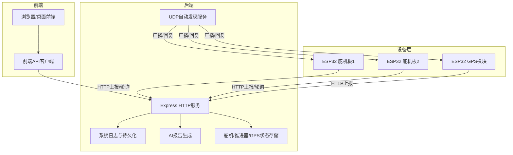
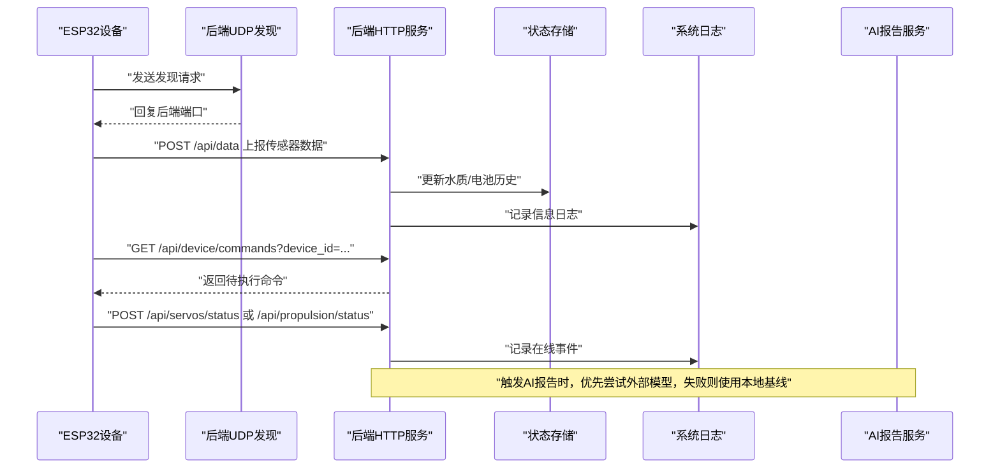
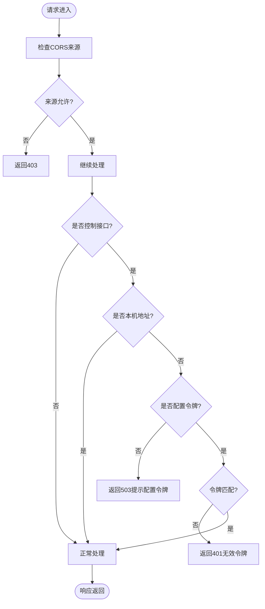
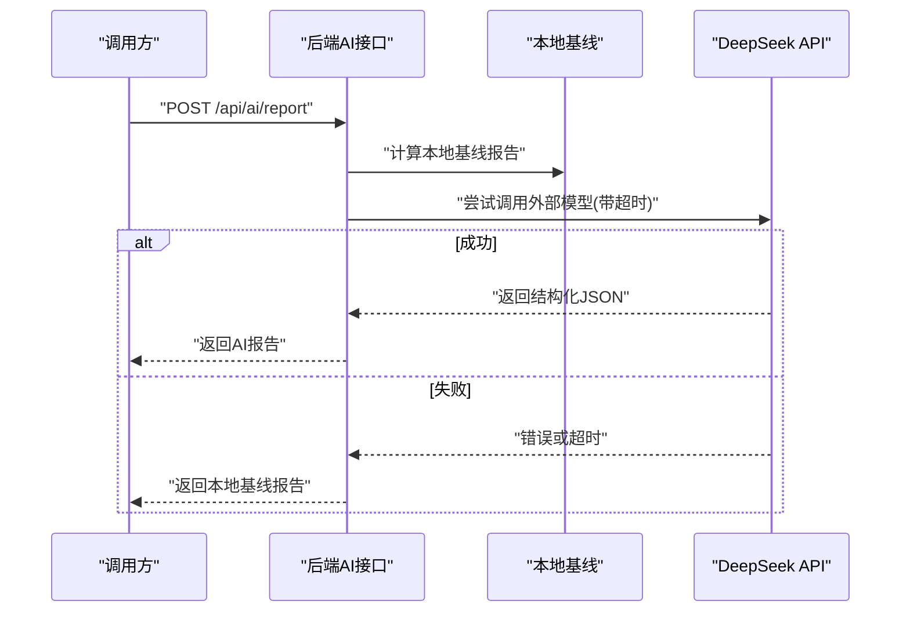
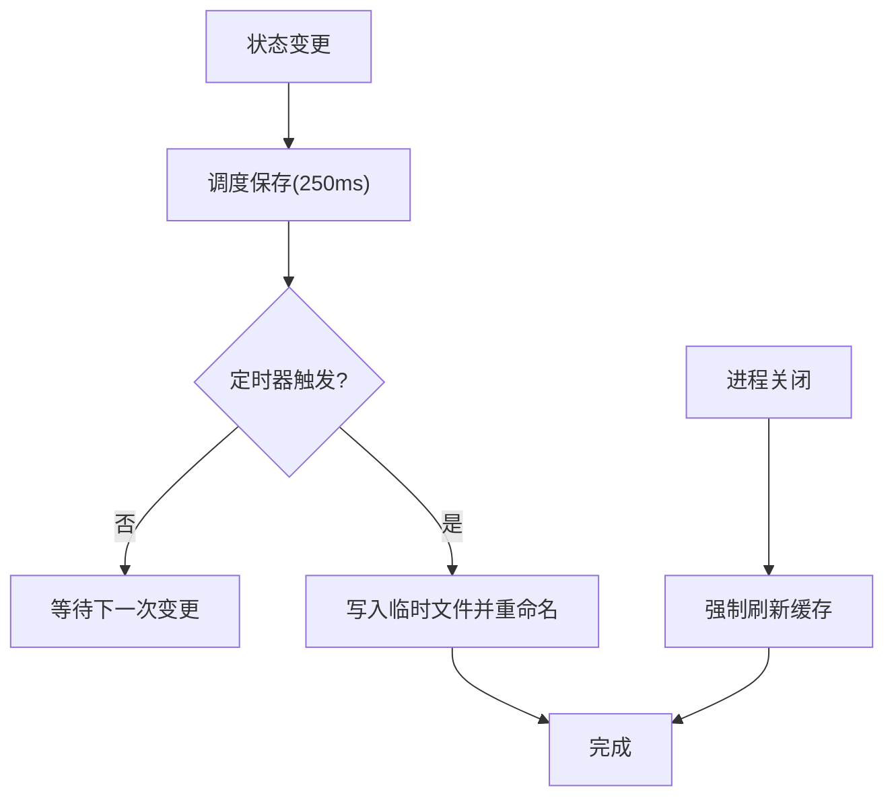
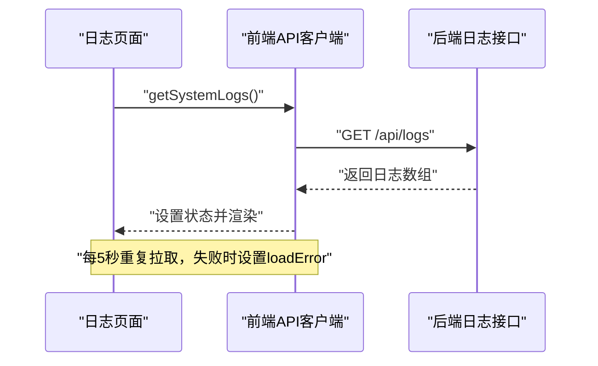
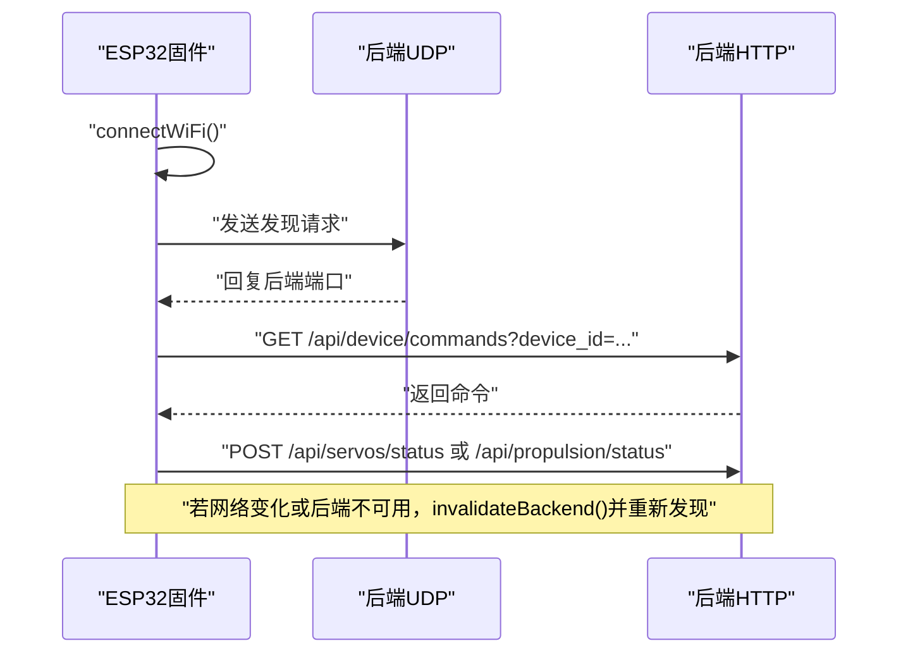
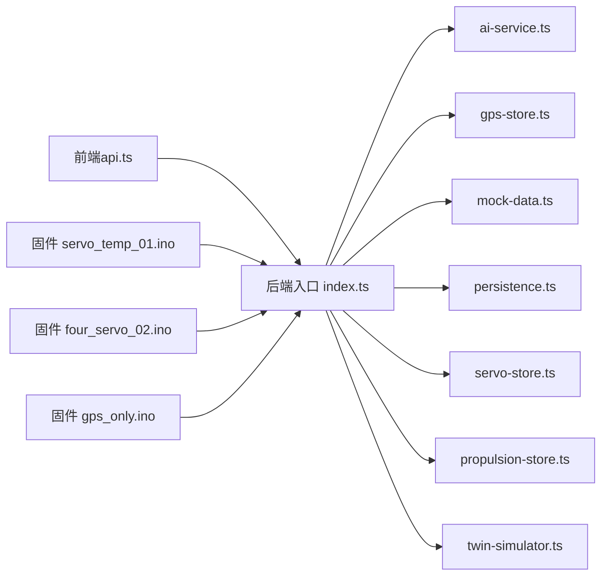

# 故障排查

<cite>
**本文引用的文件**
- [README.md](file://fishery-digital-twin-platform/README.md)
- [index.ts](file://fishery-digital-twin-platform/apps/backend/src/index.ts)
- [ai-service.ts](file://fishery-digital-twin-platform/apps/backend/src/ai-service.ts)
- [persistence.ts](file://fishery-digital-twin-platform/apps/backend/src/persistence.ts)
- [api.ts](file://fishery-digital-twin-platform/apps/frontend/src/lib/api.ts)
- [LogsPage.tsx](file://fishery-digital-twin-platform/apps/frontend/src/components/dashboard/LogsPage.tsx)
- [hardware-and-firmware.md](file://fishery-digital-twin-platform/docs/hardware-and-firmware.md)
- [security-and-network.md](file://fishery-digital-twin-platform/docs/security-and-network.md)
- [preflight.ps1](file://fishery-digital-twin-platform/scripts/preflight.ps1)
- [maker_esp32_pro_servo_temp_01.ino](file://fishery-digital-twin-platform/firmware/esp32/maker_esp32_pro_servo_temp_01/maker_esp32_pro_servo_temp_01.ino)
- [maker_esp32_pro_four_servo_02.ino](file://fishery-digital-twin-platform/firmware/esp32/maker_esp32_pro_four_servo_02/maker_esp32_pro_four_servo_02.ino)
- [maker_esp32_pro_gps_only.ino](file://fishery-digital-twin-platform/firmware/esp32/maker_esp32_pro_gps_only/maker_esp32_pro_gps_only.ino)
</cite>

## 目录
1. [简介](#简介)
2. [项目结构](#项目结构)
3. [核心组件](#核心组件)
4. [架构总览](#架构总览)
5. [详细组件分析](#详细组件分析)
6. [依赖关系分析](#依赖关系分析)
7. [性能注意事项](#性能注意事项)
8. [故障排查指南](#故障排查指南)
9. [结论](#结论)
10. [附录：常用命令与工具](#附录：常用命令与工具)

## 简介
本故障排查文档面向智慧渔业巡检船数字孪生平台，覆盖后端服务、前端界面、ESP32 固件、网络与安全、AI 报告生成、持久化存储等关键路径。文档提供系统化的问题定位方法、日志分析流程、网络连通性检测、性能诊断思路、硬件状态检查以及常见错误场景的解决方案，并附带可执行的诊断脚本和命令参考，帮助快速恢复服务运行。

## 项目结构
系统由前后端应用、共享类型库、ESP32 固件、文档与脚本组成：
- 后端：Express API，负责设备数据接入、控制指令下发、AI 报告生成、系统日志、UDP 自动发现与健康检查。
- 前端：Next.js 页面，提供健康页、日志页、控制面板，并通过统一 API 客户端调用后端接口。
- 固件：多块 ESP32 设备，通过 WiFi 连接同一热点，使用 UDP 自动发现后端 HTTP 端口，并向后端上报状态或读取命令。
- 文档：安全与网络配置、硬件与固件说明等。
- 脚本：预检脚本用于启动前环境与端口检查，运行时健康检查。

**图表来源**
- [index.ts:56-110](file://fishery-digital-twin-platform/apps/backend/src/index.ts#L56-L110)
- [index.ts:271-318](file://fishery-digital-twin-platform/apps/backend/src/index.ts#L271-L318)
- [index.ts:322-557](file://fishery-digital-twin-platform/apps/backend/src/index.ts#L322-L557)
- [api.ts:6-24](file://fishery-digital-twin-platform/apps/frontend/src/lib/api.ts#L6-L24)
- [hardware-and-firmware.md:140-159](file://fishery-digital-twin-platform/docs/hardware-and-firmware.md#L140-L159)

**章节来源**
- [README.md:16-28](file://fishery-digital-twin-platform/README.md#L16-L28)
- [security-and-network.md:28-44](file://fishery-digital-twin-platform/docs/security-and-network.md#L28-L44)

## 核心组件
- 后端服务入口与中间件：加载环境变量、CORS、JSON解析、令牌校验、健康检查、数据快照、日志记录、设备控制接口、UDP 自动发现。
- AI 报告服务：本地预测基线 + DeepSeek 外部模型；支持超时、限流、降级与错误处理。
- 持久化存储：平台状态（水质历史、电池、AI报告、系统日志）异步落盘，异常时回退到内存。
- 前端 API 客户端：统一请求封装，携带令牌、超时、错误抛出；提供健康、日志、控制、仿真等接口。
- 日志页面：定时拉取后端日志，按级别过滤，展示统计与最近事件。
- 固件通信：WiFi 连接、UDP 自动发现后端、HTTP 上报状态与读取命令，具备重连与失效清理逻辑。

**章节来源**
- [index.ts:46-110](file://fishery-digital-twin-platform/apps/backend/src/index.ts#L46-L110)
- [index.ts:116-157](file://fishery-digital-twin-platform/apps/backend/src/index.ts#L116-L157)
- [index.ts:271-318](file://fishery-digital-twin-platform/apps/backend/src/index.ts#L271-L318)
- [ai-service.ts:160-233](file://fishery-digital-twin-platform/apps/backend/src/ai-service.ts#L160-L233)
- [persistence.ts:12-68](file://fishery-digital-twin-platform/apps/backend/src/persistence.ts#L12-L68)
- [api.ts:6-24](file://fishery-digital-twin-platform/apps/frontend/src/lib/api.ts#L6-L24)
- [LogsPage.tsx:14-33](file://fishery-digital-twin-platform/apps/frontend/src/components/dashboard/LogsPage.tsx#L14-L33)
- [maker_esp32_pro_servo_temp_01.ino:305-347](file://fishery-digital-twin-platform/firmware/esp32/maker_esp32_pro_servo_temp_01/maker_esp32_pro_servo_temp_01.ino#L305-L347)
- [maker_esp32_pro_four_servo_02.ino:252-293](file://fishery-digital-twin-platform/firmware/esp32/maker_esp32_pro_four_servo_02/maker_esp32_pro_four_servo_02.ino#L252-L293)

## 架构总览
系统采用“前端-后端-设备”三层架构，后端同时承担 HTTP API 与 UDP 自动发现职责。设备通过局域网 WiFi 连接，先以 UDP 广播发现后端端口，再使用 HTTP 上报传感器数据与控制状态。后端对控制接口进行令牌校验，非本机访问必须携带令牌。AI 报告在本地基线与外部模型之间切换，失败时降级为本地报告。所有关键状态与日志均持久化，便于重启后恢复与问题回溯。

**图表来源**
- [index.ts:271-318](file://fishery-digital-twin-platform/apps/backend/src/index.ts#L271-L318)
- [index.ts:367-430](file://fishery-digital-twin-platform/apps/backend/src/index.ts#L367-L430)
- [index.ts:500-538](file://fishery-digital-twin-platform/apps/backend/src/index.ts#L500-L538)
- [ai-service.ts:167-233](file://fishery-digital-twin-platform/apps/backend/src/ai-service.ts#L167-L233)

## 详细组件分析

### 后端服务与令牌校验
- 端口与主机：从环境变量读取端口与主机，默认监听 0.0.0.0:5000。
- CORS：允许指定来源，默认包含 localhost 与 127.0.0.1。
- 令牌校验：非本机访问控制接口需携带 X-UISYS-Token，未配置令牌时拒绝局域网控制请求。
- 健康检查：/api/health 返回服务状态、数据模式、AI/GPS/舵机/推进器快照。
- 错误处理：全局错误中间件区分 CORS 拒绝与其他错误，返回相应状态码。

**图表来源**
- [index.ts:101-157](file://fishery-digital-twin-platform/apps/backend/src/index.ts#L101-L157)
- [index.ts:559-561](file://fishery-digital-twin-platform/apps/backend/src/index.ts#L559-L561)

**章节来源**
- [index.ts:46-110](file://fishery-digital-twin-platform/apps/backend/src/index.ts#L46-L110)
- [index.ts:136-157](file://fishery-digital-twin-platform/apps/backend/src/index.ts#L136-L157)
- [index.ts:322-334](file://fishery-digital-twin-platform/apps/backend/src/index.ts#L322-L334)
- [security-and-network.md:17-27](file://fishery-digital-twin-platform/docs/security-and-network.md#L17-L27)

### AI 报告生成与降级策略
- 本地基线：基于水质与电池统计生成风险等级、建议与数据质量说明。
- 外部模型：DeepSeek 调用带超时与限流，失败时抛错并被上层捕获。
- 降级机制：当外部模型不可用时，直接返回本地报告，保证功能可用。
- 错误处理：网络错误、空内容、格式异常均会抛出明确错误消息，便于日志定位。

**图表来源**
- [ai-service.ts:167-233](file://fishery-digital-twin-platform/apps/backend/src/ai-service.ts#L167-L233)
- [index.ts:456-473](file://fishery-digital-twin-platform/apps/backend/src/index.ts#L456-L473)

**章节来源**
- [ai-service.ts:49-122](file://fishery-digital-twin-platform/apps/backend/src/ai-service.ts#L49-L122)
- [ai-service.ts:160-233](file://fishery-digital-twin-platform/apps/backend/src/ai-service.ts#L160-L233)
- [index.ts:447-473](file://fishery-digital-twin-platform/apps/backend/src/index.ts#L447-L473)

### 持久化存储与状态恢复
- 数据目录：可通过环境变量配置，默认在项目 data 目录。
- 写入策略：批量延迟写入，临时文件原子替换，避免损坏。
- 读取策略：校验数据结构，失败时回退为空状态。
- 关闭保护：进程退出时强制刷新，确保数据不丢失。

**图表来源**
- [persistence.ts:12-68](file://fishery-digital-twin-platform/apps/backend/src/persistence.ts#L12-L68)

**章节来源**
- [persistence.ts:12-68](file://fishery-digital-twin-platform/apps/backend/src/persistence.ts#L12-L68)

### 前端日志页面与错误提示
- 定时刷新：每 5 秒拉取后端日志，失败时标记连接错误。
- 过滤与统计：支持按级别过滤，显示总数、预警异常数量与最近事件。
- 错误反馈：当日志服务不可用时，页面提示连接失败并保留上次成功内容。

**图表来源**
- [LogsPage.tsx:14-33](file://fishery-digital-twin-platform/apps/frontend/src/components/dashboard/LogsPage.tsx#L14-L33)
- [api.ts:91-93](file://fishery-digital-twin-platform/apps/frontend/src/lib/api.ts#L91-L93)
- [index.ts:557](file://fishery-digital-twin-platform/apps/backend/src/index.ts#L557)

**章节来源**
- [LogsPage.tsx:14-33](file://fishery-digital-twin-platform/apps/frontend/src/components/dashboard/LogsPage.tsx#L14-L33)
- [LogsPage.tsx:45-85](file://fishery-digital-twin-platform/apps/frontend/src/components/dashboard/LogsPage.tsx#L45-L85)
- [api.ts:91-93](file://fishery-digital-twin-platform/apps/frontend/src/lib/api.ts#L91-L93)

### 设备通信与自动发现
- WiFi 连接：设备尝试连接热点，超时重试。
- UDP 发现：设备广播 UISYS_DISCOVER_V1，后端回复 UISYS_BACKEND_V1|端口。
- 命令轮询：设备从 /api/device/commands 获取命令，完成后上报状态。
- 失效清理：网络变化或后端不可用时清除旧地址并重新发现。

**图表来源**
- [maker_esp32_pro_servo_temp_01.ino:305-347](file://fishery-digital-twin-platform/firmware/esp32/maker_esp32_pro_servo_temp_01/maker_esp32_pro_servo_temp_01.ino#L305-L347)
- [maker_esp32_pro_four_servo_02.ino:252-293](file://fishery-digital-twin-platform/firmware/esp32/maker_esp32_pro_four_servo_02/maker_esp32_pro_four_servo_02.ino#L252-L293)
- [index.ts:271-318](file://fishery-digital-twin-platform/apps/backend/src/index.ts#L271-L318)

**章节来源**
- [hardware-and-firmware.md:140-159](file://fishery-digital-twin-platform/docs/hardware-and-firmware.md#L140-L159)
- [maker_esp32_pro_gps_only.ino:30-49](file://fishery-digital-twin-platform/firmware/esp32/maker_esp32_pro_gps_only/maker_esp32_pro_gps_only.ino#L30-L49)

## 依赖关系分析
- 后端依赖：Express、cors、dotenv、dgram、node:crypto、node:os；内部模块包括 ai-service、gps-store、mock-data、persistence、propulsion-store、servo-store、twin-simulator。
- 前端依赖：Next.js、React、TypeScript；API 客户端统一封装 fetch。
- 固件依赖：Arduino Core、WiFi、WiFiUdp、HTTPClient、TinyGPS++、Servo、SimpleFOC（扩展）。
- 外部依赖：DeepSeek API（可选），ONNX Runtime Web（前端推理）。

**图表来源**
- [index.ts:1-45](file://fishery-digital-twin-platform/apps/backend/src/index.ts#L1-L45)
- [api.ts:1-24](file://fishery-digital-twin-platform/apps/frontend/src/lib/api.ts#L1-L24)
- [maker_esp32_pro_servo_temp_01.ino:305-347](file://fishery-digital-twin-platform/firmware/esp32/maker_esp32_pro_servo_temp_01/maker_esp32_pro_servo_temp_01.ino#L305-L347)
- [maker_esp32_pro_four_servo_02.ino:252-293](file://fishery-digital-twin-platform/firmware/esp32/maker_esp32_pro_four_servo_02/maker_esp32_pro_four_servo_02.ino#L252-L293)
- [maker_esp32_pro_gps_only.ino:30-49](file://fishery-digital-twin-platform/firmware/esp32/maker_esp32_pro_gps_only/maker_esp32_pro_gps_only.ino#L30-L49)

**章节来源**
- [index.ts:1-45](file://fishery-digital-twin-platform/apps/backend/src/index.ts#L1-L45)
- [api.ts:1-24](file://fishery-digital-twin-platform/apps/frontend/src/lib/api.ts#L1-L24)

## 性能注意事项
- 后端：
  - JSON 解析限制 1MB，避免大请求阻塞。
  - 演示水质数据间隔可调，避免频繁写入。
  - AI 报告每分钟限流一次，防止外部模型过载。
  - 持久化采用延迟写入与原子替换，降低磁盘压力。
- 前端：
  - 日志页面每 5 秒拉取，注意网络负载。
  - ONNX Runtime Web 提供 CPU 追踪点，可用于前端推理性能分析。
- 设备：
  - WiFi 重连与超时保护，避免死循环。
  - 舵机仅在角度变化时更新 PWM，减少网络与硬件负载。

[本节为通用指导，不直接分析具体文件]

## 故障排查指南

### 日志分析方法
- 后端日志：
  - 查看控制台输出：服务启动、UDP 绑定、错误与警告。
  - 查询 /api/logs：前端日志页面集中展示，支持级别过滤。
  - 关注关键事件：传感器数据接收、GPS 定位、舵机/推进器在线、AI 报告生成与失败。
- 前端日志：
  - 浏览器控制台：网络请求失败、超时、CORS 错误。
  - 日志页面：连接失败提示与最近事件。
- 设备串口：
  - ESP32 串口输出 WiFi 连接、IP、后端发现结果与错误。

**章节来源**
- [index.ts:320-334](file://fishery-digital-twin-platform/apps/backend/src/index.ts#L320-L334)
- [index.ts:557-561](file://fishery-digital-twin-platform/apps/backend/src/index.ts#L557-L561)
- [LogsPage.tsx:14-33](file://fishery-digital-twin-platform/apps/frontend/src/components/dashboard/LogsPage.tsx#L14-L33)
- [maker_esp32_pro_servo_temp_01.ino:305-347](file://fishery-digital-twin-platform/firmware/esp32/maker_esp32_pro_servo_temp_01/maker_esp32_pro_servo_temp_01.ino#L305-L347)

### 网络问题排查
- 连接超时：
  - 检查后端是否监听 0.0.0.0:5000，防火墙是否放行 TCP 5000。
  - 确认设备与电脑在同一热点且无客户端隔离。
  - 使用预检脚本验证端口占用与服务健康。
- 数据传输错误：
  - 检查令牌是否一致，控制接口需携带 X-UISYS-Token。
  - 查看 CORS 配置，确保前端来源被允许。
  - 检查请求体字段范围，非法数值会被拒绝。
- 网络连通性检测：
  - 浏览器访问 http://电脑IPv4:5000/api/health。
  - 使用 netstat 查看端口监听情况。
  - 使用 ipconfig 查看 WLAN IPv4。

**章节来源**
- [security-and-network.md:28-44](file://fishery-digital-twin-platform/docs/security-and-network.md#L28-L44)
- [preflight.ps1:116-148](file://fishery-digital-twin-platform/scripts/preflight.ps1#L116-L148)
- [hardware-and-firmware.md:177-204](file://fishery-digital-twin-platform/docs/hardware-and-firmware.md#L177-L204)
- [index.ts:101-157](file://fishery-digital-twin-platform/apps/backend/src/index.ts#L101-L157)
- [index.ts:159-176](file://fishery-digital-twin-platform/apps/backend/src/index.ts#L159-L176)

### 性能问题诊断
- CPU 与内存：
  - 后端：观察控制台错误与日志频率，避免高频写入。
  - 前端：使用浏览器性能面板分析渲染与网络请求。
  - ONNX Runtime Web：启用 CPU 追踪点，定位推理瓶颈。
- 数据库查询优化：
  - 本项目使用内存+文件持久化，关注写入频率与文件大小。
  - 调整演示数据间隔与历史长度，减少 I/O 压力。
- 前端性能调优：
  - 日志页面拉取间隔合理，避免过多请求。
  - 图片与模型资源按需加载，减少首屏负担。

**章节来源**
- [persistence.ts:51-68](file://fishery-digital-twin-platform/apps/backend/src/persistence.ts#L51-L68)
- [LogsPage.tsx:14-33](file://fishery-digital-twin-platform/apps/frontend/src/components/dashboard/LogsPage.tsx#L14-L33)
- [index.ts:178-195](file://fishery-digital-twin-platform/apps/backend/src/index.ts#L178-L195)

### 硬件故障检测
- ESP32 设备状态：
  - 查看后端健康接口中的设备在线状态。
  - 检查设备串口输出，确认 WiFi 连接与后端发现结果。
- 传感器数据异常：
  - 检查传感器数据范围，非法值会被拒绝。
  - 查看水质状态判定逻辑，识别污染或藻类风险。
- 设备通信故障：
  - 确认 UDP 42110 未被占用，防火墙规则存在。
  - 检查令牌一致性，避免 401 错误。
  - 网络变化后设备会清除旧地址并重新发现。

**章节来源**
- [index.ts:322-334](file://fishery-digital-twin-platform/apps/backend/src/index.ts#L322-L334)
- [index.ts:367-430](file://fishery-digital-twin-platform/apps/backend/src/index.ts#L367-L430)
- [maker_esp32_pro_servo_temp_01.ino:305-347](file://fishery-digital-twin-platform/firmware/esp32/maker_esp32_pro_servo_temp_01/maker_esp32_pro_servo_temp_01.ino#L305-L347)
- [security-and-network.md:28-44](file://fishery-digital-twin-platform/docs/security-and-network.md#L28-L44)

### 常见错误场景与解决方案
- 服务启动失败：
  - 端口占用：使用预检脚本检查端口，停止冲突进程。
  - 权限不足：确保防火墙规则已添加，监听 0.0.0.0。
  - 环境变量缺失：检查 .env 与设备令牌配置。
- API 调用错误：
  - 401 未授权：检查 X-UISYS-Token 是否与后端一致。
  - 403 禁止：检查 CORS 来源配置。
  - 400 参数错误：检查请求体字段范围与必填项。
- 第三方服务集成问题：
  - DeepSeek API 超时或返回空：检查密钥与网络，失败时自动降级为本地报告。
  - 限流：AI 报告每分钟一次，避免频繁触发。

**章节来源**
- [preflight.ps1:116-148](file://fishery-digital-twin-platform/scripts/preflight.ps1#L116-L148)
- [index.ts:136-157](file://fishery-digital-twin-platform/apps/backend/src/index.ts#L136-L157)
- [index.ts:559-561](file://fishery-digital-twin-platform/apps/backend/src/index.ts#L559-L561)
- [ai-service.ts:167-233](file://fishery-digital-twin-platform/apps/backend/src/ai-service.ts#L167-L233)

## 结论
本故障排查文档围绕系统架构与关键组件，提供了日志分析、网络排查、性能诊断、硬件检测与常见错误的系统化方法。通过后端健康接口、前端日志页面、设备串口输出与预检脚本，可以快速定位问题并采取相应措施。建议在部署前完成环境检查与令牌同步，运行中持续监控日志与健康状态，确保系统稳定运行。

[本节为总结，不直接分析具体文件]

## 附录：常用命令与工具
- 启动与诊断：
  - npm run dev：启动开发服务。
  - npm run doctor：一键诊断后端与固件令牌、WiFi、端口、防火墙与健康状态。
  - npm run setup:devices：一次性配置后端与固件秘密文件。
  - npm run setup:network：添加专用网络防火墙规则。
- 网络检查：
  - ipconfig | findstr IPv4：查看 WLAN IPv4。
  - netsh wlan show profiles：查看保存的 WiFi 名称。
  - netstat -ano -p tcp/udp：查看端口监听情况。
- 健康检查：
  - 浏览器访问 http://电脑IPv4:5000/api/health。
  - 前端健康页与日志页实时查看服务状态。

**章节来源**
- [README.md:36-63](file://fishery-digital-twin-platform/README.md#L36-L63)
- [hardware-and-firmware.md:140-169](file://fishery-digital-twin-platform/docs/hardware-and-firmware.md#L140-L169)
- [security-and-network.md:28-44](file://fishery-digital-twin-platform/docs/security-and-network.md#L28-L44)
- [preflight.ps1:116-148](file://fishery-digital-twin-platform/scripts/preflight.ps1#L116-L148)