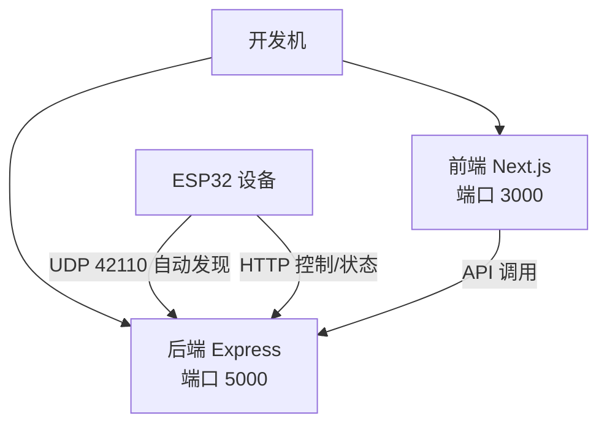
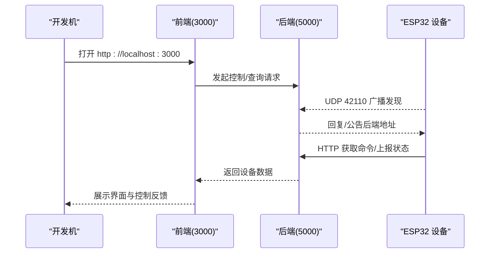
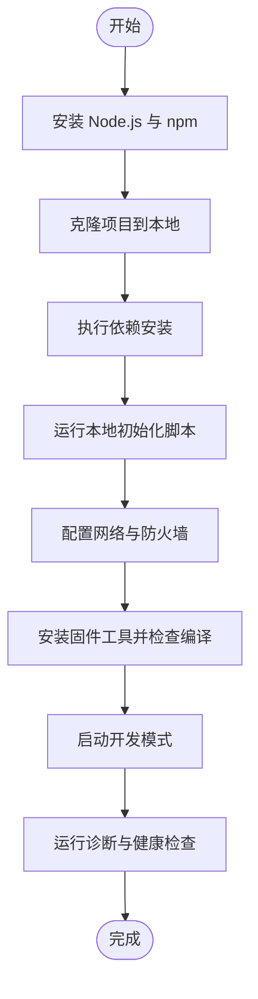
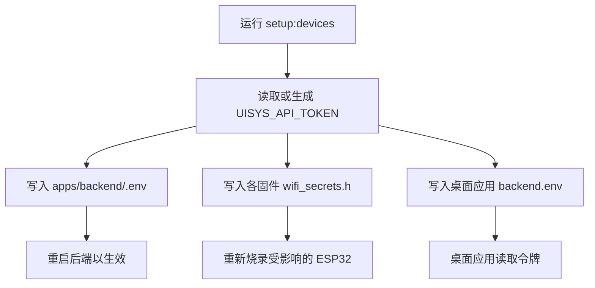
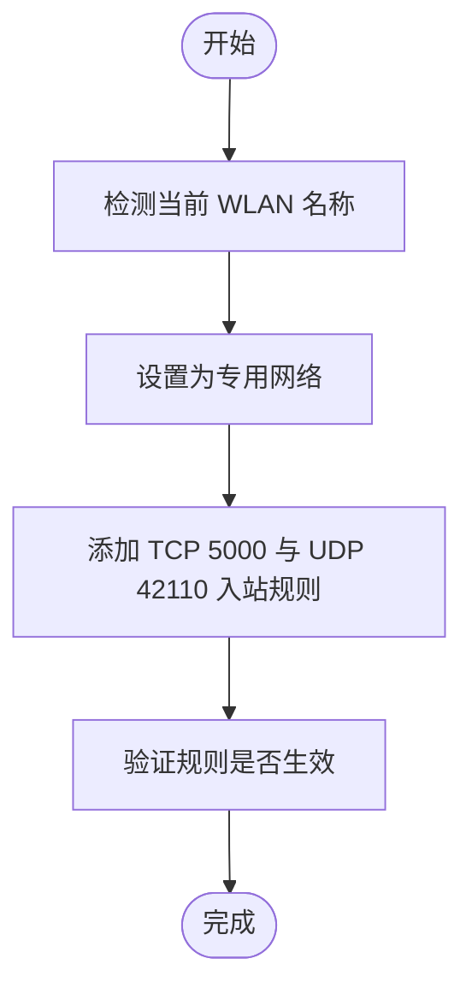
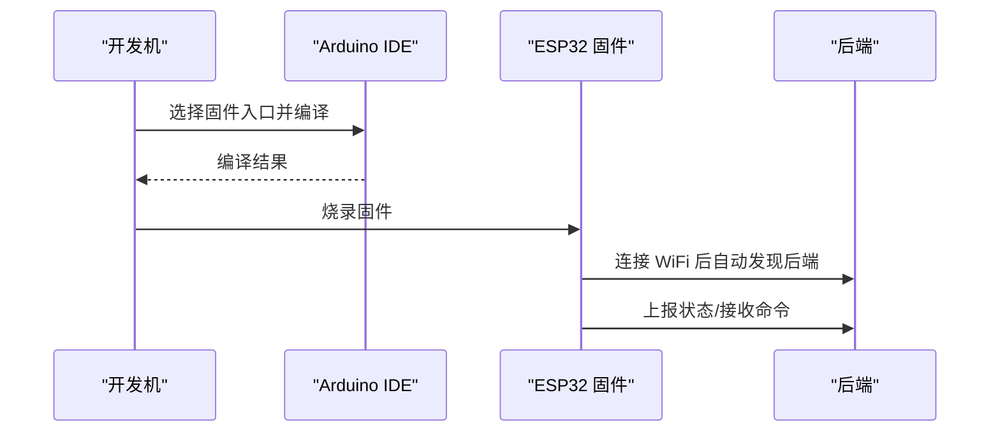
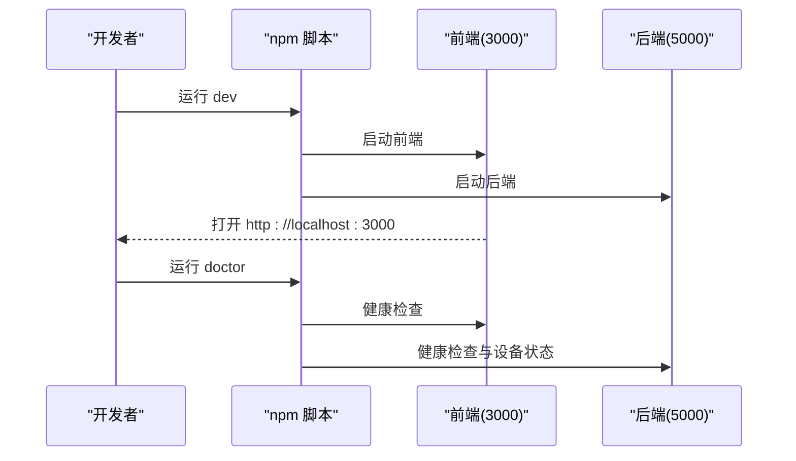
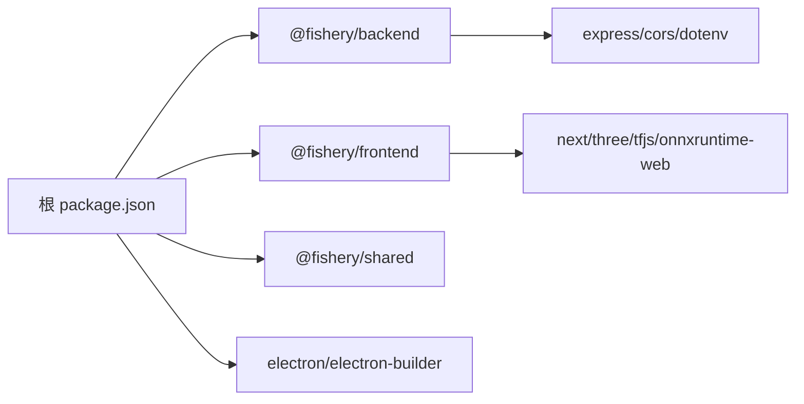
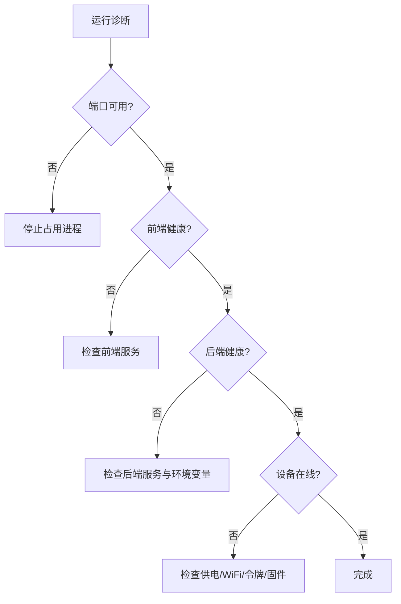

# 环境搭建

<cite>
**本文引用的文件**
- [README.md](file://fishery-digital-twin-platform/README.md)
- [package.json](file://fishery-digital-twin-platform/package.json)
- [apps/backend/package.json](file://fishery-digital-twin-platform/apps/backend/package.json)
- [apps/frontend/package.json](file://fishery-digital-twin-platform/apps/frontend/package.json)
- [apps/backend/.env.example](file://fishery-digital-twin-platform/apps/backend/.env.example)
- [docs/hardware-and-firmware.md](file://fishery-digital-twin-platform/docs/hardware-and-firmware.md)
- [docs/security-and-network.md](file://fishery-digital-twin-platform/docs/security-and-network.md)
- [scripts/preflight.ps1](file://fishery-digital-twin-platform/scripts/preflight.ps1)
- [scripts/configure-device-secrets.ps1](file://fishery-digital-twin-platform/scripts/configure-device-secrets.ps1)
- [scripts/configure-windows-network.ps1](file://fishery-digital-twin-platform/scripts/configure-windows-network.ps1)
- [firmware/esp32/maker_esp32_pro_servo_temp_01/wifi_secrets.example.h](file://fishery-digital-twin-platform/firmware/esp32/maker_esp32_pro_servo_temp_01/wifi_secrets.example.h)
- [firmware/esp32/maker_esp32_pro_four_servo_02/wifi_secrets.example.h](file://fishery-digital-twin-platform/firmware/esp32/maker_esp32_pro_four_servo_02/wifi_secrets.example.h)
</cite>

## 目录
1. [简介](#简介)
2. [项目结构](#项目结构)
3. [核心组件](#核心组件)
4. [架构总览](#架构总览)
5. [详细组件分析](#详细组件分析)
6. [依赖关系分析](#依赖关系分析)
7. [性能与资源要求](#性能与资源要求)
8. [故障排除指南](#故障排除指南)
9. [结论](#结论)
10. [附录：平台特定安装与验证](#附录平台特定安装与验证)

## 简介
本环境搭建文档面向“智慧渔业巡检船数字孪生与 AI 决策平台”的开发与生产部署，覆盖硬件与固件、Node.js 后端、Next.js 前端、桌面应用打包、ESP32 固件烧录、网络与安全配置、以及跨平台（Windows/Linux/macOS）的初始化与验证流程。文档基于仓库内脚本、配置文件与说明文档整理，确保步骤可执行、可追溯。

## 项目结构
- apps/backend：Express 后端服务，提供设备命令、状态上报与健康检查接口。
- apps/frontend：Next.js 前端，包含 3D 展示、地图、图表与控制页面。
- packages/shared：前后端共享类型定义。
- firmware/esp32：ESP32 / MAKER-ESP32-PRO / SimpleFOC 固件源码与示例密钥模板。
- scripts：预检、设备密钥生成、网络规则配置、固件工具等自动化脚本。
- docs：硬件接入、安全与网络、模型训练等说明文档。

**图示来源**
- [README.md:36-69](file://fishery-digital-twin-platform/README.md#L36-L69)
- [docs/security-and-network.md:28-44](file://fishery-digital-twin-platform/docs/security-and-network.md#L28-L44)

**章节来源**
- [README.md:16-34](file://fishery-digital-twin-platform/README.md#L16-L34)
- [package.json:12-37](file://fishery-digital-twin-platform/package.json#L12-L37)

## 核心组件
- Node.js 运行时与包管理器：根 package.json 指定 Node 版本范围与 npm 版本范围，使用 workspaces 管理多子项目。
- 后端服务：Express + TypeScript，监听 LAN 地址供 ESP32 访问，提供健康检查与设备接口。
- 前端服务：Next.js 开发/构建/启动脚本，默认本地 3000 端口。
- 桌面应用：Electron + electron-builder，支持 Windows NSIS 安装包输出。
- 固件工具链：Arduino IDE 2.x，配合脚本安装依赖并编译全部固件。
- 安全与网络：设备令牌、CORS、防火墙规则、专用网络设置、WiFi 热点配置。

**章节来源**
- [package.json:7-10](file://fishery-digital-twin-platform/package.json#L7-L10)
- [apps/backend/package.json:13-18](file://fishery-digital-twin-platform/apps/backend/package.json#L13-L18)
- [apps/frontend/package.json:14-31](file://fishery-digital-twin-platform/apps/frontend/package.json#L14-L31)
- [README.md:94-103](file://fishery-digital-twin-platform/README.md#L94-L103)
- [docs/security-and-network.md:17-44](file://fishery-digital-twin-platform/docs/security-and-network.md#L17-L44)

## 架构总览
系统由前端、后端与多个 ESP32 设备组成。前端通过浏览器或桌面应用访问；后端暴露 HTTP API 与 UDP 自动发现端口；ESP32 设备在同一可信 WiFi 下通过 UDP 发现后端并建立 HTTP 连接进行命令轮询与状态上报。

**图示来源**
- [README.md:143-153](file://fishery-digital-twin-platform/README.md#L143-L153)
- [docs/security-and-network.md:28-44](file://fishery-digital-twin-platform/docs/security-and-network.md#L28-L44)

## 详细组件分析

### 环境与依赖安装
- Node.js 与 npm：根据根 package.json 的 engines 字段，需安装 Node.js 22.20 及以上且小于 25，npm 10 至 11。
- Arduino IDE 2.x：用于 ESP32 固件编译与烧录。
- 工作区依赖：在项目根目录执行依赖安装，再运行本地初始化脚本。

**图示来源**
- [package.json:7-10](file://fishery-digital-twin-platform/package.json#L7-L10)
- [README.md:36-63](file://fishery-digital-twin-platform/README.md#L36-L63)
- [scripts/preflight.ps1:66-83](file://fishery-digital-twin-platform/scripts/preflight.ps1#L66-L83)

**章节来源**
- [package.json:7-10](file://fishery-digital-twin-platform/package.json#L7-L10)
- [README.md:36-63](file://fishery-digital-twin-platform/README.md#L36-L63)
- [scripts/preflight.ps1:66-83](file://fishery-digital-twin-platform/scripts/preflight.ps1#L66-L83)

### 环境变量与设备密钥
- 后端环境变量：复制示例文件为 .env，填写 UISYS_API_TOKEN、CORS_ORIGIN、DeepSeek 相关键值。
- 设备令牌：脚本会生成或保留现有令牌，并同步到各固件 wifi_secrets.h 与桌面应用配置。
- 桌面应用配置：在 Windows 用户目录下生成 backend.env，读取设备令牌但不包含 WiFi 密码。

**图示来源**
- [scripts/configure-device-secrets.ps1:96-143](file://fishery-digital-twin-platform/scripts/configure-device-secrets.ps1#L96-L143)
- [scripts/configure-device-secrets.ps1:145-169](file://fishery-digital-twin-platform/scripts/configure-device-secrets.ps1#L145-L169)
- [docs/security-and-network.md:17-50](file://fishery-digital-twin-platform/docs/security-and-network.md#L17-L50)

**章节来源**
- [apps/backend/.env.example:1-13](file://fishery-digital-twin-platform/apps/backend/.env.example#L1-L13)
- [scripts/configure-device-secrets.ps1:96-169](file://fishery-digital-twin-platform/scripts/configure-device-secrets.ps1#L96-L169)
- [docs/security-and-network.md:17-50](file://fishery-digital-twin-platform/docs/security-and-network.md#L17-L50)

### 网络配置与防火墙
- 端口与协议：前端 TCP 3000，后端 TCP 5000，ESP32 自动发现 UDP 42110。
- 防火墙规则：仅对“专用网络”开放 TCP 5000 入站与 UDP 42110 入站。
- WiFi 与热点：设备与电脑必须连接同一可信热点，且热点不能启用客户端隔离。

**图示来源**
- [scripts/configure-windows-network.ps1:33-63](file://fishery-digital-twin-platform/scripts/configure-windows-network.ps1#L33-L63)
- [docs/security-and-network.md:28-44](file://fishery-digital-twin-platform/docs/security-and-network.md#L28-L44)

**章节来源**
- [scripts/configure-windows-network.ps1:10-75](file://fishery-digital-twin-platform/scripts/configure-windows-network.ps1#L10-L75)
- [docs/security-and-network.md:28-44](file://fishery-digital-twin-platform/docs/security-and-network.md#L28-L44)

### 固件烧录与设备配置
- 固件入口：按 README 指引选择对应 .ino 文件进行烧录。
- WiFi 与令牌：从示例模板复制为 wifi_secrets.h，填入热点名称、密码与令牌。
- 设备 ID：不同固件对应不同设备 ID，用于后端识别与命令路由。

**图示来源**
- [README.md:94-141](file://fishery-digital-twin-platform/README.md#L94-L141)
- [docs/hardware-and-firmware.md:11-57](file://fishery-digital-twin-platform/docs/hardware-and-firmware.md#L11-L57)

**章节来源**
- [README.md:94-141](file://fishery-digital-twin-platform/README.md#L94-L141)
- [docs/hardware-and-firmware.md:11-57](file://fishery-digital-twin-platform/docs/hardware-and-firmware.md#L11-L57)
- [firmware/esp32/maker_esp32_pro_servo_temp_01/wifi_secrets.example.h:1-7](file://fishery-digital-twin-platform/firmware/esp32/maker_esp32_pro_servo_temp_01/wifi_secrets.example.h#L1-L7)
- [firmware/esp32/maker_esp32_pro_four_servo_02/wifi_secrets.example.h:1-7](file://fishery-digital-twin-platform/firmware/esp32/maker_esp32_pro_four_servo_02/wifi_secrets.example.h#L1-L7)

### 启动与运行
- 开发模式：同时启动后端与前端，监听端口分别为 5000 与 3000。
- 生产模式：先构建再启动，适合比赛展示或长时间运行。
- 一键诊断：运行诊断脚本检查端口占用、健康状态与设备在线情况。

**图示来源**
- [package.json:17-27](file://fishery-digital-twin-platform/package.json#L17-L27)
- [scripts/preflight.ps1:116-143](file://fishery-digital-twin-platform/scripts/preflight.ps1#L116-L143)

**章节来源**
- [README.md:36-76](file://fishery-digital-twin-platform/README.md#L36-L76)
- [package.json:17-27](file://fishery-digital-twin-platform/package.json#L17-L27)
- [scripts/preflight.ps1:116-143](file://fishery-digital-twin-platform/scripts/preflight.ps1#L116-L143)

## 依赖关系分析
- 根工作区：通过 workspaces 聚合 apps/* 与 packages/*。
- 后端依赖：Express、cors、dotenv、共享类型。
- 前端依赖：Next.js、Three.js、TensorFlow.js、ONNX Runtime Web 等。
- 桌面打包：Electron 与 electron-builder，输出 Windows NSIS 安装包。

**图示来源**
- [package.json:12-37](file://fishery-digital-twin-platform/package.json#L12-L37)
- [apps/backend/package.json:13-18](file://fishery-digital-twin-platform/apps/backend/package.json#L13-L18)
- [apps/frontend/package.json:14-31](file://fishery-digital-twin-platform/apps/frontend/package.json#L14-L31)

**章节来源**
- [package.json:12-37](file://fishery-digital-twin-platform/package.json#L12-L37)
- [apps/backend/package.json:13-18](file://fishery-digital-twin-platform/apps/backend/package.json#L13-L18)
- [apps/frontend/package.json:14-31](file://fishery-digital-twin-platform/apps/frontend/package.json#L14-L31)

## 性能与资源要求
- Node.js 版本：遵循 engines 限制，建议使用 22.20+ 且小于 25。
- 内存与 CPU：前端包含 3D 与 AI 推理库，建议具备独立显卡或较强集成显卡以提升渲染与推理性能。
- 磁盘空间：构建产物与 node_modules 占用较大，建议预留足够空间。
- 网络带宽：AI 报告与模型加载可能涉及网络请求，确保局域网稳定。

[本节为通用指导，不直接分析具体文件]

## 故障排除指南
- 端口冲突：诊断脚本会检查 3000、5000、42110 端口占用情况，若被占用需停止先前进程。
- 健康检查失败：分别检查前端与后端健康接口响应是否符合预期。
- 设备离线：确认设备供电、WiFi 连接、固件已正确烧录且令牌一致。
- 防火墙规则缺失：运行网络配置脚本添加专用网络入站规则。
- 令牌不一致：重新运行设备密钥配置脚本并确保所有固件与后端一致。

**图示来源**
- [scripts/preflight.ps1:116-143](file://fishery-digital-twin-platform/scripts/preflight.ps1#L116-L143)
- [docs/security-and-network.md:28-44](file://fishery-digital-twin-platform/docs/security-and-network.md#L28-L44)

**章节来源**
- [scripts/preflight.ps1:116-143](file://fishery-digital-twin-platform/scripts/preflight.ps1#L116-L143)
- [docs/security-and-network.md:28-44](file://fishery-digital-twin-platform/docs/security-and-network.md#L28-L44)

## 结论
本环境搭建流程围绕 Node.js 工作区、Express 后端、Next.js 前端、ESP32 固件与桌面应用展开，强调设备令牌一致性、专用网络与最小化防火墙规则、以及自动化预检与诊断。按照本文步骤完成初始化、配置与验证后，可在开发或生产环境中稳定运行该平台。

[本节为总结性内容，不直接分析具体文件]

## 附录：平台特定安装与验证

### Windows
- 安装 Node.js 与 npm：确保版本满足 engines 限制。
- 安装 Arduino IDE 2.x：用于固件编译与烧录。
- 初始化与配置：
  - 运行依赖安装与本地初始化脚本。
  - 运行网络配置脚本以设置专用网络与防火墙规则。
  - 运行固件工具脚本安装依赖并检查编译。
- 启动与验证：
  - 启动开发模式，打开前端页面。
  - 运行诊断脚本检查端口、健康状态与设备在线。

**章节来源**
- [README.md:36-63](file://fishery-digital-twin-platform/README.md#L36-L63)
- [scripts/configure-windows-network.ps1:10-75](file://fishery-digital-twin-platform/scripts/configure-windows-network.ps1#L10-L75)
- [scripts/preflight.ps1:66-83](file://fishery-digital-twin-platform/scripts/preflight.ps1#L66-L83)

### Linux
- 安装 Node.js 与 npm：确保版本满足 engines 限制。
- 安装 Arduino IDE 2.x：用于固件编译与烧录。
- 初始化与配置：
  - 运行依赖安装与本地初始化脚本。
  - 手动配置防火墙规则，允许 TCP 5000 与 UDP 42110 入站。
  - 运行固件工具脚本安装依赖并检查编译。
- 启动与验证：
  - 启动开发模式，打开前端页面。
  - 运行诊断脚本检查端口、健康状态与设备在线。

[本节为通用指导，不直接分析具体文件]

### macOS
- 安装 Node.js 与 npm：确保版本满足 engines 限制。
- 安装 Arduino IDE 2.x：用于固件编译与烧录。
- 初始化与配置：
  - 运行依赖安装与本地初始化脚本。
  - 手动配置防火墙规则，允许 TCP 5000 与 UDP 42110 入站。
  - 运行固件工具脚本安装依赖并检查编译。
- 启动与验证：
  - 启动开发模式，打开前端页面。
  - 运行诊断脚本检查端口、健康状态与设备在线。

[本节为通用指导，不直接分析具体文件]