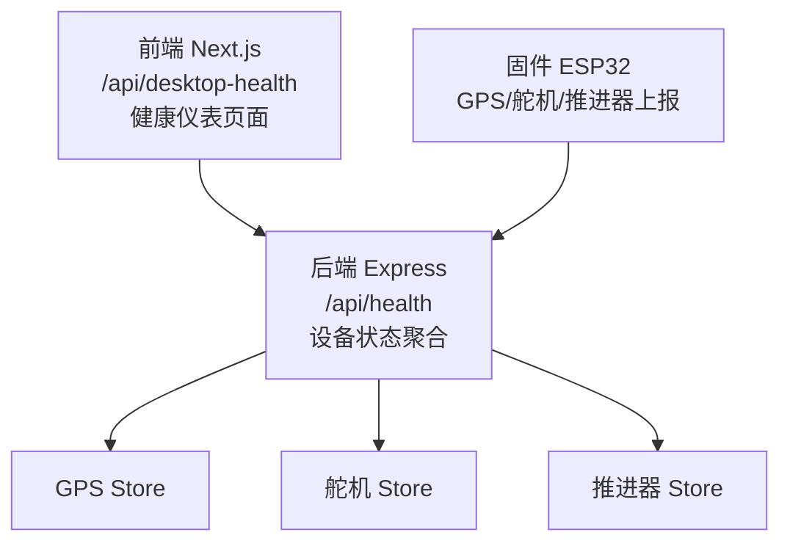
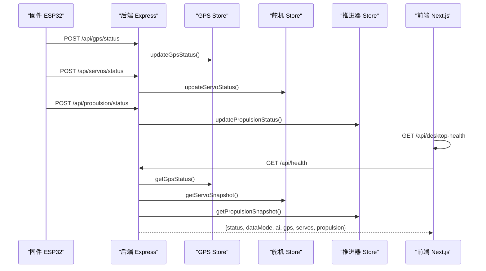
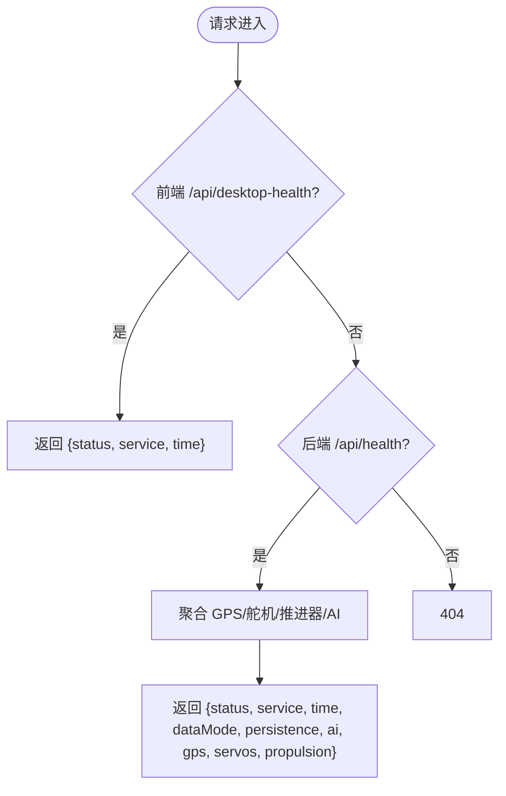
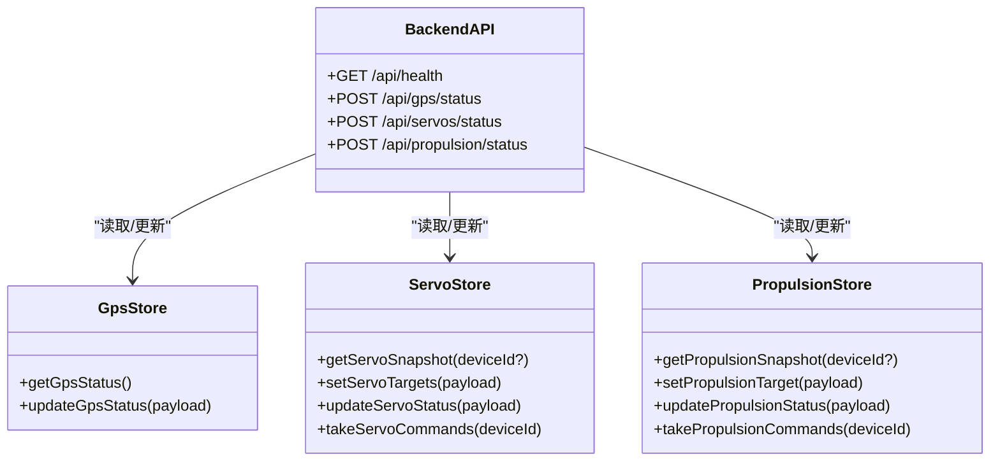
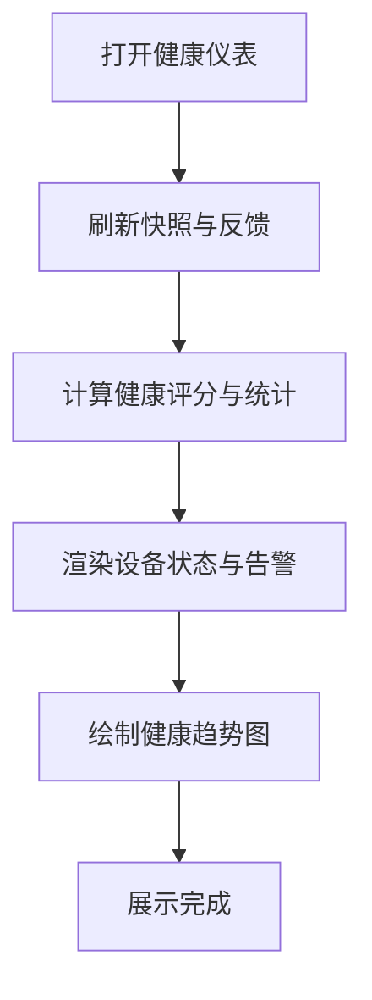
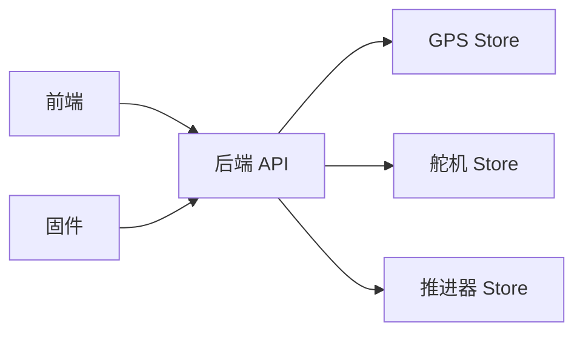

# 健康检查

<cite>
**本文引用的文件**
- [apps/frontend/src/app/api/desktop-health/route.ts](file://fishery-digital-twin-platform/apps/frontend/src/app/api/desktop-health/route.ts)
- [apps/backend/src/index.ts](file://fishery-digital-twin-platform/apps/backend/src/index.ts)
- [apps/backend/src/gps-store.ts](file://fishery-digital-twin-platform/apps/backend/src/gps-store.ts)
- [apps/backend/src/servo-store.ts](file://fishery-digital-twin-platform/apps/backend/src/servo-store.ts)
- [apps/backend/src/propulsion-store.ts](file://fishery-digital-twin-platform/apps/backend/src/propulsion-store.ts)
- [apps/frontend/src/components/dashboard/HealthPage.tsx](file://fishery-digital-twin-platform/apps/frontend/src/components/dashboard/HealthPage.tsx)
- [firmware/esp32/maker_esp32_pro_servo_temp_01/maker_esp32_pro_servo_temp_01.ino](file://fishery-digital-twin-platform/firmware/esp32/maker_esp32_pro_servo_temp_01/maker_esp32_pro_servo_temp_01.ino)
</cite>

## 目录
1. [简介](#简介)
2. [项目结构](#项目结构)
3. [核心组件](#核心组件)
4. [架构总览](#架构总览)
5. [详细组件分析](#详细组件分析)
6. [依赖关系分析](#依赖关系分析)
7. [性能考量](#性能考量)
8. [故障诊断指南](#故障诊断指南)
9. [结论](#结论)
10. [附录](#附录)

## 简介
本文件面向“渔业数字孪生平台”的健康检查能力，系统性说明服务可用性检测、依赖服务状态监控、自动恢复机制与前端健康仪表板。重点覆盖：
- /api/health 端点的响应格式与健康判断逻辑
- 后端服务、GPS、舵机控制板、推进器与环境传感器的状态采集与聚合
- 设备侧（ESP32）对后端的发现、连接测试与上报机制
- 前端健康仪表板的实时展示、趋势图与告警提示
- 配置优化建议与常见故障排查方法

## 项目结构
健康检查涉及前后端与固件三层：
- 前端 Next.js 提供桌面健康检查接口 /api/desktop-health 以及健康仪表页面
- 后端 Express 提供 /api/health 聚合健康信息，并维护 GPS、舵机、推进器等设备状态
- 固件 ESP32 负责设备数据采集、后端发现与连接测试、向后端上报状态

图表来源
- [apps/frontend/src/app/api/desktop-health/route.ts:1-10](file://fishery-digital-twin-platform/apps/frontend/src/app/api/desktop-health/route.ts#L1-L10)
- [apps/backend/src/index.ts:322-334](file://fishery-digital-twin-platform/apps/backend/src/index.ts#L322-L334)
- [apps/backend/src/gps-store.ts:1-103](file://fishery-digital-twin-platform/apps/backend/src/gps-store.ts#L1-L103)
- [apps/backend/src/servo-store.ts:1-184](file://fishery-digital-twin-platform/apps/backend/src/servo-store.ts#L1-L184)
- [apps/backend/src/propulsion-store.ts:1-319](file://fishery-digital-twin-platform/apps/backend/src/propulsion-store.ts#L1-L319)

章节来源
- [apps/frontend/src/app/api/desktop-health/route.ts:1-10](file://fishery-digital-twin-platform/apps/frontend/src/app/api/desktop-health/route.ts#L1-L10)
- [apps/backend/src/index.ts:322-334](file://fishery-digital-twin-platform/apps/backend/src/index.ts#L322-L334)

## 核心组件
- 前端健康检查接口：/api/desktop-health，返回基础服务可用性与时间戳
- 后端健康检查接口：/api/health，聚合数据模式、AI 状态、GPS、舵机、推进器快照
- 设备状态存储：
  - GPS Store：维护串口在线、定位有效、坐标、卫星数、速度、航向等
  - 舵机 Store：维护多块舵机板的目标角度、实际角度、在线状态与命令队列
  - 推进器 Store：维护目标输出、实际功率、运行周期、冷却、急停等
- 前端健康仪表：综合评分、设备统计、电源系统、最近告警、趋势图

章节来源
- [apps/frontend/src/app/api/desktop-health/route.ts:1-10](file://fishery-digital-twin-platform/apps/frontend/src/app/api/desktop-health/route.ts#L1-L10)
- [apps/backend/src/index.ts:322-334](file://fishery-digital-twin-platform/apps/backend/src/index.ts#L322-L334)
- [apps/backend/src/gps-store.ts:1-103](file://fishery-digital-twin-platform/apps/backend/src/gps-store.ts#L1-L103)
- [apps/backend/src/servo-store.ts:1-184](file://fishery-digital-twin-platform/apps/backend/src/servo-store.ts#L1-L184)
- [apps/backend/src/propulsion-store.ts:1-319](file://fishery-digital-twin-platform/apps/backend/src/propulsion-store.ts#L1-L319)
- [apps/frontend/src/components/dashboard/HealthPage.tsx:13-215](file://fishery-digital-twin-platform/apps/frontend/src/components/dashboard/HealthPage.tsx#L13-L215)

## 架构总览
健康检查的数据流从设备到后端再到前端：
- 固件通过 UDP 广播发现后端，建立 TCP 连接，定时上报 GPS、舵机、推进器状态
- 后端接收状态更新，写入对应 Store，并在 /api/health 中聚合快照
- 前端调用 /api/desktop-health 进行本地可用性探测，并通过仪表页面拉取后端快照展示

图表来源
- [apps/backend/src/index.ts:322-334](file://fishery-digital-twin-platform/apps/backend/src/index.ts#L322-L334)
- [apps/backend/src/gps-store.ts:55-103](file://fishery-digital-twin-platform/apps/backend/src/gps-store.ts#L55-L103)
- [apps/backend/src/servo-store.ts:89-184](file://fishery-digital-twin-platform/apps/backend/src/servo-store.ts#L89-L184)
- [apps/backend/src/propulsion-store.ts:149-319](file://fishery-digital-twin-platform/apps/backend/src/propulsion-store.ts#L149-L319)
- [apps/frontend/src/app/api/desktop-health/route.ts:1-10](file://fishery-digital-twin-platform/apps/frontend/src/app/api/desktop-health/route.ts#L1-L10)

## 详细组件分析

### 健康检查接口定义与响应格式
- 前端 /api/desktop-health
  - 作用：快速确认 Web 服务是否存活，返回固定结构与时间戳
  - 响应字段示例：status、service、time
- 后端 /api/health
  - 作用：聚合平台健康信息，包含数据模式、持久化开关、AI 状态、GPS、舵机、推进器快照
  - 响应字段示例：status、service、time、dataMode、persistence、ai、gps、servos、propulsion

图表来源
- [apps/frontend/src/app/api/desktop-health/route.ts:1-10](file://fishery-digital-twin-platform/apps/frontend/src/app/api/desktop-health/route.ts#L1-L10)
- [apps/backend/src/index.ts:322-334](file://fishery-digital-twin-platform/apps/backend/src/index.ts#L322-L334)

章节来源
- [apps/frontend/src/app/api/desktop-health/route.ts:1-10](file://fishery-digital-twin-platform/apps/frontend/src/app/api/desktop-health/route.ts#L1-L10)
- [apps/backend/src/index.ts:322-334](file://fishery-digital-twin-platform/apps/backend/src/index.ts#L322-L334)

### 服务可用性检测
- 后端服务可用性：监听端口与 HTTP 服务启动成功即视为可用；错误时记录日志并退出进程
- 数据模式判定：根据水质历史数据来源（真实传感器、回退、演示）决定 dataMode
- AI 状态：暴露 /api/ai/status 与报告生成接口，健康检查中包含 AI 状态摘要
- 持久化：启用平台状态持久化，健康检查中声明 persistence 为 enabled

章节来源
- [apps/backend/src/index.ts:56-69](file://fishery-digital-twin-platform/apps/backend/src/index.ts#L56-L69)
- [apps/backend/src/index.ts:178-195](file://fishery-digital-twin-platform/apps/backend/src/index.ts#L178-L195)
- [apps/backend/src/index.ts:322-334](file://fishery-digital-twin-platform/apps/backend/src/index.ts#L322-L334)
- [apps/backend/src/index.ts:559-579](file://fishery-digital-twin-platform/apps/backend/src/index.ts#L559-L579)

### 依赖服务状态监控
- GPS 模块状态
  - 串口在线与定位有效性：基于 last_seen 与 valid 标志判断
  - 坐标范围校验：仅接受 WGS84 坐标系与合法经纬度
  - 健康检查中直接返回 GPS 快照
- 舵机控制板状态
  - 多设备管理：默认两块舵机板，支持通道预留与角度限制
  - 在线判定：last_seen 在阈值内视为 online
  - 健康检查中返回设备列表、在线数量与整体 online 标志
- 推进器状态
  - 目标与实际输出：支持单通道与双通道混合计算
  - 运行周期与冷却：记录 run_active、cooldown_remaining_ms、cycle_phase 等
  - 健康检查中返回设备列表、在线数量与整体 online 标志
- 环境传感器状态
  - 水质数据新鲜度：基于 lastRealWaterAt 与 sensorFreshnessMs 判定
  - 健康检查中通过 vessel.sensor 反映传感器在线情况

图表来源
- [apps/backend/src/gps-store.ts:55-103](file://fishery-digital-twin-platform/apps/backend/src/gps-store.ts#L55-L103)
- [apps/backend/src/servo-store.ts:89-184](file://fishery-digital-twin-platform/apps/backend/src/servo-store.ts#L89-L184)
- [apps/backend/src/propulsion-store.ts:149-319](file://fishery-digital-twin-platform/apps/backend/src/propulsion-store.ts#L149-L319)
- [apps/backend/src/index.ts:322-334](file://fishery-digital-twin-platform/apps/backend/src/index.ts#L322-L334)

章节来源
- [apps/backend/src/gps-store.ts:1-103](file://fishery-digital-twin-platform/apps/backend/src/gps-store.ts#L1-L103)
- [apps/backend/src/servo-store.ts:1-184](file://fishery-digital-twin-platform/apps/backend/src/servo-store.ts#L1-L184)
- [apps/backend/src/propulsion-store.ts:1-319](file://fishery-digital-twin-platform/apps/backend/src/propulsion-store.ts#L1-L319)
- [apps/backend/src/index.ts:322-334](file://fishery-digital-twin-platform/apps/backend/src/index.ts#L322-L334)

### 自动恢复机制
- 服务重启策略
  - 后端监听 SIGINT/SIGTERM，优雅关闭持久化与 UDP 广播，关闭 HTTP 服务后退出
  - 端口占用或权限错误时设置退出码并立即退出，便于容器或进程管理器重启
- 故障转移
  - 设备侧检测到后端不可达时，标记 backendDiscovered=false 并停止后续上报
  - 前端健康仪表在连接断开时显示“后端连接已断开”，引导用户关注通信链路
- 负载均衡配置
  - 当前实现未内置多实例负载均衡；可通过外部反向代理或容器编排实现
  - 若需扩展，建议将 /api/health 与关键读写接口置于负载均衡之后，并保证会话与状态一致性

章节来源
- [apps/backend/src/index.ts:581-599](file://fishery-digital-twin-platform/apps/backend/src/index.ts#L581-L599)
- [firmware/esp32/maker_esp32_pro_servo_temp_01/maker_esp32_pro_servo_temp_01.ino:399-437](file://fishery-digital-twin-platform/firmware/esp32/maker_esp32_pro_servo_temp_01/maker_esp32_pro_servo_temp_01.ino#L399-L437)
- [apps/frontend/src/components/dashboard/HealthPage.tsx:147-154](file://fishery-digital-twin-platform/apps/frontend/src/components/dashboard/HealthPage.tsx#L147-L154)

### 健康检查仪表板
- 综合健康评分：基于设备在线数、电池电量、预警与严重故障项计算
- 设备统计：在线设备数量、电池平均电量、当前预警项、严重故障项
- 电源系统：逐电池展示电量百分比、电压与状态标签
- 核心设备状态：主控开发板、飞控模块、通信模块、环境传感器
- 最近告警：低电量与设备异常提示
- 趋势图：基于当前快照推算的短期健康分数变化

图表来源
- [apps/frontend/src/components/dashboard/HealthPage.tsx:13-215](file://fishery-digital-twin-platform/apps/frontend/src/components/dashboard/HealthPage.tsx#L13-L215)

章节来源
- [apps/frontend/src/components/dashboard/HealthPage.tsx:13-215](file://fishery-digital-twin-platform/apps/frontend/src/components/dashboard/HealthPage.tsx#L13-L215)

## 依赖关系分析
- 前端依赖
  - Next.js 路由与响应封装
  - 健康仪表组件与图表库
- 后端依赖
  - Express 路由与中间件
  - GPS/舵机/推进器 Store 的状态管理与命令队列
  - 系统日志与持久化
- 固件依赖
  - WiFi 连接与 UDP 广播发现
  - TCP 连接测试与后端可达性判断
  - 设备数据采集与上报

图表来源
- [apps/backend/src/index.ts:322-334](file://fishery-digital-twin-platform/apps/backend/src/index.ts#L322-L334)
- [apps/backend/src/gps-store.ts:1-103](file://fishery-digital-twin-platform/apps/backend/src/gps-store.ts#L1-L103)
- [apps/backend/src/servo-store.ts:1-184](file://fishery-digital-twin-platform/apps/backend/src/servo-store.ts#L1-L184)
- [apps/backend/src/propulsion-store.ts:1-319](file://fishery-digital-twin-platform/apps/backend/src/propulsion-store.ts#L1-L319)
- [firmware/esp32/maker_esp32_pro_servo_temp_01/maker_esp32_pro_servo_temp_01.ino:399-437](file://fishery-digital-twin-platform/firmware/esp32/maker_esp32_pro_servo_temp_01/maker_esp32_pro_servo_temp_01.ino#L399-L437)

章节来源
- [apps/backend/src/index.ts:322-334](file://fishery-digital-twin-platform/apps/backend/src/index.ts#L322-L334)
- [apps/backend/src/gps-store.ts:1-103](file://fishery-digital-twin-platform/apps/backend/src/gps-store.ts#L1-L103)
- [apps/backend/src/servo-store.ts:1-184](file://fishery-digital-twin-platform/apps/backend/src/servo-store.ts#L1-L184)
- [apps/backend/src/propulsion-store.ts:1-319](file://fishery-digital-twin-platform/apps/backend/src/propulsion-store.ts#L1-L319)
- [firmware/esp32/maker_esp32_pro_servo_temp_01/maker_esp32_pro_servo_temp_01.ino:399-437](file://fishery-digital-twin-platform/firmware/esp32/maker_esp32_pro_servo_temp_01/maker_esp32_pro_servo_temp_01.ino#L399-L437)

## 性能考量
- 健康检查频率
  - 前端可周期性调用 /api/desktop-health 做心跳探测，避免频繁拉取完整快照
  - 后端 /api/health 聚合多个 Store 快照，建议在 UI 层控制刷新间隔
- 数据新鲜度
  - GPS 在线超时、舵机/推进器 last_seen 阈值用于判定设备在线，避免陈旧状态影响健康评分
  - 水质传感器新鲜度由 sensorFreshnessMs 控制，影响 vessel.sensor 状态
- 命令队列与 TTL
  - 舵机与推进器命令具有 TTL，防止过期命令被下发，降低无效负载
- 资源占用
  - 持久化与日志写入应控制频率，避免 I/O 瓶颈
  - UDP 广播与 TCP 连接测试需合理设置重试间隔，减少网络抖动影响

[本节为通用指导，不直接分析具体文件]

## 故障诊断指南
- 后端健康检查失败
  - 检查端口占用与权限错误日志
  - 确认 CORS 与令牌配置是否正确
- GPS 无定位
  - 确认 coordinate_system 必须为 WGS84
  - 检查 serial_online 与 last_seen 是否按时更新
  - 验证经纬度范围与 valid 标志
- 舵机控制异常
  - 确保设备处于 online 状态再下发目标角度
  - 注意预留通道与最大角度限制
  - 检查命令队列是否被消费且未过期
- 推进器无法驱动
  - 检查设备 last_seen 是否新鲜
  - 确认模式、使能位与急停状态
  - 查看实际左右功率是否与目标一致
- 前端仪表显示异常
  - 确认后端连接状态与数据模式
  - 检查健康评分计算逻辑与告警项
  - 观察趋势图数据源是否为当前快照推算

章节来源
- [apps/backend/src/index.ts:559-579](file://fishery-digital-twin-platform/apps/backend/src/index.ts#L559-L579)
- [apps/backend/src/gps-store.ts:59-103](file://fishery-digital-twin-platform/apps/backend/src/gps-store.ts#L59-L103)
- [apps/backend/src/servo-store.ts:106-184](file://fishery-digital-twin-platform/apps/backend/src/servo-store.ts#L106-L184)
- [apps/backend/src/propulsion-store.ts:166-319](file://fishery-digital-twin-platform/apps/backend/src/propulsion-store.ts#L166-L319)
- [apps/frontend/src/components/dashboard/HealthPage.tsx:147-154](file://fishery-digital-twin-platform/apps/frontend/src/components/dashboard/HealthPage.tsx#L147-L154)

## 结论
本健康检查方案通过前后端与固件协同，实现了服务可用性检测与多类依赖状态监控。/api/health 提供统一的聚合视图，结合前端仪表板直观展示健康评分、设备状态与告警。自动恢复机制保障服务优雅退出与设备侧故障感知。建议在生产环境中结合外部负载均衡与进程管理工具，进一步优化高可用与可观测性。

[本节为总结性内容，不直接分析具体文件]

## 附录
- 健康检查接口参考
  - 前端：GET /api/desktop-health
  - 后端：GET /api/health
- 设备状态上报接口参考
  - 后端：POST /api/gps/status、POST /api/servos/status、POST /api/propulsion/status
- 相关 Store 函数参考
  - GPS：getGpsStatus、updateGpsStatus
  - 舵机：getServoSnapshot、setServoTargets、updateServoStatus、takeServoCommands
  - 推进器：getPropulsionSnapshot、setPropulsionTarget、updatePropulsionStatus、takePropulsionCommands

章节来源
- [apps/backend/src/index.ts:322-334](file://fishery-digital-twin-platform/apps/backend/src/index.ts#L322-L334)
- [apps/backend/src/gps-store.ts:55-103](file://fishery-digital-twin-platform/apps/backend/src/gps-store.ts#L55-L103)
- [apps/backend/src/servo-store.ts:89-184](file://fishery-digital-twin-platform/apps/backend/src/servo-store.ts#L89-L184)
- [apps/backend/src/propulsion-store.ts:149-319](file://fishery-digital-twin-platform/apps/backend/src/propulsion-store.ts#L149-L319)