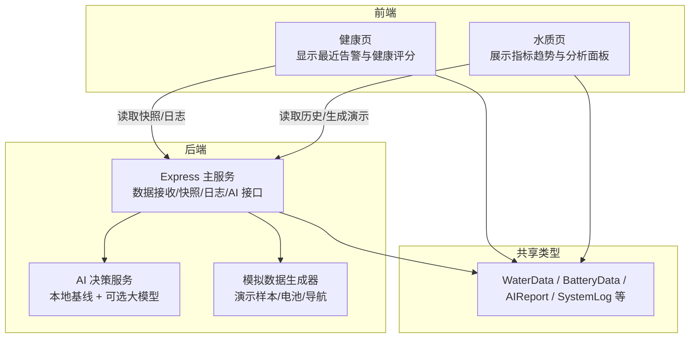
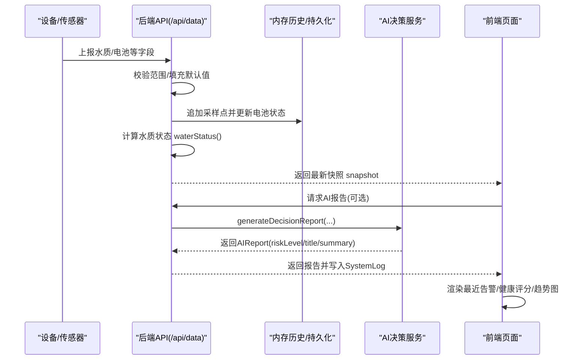
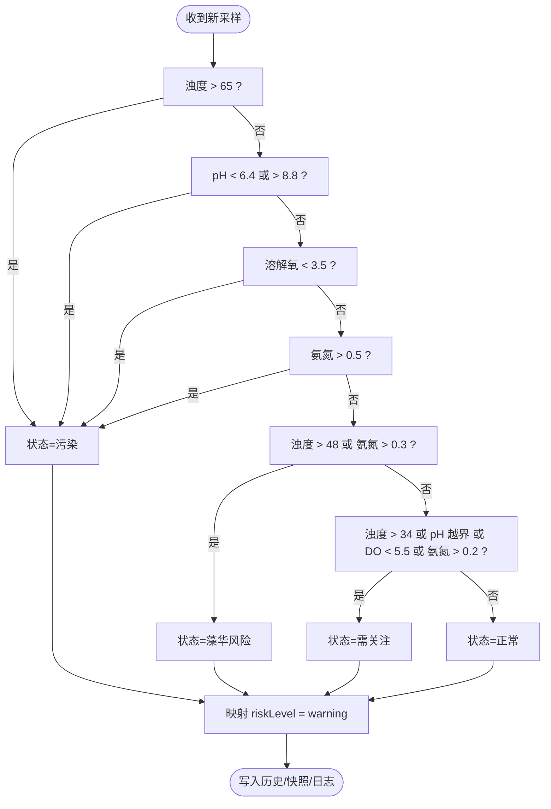
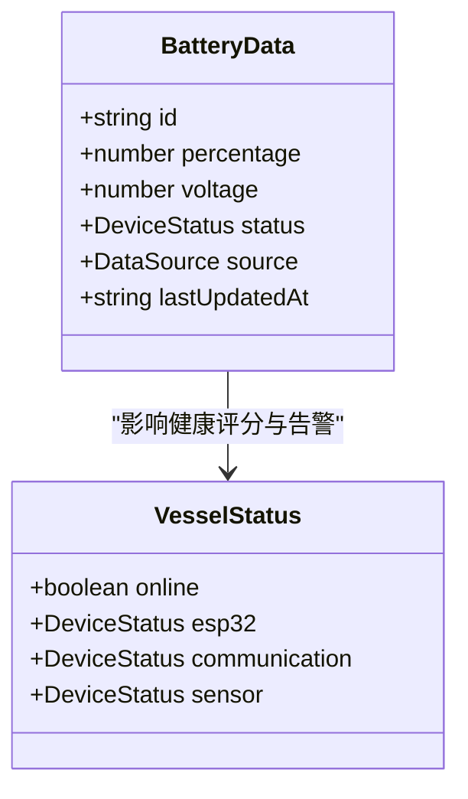
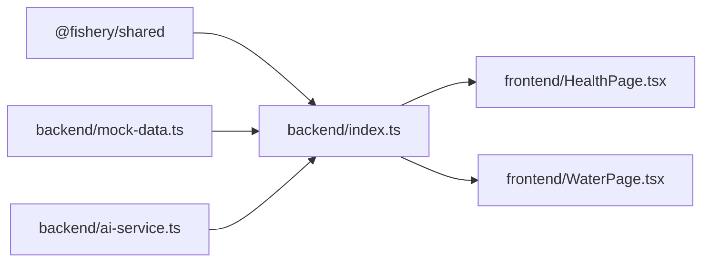

# 告警配置

<cite>
**本文引用的文件**
- [apps/backend/src/index.ts](file://fishery-digital-twin-platform/apps/backend/src/index.ts)
- [apps/backend/src/ai-service.ts](file://fishery-digital-twin-platform/apps/backend/src/ai-service.ts)
- [apps/backend/src/mock-data.ts](file://fishery-digital-twin-platform/apps/backend/src/mock-data.ts)
- [packages/shared/src/index.ts](file://fishery-digital-twin-platform/packages/shared/src/index.ts)
- [apps/frontend/src/components/dashboard/HealthPage.tsx](file://fishery-digital-twin-platform/apps/frontend/src/components/dashboard/HealthPage.tsx)
- [apps/frontend/src/components/dashboard/WaterPage.tsx](file://fishery-digital-twin-platform/apps/frontend/src/components/dashboard/WaterPage.tsx)
</cite>

## 目录
1. [简介](#简介)
2. [项目结构](#项目结构)
3. [核心组件](#核心组件)
4. [架构总览](#架构总览)
5. [详细组件分析](#详细组件分析)
6. [依赖关系分析](#依赖关系分析)
7. [性能与稳定性考虑](#性能与稳定性考虑)
8. [故障排查指南](#故障排查指南)
9. [结论](#结论)
10. [附录：阈值与告警规则速查](#附录阈值与告警规则速查)

## 简介
本文件面向“智慧渔业数字孪生平台”的告警配置与管理，聚焦以下目标：
- 明确水质参数、设备状态与性能指标的阈值设置方法。
- 定义告警级别（信息级、关注级、预警级）及其触发条件。
- 说明当前系统内的通知渠道现状与扩展建议（邮件、短信、Webhook、站内消息）。
- 给出告警升级策略建议（自动升级、时间窗口、升级目标）。
- 提供告警抑制与去重机制建议，避免告警风暴与重复通知。
- 提供告警规则模板与自定义脚本开发指引，便于后续扩展。

## 项目结构
本仓库采用前后端分离与共享类型库的组织方式：
- 后端服务负责数据接入、阈值判定、AI 报告生成、系统日志记录与持久化。
- 前端页面负责展示健康度、水质趋势、最近告警与分析报告。
- 共享类型库统一了数据结构与枚举值，确保前后端一致。

图表来源
- [apps/backend/src/index.ts:1-120](file://fishery-digital-twin-platform/apps/backend/src/index.ts#L1-L120)
- [apps/backend/src/ai-service.ts:1-120](file://fishery-digital-twin-platform/apps/backend/src/ai-service.ts#L1-L120)
- [apps/backend/src/mock-data.ts:180-244](file://fishery-digital-twin-platform/apps/backend/src/mock-data.ts#L180-L244)
- [packages/shared/src/index.ts:1-106](file://fishery-digital-twin-platform/packages/shared/src/index.ts#L1-L106)

章节来源
- [apps/backend/src/index.ts:1-120](file://fishery-digital-twin-platform/apps/backend/src/index.ts#L1-L120)
- [packages/shared/src/index.ts:1-106](file://fishery-digital-twin-platform/packages/shared/src/index.ts#L1-L106)

## 核心组件
- 水质阈值与状态判定：后端在数据入库时计算 WaterStatus，并映射为风险等级 riskLevel。
- 设备健康与告警聚合：前端根据设备在线状态与电池电量计算健康评分与活动告警。
- AI 辅助决策：后端基于统计特征与可选大模型输出结构化报告，包含风险等级与建议。
- 系统日志：后端将关键事件写入 SystemLog，供前端查询与展示。

章节来源
- [apps/backend/src/index.ts:264-269](file://fishery-digital-twin-platform/apps/backend/src/index.ts#L264-L269)
- [apps/backend/src/ai-service.ts:75-122](file://fishery-digital-twin-platform/apps/backend/src/ai-service.ts#L75-L122)
- [apps/frontend/src/components/dashboard/HealthPage.tsx:18-35](file://fishery-digital-twin-platform/apps/frontend/src/components/dashboard/HealthPage.tsx#L18-L35)
- [packages/shared/src/index.ts:65-106](file://fishery-digital-twin-platform/packages/shared/src/index.ts#L65-L106)

## 架构总览
下图展示了从传感器数据到告警与报告的端到端流程，包括阈值判定、AI 报告生成与前端展示。

图表来源
- [apps/backend/src/index.ts:367-430](file://fishery-digital-twin-platform/apps/backend/src/index.ts#L367-L430)
- [apps/backend/src/ai-service.ts:167-233](file://fishery-digital-twin-platform/apps/backend/src/ai-service.ts#L167-L233)
- [apps/frontend/src/components/dashboard/WaterPage.tsx:403-461](file://fishery-digital-twin-platform/apps/frontend/src/components/dashboard/WaterPage.tsx#L403-L461)

## 详细组件分析

### 水质阈值与告警级别
- 水质状态 waterStatus 由浊度、pH、溶解氧、氨氮共同决定，分为 normal、attention、algae-risk、polluted。
- 风险等级 riskLevel 将水质状态映射为 normal、attention、warning，用于统一对外展示与处理。
- 前端对单指标进行“正常/关注”提示，便于快速定位异常项。

图表来源
- [apps/backend/src/index.ts:264-269](file://fishery-digital-twin-platform/apps/backend/src/index.ts#L264-L269)
- [apps/backend/src/ai-service.ts:43-47](file://fishery-digital-twin-platform/apps/backend/src/ai-service.ts#L43-L47)
- [apps/backend/src/mock-data.ts:27-32](file://fishery-digital-twin-platform/apps/backend/src/mock-data.ts#L27-L32)

章节来源
- [apps/backend/src/index.ts:264-269](file://fishery-digital-twin-platform/apps/backend/src/index.ts#L264-L269)
- [apps/backend/src/ai-service.ts:43-47](file://fishery-digital-twin-platform/apps/backend/src/ai-service.ts#L43-L47)
- [apps/backend/src/mock-data.ts:27-32](file://fishery-digital-twin-platform/apps/backend/src/mock-data.ts#L27-L32)
- [apps/frontend/src/components/dashboard/WaterPage.tsx:233-240](file://fishery-digital-twin-platform/apps/frontend/src/components/dashboard/WaterPage.tsx#L233-L240)

### 设备状态阈值与告警
- 设备状态 DeviceStatus 包含 online、warning、offline。
- 电池低电量阈值：当百分比 ≤ 20% 标记为 warning；前端进一步将 ≤ 30% 视为需关注。
- 设备离线：通信/传感器/主控模块 offline 会直接计入严重故障。

图表来源
- [packages/shared/src/index.ts:19-26](file://fishery-digital-twin-platform/packages/shared/src/index.ts#L19-L26)
- [packages/shared/src/index.ts:86-96](file://fishery-digital-twin-platform/packages/shared/src/index.ts#L86-L96)
- [apps/backend/src/index.ts:406-416](file://fishery-digital-twin-platform/apps/backend/src/index.ts#L406-L416)
- [apps/frontend/src/components/dashboard/HealthPage.tsx:18-35](file://fishery-digital-twin-platform/apps/frontend/src/components/dashboard/HealthPage.tsx#L18-L35)

章节来源
- [apps/backend/src/index.ts:406-416](file://fishery-digital-twin-platform/apps/backend/src/index.ts#L406-L416)
- [apps/frontend/src/components/dashboard/HealthPage.tsx:18-35](file://fishery-digital-twin-platform/apps/frontend/src/components/dashboard/HealthPage.tsx#L18-L35)
- [packages/shared/src/index.ts:19-26](file://fishery-digital-twin-platform/packages/shared/src/index.ts#L19-L26)

### 性能指标阈值与告警
- 推进器急停命令会触发 warning 级别日志，用于安全相关告警。
- 数字孪生推演结果中的风险等级可用于评估任务完成概率与设备疲劳，作为运行期告警参考。

章节来源
- [apps/backend/src/index.ts:510-523](file://fishery-digital-twin-platform/apps/backend/src/index.ts#L510-L523)
- [packages/shared/src/index.ts:209-287](file://fishery-digital-twin-platform/packages/shared/src/index.ts#L209-L287)

### 通知渠道配置
- 当前实现：系统通过 SystemLog 记录事件，前端提供“最近告警”视图，属于站内消息范畴。
- 未实现的外部通知：邮件、短信、Webhook 回调在当前代码中未发现实现。
- 建议扩展：
  - Webhook：在 appendLog 后增加可配置的 Webhook 调用，支持重试与幂等键。
  - 邮件/短信：通过第三方服务 API 发送，结合告警级别与频率限制。
  - 站内消息：基于现有 SystemLog 列表与筛选能力，增强订阅与已读状态。

章节来源
- [apps/backend/src/index.ts:116-129](file://fishery-digital-twin-platform/apps/backend/src/index.ts#L116-L129)
- [apps/frontend/src/components/dashboard/HealthPage.tsx:158-178](file://fishery-digital-twin-platform/apps/frontend/src/components/dashboard/HealthPage.tsx#L158-L178)

### 告警升级策略
- 当前行为：waterStatus 与 battery 状态直接映射为风险等级，未见按时间窗口的自动升级逻辑。
- 建议策略：
  - 自动升级：同一告警持续 N 分钟且无恢复则升级一级。
  - 升级时间：可配置静默期、冷却期与升级步长。
  - 升级目标：按角色或群组路由（如运维、船长、调度）。

[本节为通用建议，不直接分析具体文件]

### 告警抑制与去重
- 当前行为：AI 报告生成限频（每分钟一次），避免频繁外部调用。
- 建议机制：
  - 同键去重：以设备ID+指标+阈值组合为键，设定最小间隔。
  - 告警风暴抑制：滑动窗口内相同告警合并为一条，附带计数与首次/末次时间。
  - 恢复通知：仅在上一次告警恢复时发送一次通知。

章节来源
- [apps/backend/src/index.ts:456-473](file://fishery-digital-twin-platform/apps/backend/src/index.ts#L456-L473)

### 告警规则模板与自定义脚本
- 内置规则模板：
  - 水质阈值：浊度、pH、溶解氧、氨氮的多级阈值。
  - 设备阈值：电池低电量、设备离线。
  - 安全阈值：推进器急停。
- 自定义脚本建议：
  - 在数据入库前插入“预处理脚本”，对异常值做平滑或剔除。
  - 在 appendLog 后插入“通知脚本”，对接邮件/短信/Webhook。
  - 使用环境变量注入阈值与通道配置，便于多环境部署。

章节来源
- [apps/backend/src/index.ts:367-430](file://fishery-digital-twin-platform/apps/backend/src/index.ts#L367-L430)
- [apps/backend/src/ai-service.ts:167-233](file://fishery-digital-twin-platform/apps/backend/src/ai-service.ts#L167-L233)

## 依赖关系分析
- 后端 index.ts 依赖：
  - 共享类型 packages/shared/src/index.ts 定义的数据结构与枚举。
  - AI 服务 ai-service.ts 生成结构化报告。
  - 模拟数据 mock-data.ts 提供演示样本与默认值。
- 前端 HealthPage.tsx 与 WaterPage.tsx 依赖后端快照与日志接口，以及共享类型。

图表来源
- [packages/shared/src/index.ts:1-106](file://fishery-digital-twin-platform/packages/shared/src/index.ts#L1-L106)
- [apps/backend/src/index.ts:1-45](file://fishery-digital-twin-platform/apps/backend/src/index.ts#L1-L45)
- [apps/backend/src/ai-service.ts:1-3](file://fishery-digital-twin-platform/apps/backend/src/ai-service.ts#L1-L3)
- [apps/backend/src/mock-data.ts:1-9](file://fishery-digital-twin-platform/apps/backend/src/mock-data.ts#L1-L9)
- [apps/frontend/src/components/dashboard/HealthPage.tsx:1-12](file://fishery-digital-twin-platform/apps/frontend/src/components/dashboard/HealthPage.tsx#L1-L12)
- [apps/frontend/src/components/dashboard/WaterPage.tsx:1-12](file://fishery-digital-twin-platform/apps/frontend/src/components/dashboard/WaterPage.tsx#L1-L12)

章节来源
- [packages/shared/src/index.ts:1-106](file://fishery-digital-twin-platform/packages/shared/src/index.ts#L1-L106)
- [apps/backend/src/index.ts:1-45](file://fishery-digital-twin-platform/apps/backend/src/index.ts#L1-L45)

## 性能与稳定性考虑
- 数据新鲜度：通过 sensorFreshnessMs 控制传感器在线判断，避免陈旧数据导致误判。
- 历史长度：waterHistory 最大保留条数限制，防止内存增长。
- AI 报告限频：每分钟最多一次，降低外部模型调用压力。
- 日志裁剪：systemLogs 固定长度，避免无限增长。

章节来源
- [apps/backend/src/index.ts:67-68](file://fishery-digital-twin-platform/apps/backend/src/index.ts#L67-L68)
- [apps/backend/src/index.ts:64-65](file://fishery-digital-twin-platform/apps/backend/src/index.ts#L64-L65)
- [apps/backend/src/index.ts:456-473](file://fishery-digital-twin-platform/apps/backend/src/index.ts#L456-L473)
- [apps/backend/src/index.ts:116-129](file://fishery-digital-twin-platform/apps/backend/src/index.ts#L116-L129)

## 故障排查指南
- 传感器数据无效：检查字段是否落在允许范围，错误将被拒绝并返回错误信息。
- AI 报告失败：检查网络与密钥配置，失败时会记录 error 级别日志。
- 设备离线：确认 GPS/舵机/推进器/传感器在线状态，必要时重启或检查供电。
- 告警不刷新：确认后端连接与快照获取是否正常，查看“最近告警”区域。

章节来源
- [apps/backend/src/index.ts:367-430](file://fishery-digital-twin-platform/apps/backend/src/index.ts#L367-L430)
- [apps/backend/src/index.ts:456-473](file://fishery-digital-twin-platform/apps/backend/src/index.ts#L456-L473)
- [apps/frontend/src/components/dashboard/HealthPage.tsx:158-178](file://fishery-digital-twin-platform/apps/frontend/src/components/dashboard/HealthPage.tsx#L158-L178)

## 结论
当前系统在阈值判定、设备健康与告警展示方面具备完整闭环：后端负责阈值计算与日志记录，前端负责可视化与用户交互。尚未实现外部通知渠道与复杂升级策略，但提供了良好的扩展点（appendLog、AI 报告接口、快照接口）。建议在后续迭代中引入 Webhook/邮件/短信通知、告警抑制与升级策略，以提升运维效率与用户体验。

## 附录：阈值与告警规则速查
- 水质阈值（waterStatus）
  - 污染：浊度 > 65 或 pH < 6.4 或 pH > 8.8 或 溶解氧 < 3.5 或 氨氮 > 0.5
  - 藻华风险：浊度 > 48 或 氨氮 > 0.3
  - 需关注：浊度 > 34 或 pH 越界 6.8-8.4 或 溶解氧 < 5.5 或 氨氮 > 0.2
  - 正常：以上均不满足
- 风险等级映射
  - polluted/algae-risk → warning
  - attention → attention
  - normal → normal
- 设备阈值
  - 电池 ≤ 20% → warning；前端 ≤ 30% 视为需关注
  - 设备 offline → 计入严重故障
- 安全阈值
  - 推进器急停 → warning 日志
- 通知与升级
  - 当前：站内消息（SystemLog + 最近告警）
  - 建议：Webhook/邮件/短信 + 自动升级与抑制

章节来源
- [apps/backend/src/index.ts:264-269](file://fishery-digital-twin-platform/apps/backend/src/index.ts#L264-L269)
- [apps/backend/src/ai-service.ts:43-47](file://fishery-digital-twin-platform/apps/backend/src/ai-service.ts#L43-L47)
- [apps/backend/src/index.ts:406-416](file://fishery-digital-twin-platform/apps/backend/src/index.ts#L406-L416)
- [apps/backend/src/index.ts:510-523](file://fishery-digital-twin-platform/apps/backend/src/index.ts#L510-L523)
- [apps/frontend/src/components/dashboard/HealthPage.tsx:158-178](file://fishery-digital-twin-platform/apps/frontend/src/components/dashboard/HealthPage.tsx#L158-L178)