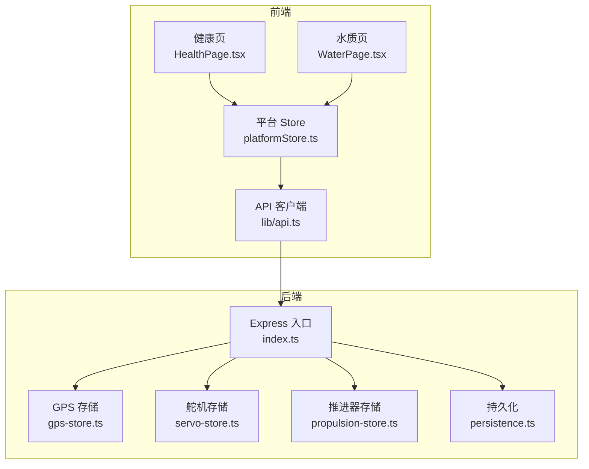
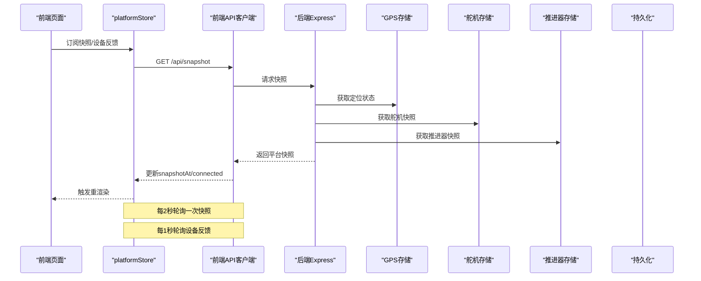
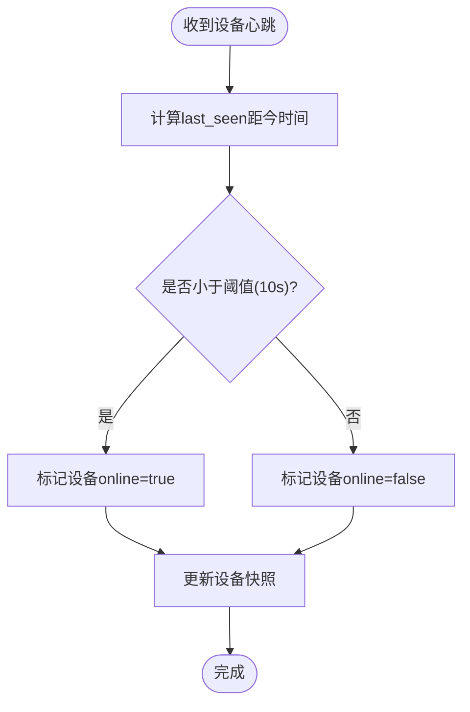
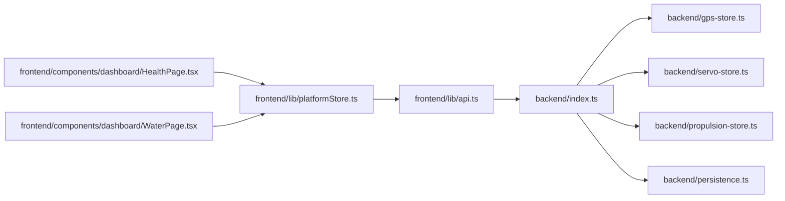

# 性能监控

<cite>
**本文引用的文件**
- [apps/backend/src/index.ts](file://fishery-digital-twin-platform/apps/backend/src/index.ts)
- [apps/backend/src/persistence.ts](file://fishery-digital-twin-platform/apps/backend/src/persistence.ts)
- [apps/backend/src/gps-store.ts](file://fishery-digital-twin-platform/apps/backend/src/gps-store.ts)
- [apps/backend/src/servo-store.ts](file://fishery-digital-twin-platform/apps/backend/src/servo-store.ts)
- [apps/backend/src/propulsion-store.ts](file://fishery-digital-twin-platform/apps/backend/src/propulsion-store.ts)
- [apps/frontend/src/lib/platformStore.ts](file://fishery-digital-twin-platform/apps/frontend/src/lib/platformStore.ts)
- [apps/frontend/src/hooks/usePlatformData.ts](file://fishery-digital-twin-platform/apps/frontend/src/hooks/usePlatformData.ts)
- [apps/frontend/src/lib/api.ts](file://fishery-digital-twin-platform/apps/frontend/src/lib/api.ts)
- [apps/frontend/src/components/dashboard/HealthPage.tsx](file://fishery-digital-twin-platform/apps/frontend/src/components/dashboard/HealthPage.tsx)
- [apps/frontend/src/components/dashboard/WaterPage.tsx](file://fishery-digital-twin-platform/apps/frontend/src/components/dashboard/WaterPage.tsx)
- [apps/backend/src/mock-data.ts](file://fishery-digital-twin-platform/apps/backend/src/mock-data.ts)
</cite>

## 目录
1. [简介](#简介)
2. [项目结构](#项目结构)
3. [核心组件](#核心组件)
4. [架构总览](#架构总览)
5. [详细组件分析](#详细组件分析)
6. [依赖关系分析](#依赖关系分析)
7. [性能考量](#性能考量)
8. [故障排查指南](#故障排查指南)
9. [结论](#结论)
10. [附录](#附录)

## 简介
本文件面向渔业数字孪生平台的性能监控与指标体系，覆盖系统资源使用、应用性能指标、设备状态监控、业务关键指标、基准测试方法与瓶颈识别工具，以及常见问题的诊断与优化建议。平台通过后端 Express API 聚合传感器、GPS、舵机、推进器与 AI 报告等数据，前端以固定频率轮询快照与设备反馈，形成端到端的可观测性闭环。

## 项目结构
- 后端（Node.js + Express）
  - 统一入口与路由：提供健康检查、快照、水质、电池、导航、设备控制与日志接口；内置 UDP 设备发现广播；实现数据持久化与限流保护。
  - 设备状态存储：GPS、舵机、推进器各自维护在线判定、命令队列与时间窗口过滤。
  - 持久化：异步批量落盘 platform-state.json，包含水质历史、电池、AI 报告与系统日志。
- 前端（Next.js）
  - 共享 Store：platformStore 以固定间隔轮询 /api/snapshot 与设备反馈接口，合并连接状态与更新时间。
  - 页面与可视化：健康页、水质页、AI 报告、数字孪生推演等界面消费 store 数据并展示趋势、告警与健康评分。
  - API 客户端：封装 fetchJson，统一超时、鉴权头与错误处理。

**图表来源**
- [apps/frontend/src/lib/api.ts:1-101](file://fishery-digital-twin-platform/apps/frontend/src/lib/api.ts#L1-L101)
- [apps/frontend/src/lib/platformStore.ts:1-196](file://fishery-digital-twin-platform/apps/frontend/src/lib/platformStore.ts#L1-L196)
- [apps/frontend/src/components/dashboard/HealthPage.tsx:1-215](file://fishery-digital-twin-platform/apps/frontend/src/components/dashboard/HealthPage.tsx#L1-L215)
- [apps/frontend/src/components/dashboard/WaterPage.tsx:1-612](file://fishery-digital-twin-platform/apps/frontend/src/components/dashboard/WaterPage.tsx#L1-L612)
- [apps/backend/src/index.ts:1-599](file://fishery-digital-twin-platform/apps/backend/src/index.ts#L1-L599)
- [apps/backend/src/gps-store.ts:1-103](file://fishery-digital-twin-platform/apps/backend/src/gps-store.ts#L1-L103)
- [apps/backend/src/servo-store.ts:1-184](file://fishery-digital-twin-platform/apps/backend/src/servo-store.ts#L1-L184)
- [apps/backend/src/propulsion-store.ts:1-319](file://fishery-digital-twin-platform/apps/backend/src/propulsion-store.ts#L1-L319)
- [apps/backend/src/persistence.ts:1-68](file://fishery-digital-twin-platform/apps/backend/src/persistence.ts#L1-L68)

**章节来源**
- [apps/backend/src/index.ts:46-114](file://fishery-digital-twin-platform/apps/backend/src/index.ts#L46-L114)
- [apps/backend/src/persistence.ts:12-68](file://fishery-digital-twin-platform/apps/backend/src/persistence.ts#L12-L68)
- [apps/frontend/src/lib/platformStore.ts:20-139](file://fishery-digital-twin-platform/apps/frontend/src/lib/platformStore.ts#L20-L139)
- [apps/frontend/src/lib/api.ts:6-24](file://fishery-digital-twin-platform/apps/frontend/src/lib/api.ts#L6-L24)

## 核心组件
- 健康检查与运行态
  - /api/health 返回服务状态、数据模式、AI/GPS/舵机/推进器快照，便于外部探针与前端快速判断可用性。
- 平台快照
  - /api/snapshot 聚合水质历史、电池、导航、AI 报告与船舶状态，供前端渲染主面板。
- 设备与传感器数据
  - /api/data 接收传感器上报，写入水质历史与电池电量，触发 AI 报告失效与日志记录。
  - /api/gps/status、/api/servos/status、/api/propulsion/status 更新各设备在线与遥测。
- 设备控制
  - /api/servos、/api/propulsion 下发目标，后端进行范围校验、限速与命令队列管理。
- 数字孪生与 AI
  - /api/twin/simulate 执行仿真推演；/api/ai/report 生成决策报告（带每分钟限流）。
- 日志与持久化
  - /api/logs 读取系统日志；persistence 模块将水质、电池、AI 报告与日志异步落盘。

**章节来源**
- [apps/backend/src/index.ts:322-557](file://fishery-digital-twin-platform/apps/backend/src/index.ts#L322-L557)
- [apps/backend/src/persistence.ts:17-68](file://fishery-digital-twin-platform/apps/backend/src/persistence.ts#L17-L68)

## 架构总览
下图展示了从前端轮询到后端聚合、设备状态计算与持久化的完整链路，体现性能监控的关键路径。

**图表来源**
- [apps/frontend/src/lib/platformStore.ts:20-139](file://fishery-digital-twin-platform/apps/frontend/src/lib/platformStore.ts#L20-L139)
- [apps/frontend/src/lib/api.ts:26-28](file://fishery-digital-twin-platform/apps/frontend/src/lib/api.ts#L26-L28)
- [apps/backend/src/index.ts:247-262](file://fishery-digital-twin-platform/apps/backend/src/index.ts#L247-L262)
- [apps/backend/src/gps-store.ts:46-57](file://fishery-digital-twin-platform/apps/backend/src/gps-store.ts#L46-L57)
- [apps/backend/src/servo-store.ts:89-104](file://fishery-digital-twin-platform/apps/backend/src/servo-store.ts#L89-L104)
- [apps/backend/src/propulsion-store.ts:149-164](file://fishery-digital-twin-platform/apps/backend/src/propulsion-store.ts#L149-L164)

## 详细组件分析

### 系统资源使用监控
- 进程与服务
  - 端口与主机：HTTP 监听端口与主机由环境变量配置，启动失败时输出错误并退出。
  - UDP 设备发现：绑定指定端口并周期性广播后端地址，用于局域网设备自动发现。
- 网络与I/O
  - CORS 白名单与请求体大小限制，避免恶意或异常流量影响服务稳定性。
  - 持久化采用临时文件+原子重命名，降低写放大与崩溃风险。
- 内存与CPU
  - 水质历史最大长度限制为固定值，防止无限增长导致内存压力。
  - 系统日志保留最近若干条，避免日志膨胀。

**章节来源**
- [apps/backend/src/index.ts:48-76](file://fishery-digital-twin-platform/apps/backend/src/index.ts#L48-L76)
- [apps/backend/src/index.ts:101-114](file://fishery-digital-twin-platform/apps/backend/src/index.ts#L101-L114)
- [apps/backend/src/index.ts:271-318](file://fishery-digital-twin-platform/apps/backend/src/index.ts#L271-L318)
- [apps/backend/src/index.ts:559-599](file://fishery-digital-twin-platform/apps/backend/src/index.ts#L559-L599)
- [apps/backend/src/persistence.ts:17-68](file://fishery-digital-twin-platform/apps/backend/src/persistence.ts#L17-L68)

### 应用性能指标
- API 响应时间
  - 前端统一设置 5 秒超时，避免长尾请求阻塞界面。
  - 快照与设备反馈分别以 2 秒与 1 秒间隔轮询，平衡实时性与负载。
- 请求吞吐
  - 传感器数据写入会截断历史至固定长度，减少后续查询与序列化开销。
  - 演示数据生成不修改真实历史，避免污染生产数据。
- 错误率
  - 控制类接口需要令牌鉴权，未配置令牌时在局域网拒绝控制请求。
  - 参数校验失败返回 400，CORS 错误返回 403，其他错误 500。
- 数据库/存储性能
  - 持久化采用节流合并写入（约 250ms），降低磁盘 I/O 抖动。

**章节来源**
- [apps/frontend/src/lib/api.ts:6-24](file://fishery-digital-twin-platform/apps/frontend/src/lib/api.ts#L6-L24)
- [apps/frontend/src/lib/platformStore.ts:20-139](file://fishery-digital-twin-platform/apps/frontend/src/lib/platformStore.ts#L20-L139)
- [apps/backend/src/index.ts:159-176](file://fishery-digital-twin-platform/apps/backend/src/index.ts#L159-L176)
- [apps/backend/src/index.ts:367-430](file://fishery-digital-twin-platform/apps/backend/src/index.ts#L367-L430)
- [apps/backend/src/persistence.ts:51-68](file://fishery-digital-twin-platform/apps/backend/src/persistence.ts#L51-L68)

### 设备状态监控
- ESP32 设备在线状态
  - GPS、舵机、推进器均基于 last_seen 时间戳判断在线，阈值分别为 10 秒。
  - 船舶状态综合多个子设备在线情况，区分 esp32、communication、sensor 三类。
- 传感器数据新鲜度
  - 水质数据若超过配置的 sensorFreshnessMs（默认 30 秒）将被视为离线，影响 sensor 状态。
- 设备通信质量
  - 通过 /api/health 暴露 GPS、舵机、推进器快照，便于外部监控系统评估连通性。

**图表来源**
- [apps/backend/src/gps-store.ts:40-57](file://fishery-digital-twin-platform/apps/backend/src/gps-store.ts#L40-L57)
- [apps/backend/src/servo-store.ts:43-58](file://fishery-digital-twin-platform/apps/backend/src/servo-store.ts#L43-L58)
- [apps/backend/src/propulsion-store.ts:82-147](file://fishery-digital-twin-platform/apps/backend/src/propulsion-store.ts#L82-L147)
- [apps/backend/src/index.ts:228-245](file://fishery-digital-twin-platform/apps/backend/src/index.ts#L228-L245)

**章节来源**
- [apps/backend/src/gps-store.ts:40-57](file://fishery-digital-twin-platform/apps/backend/src/gps-store.ts#L40-L57)
- [apps/backend/src/servo-store.ts:43-58](file://fishery-digital-twin-platform/apps/backend/src/servo-store.ts#L43-L58)
- [apps/backend/src/propulsion-store.ts:82-147](file://fishery-digital-twin-platform/apps/backend/src/propulsion-store.ts#L82-L147)
- [apps/backend/src/index.ts:228-245](file://fishery-digital-twin-platform/apps/backend/src/index.ts#L228-L245)

### 业务关键指标监控
- 水质参数异常检测
  - 根据浊度、pH、溶解氧、氨氮阈值划分正常/关注/藻华风险/污染等级。
  - 水质页展示最新值与趋势，支持 1h/6h/24h/7d 多时间窗对比。
- 电池电量监控
  - 传感器上报百分比后，后端计算电压与状态（低电量警告），前端健康页汇总平均电量与预警项。
- 导航定位精度
  - GPS 有效定位需满足坐标范围与 valid 标志，结合 HDOP、卫星数等辅助指标；导航模块据此填充位置、航向与速度。

**章节来源**
- [apps/backend/src/index.ts:264-269](file://fishery-digital-twin-platform/apps/backend/src/index.ts#L264-L269)
- [apps/backend/src/index.ts:367-430](file://fishery-digital-twin-platform/apps/backend/src/index.ts#L367-L430)
- [apps/frontend/src/components/dashboard/WaterPage.tsx:220-275](file://fishery-digital-twin-platform/apps/frontend/src/components/dashboard/WaterPage.tsx#L220-L275)
- [apps/frontend/src/components/dashboard/HealthPage.tsx:24-31](file://fishery-digital-twin-platform/apps/frontend/src/components/dashboard/HealthPage.tsx#L24-L31)
- [apps/backend/src/gps-store.ts:59-103](file://fishery-digital-twin-platform/apps/backend/src/gps-store.ts#L59-L103)

### 性能基准测试方法
- 接口压测
  - 对 /api/snapshot、/api/data、/api/ai/report 进行并发请求，观察 P50/P95/P99 响应时间与错误率。
  - 注意 /api/ai/report 有每分钟限流，压测时应考虑该约束。
- 数据吞吐
  - 模拟传感器高频上报（如每秒多条），验证水质历史截断与持久化节流是否稳定。
- 前端轮询负载
  - 调整 platformStore 的快照与反馈轮询间隔，评估不同间隔下的 CPU 与网络占用。
- 设备侧
  - 通过固件定时上报 GPS/舵机/推进器状态，观察后端在线判定与命令队列 TTL 行为。

[本节为通用指导，不直接分析具体文件]

### 性能瓶颈识别工具
- 前端
  - 浏览器开发者工具的 Network 面板查看请求耗时与失败率；Performance 面板分析渲染与脚本执行。
  - 通过 HealthPage 的“立即健康检查”触发快照与设备反馈刷新，观察连接状态与更新时间。
- 后端
  - 利用 /api/health 快速自检服务与子系统状态。
  - 通过 /api/logs 查看系统日志，定位错误与告警。
  - 观察 persistence 落盘频率与文件大小变化，评估磁盘 I/O 压力。

**章节来源**
- [apps/frontend/src/components/dashboard/HealthPage.tsx:37-47](file://fishery-digital-twin-platform/apps/frontend/src/components/dashboard/HealthPage.tsx#L37-L47)
- [apps/backend/src/index.ts:322-334](file://fishery-digital-twin-platform/apps/backend/src/index.ts#L322-L334)
- [apps/backend/src/index.ts:557-561](file://fishery-digital-twin-platform/apps/backend/src/index.ts#L557-L561)
- [apps/backend/src/persistence.ts:51-68](file://fishery-digital-twin-platform/apps/backend/src/persistence.ts#L51-L68)

## 依赖关系分析
- 前端依赖
  - platformStore 依赖 api 客户端调用 /api/snapshot 与设备反馈接口。
  - 页面组件（HealthPage、WaterPage）消费 usePlatformData 提供的快照切片。
- 后端依赖
  - index.ts 依赖 gps-store、servo-store、propulsion-store 获取设备状态。
  - 持久化模块负责将运行时状态落盘，供重启恢复。

**图表来源**
- [apps/frontend/src/lib/api.ts:1-101](file://fishery-digital-twin-platform/apps/frontend/src/lib/api.ts#L1-L101)
- [apps/frontend/src/lib/platformStore.ts:1-196](file://fishery-digital-twin-platform/apps/frontend/src/lib/platformStore.ts#L1-L196)
- [apps/frontend/src/components/dashboard/HealthPage.tsx:1-215](file://fishery-digital-twin-platform/apps/frontend/src/components/dashboard/HealthPage.tsx#L1-L215)
- [apps/frontend/src/components/dashboard/WaterPage.tsx:1-612](file://fishery-digital-twin-platform/apps/frontend/src/components/dashboard/WaterPage.tsx#L1-L612)
- [apps/backend/src/index.ts:1-599](file://fishery-digital-twin-platform/apps/backend/src/index.ts#L1-L599)
- [apps/backend/src/gps-store.ts:1-103](file://fishery-digital-twin-platform/apps/backend/src/gps-store.ts#L1-L103)
- [apps/backend/src/servo-store.ts:1-184](file://fishery-digital-twin-platform/apps/backend/src/servo-store.ts#L1-L184)
- [apps/backend/src/propulsion-store.ts:1-319](file://fishery-digital-twin-platform/apps/backend/src/propulsion-store.ts#L1-L319)
- [apps/backend/src/persistence.ts:1-68](file://fishery-digital-twin-platform/apps/backend/src/persistence.ts#L1-L68)

**章节来源**
- [apps/frontend/src/lib/platformStore.ts:53-96](file://fishery-digital-twin-platform/apps/frontend/src/lib/platformStore.ts#L53-L96)
- [apps/backend/src/index.ts:247-262](file://fishery-digital-twin-platform/apps/backend/src/index.ts#L247-L262)

## 性能考量
- 轮询频率与负载
  - 快照 2 秒、设备反馈 1 秒，适合实时监控但会增加网络与解析开销；在带宽受限环境可适当增大间隔。
- 数据量控制
  - 水质历史与日志均有上限，避免内存与磁盘持续增长；必要时调小 maxHistory 或日志保留条数。
- 鉴权与限流
  - 控制接口要求令牌，AI 报告每分钟限流，防止滥用与雪崩。
- 持久化策略
  - 节流写入与原子重命名提升可靠性；在高写入场景下关注磁盘 I/O 峰值。
- 前端渲染
  - 使用切片对象与 useSyncExternalStore 减少不必要重渲染；图表初始化延迟与空状态占位提升体验。

[本节为通用指导，不直接分析具体文件]

## 故障排查指南
- 无法连接后端
  - 检查 NEXT_PUBLIC_API_BASE 与后端端口；确认 CORS 白名单包含前端域名。
  - 使用 /api/health 验证服务可用性与子系统状态。
- 设备离线
  - 确认设备心跳 last_seen 是否在阈值内；检查串口/网络连通与固件上报逻辑。
  - 舵机/推进器命令需在设备 online 且处于 TTL 窗口内才生效。
- 传感器数据不更新
  - 检查 /api/data 入参字段与范围；确认 sensorFreshnessMs 配置是否合理。
  - 查看 /api/logs 中的“传感器数据已接收”日志。
- AI 报告失败
  - 注意每分钟限流；检查令牌配置与模型依赖；查看错误日志。
- 持久化失败
  - 检查数据目录权限与磁盘空间；关注持久化错误日志。

**章节来源**
- [apps/frontend/src/lib/api.ts:6-24](file://fishery-digital-twin-platform/apps/frontend/src/lib/api.ts#L6-L24)
- [apps/backend/src/index.ts:101-114](file://fishery-digital-twin-platform/apps/backend/src/index.ts#L101-L114)
- [apps/backend/src/index.ts:322-334](file://fishery-digital-twin-platform/apps/backend/src/index.ts#L322-L334)
- [apps/backend/src/index.ts:367-430](file://fishery-digital-twin-platform/apps/backend/src/index.ts#L367-L430)
- [apps/backend/src/index.ts:447-473](file://fishery-digital-twin-platform/apps/backend/src/index.ts#L447-L473)
- [apps/backend/src/persistence.ts:17-68](file://fishery-digital-twin-platform/apps/backend/src/persistence.ts#L17-L68)

## 结论
该平台通过前后端协作实现了完整的性能监控与可观测性：后端聚合设备与传感器数据并提供健康检查与日志，前端以固定频率轮询并可视化关键指标。通过数据量控制、鉴权限流与持久化节流，系统在实时性与稳定性之间取得平衡。建议在生产环境中结合外部监控（如 Prometheus 或 APM）进一步采集 CPU、内存、磁盘与网络指标，并对轮询频率与数据窗口进行容量规划与压测验证。

## 附录
- 关键接口一览
  - 健康检查：GET /api/health
  - 平台快照：GET /api/snapshot
  - 水质历史：GET /api/water
  - 传感器上报：POST /api/data
  - 电池列表：GET /api/batteries
  - 导航与GPS：GET /api/navigation、GET /api/gps
  - 舵机/推进器：GET/POST /api/servos、/api/propulsion
  - 数字孪生：POST /api/twin/simulate
  - AI 报告：GET/POST /api/ai/report
  - 系统日志：GET /api/logs

[本节为概览信息，不直接分析具体文件]