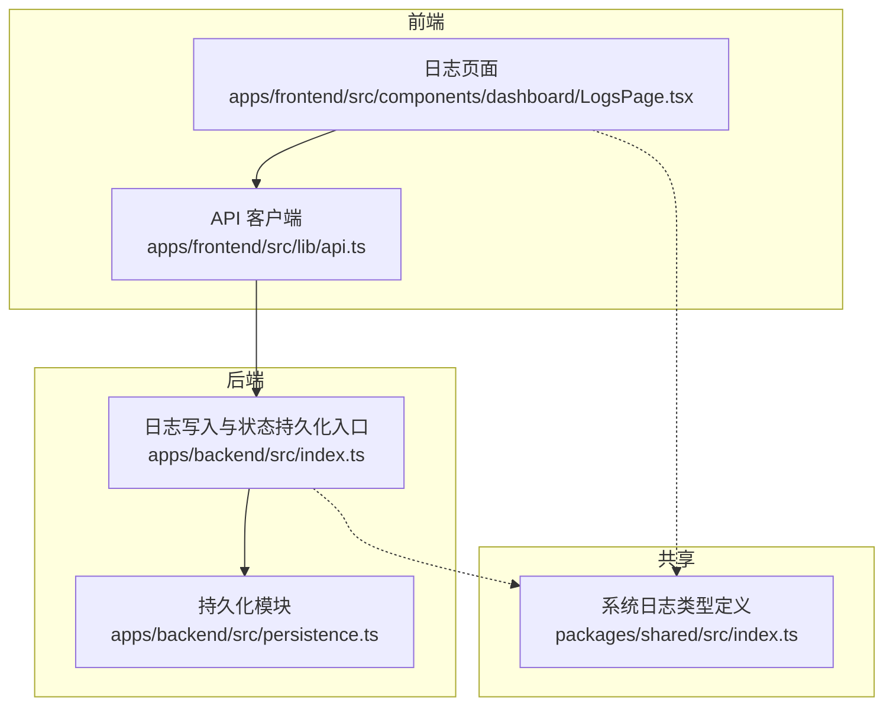
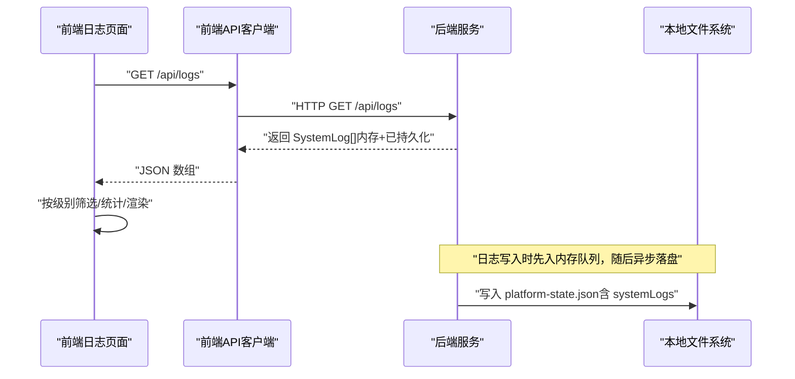
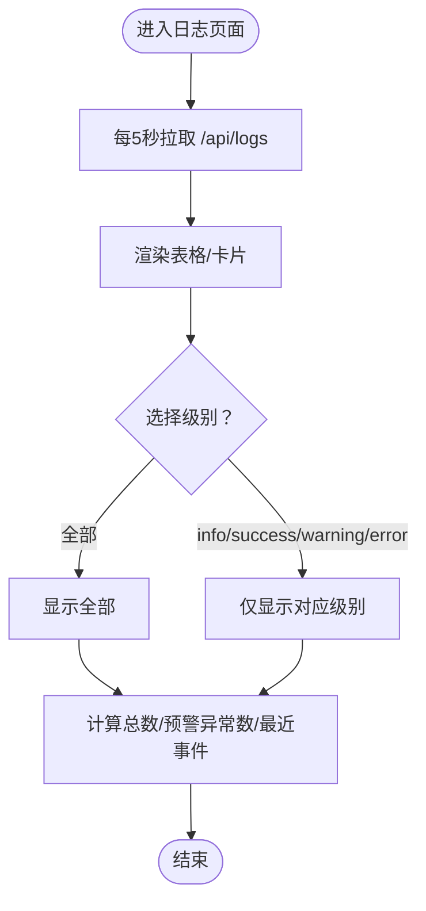
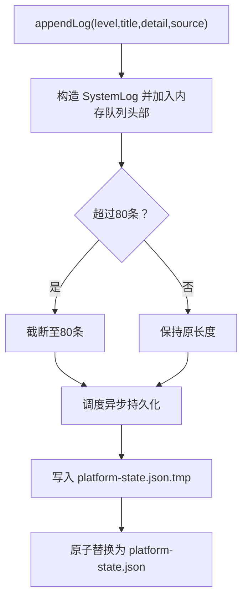
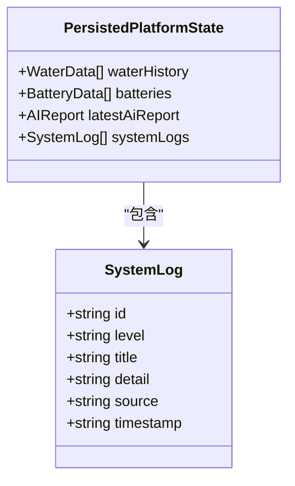
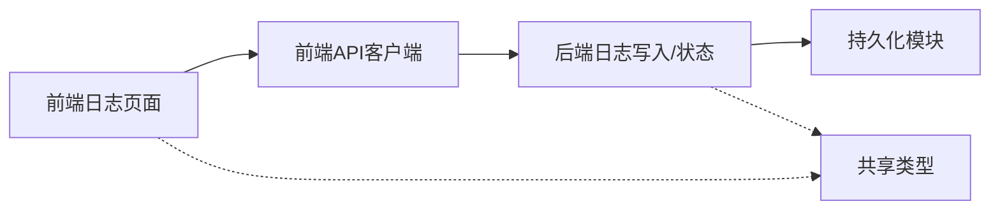

# 日志管理

<cite>
**本文引用的文件**
- [apps/backend/src/index.ts](file://fishery-digital-twin-platform/apps/backend/src/index.ts)
- [apps/backend/src/persistence.ts](file://fishery-digital-twin-platform/apps/backend/src/persistence.ts)
- [packages/shared/src/index.ts](file://fishery-digital-twin-platform/packages/shared/src/index.ts)
- [apps/frontend/src/lib/api.ts](file://fishery-digital-twin-platform/apps/frontend/src/lib/api.ts)
- [apps/frontend/src/components/dashboard/LogsPage.tsx](file://fishery-digital-twin-platform/apps/frontend/src/components/dashboard/LogsPage.tsx)
- [apps/frontend/src/app/dashboard/logs/page.tsx](file://fishery-digital-twin-platform/apps/frontend/src/app/dashboard/logs/page.tsx)
</cite>

## 目录
1. [简介](#简介)
2. [项目结构](#项目结构)
3. [核心组件](#核心组件)
4. [架构总览](#架构总览)
5. [详细组件分析](#详细组件分析)
6. [依赖关系分析](#依赖关系分析)
7. [性能考虑](#性能考虑)
8. [故障排查指南](#故障排查指南)
9. [结论](#结论)
10. [附录](#附录)

## 简介
本文件面向“渔业数字孪生平台”的日志子系统，聚焦日志收集、存储与展示的全链路说明。系统采用后端集中式记录与持久化、前端轮询拉取并可视化的方式，提供结构化日志格式、级别定义、来源标识与时间戳规范；同时给出日志容量限制、历史保留策略与自动清理机制，以及前端过滤与统计能力。文档还包含常见问题的定位方法与最佳实践建议，帮助运维与开发人员高效排障与优化。

## 项目结构
日志相关的关键位置如下：
- 后端服务：负责生成、维护与持久化系统日志，并通过 API 暴露查询接口。
- 共享类型：统一日志数据结构，确保前后端一致。
- 前端页面：定时拉取日志数据，支持按级别筛选与概览统计。

**图示来源**
- [apps/frontend/src/components/dashboard/LogsPage.tsx:1-89](file://fishery-digital-twin-platform/apps/frontend/src/components/dashboard/LogsPage.tsx#L1-L89)
- [apps/frontend/src/lib/api.ts:1-101](file://fishery-digital-twin-platform/apps/frontend/src/lib/api.ts#L1-L101)
- [apps/backend/src/index.ts:112-129](file://fishery-digital-twin-platform/apps/backend/src/index.ts#L112-L129)
- [apps/backend/src/persistence.ts:1-67](file://fishery-digital-twin-platform/apps/backend/src/persistence.ts#L1-L67)
- [packages/shared/src/index.ts:196-203](file://fishery-digital-twin-platform/packages/shared/src/index.ts#L196-L203)

**章节来源**
- [apps/frontend/src/components/dashboard/LogsPage.tsx:1-89](file://fishery-digital-twin-platform/apps/frontend/src/components/dashboard/LogsPage.tsx#L1-L89)
- [apps/frontend/src/lib/api.ts:1-101](file://fishery-digital-twin-platform/apps/frontend/src/lib/api.ts#L1-L101)
- [apps/backend/src/index.ts:112-129](file://fishery-digital-twin-platform/apps/backend/src/index.ts#L112-L129)
- [apps/backend/src/persistence.ts:1-67](file://fishery-digital-twin-platform/apps/backend/src/persistence.ts#L1-L67)
- [packages/shared/src/index.ts:196-203](file://fishery-digital-twin-platform/packages/shared/src/index.ts#L196-L203)

## 核心组件
- 结构化日志模型：统一字段 id、level、title、detail、source、timestamp，保证可检索、可排序、可聚合。
- 日志写入：后端在关键流程中追加日志条目，限制内存中的最大条数，并触发异步持久化。
- 持久化存储：将系统日志与其他平台状态一起落盘为 JSON 文件，重启后可恢复最近的历史日志。
- 前端展示：每 5 秒轮询获取最新日志，支持按级别筛选，显示总数、预警异常计数与最近事件标题。

**章节来源**
- [packages/shared/src/index.ts:196-203](file://fishery-digital-twin-platform/packages/shared/src/index.ts#L196-L203)
- [apps/backend/src/index.ts:116-129](file://fishery-digital-twin-platform/apps/backend/src/index.ts#L116-L129)
- [apps/backend/src/persistence.ts:17-49](file://fishery-digital-twin-platform/apps/backend/src/persistence.ts#L17-L49)
- [apps/frontend/src/components/dashboard/LogsPage.tsx:14-43](file://fishery-digital-twin-platform/apps/frontend/src/components/dashboard/LogsPage.tsx#L14-L43)

## 架构总览
日志从产生到展示的完整调用链如下：

**图示来源**
- [apps/frontend/src/lib/api.ts:91-93](file://fishery-digital-twin-platform/apps/frontend/src/lib/api.ts#L91-L93)
- [apps/backend/src/index.ts:116-129](file://fishery-digital-twin-platform/apps/backend/src/index.ts#L116-L129)
- [apps/backend/src/persistence.ts:17-49](file://fishery-digital-twin-platform/apps/backend/src/persistence.ts#L17-L49)

## 详细组件分析

### 结构化日志格式
- 字段说明
  - id：唯一标识，便于去重与追踪。
  - level：日志级别，取值 info、success、warning、error。
  - title：事件摘要，用于列表快速识别。
  - detail：详情文本，承载上下文信息。
  - source：来源标识，如传感器、AI 报告、舵机控制板、后端服务等。
  - timestamp：ISO 8601 时间字符串，便于跨时区排序与解析。
- 使用建议
  - 所有模块统一通过后端提供的写入函数追加日志，避免分散实现。
  - title 应简洁明确，detail 补充必要上下文（设备ID、参数、错误码等）。
  - source 尽量具体，便于后续按来源聚合与告警。

**章节来源**
- [packages/shared/src/index.ts:196-203](file://fishery-digital-twin-platform/packages/shared/src/index.ts#L196-L203)
- [apps/backend/src/index.ts:116-129](file://fishery-digital-twin-platform/apps/backend/src/index.ts#L116-L129)

### 日志级别定义与前端展示
- 级别集合：info、success、warning、error。
- 前端筛选器：全部、信息、成功、预警、异常。
- 视觉提示：success 标记为“良好”，warning/error 标记为“警告”。

**图示来源**
- [apps/frontend/src/components/dashboard/LogsPage.tsx:14-43](file://fishery-digital-twin-platform/apps/frontend/src/components/dashboard/LogsPage.tsx#L14-L43)
- [apps/frontend/src/components/dashboard/LogsPage.tsx:51-88](file://fishery-digital-twin-platform/apps/frontend/src/components/dashboard/LogsPage.tsx#L51-L88)

**章节来源**
- [apps/frontend/src/components/dashboard/LogsPage.tsx:14-43](file://fishery-digital-twin-platform/apps/frontend/src/components/dashboard/LogsPage.tsx#L14-L43)
- [apps/frontend/src/components/dashboard/LogsPage.tsx:51-88](file://fishery-digital-twin-platform/apps/frontend/src/components/dashboard/LogsPage.tsx#L51-L88)

### 日志轮转策略与自动清理
- 内存限制：内存中最多保留最近 80 条日志，新日志插入头部后截断超出部分。
- 持久化裁剪：加载历史状态时，systemLogs 仅恢复前 80 条，避免大文件导致启动缓慢。
- 落盘策略：使用临时文件写入再原子替换，降低损坏风险；写操作节流合并，减少频繁 IO。
- 历史保留：当前未实现基于时间的滚动归档或按大小切分的多文件轮转；如需扩展，可在持久化层增加按日期/大小的拆分与清理任务。

**图示来源**
- [apps/backend/src/index.ts:116-129](file://fishery-digital-twin-platform/apps/backend/src/index.ts#L116-L129)
- [apps/backend/src/persistence.ts:17-49](file://fishery-digital-twin-platform/apps/backend/src/persistence.ts#L17-L49)

**章节来源**
- [apps/backend/src/index.ts:116-129](file://fishery-digital-twin-platform/apps/backend/src/index.ts#L116-L129)
- [apps/backend/src/persistence.ts:17-49](file://fishery-digital-twin-platform/apps/backend/src/persistence.ts#L17-L49)

### 集中式日志管理与查询接口
- 持久化存储：platform-state.json 位于 data 目录（可通过环境变量覆盖），包含 waterHistory、batteries、latestAiReport、systemLogs。
- 查询接口：前端通过 /api/logs 获取 SystemLog[]，用于实时展示。
- 过滤功能：前端支持按级别过滤；后端暂未提供服务端过滤与分页接口。
- 安全访问：前端请求携带可选的 X-UISYS-Token 头，后端对非回环地址进行令牌校验（控制类接口），日志读取是否受控取决于路由实现。

**图示来源**
- [packages/shared/src/index.ts:196-203](file://fishery-digital-twin-platform/packages/shared/src/index.ts#L196-L203)
- [apps/backend/src/persistence.ts:5-10](file://fishery-digital-twin-platform/apps/backend/src/persistence.ts#L5-L10)

**章节来源**
- [apps/backend/src/persistence.ts:5-10](file://fishery-digital-twin-platform/apps/backend/src/persistence.ts#L5-L10)
- [apps/backend/src/persistence.ts:12-29](file://fishery-digital-twin-platform/apps/backend/src/persistence.ts#L12-L29)
- [apps/frontend/src/lib/api.ts:91-93](file://fishery-digital-twin-platform/apps/frontend/src/lib/api.ts#L91-L93)

### 日志分析工具与趋势图表
- 搜索语法：当前前端仅支持按级别过滤；可扩展为关键词搜索、来源过滤、时间范围筛选。
- 统计分析：前端已统计“日志总数”“预警与异常数量”“最近事件标题”；可进一步扩展各来源占比、级别分布、时间序列趋势。
- 趋势图表：建议在日志页面增加折线图/柱状图，展示单位时间内各级别日志数量变化，辅助发现异常时段。

[本节为概念性内容，不直接分析具体文件]

### 配置选项与自定义日志格式
- 数据存储路径：可通过环境变量设置数据目录，默认在项目根目录下的 data 文件夹。
- 日志格式：遵循共享类型 SystemLog；如需扩展字段（如 traceId、correlationId），应在共享类型中新增并在写入处填充。
- 轮转策略：当前为固定上限截断；如需按时间/大小轮转，可在持久化层引入滚动文件与清理任务。

**章节来源**
- [apps/backend/src/persistence.ts:12-13](file://fishery-digital-twin-platform/apps/backend/src/persistence.ts#L12-L13)
- [packages/shared/src/index.ts:196-203](file://fishery-digital-twin-platform/packages/shared/src/index.ts#L196-L203)

## 依赖关系分析
- 前端依赖
  - 日志页面依赖 API 客户端拉取数据，并依赖共享类型进行类型约束。
  - 页面内定时刷新与筛选逻辑决定用户体验与性能。
- 后端依赖
  - 日志写入依赖共享类型，持久化依赖文件系统。
  - 内存队列与落盘策略影响吞吐与可靠性。
- 耦合度
  - 前后端通过 REST 接口松耦合；共享类型增强一致性。
  - 持久化与业务逻辑解耦，便于独立演进。

**图示来源**
- [apps/frontend/src/components/dashboard/LogsPage.tsx:1-89](file://fishery-digital-twin-platform/apps/frontend/src/components/dashboard/LogsPage.tsx#L1-L89)
- [apps/frontend/src/lib/api.ts:1-101](file://fishery-digital-twin-platform/apps/frontend/src/lib/api.ts#L1-L101)
- [apps/backend/src/index.ts:112-129](file://fishery-digital-twin-platform/apps/backend/src/index.ts#L112-L129)
- [apps/backend/src/persistence.ts:1-67](file://fishery-digital-twin-platform/apps/backend/src/persistence.ts#L1-L67)
- [packages/shared/src/index.ts:196-203](file://fishery-digital-twin-platform/packages/shared/src/index.ts#L196-L203)

**章节来源**
- [apps/frontend/src/components/dashboard/LogsPage.tsx:1-89](file://fishery-digital-twin-platform/apps/frontend/src/components/dashboard/LogsPage.tsx#L1-L89)
- [apps/frontend/src/lib/api.ts:1-101](file://fishery-digital-twin-platform/apps/frontend/src/lib/api.ts#L1-L101)
- [apps/backend/src/index.ts:112-129](file://fishery-digital-twin-platform/apps/backend/src/index.ts#L112-L129)
- [apps/backend/src/persistence.ts:1-67](file://fishery-digital-twin-platform/apps/backend/src/persistence.ts#L1-L67)
- [packages/shared/src/index.ts:196-203](file://fishery-digital-twin-platform/packages/shared/src/index.ts#L196-L203)

## 性能考虑
- 前端轮询间隔：默认每 5 秒拉取一次，适合监控场景；若日志量较大，可适当延长间隔或增加分页/增量拉取。
- 内存占用：内存中最多保留 80 条日志，避免无限增长；前端渲染也仅处理当前页数据。
- 磁盘 IO：持久化采用节流合并与临时文件原子替换，降低抖动与损坏风险。
- 网络开销：API 请求带超时与无缓存策略，确保实时性；在高并发下需评估后端负载。

[本节为通用性能建议，不直接分析具体文件]

## 故障排查指南
- 无法连接日志服务
  - 现象：前端显示“日志服务连接失败”，保留上一次成功读取的内容。
  - 排查：检查后端是否运行、API 地址是否正确、网络连通性与鉴权配置。
- 日志不更新
  - 现象：页面长时间无新日志。
  - 排查：确认是否有模块调用日志写入；检查内存队列是否被截断；查看持久化文件是否可写。
- 历史日志缺失
  - 现象：重启后看不到更早的日志。
  - 原因：当前仅保留最近 80 条；如需更长历史，需扩展持久化与轮转策略。
- 权限问题
  - 现象：非回环地址访问受限。
  - 排查：检查令牌配置与请求头；确认路由是否需要鉴权。

**章节来源**
- [apps/frontend/src/components/dashboard/LogsPage.tsx:14-33](file://fishery-digital-twin-platform/apps/frontend/src/components/dashboard/LogsPage.tsx#L14-L33)
- [apps/backend/src/index.ts:131-157](file://fishery-digital-twin-platform/apps/backend/src/index.ts#L131-L157)
- [apps/backend/src/persistence.ts:17-49](file://fishery-digital-twin-platform/apps/backend/src/persistence.ts#L17-L49)

## 结论
该日志子系统以“后端集中记录 + 前端可视化”的方式实现了最小可用的日志能力：统一的 JSON 结构、明确的级别与来源、稳定的持久化与恢复、直观的前端筛选与统计。当前版本未实现按时间/大小的文件轮转与服务端高级查询，但具备清晰的扩展点。建议后续逐步完善：服务端过滤与分页、时间窗口查询、趋势图表、按来源/级别的告警规则，以及更灵活的日志轮转策略。

[本节为总结性内容，不直接分析具体文件]

## 附录
- 关键路径参考
  - 日志写入与状态持久化入口：[apps/backend/src/index.ts:112-129](file://fishery-digital-twin-platform/apps/backend/src/index.ts#L112-L129)
  - 持久化模块（落盘与恢复）：[apps/backend/src/persistence.ts:17-49](file://fishery-digital-twin-platform/apps/backend/src/persistence.ts#L17-L49)
  - 系统日志类型定义：[packages/shared/src/index.ts:196-203](file://fishery-digital-twin-platform/packages/shared/src/index.ts#L196-L203)
  - 前端日志页面与轮询：[apps/frontend/src/components/dashboard/LogsPage.tsx:14-43](file://fishery-digital-twin-platform/apps/frontend/src/components/dashboard/LogsPage.tsx#L14-L43)
  - 前端 API 客户端（日志接口）：[apps/frontend/src/lib/api.ts:91-93](file://fishery-digital-twin-platform/apps/frontend/src/lib/api.ts#L91-L93)
  - 日志路由入口：[apps/frontend/src/app/dashboard/logs/page.tsx:1-5](file://fishery-digital-twin-platform/apps/frontend/src/app/dashboard/logs/page.tsx#L1-L5)

[本节为索引性内容，不直接分析具体文件]