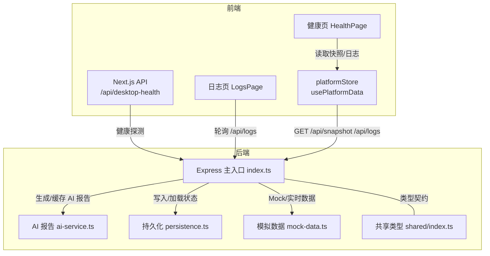
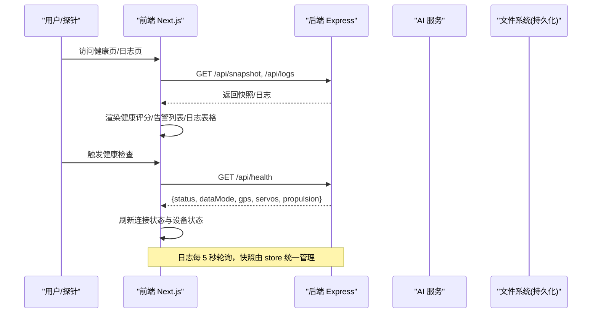
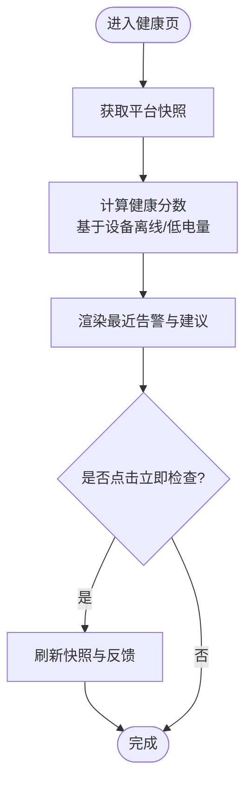
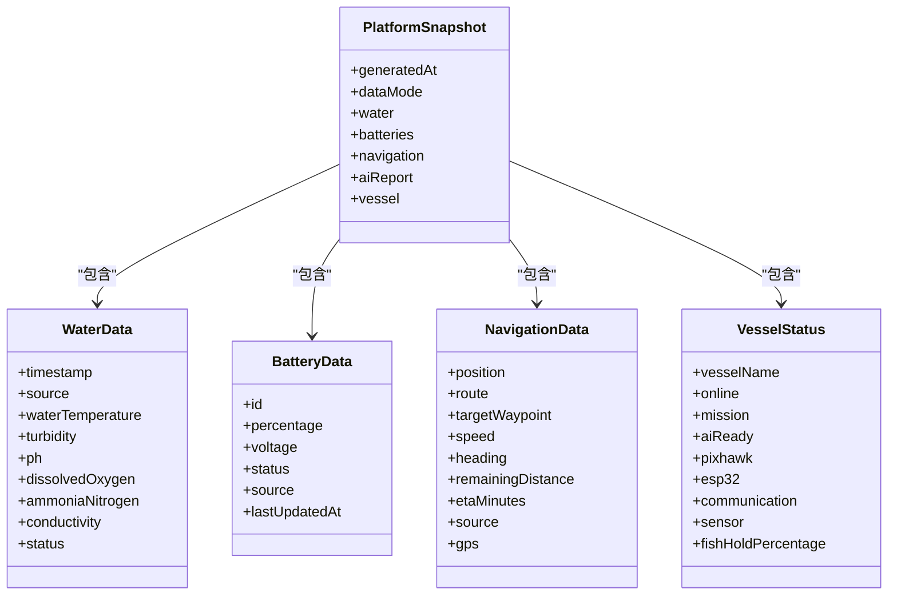
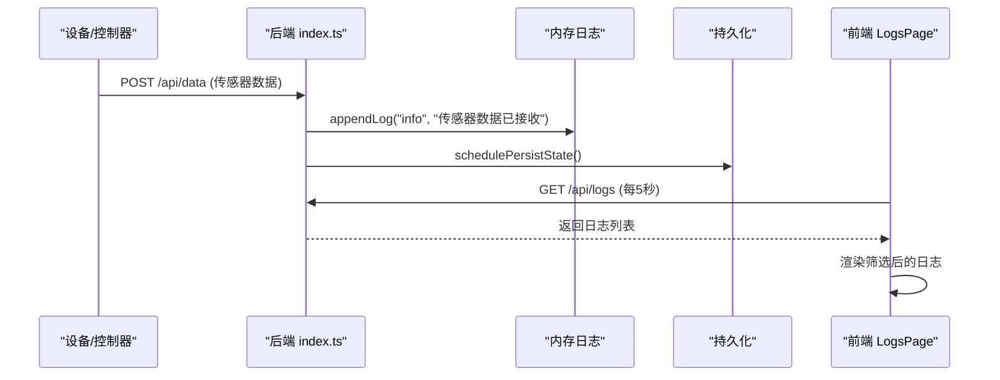
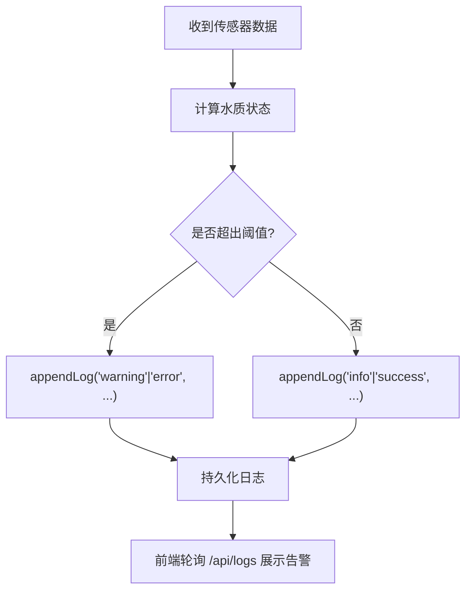
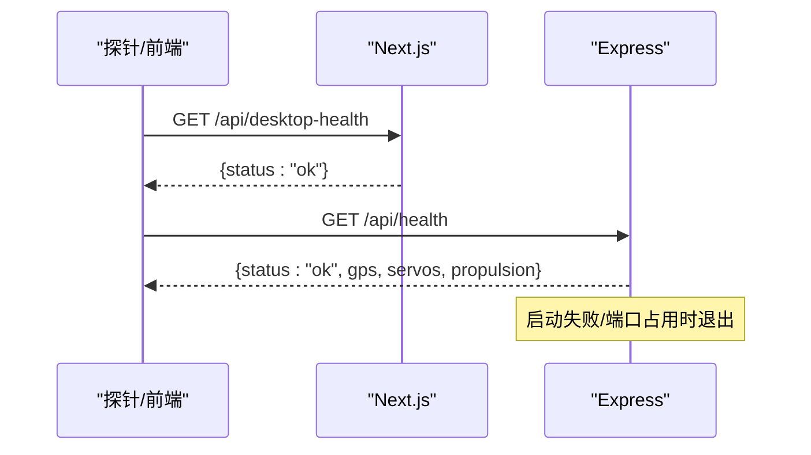
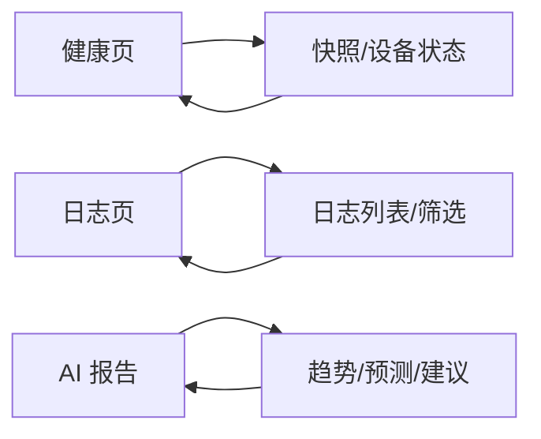
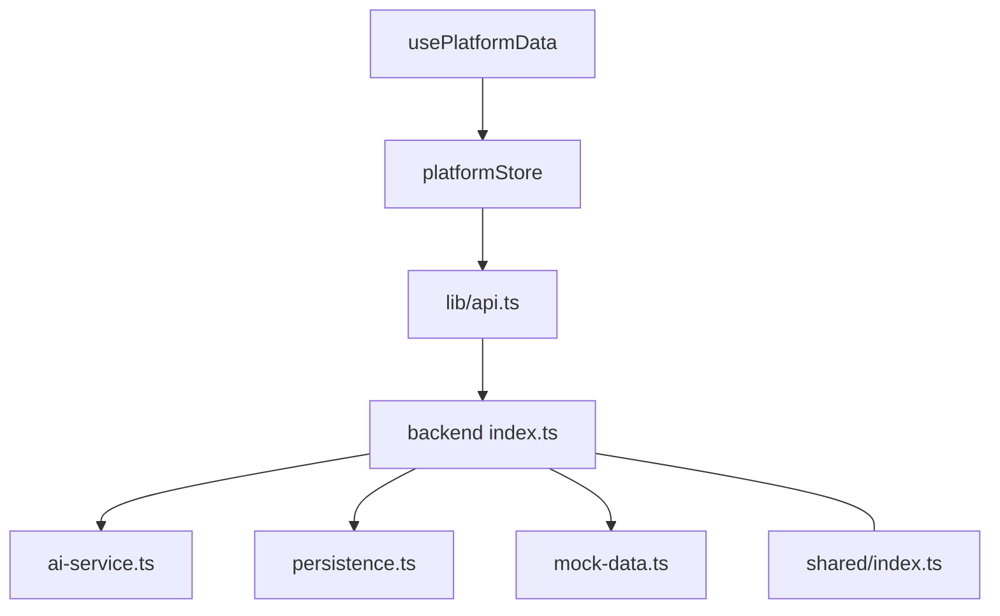

# 监控告警

<cite>
**本文引用的文件**
- [apps/backend/src/index.ts](file://fishery-digital-twin-platform/apps/backend/src/index.ts)
- [apps/backend/src/persistence.ts](file://fishery-digital-twin-platform/apps/backend/src/persistence.ts)
- [apps/backend/src/ai-service.ts](file://fishery-digital-twin-platform/apps/backend/src/ai-service.ts)
- [apps/backend/src/mock-data.ts](file://fishery-digital-twin-platform/apps/backend/src/mock-data.ts)
- [packages/shared/src/index.ts](file://fishery-digital-twin-platform/packages/shared/src/index.ts)
- [apps/frontend/src/app/api/desktop-health/route.ts](file://fishery-digital-twin-platform/apps/frontend/src/app/api/desktop-health/route.ts)
- [apps/frontend/src/components/dashboard/HealthPage.tsx](file://fishery-digital-twin-platform/apps/frontend/src/components/dashboard/HealthPage.tsx)
- [apps/frontend/src/components/dashboard/LogsPage.tsx](file://fishery-digital-twin-platform/apps/frontend/src/components/dashboard/LogsPage.tsx)
- [apps/frontend/src/lib/api.ts](file://fishery-digital-twin-platform/apps/frontend/src/lib/api.ts)
- [apps/frontend/src/hooks/usePlatformData.ts](file://fishery-digital-twin-platform/apps/frontend/src/hooks/usePlatformData.ts)
</cite>

## 目录
1. [简介](#简介)
2. [项目结构](#项目结构)
3. [核心组件](#核心组件)
4. [架构总览](#架构总览)
5. [详细组件分析](#详细组件分析)
6. [依赖关系分析](#依赖关系分析)
7. [性能考量](#性能考量)
8. [故障排查指南](#故障排查指南)
9. [结论](#结论)
10. [附录](#附录)

## 简介
本文件面向“渔业数字孪生平台”的监控与告警能力，覆盖以下方面：
- 指标采集：系统资源、应用性能、设备状态、业务关键指标（水质、电池、导航等）
- 日志管理：结构化日志、轮转策略、集中式查看与查询
- 告警规则：阈值、级别、通知渠道与升级策略（当前实现为前端可视化告警与后端日志联动）
- 健康检查：服务可用性、依赖状态、自动恢复机制
- 仪表板与报表：健康页、日志页、AI 报告与趋势图
- 常见问题定位与优化建议

## 项目结构
平台由前后端组成：
- 后端 Express API：提供健康检查、数据快照、传感器数据上报、设备控制、AI 报告、日志查询等接口；内置 UDP 发现广播；持久化平台状态到本地 JSON。
- 前端 Next.js：提供健康检查页面、日志中心、仪表盘；通过统一 store 拉取后端快照并展示。

图表来源
- [apps/backend/src/index.ts:322-336](file://fishery-digital-twin-platform/apps/backend/src/index.ts#L322-L336)
- [apps/backend/src/persistence.ts:12-68](file://fishery-digital-twin-platform/apps/backend/src/persistence.ts#L12-L68)
- [apps/frontend/src/app/api/desktop-health/route.ts:3-9](file://fishery-digital-twin-platform/apps/frontend/src/app/api/desktop-health/route.ts#L3-L9)
- [apps/frontend/src/components/dashboard/HealthPage.tsx:13-47](file://fishery-digital-twin-platform/apps/frontend/src/components/dashboard/HealthPage.tsx#L13-L47)
- [apps/frontend/src/components/dashboard/LogsPage.tsx:14-33](file://fishery-digital-twin-platform/apps/frontend/src/components/dashboard/LogsPage.tsx#L14-L33)
- [apps/frontend/src/lib/api.ts:26-93](file://fishery-digital-twin-platform/apps/frontend/src/lib/api.ts#L26-L93)
- [apps/frontend/src/hooks/usePlatformData.ts:10-23](file://fishery-digital-twin-platform/apps/frontend/src/hooks/usePlatformData.ts#L10-L23)

章节来源
- [apps/backend/src/index.ts:48-114](file://fishery-digital-twin-platform/apps/backend/src/index.ts#L48-L114)
- [apps/frontend/src/lib/api.ts:1-24](file://fishery-digital-twin-platform/apps/frontend/src/lib/api.ts#L1-L24)

## 核心组件
- 健康检查与健康页
  - 后端暴露 /api/health，返回服务状态、数据模式、AI/GPS/舵机/推进器状态。
  - 前端 Next.js 暴露 /api/desktop-health 用于桌面端或外部探针快速检测 Web 服务可用性。
  - 健康页聚合设备在线数、电池电量、综合评分与最近告警。
- 日志中心
  - 后端维护内存中的 SystemLog 列表，支持按级别过滤与分页显示。
  - 前端每 5 秒轮询 /api/logs，展示总数、预警异常数量、最近事件。
- 指标采集与快照
  - 后端 /api/snapshot 返回 waterHistory、batteries、navigation、aiReport、vessel 等综合快照。
  - 传感器数据通过 /api/data 上报，后端计算水质状态并更新历史。
- AI 报告
  - 后端根据水质统计与电池情况生成报告，可调用外部模型增强。
- 持久化
  - 平台状态（水样历史、电池、AI 报告、日志）以 JSON 文件形式落盘，启动时加载，关闭时刷新。

章节来源
- [apps/backend/src/index.ts:322-336](file://fishery-digital-twin-platform/apps/backend/src/index.ts#L322-L336)
- [apps/frontend/src/app/api/desktop-health/route.ts:3-9](file://fishery-digital-twin-platform/apps/frontend/src/app/api/desktop-health/route.ts#L3-L9)
- [apps/frontend/src/components/dashboard/HealthPage.tsx:13-47](file://fishery-digital-twin-platform/apps/frontend/src/components/dashboard/HealthPage.tsx#L13-L47)
- [apps/frontend/src/components/dashboard/LogsPage.tsx:14-33](file://fishery-digital-twin-platform/apps/frontend/src/components/dashboard/LogsPage.tsx#L14-L33)
- [apps/backend/src/index.ts:367-430](file://fishery-digital-twin-platform/apps/backend/src/index.ts#L367-L430)
- [apps/backend/src/ai-service.ts:49-122](file://fishery-digital-twin-platform/apps/backend/src/ai-service.ts#L49-L122)
- [apps/backend/src/persistence.ts:32-68](file://fishery-digital-twin-platform/apps/backend/src/persistence.ts#L32-L68)

## 架构总览

图表来源
- [apps/frontend/src/components/dashboard/HealthPage.tsx:37-47](file://fishery-digital-twin-platform/apps/frontend/src/components/dashboard/HealthPage.tsx#L37-L47)
- [apps/frontend/src/components/dashboard/LogsPage.tsx:14-33](file://fishery-digital-twin-platform/apps/frontend/src/components/dashboard/LogsPage.tsx#L14-L33)
- [apps/backend/src/index.ts:322-336](file://fishery-digital-twin-platform/apps/backend/src/index.ts#L322-L336)

## 详细组件分析

### 健康检查与服务可用性
- 后端健康接口
  - 路径：/api/health
  - 功能：返回服务名、时间戳、数据模式、AI 配置状态、GPS/舵机/推进器快照。
  - 用途：供前端健康页与外部探针判断服务是否可用及依赖状态。
- 前端健康接口
  - 路径：/api/desktop-health
  - 功能：返回 Web 服务基本健康信息。
  - 用途：桌面端或容器编排探针进行存活检测。
- 健康页逻辑
  - 聚合设备在线数、电池平均电量、严重故障项，计算综合健康分，展示最近告警与建议。
  - 支持手动触发健康检查，刷新快照与反馈数据。

图表来源
- [apps/frontend/src/components/dashboard/HealthPage.tsx:13-47](file://fishery-digital-twin-platform/apps/frontend/src/components/dashboard/HealthPage.tsx#L13-L47)
- [apps/backend/src/index.ts:322-336](file://fishery-digital-twin-platform/apps/backend/src/index.ts#L322-L336)

章节来源
- [apps/backend/src/index.ts:322-336](file://fishery-digital-twin-platform/apps/backend/src/index.ts#L322-L336)
- [apps/frontend/src/app/api/desktop-health/route.ts:3-9](file://fishery-digital-twin-platform/apps/frontend/src/app/api/desktop-health/route.ts#L3-L9)
- [apps/frontend/src/components/dashboard/HealthPage.tsx:13-47](file://fishery-digital-twin-platform/apps/frontend/src/components/dashboard/HealthPage.tsx#L13-L47)

### 指标采集：系统资源、应用性能、设备状态、业务关键指标
- 系统与应用性能
  - 后端进程监听端口、CORS、请求体大小限制、错误处理中间件。
  - 健康接口包含服务名、时间戳、数据模式、AI/GPS/舵机/推进器状态。
- 设备状态
  - 后端维护 GPS、舵机、推进器快照；根据最后可见时间与在线标志判定设备状态。
  - 健康页展示主控开发板、飞控模块、通信模块、环境传感器状态。
- 业务关键指标
  - 水质：水温、浊度、pH、溶解氧、氨氮、电导率，以及派生的水质状态。
  - 电池：多组电池百分比、电压、状态。
  - 导航：当前位置、航向、目标航点、剩余距离、ETA。
  - AI 报告：风险等级、摘要、发现与建议、置信度、预测。

图表来源
- [packages/shared/src/index.ts:7-106](file://fishery-digital-twin-platform/packages/shared/src/index.ts#L7-L106)

章节来源
- [apps/backend/src/index.ts:197-257](file://fishery-digital-twin-platform/apps/backend/src/index.ts#L197-L257)
- [packages/shared/src/index.ts:7-106](file://fishery-digital-twin-platform/packages/shared/src/index.ts#L7-L106)

### 日志收集与分析
- 结构化日志格式
  - 每条日志包含 id、level、title、detail、source、timestamp。
  - level 支持 info、success、warning、error。
- 日志轮转与持久化
  - 内存中保留最近 80 条日志；每次新增后延迟 250ms 批量写入 platform-state.json。
  - 启动时加载历史日志（最多 80 条），确保重启不丢失近期事件。
- 集中式管理与查询
  - 前端每 5 秒轮询 /api/logs，支持按级别筛选，展示总数、预警异常数量、最近事件。
  - 日志来源包括传感器数据接收、AI 报告生成、设备控制命令、数字孪生推演等。

图表来源
- [apps/backend/src/index.ts:116-129](file://fishery-digital-twin-platform/apps/backend/src/index.ts#L116-L129)
- [apps/backend/src/index.ts:367-430](file://fishery-digital-twin-platform/apps/backend/src/index.ts#L367-L430)
- [apps/backend/src/persistence.ts:51-68](file://fishery-digital-twin-platform/apps/backend/src/persistence.ts#L51-L68)
- [apps/frontend/src/components/dashboard/LogsPage.tsx:14-33](file://fishery-digital-twin-platform/apps/frontend/src/components/dashboard/LogsPage.tsx#L14-L33)

章节来源
- [apps/backend/src/index.ts:116-129](file://fishery-digital-twin-platform/apps/backend/src/index.ts#L116-L129)
- [apps/backend/src/persistence.ts:12-68](file://fishery-digital-twin-platform/apps/backend/src/persistence.ts#L12-L68)
- [apps/frontend/src/components/dashboard/LogsPage.tsx:45-85](file://fishery-digital-twin-platform/apps/frontend/src/components/dashboard/LogsPage.tsx#L45-L85)

### 告警规则配置：阈值、级别、通知渠道与升级策略
- 阈值定义
  - 水质状态阈值：浊度、pH、溶解氧、氨氮组合判定 normal/attention/algae-risk/polluted。
  - 电池低电量：百分比低于阈值标记 warning。
  - 设备离线：基于 last_seen 与 online 标志判定 offline。
- 告警级别
  - 日志级别：info、success、warning、error。
  - 健康页告警：电池需关注、设备状态异常。
- 通知渠道与升级策略
  - 当前实现为前端可视化告警与后端日志记录；未集成邮件/短信/IM 等外部通知渠道。
  - 可扩展：在 appendLog 处增加异步通知函数，依据 level 与 source 路由至不同渠道；对 error/warning 设置升级策略（如重复告警、超时未处理升级）。

图表来源
- [apps/backend/src/index.ts:264-269](file://fishery-digital-twin-platform/apps/backend/src/index.ts#L264-L269)
- [apps/backend/src/index.ts:418-426](file://fishery-digital-twin-platform/apps/backend/src/index.ts#L418-L426)
- [apps/frontend/src/components/dashboard/LogsPage.tsx:57-85](file://fishery-digital-twin-platform/apps/frontend/src/components/dashboard/LogsPage.tsx#L57-L85)

章节来源
- [apps/backend/src/index.ts:264-269](file://fishery-digital-twin-platform/apps/backend/src/index.ts#L264-L269)
- [apps/backend/src/index.ts:418-426](file://fishery-digital-twin-platform/apps/backend/src/index.ts#L418-L426)
- [apps/frontend/src/components/dashboard/HealthPage.tsx:158-179](file://fishery-digital-twin-platform/apps/frontend/src/components/dashboard/HealthPage.tsx#L158-L179)

### 健康检查接口：服务可用性、依赖状态、自动恢复
- 服务可用性
  - /api/health 与 /api/desktop-health 提供轻量健康响应。
- 依赖状态监控
  - 健康接口返回 GPS、舵机、推进器快照；前端健康页展示设备在线情况。
- 自动恢复机制
  - 后端在启动失败或端口占用时退出；UDP 发现广播失败时记录错误并终止进程。
  - 前端健康检查失败时保持上一次成功读取内容，避免界面空白。

图表来源
- [apps/frontend/src/app/api/desktop-health/route.ts:3-9](file://fishery-digital-twin-platform/apps/frontend/src/app/api/desktop-health/route.ts#L3-L9)
- [apps/backend/src/index.ts:322-336](file://fishery-digital-twin-platform/apps/backend/src/index.ts#L322-L336)
- [apps/backend/src/index.ts:573-579](file://fishery-digital-twin-platform/apps/backend/src/index.ts#L573-L579)

章节来源
- [apps/frontend/src/app/api/desktop-health/route.ts:3-9](file://fishery-digital-twin-platform/apps/frontend/src/app/api/desktop-health/route.ts#L3-L9)
- [apps/backend/src/index.ts:322-336](file://fishery-digital-twin-platform/apps/backend/src/index.ts#L322-L336)
- [apps/backend/src/index.ts:573-579](file://fishery-digital-twin-platform/apps/backend/src/index.ts#L573-L579)

### 监控仪表板与自定义报表
- 健康仪表板
  - 综合健康分、设备统计、电源系统、核心设备状态、最近告警、状态评分趋势图。
- 日志仪表板
  - 日志总数、预警与异常计数、最近事件、级别筛选、自动刷新。
- 自定义报表
  - AI 报告：基于水质统计与电池情况生成标题、摘要、发现、建议、置信度与预测。
  - 数字孪生推演：航线预测、故障预测、疲劳预测，辅助决策。

图表来源
- [apps/frontend/src/components/dashboard/HealthPage.tsx:49-204](file://fishery-digital-twin-platform/apps/frontend/src/components/dashboard/HealthPage.tsx#L49-L204)
- [apps/frontend/src/components/dashboard/LogsPage.tsx:45-85](file://fishery-digital-twin-platform/apps/frontend/src/components/dashboard/LogsPage.tsx#L45-L85)
- [apps/backend/src/ai-service.ts:49-122](file://fishery-digital-twin-platform/apps/backend/src/ai-service.ts#L49-L122)

章节来源
- [apps/frontend/src/components/dashboard/HealthPage.tsx:49-204](file://fishery-digital-twin-platform/apps/frontend/src/components/dashboard/HealthPage.tsx#L49-L204)
- [apps/frontend/src/components/dashboard/LogsPage.tsx:45-85](file://fishery-digital-twin-platform/apps/frontend/src/components/dashboard/LogsPage.tsx#L45-L85)
- [apps/backend/src/ai-service.ts:49-122](file://fishery-digital-twin-platform/apps/backend/src/ai-service.ts#L49-L122)

## 依赖关系分析
- 前端依赖
  - usePlatformData 通过 platformStore 订阅快照，所有页面共享同一份数据切片。
  - api.ts 封装 fetchJson，统一超时与令牌头，简化各页面调用。
- 后端依赖
  - index.ts 依赖 ai-service、gps-store、propulsion-store、servo-store、mock-data、persistence。
  - 共享类型 packages/shared 定义数据结构，前后端一致。
- 潜在耦合
  - 健康页强依赖 snapshot.vessel 与 batteries；若后端字段变更需同步前端。
  - 日志页强依赖 SystemLog 结构与 /api/logs 行为。

图表来源
- [apps/frontend/src/hooks/usePlatformData.ts:10-23](file://fishery-digital-twin-platform/apps/frontend/src/hooks/usePlatformData.ts#L10-L23)
- [apps/frontend/src/lib/api.ts:26-93](file://fishery-digital-twin-platform/apps/frontend/src/lib/api.ts#L26-L93)
- [apps/backend/src/index.ts:21-44](file://fishery-digital-twin-platform/apps/backend/src/index.ts#L21-L44)
- [packages/shared/src/index.ts:7-106](file://fishery-digital-twin-platform/packages/shared/src/index.ts#L7-L106)

章节来源
- [apps/frontend/src/hooks/usePlatformData.ts:10-23](file://fishery-digital-twin-platform/apps/frontend/src/hooks/usePlatformData.ts#L10-L23)
- [apps/frontend/src/lib/api.ts:26-93](file://fishery-digital-twin-platform/apps/frontend/src/lib/api.ts#L26-L93)
- [apps/backend/src/index.ts:21-44](file://fishery-digital-twin-platform/apps/backend/src/index.ts#L21-L44)
- [packages/shared/src/index.ts:7-106](file://fishery-digital-twin-platform/packages/shared/src/index.ts#L7-L106)

## 性能考量
- 数据采集频率
  - 日志每 5 秒轮询，避免频繁请求造成后端压力。
  - 快照由 store 统一管理，减少重复请求。
- 数据量控制
  - 水样历史最大保留 180 条；日志保留 80 条；防止内存膨胀。
- 持久化策略
  - 使用延迟写（250ms）合并多次写入，降低磁盘 IO。
  - 临时文件原子替换，避免损坏状态文件。
- 网络与安全
  - CORS 白名单控制跨域；LAN 控制需要 X-UISYS-Token；超时与错误处理完善。
- 扩展建议
  - 引入指标采集库（如 Prometheus client）导出 CPU/内存/请求耗时等系统与应用指标。
  - 接入集中式日志系统（如 ELK/Loki）替代本地 JSON，支持更强大的检索与告警。

[本节为通用指导，无需特定文件引用]

## 故障排查指南
- 后端启动失败
  - 端口占用或权限不足会记录错误并退出；检查端口与 HOST 配置。
- 健康检查失败
  - 确认 /api/health 与 /api/desktop-health 可达；检查 CORS 与 Token 配置。
- 日志无法加载
  - 前端轮询失败时保留上次成功内容；检查 /api/logs 连通性与后端状态。
- 传感器数据异常
  - 检查 /api/data 参数范围与必填字段；确认设备上报频率与数据质量。
- AI 报告失败
  - 检查 DeepSeek API Key 与模型配置；超时或返回空内容会抛出错误并记录日志。

章节来源
- [apps/backend/src/index.ts:573-579](file://fishery-digital-twin-platform/apps/backend/src/index.ts#L573-L579)
- [apps/backend/src/index.ts:322-336](file://fishery-digital-twin-platform/apps/backend/src/index.ts#L322-L336)
- [apps/frontend/src/components/dashboard/LogsPage.tsx:45-85](file://fishery-digital-twin-platform/apps/frontend/src/components/dashboard/LogsPage.tsx#L45-L85)
- [apps/backend/src/index.ts:367-430](file://fishery-digital-twin-platform/apps/backend/src/index.ts#L367-L430)
- [apps/backend/src/ai-service.ts:167-233](file://fishery-digital-twin-platform/apps/backend/src/ai-service.ts#L167-L233)

## 结论
该平台已具备基础的监控与告警能力：
- 健康检查接口与前端健康页提供服务与设备状态可视化。
- 结构化日志与持久化保证事件可追溯。
- 指标采集覆盖水质、电池、导航与 AI 报告，支撑业务决策。
- 当前告警以可视化为主，可扩展通知渠道与升级策略。
- 建议引入标准指标采集与集中式日志系统，提升可观测性与运维效率。

[本节为总结性内容，无需特定文件引用]

## 附录
- 环境变量与配置要点
  - PORT/HOST：后端服务监听地址。
  - UISYS_API_TOKEN：LAN 控制鉴权令牌。
  - UISYS_DEMO_WATER_FEED/UISYS_DEMO_WATER_INTERVAL_MS：演示数据开关与间隔。
  - UISYS_SENSOR_FRESHNESS_MS：传感器新鲜度判定阈值。
  - DEEPSEEK_API_KEY/DEEPSEEK_BASE_URL/DEEPSEEK_MODEL/DEEPSEEK_TIMEOUT_SECONDS：AI 报告外部模型配置。
- 常用接口
  - /api/health：服务健康检查。
  - /api/snapshot：平台快照。
  - /api/data：传感器数据上报。
  - /api/logs：系统日志查询。
  - /api/ai/report：AI 报告生成与获取。
  - /api/twin/simulate：数字孪生推演。

章节来源
- [apps/backend/src/index.ts:48-114](file://fishery-digital-twin-platform/apps/backend/src/index.ts#L48-L114)
- [apps/backend/src/index.ts:322-336](file://fishery-digital-twin-platform/apps/backend/src/index.ts#L322-L336)
- [apps/backend/src/index.ts:367-430](file://fishery-digital-twin-platform/apps/backend/src/index.ts#L367-L430)
- [apps/backend/src/index.ts:447-473](file://fishery-digital-twin-platform/apps/backend/src/index.ts#L447-L473)
- [apps/backend/src/index.ts:540-555](file://fishery-digital-twin-platform/apps/backend/src/index.ts#L540-L555)