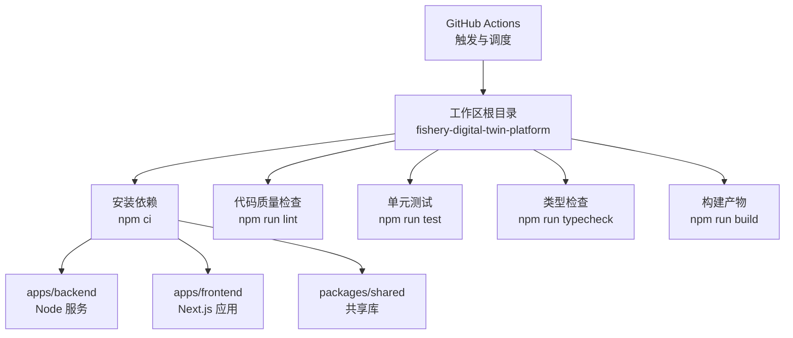
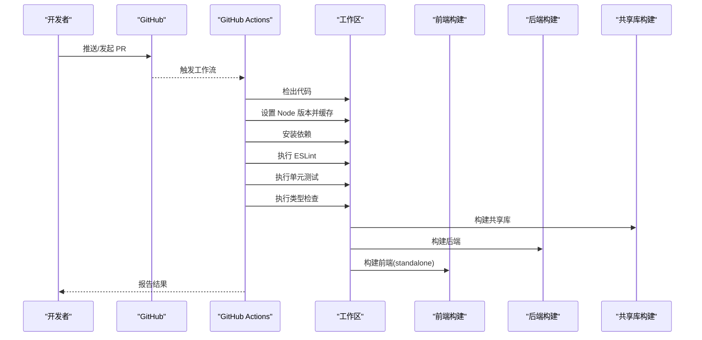
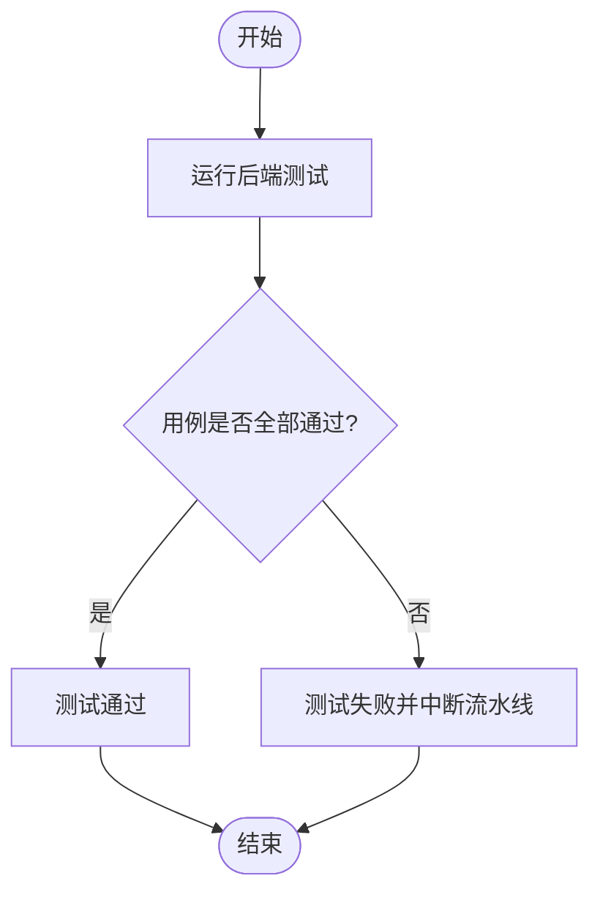
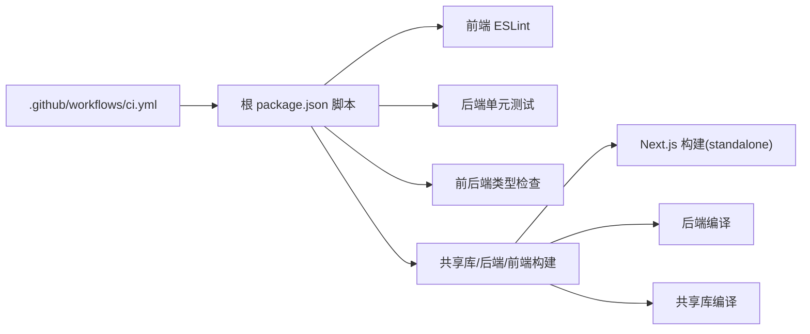

# CI/CD流水线

<cite>
**本文引用的文件**
- [ci.yml](file://.github/workflows/ci.yml)
- [package.json（根工作区）](file://fishery-digital-twin-platform/package.json)
- [apps/backend/package.json](file://fishery-digital-twin-platform/apps/backend/package.json)
- [apps/frontend/package.json](file://fishery-digital-twin-platform/apps/frontend/package.json)
- [apps/frontend/eslint.config.mjs](file://fishery-digital-twin-platform/apps/frontend/eslint.config.mjs)
- [apps/backend/tsconfig.json](file://fishery-digital-twin-platform/apps/backend/tsconfig.json)
- [apps/frontend/tsconfig.json](file://fishery-digital-twin-platform/apps/frontend/tsconfig.json)
- [apps/frontend/tsconfig.typecheck.json](file://fishery-digital-twin-platform/apps/frontend/tsconfig.typecheck.json)
- [apps/backend/src/device-stores.test.ts](file://fishery-digital-twin-platform/apps/backend/src/device-stores.test.ts)
- [apps/frontend/next.config.mjs](file://fishery-digital-twin-platform/apps/frontend/next.config.mjs)
</cite>

## 目录
1. [简介](#简介)
2. [项目结构](#项目结构)
3. [核心组件](#核心组件)
4. [架构总览](#架构总览)
5. [详细组件分析](#详细组件分析)
6. [依赖关系分析](#依赖关系分析)
7. [性能考量](#性能考量)
8. [故障排查指南](#故障排查指南)
9. [结论](#结论)
10. [附录](#附录)

## 简介
本文件面向持续集成与持续部署（CI/CD）的落地实践，围绕仓库中的 GitHub Actions 工作流、Monorepo 脚本编排、前端/后端构建与测试、代码质量检查、以及可落地的部署与健康检查策略进行系统化说明。目标是帮助读者在不深入源码细节的情况下，也能理解流水线的触发条件、任务顺序、执行环境与关键配置点，并具备监控与排障能力。

## 项目结构
本项目采用 Monorepo 组织方式，根工作区通过 npm workspaces 管理 apps/* 与 packages/* 子包。CI 在统一的工作目录下执行安装、校验、测试、类型检查与构建，确保前后端与共享库的一致性。

图表来源
- [ci.yml:1-26](file://.github/workflows/ci.yml#L1-L26)
- [package.json（根工作区）:16-37](file://fishery-digital-twin-platform/package.json#L16-L37)

章节来源
- [ci.yml:1-26](file://.github/workflows/ci.yml#L1-L26)
- [package.json（根工作区）:1-37](file://fishery-digital-twin-platform/package.json#L1-L37)

## 核心组件
- 触发条件与工作流定义：GitHub Actions 在 push 到 main 分支或创建 pull_request 时运行验证任务。
- 环境准备：使用 Node 版本文件指定运行时版本，启用 npm 缓存加速安装。
- 任务编排：按顺序执行依赖安装、代码检查、测试、类型检查与构建。
- 子任务脚本：
  - 前端：ESLint 规则基于 Next.js 官方配置，严格模式禁止警告；TypeScript 类型检查独立配置文件；构建输出为 standalone 以利于部署。
  - 后端：基于 tsx 的运行与测试脚本；TypeScript 严格模式编译；测试覆盖设备状态与命令队列等核心逻辑。
  - 共享库：独立的 TypeScript 构建与类型检查脚本，供前后端复用。

章节来源
- [ci.yml:1-26](file://.github/workflows/ci.yml#L1-L26)
- [package.json（根工作区）:16-37](file://fishery-digital-twin-platform/package.json#L16-L37)
- [apps/frontend/package.json:6-13](file://fishery-digital-twin-platform/apps/frontend/package.json#L6-L13)
- [apps/backend/package.json:6-12](file://fishery-digital-twin-platform/apps/backend/package.json#L6-L12)
- [packages/shared/package.json:8-11](file://fishery-digital-twin-platform/packages/shared/package.json#L8-L11)

## 架构总览
下图展示从代码提交到构建产物的完整流水线路径，包括触发、环境准备、多阶段任务与产物输出。

图表来源
- [ci.yml:1-26](file://.github/workflows/ci.yml#L1-L26)
- [package.json（根工作区）:16-37](file://fishery-digital-twin-platform/package.json#L16-L37)
- [apps/frontend/next.config.mjs:8-16](file://fishery-digital-twin-platform/apps/frontend/next.config.mjs#L8-L16)

## 详细组件分析

### 工作流触发与任务编排
- 触发条件：push 至 main 分支与所有 pull_request。
- 运行环境：Ubuntu 最新镜像，工作目录指向 Monorepo 根。
- 任务顺序：
  1) 检出代码
  2) 设置 Node 版本（读取 .nvmrc）并启用 npm 缓存
  3) 安装依赖
  4) 代码检查（前端 ESLint）
  5) 单元测试（后端）
  6) 类型检查（后端与前端）
  7) 构建（共享库、后端、前端）

章节来源
- [ci.yml:1-26](file://.github/workflows/ci.yml#L1-L26)
- [package.json（根工作区）:16-37](file://fishery-digital-twin-platform/package.json#L16-L37)

### 自动化测试流程
- 测试框架与入口：后端使用 Node 内置测试模块，测试文件位于 src/*.test.ts。
- 测试范围：涵盖 GPS 状态更新、舵机命令限制与保留通道、推进器目标与反馈隔离、紧急停止命令入队等行为。
- 执行策略：CI 中通过根脚本调用后端测试，保证在干净环境中运行。

图表来源
- [apps/backend/package.json:6-12](file://fishery-digital-twin-platform/apps/backend/package.json#L6-L12)
- [apps/backend/src/device-stores.test.ts:1-93](file://fishery-digital-twin-platform/apps/backend/src/device-stores.test.ts#L1-L93)

章节来源
- [apps/backend/package.json:6-12](file://fishery-digital-twin-platform/apps/backend/package.json#L6-L12)
- [apps/backend/src/device-stores.test.ts:1-93](file://fishery-digital-twin-platform/apps/backend/src/device-stores.test.ts#L1-L93)

### 代码质量检查
- ESLint：基于 Next.js 官方规则集，开启严格模式并关闭特定与 3D/媒体场景相关的限制；忽略构建与模型目录。
- TypeScript 类型检查：
  - 后端：严格模式，仅检查不生成文件。
  - 前端：独立 typecheck 配置，排除构建产物。
- 覆盖率统计：当前未配置覆盖率收集步骤；可在后续扩展。

章节来源
- [apps/frontend/eslint.config.mjs:1-19](file://fishery-digital-twin-platform/apps/frontend/eslint.config.mjs#L1-L19)
- [apps/backend/tsconfig.json:1-15](file://fishery-digital-twin-platform/apps/backend/tsconfig.json#L1-L15)
- [apps/frontend/tsconfig.typecheck.json:1-13](file://fishery-digital-twin-platform/apps/frontend/tsconfig.typecheck.json#L1-L13)
- [apps/frontend/package.json:6-13](file://fishery-digital-twin-platform/apps/frontend/package.json#L6-L13)

### 构建与产物
- 共享库：TypeScript 编译输出至 dist。
- 后端：TypeScript 编译输出至 dist，启动命令指向编译产物。
- 前端：Next.js 构建输出为 standalone 模式，便于容器化或轻量部署；开发期与生产期输出目录分离以避免缓存污染。

章节来源
- [packages/shared/package.json:8-11](file://fishery-digital-twin-platform/packages/shared/package.json#L8-L11)
- [apps/backend/package.json:6-12](file://fishery-digital-twin-platform/apps/backend/package.json#L6-L12)
- [apps/frontend/next.config.mjs:8-16](file://fishery-digital-twin-platform/apps/frontend/next.config.mjs#L8-L16)
- [package.json（根工作区）:16-37](file://fishery-digital-twin-platform/package.json#L16-L37)

### 自动化部署与健康检查（建议方案）
当前工作流仅包含验证与构建。若需进一步实现自动化部署，建议如下：
- 环境配置
  - 使用 GitHub Secrets 管理环境变量与密钥。
  - 根据分支选择部署目标环境（如 staging/prod）。
- 服务启动
  - 后端：启动编译后的 Node 服务。
  - 前端：使用 standalone 输出启动 Next.js 服务。
- 健康检查
  - 前端暴露健康接口用于探针探测。
  - 后端提供健康端点，结合负载均衡或进程管理器进行存活检测。
- 发布策略
  - 灰度发布或蓝绿部署，配合流量切换与回滚机制。
  - 构建产物归档以便快速回滚。

注：以上为通用部署建议，具体实现需结合平台与运维规范补充相应步骤。

[本节为概念性内容，不直接分析具体文件]

## 依赖关系分析
工作流与脚本之间的依赖关系如下：

图表来源
- [ci.yml:1-26](file://.github/workflows/ci.yml#L1-L26)
- [package.json（根工作区）:16-37](file://fishery-digital-twin-platform/package.json#L16-L37)
- [apps/frontend/next.config.mjs:8-16](file://fishery-digital-twin-platform/apps/frontend/next.config.mjs#L8-L16)

章节来源
- [ci.yml:1-26](file://.github/workflows/ci.yml#L1-L26)
- [package.json（根工作区）:16-37](file://fishery-digital-twin-platform/package.json#L16-L37)

## 性能考量
- 依赖缓存：启用 npm 缓存以减少安装时间。
- 并行化：当前为串行任务，可按需将 lint/test/typecheck/build 拆分为并行 job，提升吞吐。
- 增量构建：前端使用 Next.js 增量编译；TypeScript 开启 incremental。
- 产物体积：前端 standalone 输出有助于缩小部署体积与启动时间。
- 资源限制：合理设置 runner 规格与超时，避免大构建被中断。

[本节提供通用指导，不直接分析具体文件]

## 故障排查指南
- 日志查看
  - 在 GitHub Actions 页面查看每个 step 的详细日志，定位失败位置。
- 失败重试
  - 对偶发失败的步骤启用自动重试；对确定性失败优先修复问题。
- 通知机制
  - 可在工作流末尾添加通知步骤（如邮件、Webhook），及时同步流水线状态。
- 常见问题定位
  - 依赖安装失败：检查 Node 版本与缓存键；确认网络与镜像源。
  - 测试失败：聚焦后端测试用例，核对设备状态与命令边界条件。
  - 类型检查失败：根据报错信息修正类型定义或配置。
  - 构建失败：关注 Next.js 与 TypeScript 编译错误，必要时清理构建缓存。

章节来源
- [ci.yml:1-26](file://.github/workflows/ci.yml#L1-L26)
- [apps/backend/src/device-stores.test.ts:1-93](file://fishery-digital-twin-platform/apps/backend/src/device-stores.test.ts#L1-L93)

## 结论
该 CI/CD 流水线以简洁可靠的方式实现了 Monorepo 的代码质量保障与构建验证。通过严格的类型检查、基于 Next.js 的前端代码规范与覆盖关键业务逻辑的后端测试，有效降低了回归风险。后续可在保持现有稳定性的基础上，逐步引入并行化、覆盖率统计与自动化部署，进一步提升交付效率与质量。

[本节为总结性内容，不直接分析具体文件]

## 附录
- 关键脚本路径参考
  - 工作流定义：[ci.yml](file://.github/workflows/ci.yml)
  - 根脚本入口：[package.json（根工作区）](file://fishery-digital-twin-platform/package.json)
  - 前端 ESLint 配置：[eslint.config.mjs](file://fishery-digital-twin-platform/apps/frontend/eslint.config.mjs)
  - 前端类型检查配置：[tsconfig.typecheck.json](file://fishery-digital-twin-platform/apps/frontend/tsconfig.typecheck.json)
  - 后端测试用例：[device-stores.test.ts](file://fishery-digital-twin-platform/apps/backend/src/device-stores.test.ts)
  - 前端构建配置：[next.config.mjs](file://fishery-digital-twin-platform/apps/frontend/next.config.mjs)

[本节为索引性内容，不直接分析具体文件]