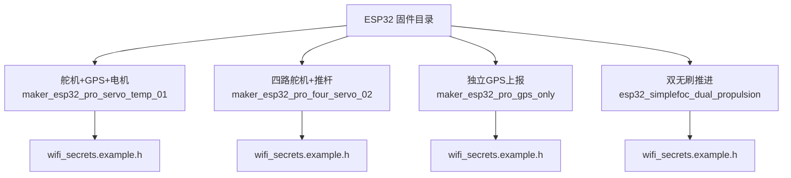
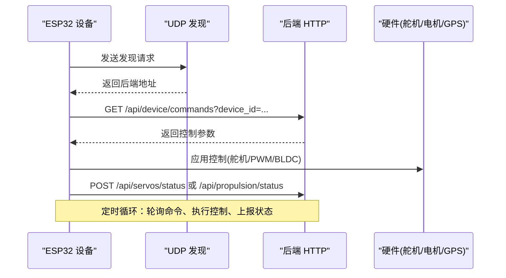
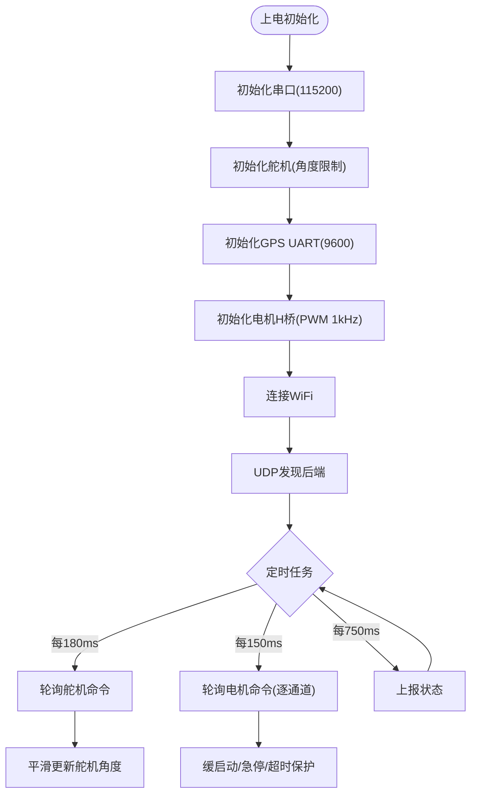
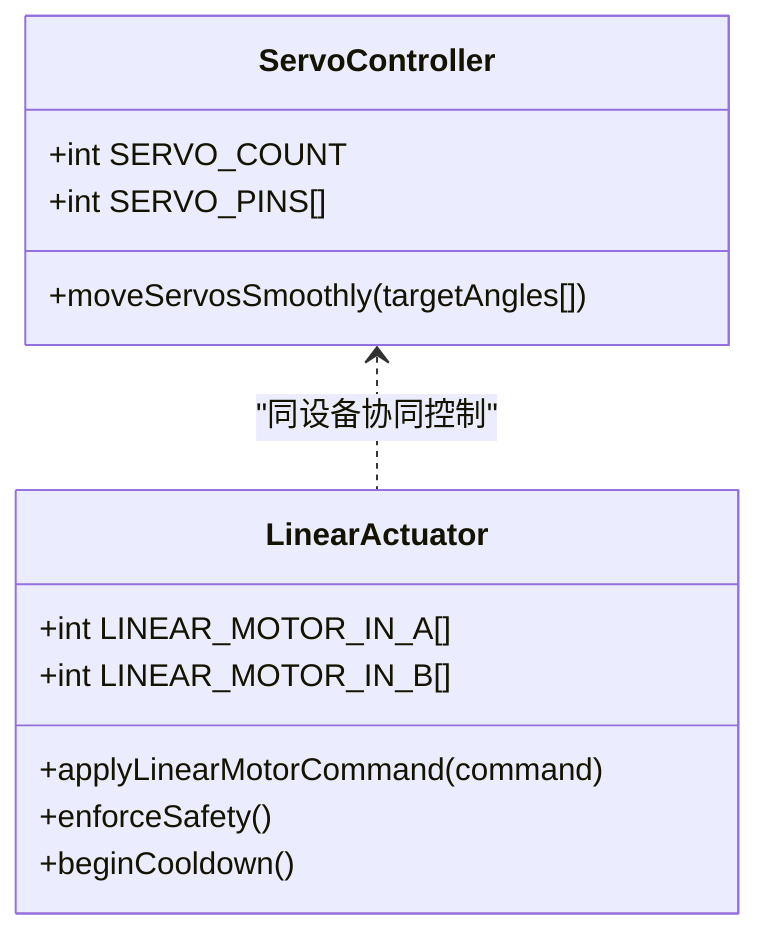
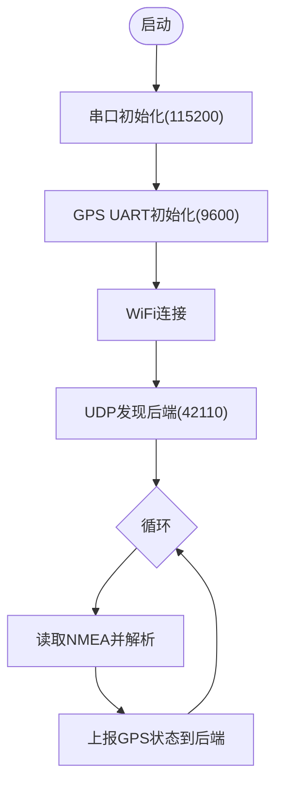
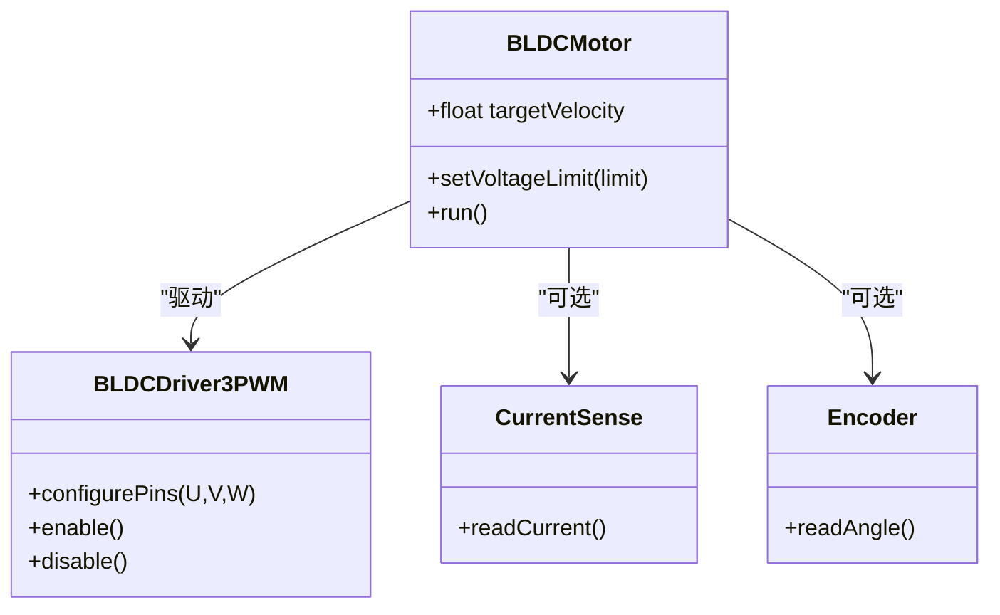
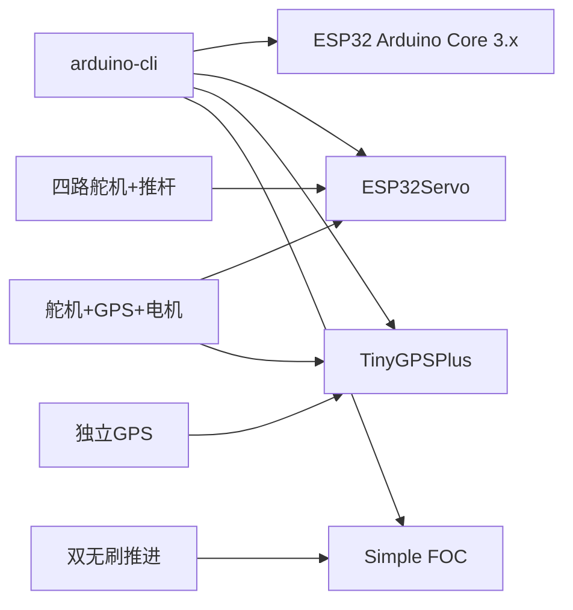

# 固件构建

<cite>
**本文引用的文件**
- [firmware-tooling.ps1](file://fishery-digital-twin-platform/scripts/firmware-tooling.ps1)
- [hardware-and-firmware.md](file://fishery-digital-twin-platform/docs/hardware-and-firmware.md)
- [maker_esp32_pro_servo_temp_01.ino](file://fishery-digital-twin-platform/firmware/esp32/maker_esp32_pro_servo_temp_01/maker_esp32_pro_servo_temp_01.ino)
- [maker_esp32_pro_four_servo_02.ino](file://fishery-digital-twin-platform/firmware/esp32/maker_esp32_pro_four_servo_02/maker_esp32_pro_four_servo_02.ino)
- [maker_esp32_pro_gps_only.ino](file://fishery-digital-twin-platform/firmware/esp32/maker_esp32_pro_gps_only/maker_esp32_pro_gps_only.ino)
- [esp32_simplefoc_dual_propulsion.ino](file://fishery-digital-twin-platform/firmware/esp32/esp32_simplefoc_dual_propulsion/esp32_simplefoc_dual_propulsion.ino)
- [README.md（双无刷推进板）](file://fishery-digital-twin-platform/firmware/esp32/esp32_simplefoc_dual_propulsion/README.md)
- [README.md（舵机温度版）](file://fishery-digital-twin-platform/firmware/esp32/maker_esp32_pro_servo_temp_01/README.md)
- [wifi_secrets.example.h（舵机温度版）](file://fishery-digital-twin-platform/firmware/esp32/maker_esp32_pro_servo_temp_01/wifi_secrets.example.h)
- [wifi_secrets.example.h（四路舵机版）](file://fishery-digital-twin-platform/firmware/esp32/maker_esp32_pro_four_servo_02/wifi_secrets.example.h)
- [wifi_secrets.example.h（GPS独立版）](file://fishery-digital-twin-platform/firmware/esp32/maker_esp32_pro_gps_only/wifi_secrets.example.h)
- [wifi_secrets.example.h（双无刷推进板）](file://fishery-digital-twin-platform/firmware/esp32/esp32_simplefoc_dual_propulsion/wifi_secrets.example.h)
</cite>

## 目录
1. [简介](#简介)
2. [项目结构](#项目结构)
3. [核心组件](#核心组件)
4. [架构总览](#架构总览)
5. [详细组件分析](#详细组件分析)
6. [依赖关系分析](#依赖关系分析)
7. [性能与资源考量](#性能与资源考量)
8. [故障排查指南](#故障排查指南)
9. [结论](#结论)
10. [附录：编译与烧录步骤清单](#附录编译与烧录步骤清单)

## 简介
本文件面向ESP32固件的编译与烧录，覆盖Arduino IDE与PlatformIO两种环境下的配置要点、库依赖管理、编译器设置，以及不同功能模块（舵机控制、推进器控制、GPS定位）的模块化构建方式。文档还包含串口调试、日志输出、错误诊断方法，并汇总常见编译与烧录问题的解决方案。

## 项目结构
仓库中的ESP32固件位于 firmware/esp32 下，按设备/功能划分多个Sketch目录：
- maker_esp32_pro_servo_temp_01：第一块MAKER-ESP32-PRO主控，集成舵机、GPS、直流电机与双推杆控制。
- maker_esp32_pro_four_servo_02：第二块MAKER-ESP32-PRO主控，负责四路舵机与SXTL电动推杆。
- maker_esp32_pro_gps_only：独立GPS上报固件，仅通过WiFi将NMEA解析后的位置数据上报后端。
- esp32_simplefoc_dual_propulsion：SimpleFOC双路无刷推进控制器，用于后续推进系统扩展。

每个Sketch目录均包含：
- .ino主程序文件
- wifi_secrets.example.h模板（需复制为wifi_secrets.h并填写网络与令牌）
- README说明（部分目录）

**图示来源**
- [hardware-and-firmware.md:9-65](file://fishery-digital-twin-platform/docs/hardware-and-firmware.md#L9-L65)
- [wifi_secrets.example.h（舵机温度版）:1-7](file://fishery-digital-twin-platform/firmware/esp32/maker_esp32_pro_servo_temp_01/wifi_secrets.example.h#L1-L7)
- [wifi_secrets.example.h（四路舵机版）:1-7](file://fishery-digital-twin-platform/firmware/esp32/maker_esp32_pro_four_servo_02/wifi_secrets.example.h#L1-L7)
- [wifi_secrets.example.h（GPS独立版）:1-7](file://fishery-digital-twin-platform/firmware/esp32/maker_esp32_pro_gps_only/wifi_secrets.example.h#L1-L7)
- [wifi_secrets.example.h（双无刷推进板）:1-7](file://fishery-digital-twin-platform/firmware/esp32/esp32_simplefoc_dual_propulsion/wifi_secrets.example.h#L1-L7)

**章节来源**
- [hardware-and-firmware.md:9-65](file://fishery-digital-twin-platform/docs/hardware-and-firmware.md#L9-L65)

## 核心组件
- 舵机控制：使用ESP32Servo库驱动板载舵机接口，支持角度限制与平滑更新。
- GPS定位：使用TinyGPSPlus解析NMEA数据，通过HTTP上报至后端。
- 推进器控制：
  - 有刷直流电机与推杆：通过H桥引脚控制PWM，实现缓启动、急停与超时保护。
  - 无刷推进器：基于SimpleFOF库进行开环速度控制，支持电流采样与I2C编码器可选启用。
- 网络通信：WiFi连接后通过UDP广播发现后端服务，再使用HTTPClient轮询命令与上报状态。

**章节来源**
- [maker_esp32_pro_servo_temp_01.ino:30-110](file://fishery-digital-twin-platform/firmware/esp32/maker_esp32_pro_servo_temp_01/maker_esp32_pro_servo_temp_01.ino#L30-L110)
- [maker_esp32_pro_four_servo_02.ino:33-82](file://fishery-digital-twin-platform/firmware/esp32/maker_esp32_pro_four_servo_02/maker_esp32_pro_four_servo_02.ino#L33-L82)
- [maker_esp32_pro_gps_only.ino:18-50](file://fishery-digital-twin-platform/firmware/esp32/maker_esp32_pro_gps_only/maker_esp32_pro_gps_only.ino#L18-L50)
- [esp32_simplefoc_dual_propulsion.ino:23-130](file://fishery-digital-twin-platform/firmware/esp32/esp32_simplefoc_dual_propulsion/esp32_simplefoc_dual_propulsion.ino#L23-L130)

## 架构总览
固件整体采用“设备端轮询”的数据流模式：
- WiFi连接成功后，通过UDP广播发现后端地址。
- 定时从后端获取命令（舵机角度、推进器功率等）。
- 执行控制逻辑（舵机角度更新、电机PWM输出、BLDC目标速度设定）。
- 周期性上报设备状态（舵机角度、GPS坐标、电机状态等）到后端。

**图示来源**
- [maker_esp32_pro_servo_temp_01.ino:43-47](file://fishery-digital-twin-platform/firmware/esp32/maker_esp32_pro_servo_temp_01/maker_esp32_pro_servo_temp_01.ino#L43-L47)
- [maker_esp32_pro_four_servo_02.ino:44-48](file://fishery-digital-twin-platform/firmware/esp32/maker_esp32_pro_four_servo_02/maker_esp32_pro_four_servo_02.ino#L44-L48)
- [maker_esp32_pro_gps_only.ino:35-39](file://fishery-digital-twin-platform/firmware/esp32/maker_esp32_pro_gps_only/maker_esp32_pro_gps_only.ino#L35-L39)
- [esp32_simplefoc_dual_propulsion.ino:35-39](file://fishery-digital-twin-platform/firmware/esp32/esp32_simplefoc_dual_propulsion/esp32_simplefoc_dual_propulsion.ino#L35-L39)

## 详细组件分析

### 舵机与GPS一体化固件（maker_esp32_pro_servo_temp_01）
- 功能范围：三路舵机、GPS数据接收、M0端口直流电机、M1/M2双推杆。
- 关键常量：
  - 舵机引脚：GPIO25/26/32；Servo4信号脚GPIO33用于GPS。
  - 电机控制：M0用GPIO27/13；M1用GPIO4/2；M2用GPIO17/12。
  - GPS波特率：9600；调试串口：115200。
  - 安全策略：命令超时约2.2秒自动停止；断网立即停止；急停清零PWM。
- 构建要点：
  - Arduino IDE库：ESP32Servo、TinyGPSPlus。
  - 开发板核心：ESP32 Arduino Core 3.x。
  - 编译目标：esp32:esp32:esp32。

**图示来源**
- [maker_esp32_pro_servo_temp_01.ino:187-200](file://fishery-digital-twin-platform/firmware/esp32/maker_esp32_pro_servo_temp_01/maker_esp32_pro_servo_temp_01.ino#L187-L200)
- [maker_esp32_pro_servo_temp_01.ino:69-106](file://fishery-digital-twin-platform/firmware/esp32/maker_esp32_pro_servo_temp_01/maker_esp32_pro_servo_temp_01.ino#L69-L106)

**章节来源**
- [maker_esp32_pro_servo_temp_01.ino:30-110](file://fishery-digital-twin-platform/firmware/esp32/maker_esp32_pro_servo_temp_01/maker_esp32_pro_servo_temp_01.ino#L30-L110)
- [maker_esp32_pro_servo_temp_01.ino:187-200](file://fishery-digital-twin-platform/firmware/esp32/maker_esp32_pro_servo_temp_01/maker_esp32_pro_servo_temp_01.ino#L187-L200)
- [README.md（舵机温度版）:18-28](file://fishery-digital-twin-platform/firmware/esp32/maker_esp32_pro_servo_temp_01/README.md#L18-L28)

### 四路舵机与SXTL推杆固件（maker_esp32_pro_four_servo_02）
- 功能范围：四路舵机、SXTL电动推杆（M0端口）。
- 关键常量：
  - 舵机引脚：GPIO25/26/32/33。
  - 推杆控制：GPIO27/13，PWM频率1kHz。
  - 运行限制：单方向最长120秒；累计4次往返或总通电时间达120秒后冷却18分钟。
- 构建要点：
  - Arduino IDE库：ESP32Servo。
  - 编译目标：esp32:esp32:esp32。

**图示来源**
- [maker_esp32_pro_four_servo_02.ino:56-82](file://fishery-digital-twin-platform/firmware/esp32/maker_esp32_pro_four_servo_02/maker_esp32_pro_four_servo_02.ino#L56-L82)
- [maker_esp32_pro_four_servo_02.ino:124-166](file://fishery-digital-twin-platform/firmware/esp32/maker_esp32_pro_four_servo_02/maker_esp32_pro_four_servo_02.ino#L124-L166)

**章节来源**
- [maker_esp32_pro_four_servo_02.ino:33-82](file://fishery-digital-twin-platform/firmware/esp32/maker_esp32_pro_four_servo_02/maker_esp32_pro_four_servo_02.ino#L33-L82)
- [maker_esp32_pro_four_servo_02.ino:168-200](file://fishery-digital-twin-platform/firmware/esp32/maker_esp32_pro_four_servo_02/maker_esp32_pro_four_servo_02.ino#L168-L200)

### 独立GPS上报固件（maker_esp32_pro_gps_only）
- 功能范围：仅读取ATGM336H-5N GPS并通过HTTP上报位置。
- 关键常量：
  - GPS RX引脚：GPIO33；GPS波特率：9600；调试串口：115200。
  - 本地UDP监听端口：42113。
- 构建要点：
  - Arduino IDE库：TinyGPSPlus。
  - 编译目标：esp32:esp32:esp32。

**图示来源**
- [maker_esp32_pro_gps_only.ino:82-97](file://fishery-digital-twin-platform/firmware/esp32/maker_esp32_pro_gps_only/maker_esp32_pro_gps_only.ino#L82-L97)
- [maker_esp32_pro_gps_only.ino:99-116](file://fishery-digital-twin-platform/firmware/esp32/maker_esp32_pro_gps_only/maker_esp32_pro_gps_only.ino#L99-L116)
- [maker_esp32_pro_gps_only.ino:118-142](file://fishery-digital-twin-platform/firmware/esp32/maker_esp32_pro_gps_only/maker_esp32_pro_gps_only.ino#L118-L142)

**章节来源**
- [maker_esp32_pro_gps_only.ino:18-50](file://fishery-digital-twin-platform/firmware/esp32/maker_esp32_pro_gps_only/maker_esp32_pro_gps_only.ino#L18-L50)
- [maker_esp32_pro_gps_only.ino:82-116](file://fishery-digital-twin-platform/firmware/esp32/maker_esp32_pro_gps_only/maker_esp32_pro_gps_only.ino#L82-L116)

### 双无刷推进固件（esp32_simplefoc_dual_propulsion）
- 功能范围：双路BLDC推进器控制，支持开环速度目标、电流采样与I2C编码器可选。
- 关键常量：
  - 左电机U/V/W：GPIO32/33/25；右电机U/V/W：GPIO26/27/14。
  - 默认安全：MOTOR_OUTPUT_ENABLED=0；PIN_MAP_CONFIRMED=1；USE_CURRENT_SENSE=0；USE_I2C_ENCODERS=0。
  - 极对数：左右均为7（需根据实际电机确认）。
  - 供电电压：12V；初始电压限制较低，逐步提升。
- 构建要点：
  - Arduino IDE库：SimpleFOC。
  - 编译目标：esp32:esp32:esp32。

**图示来源**
- [esp32_simplefoc_dual_propulsion.ino:132-147](file://fishery-digital-twin-platform/firmware/esp32/esp32_simplefoc_dual_propulsion/esp32_simplefoc_dual_propulsion.ino#L132-L147)
- [esp32_simplefoc_dual_propulsion.ino:61-124](file://fishery-digital-twin-platform/firmware/esp32/esp32_simplefoc_dual_propulsion/esp32_simplefoc_dual_propulsion.ino#L61-L124)

**章节来源**
- [esp32_simplefoc_dual_propulsion.ino:23-130](file://fishery-digital-twin-platform/firmware/esp32/esp32_simplefoc_dual_propulsion/esp32_simplefoc_dual_propulsion.ino#L23-L130)
- [README.md（双无刷推进板）:31-110](file://fishery-digital-twin-platform/firmware/esp32/esp32_simplefoc_dual_propulsion/README.md#L31-L110)

## 依赖关系分析
- 工具链：脚本通过arduino-cli查找并安装ESP32核心与所需库。
- 库依赖：
  - ESP32Servo：舵机控制。
  - TinyGPSPlus：GPS NMEA解析。
  - SimpleFOC：无刷电机FOC控制。
- 编译目标：统一使用esp32:esp32:esp32。

**图示来源**
- [firmware-tooling.ps1:37-58](file://fishery-digital-twin-platform/scripts/firmware-tooling.ps1#L37-L58)
- [firmware-tooling.ps1:60-73](file://fishery-digital-twin-platform/scripts/firmware-tooling.ps1#L60-L73)

**章节来源**
- [firmware-tooling.ps1:10-75](file://fishery-digital-twin-platform/scripts/firmware-tooling.ps1#L10-L75)

## 性能与资源考量
- 舵机控制：仅在目标角度变化时更新PWM，避免重复写入造成网络抖动。
- 电机控制：
  - PWM频率1kHz，死区与缓启动减少冲击。
  - 命令超时保护防止失控。
- GPS上报：固定周期上报，降低带宽占用。
- 无刷推进：低电压限制起步，逐步提升；可选电流采样与闭环速度控制提高稳定性。

[本节提供通用指导，不直接分析具体文件]

## 故障排查指南
- 编译阶段
  - 缺少wifi_secrets.h：需在对应目录复制wifi_secrets.example.h为wifi_secrets.h并填写SSID、密码与令牌。
  - 库缺失：使用脚本安装依赖或手动在Arduino IDE库管理器中安装ESP32Servo、TinyGPSPlus、Simple FOC。
  - 核心未安装：确保已安装ESP32 Arduino Core 3.x。
- 烧录阶段
  - 串口无法打开：检查USB线、驱动、端口号。
  - 波特率不匹配：调试串口通常为115200；GPS UART为9600。
  - 上传失败：尝试降低时钟频率或重启开发板进入下载模式。
- 运行阶段
  - WiFi连接失败：确认热点名称与密码正确，路由器未开启客户端隔离。
  - 后端不可达：检查电脑IP、防火墙是否放行TCP 5000，后端是否运行。
  - 舵机抖动/异响：检查供电、共地、机械限位与脉宽范围。
  - 电机方向反了：断电后交换动力线或调整代码方向修正。
  - 推进器不转：确认MOTOR_OUTPUT_ENABLED与PIN_MAP_CONFIRMED设置，先无桨测试。

**章节来源**
- [maker_esp32_pro_servo_temp_01.ino:38-42](file://fishery-digital-twin-platform/firmware/esp32/maker_esp32_pro_servo_temp_01/maker_esp32_pro_servo_temp_01.ino#L38-L42)
- [maker_esp32_pro_four_servo_02.ino:39-43](file://fishery-digital-twin-platform/firmware/esp32/maker_esp32_pro_four_servo_02/maker_esp32_pro_four_servo_02.ino#L39-L43)
- [maker_esp32_pro_gps_only.ino:30-34](file://fishery-digital-twin-platform/firmware/esp32/maker_esp32_pro_gps_only/maker_esp32_pro_gps_only.ino#L30-L34)
- [esp32_simplefoc_dual_propulsion.ino:30-34](file://fishery-digital-twin-platform/firmware/esp32/esp32_simplefoc_dual_propulsion/esp32_simplefoc_dual_propulsion.ino#L30-L34)
- [hardware-and-firmware.md:140-204](file://fishery-digital-twin-platform/docs/hardware-and-firmware.md#L140-L204)

## 结论
本项目提供了多套ESP32固件，分别覆盖舵机控制、GPS定位、推进器控制等场景。通过统一的arduino-cli脚本可快速安装依赖并批量编译。各固件具备完善的安全策略与调试接口，便于开发与现场验证。建议首次上电保持保守参数，逐步调优后再投入实际应用。

[本节为总结性内容，不直接分析具体文件]

## 附录：编译与烧录步骤清单
- 环境准备
  - 安装Arduino IDE 2.x或PlatformIO。
  - 安装ESP32 Arduino Core 3.x。
  - 安装依赖库：ESP32Servo、TinyGPSPlus、Simple FOC。
- 配置网络
  - 复制对应目录的wifi_secrets.example.h为wifi_secrets.h。
  - 填写WIFI_SSID、WIFI_PASSWORD、UISYS_API_TOKEN。
- 选择固件
  - 舵机+GPS+电机：maker_esp32_pro_servo_temp_01.ino
  - 四路舵机+推杆：maker_esp32_pro_four_servo_02.ino
  - 独立GPS：maker_esp32_pro_gps_only.ino
  - 双无刷推进：esp32_simplefoc_dual_propulsion.ino
- 编译与烧录
  - 使用arduino-cli编译目标：esp32:esp32:esp32。
  - 串口监控波特率：115200；GPS UART：9600。
  - 上传后观察串口日志，确认WiFi连接与后端发现。
- 验证与调试
  - 访问后端健康检查：http://电脑IPv4:5000/api/health。
  - 查看设备状态上报接口是否收到数据。
  - 对电机与舵机进行低速、空载测试，逐步提升功率。

**章节来源**
- [firmware-tooling.ps1:37-73](file://fishery-digital-twin-platform/scripts/firmware-tooling.ps1#L37-L73)
- [hardware-and-firmware.md:140-204](file://fishery-digital-twin-platform/docs/hardware-and-firmware.md#L140-L204)
- [maker_esp32_pro_servo_temp_01.ino:187-200](file://fishery-digital-twin-platform/firmware/esp32/maker_esp32_pro_servo_temp_01/maker_esp32_pro_servo_temp_01.ino#L187-L200)
- [maker_esp32_pro_gps_only.ino:82-97](file://fishery-digital-twin-platform/firmware/esp32/maker_esp32_pro_gps_only/maker_esp32_pro_gps_only.ino#L82-L97)
- [esp32_simplefoc_dual_propulsion.ino:119-130](file://fishery-digital-twin-platform/firmware/esp32/esp32_simplefoc_dual_propulsion/esp32_simplefoc_dual_propulsion.ino#L119-L130)