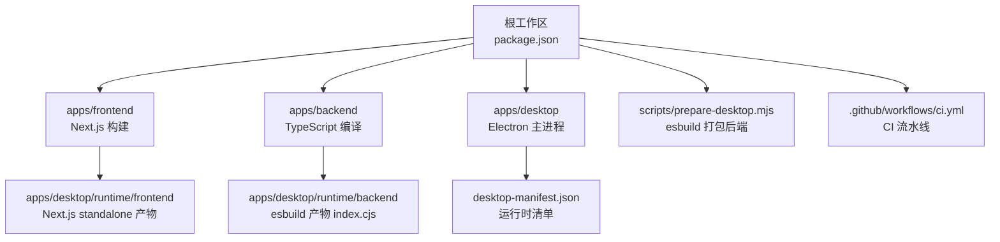
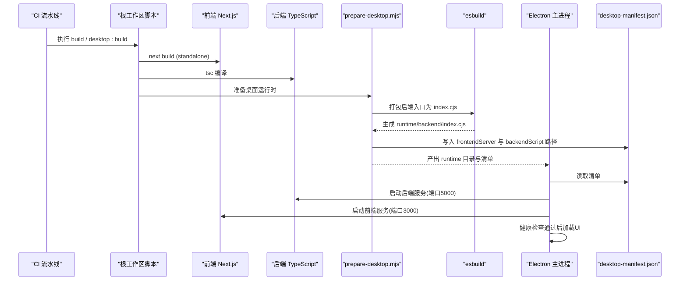
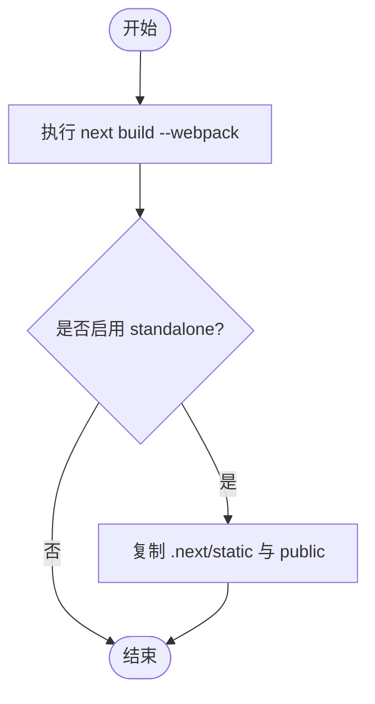
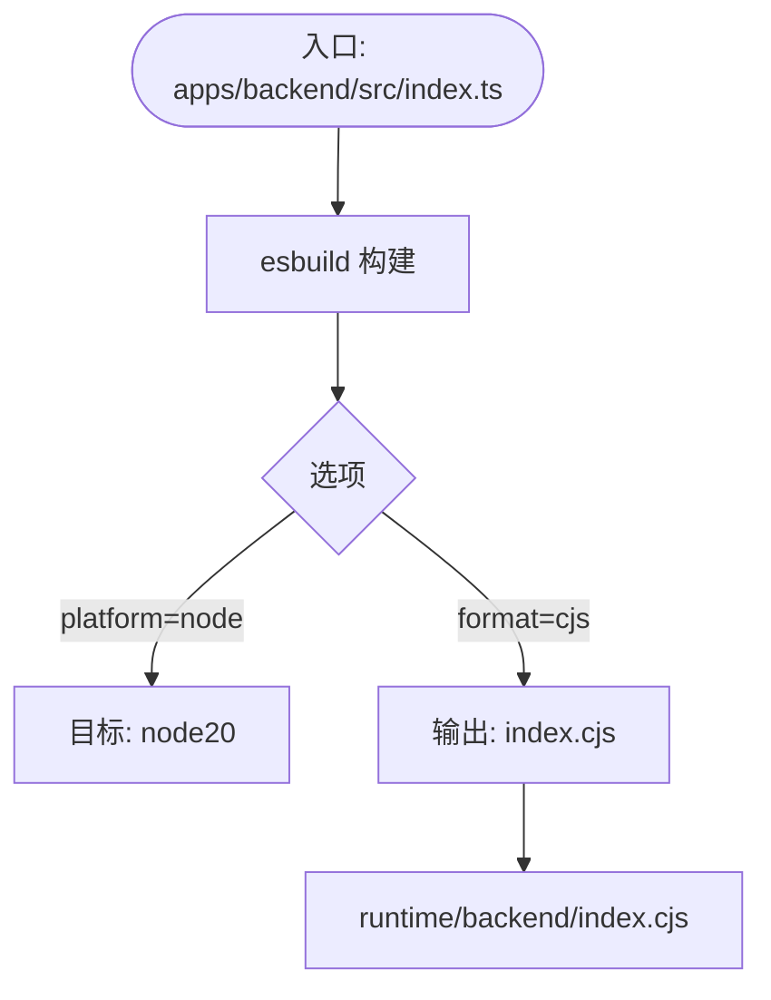
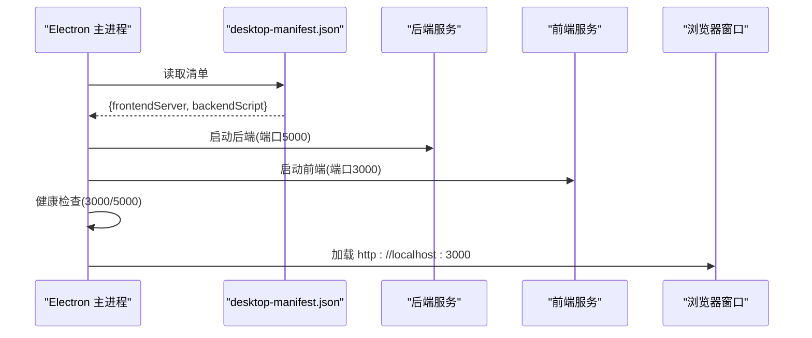
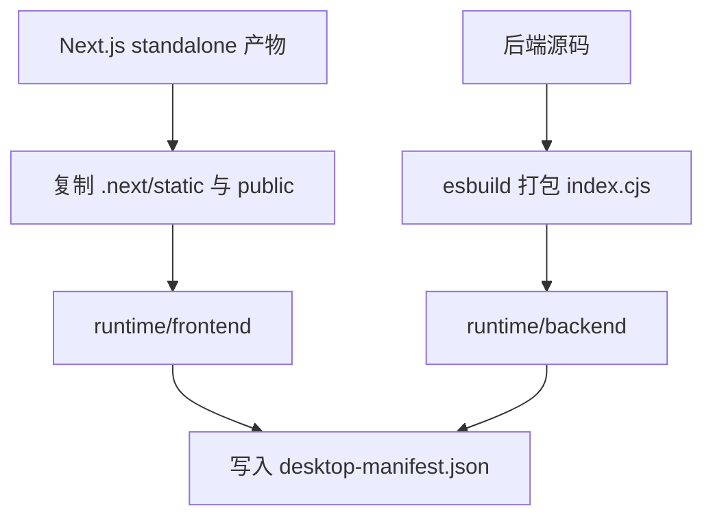
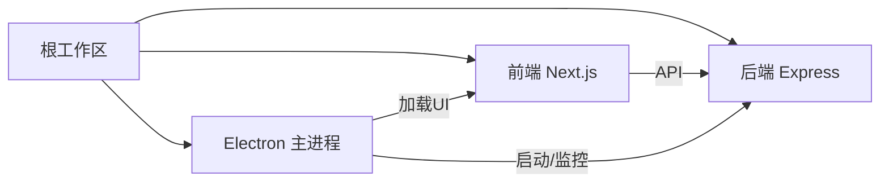

# 构建流程

<cite>
**本文引用的文件**
- [package.json](file://fishery-digital-twin-platform/package.json)
- [apps/backend/package.json](file://fishery-digital-twin-platform/apps/backend/package.json)
- [apps/frontend/package.json](file://fishery-digital-twin-platform/apps/frontend/package.json)
- [scripts/prepare-desktop.mjs](file://fishery-digital-twin-platform/scripts/prepare-desktop.mjs)
- [apps/desktop/main.cjs](file://fishery-digital-twin-platform/apps/desktop/main.cjs)
- [apps/frontend/next.config.mjs](file://fishery-digital-twin-platform/apps/frontend/next.config.mjs)
- [apps/backend/tsconfig.json](file://fishery-digital-twin-platform/apps/backend/tsconfig.json)
- [apps/frontend/tsconfig.json](file://fishery-digital-twin-platform/apps/frontend/tsconfig.json)
- [.github/workflows/ci.yml](file://.github/workflows/ci.yml)
- [scripts/preflight.ps1](file://fishery-digital-twin-platform/scripts/preflight.ps1)
</cite>

## 目录
1. [简介](#简介)
2. [项目结构](#项目结构)
3. [核心组件](#核心组件)
4. [架构总览](#架构总览)
5. [详细组件分析](#详细组件分析)
6. [依赖分析](#依赖分析)
7. [性能考虑](#性能考虑)
8. [故障排查指南](#故障排查指南)
9. [结论](#结论)
10. [附录](#附录)

## 简介
本文件面向“渔博士”数字孪生平台的自动化构建流程，覆盖前端 Next.js 独立构建、后端 TypeScript 编译与桌面应用打包全过程。重点说明 esbuild 在桌面运行时构建中的角色（入口处理、依赖打包、目标平台），以及构建产物管理（静态资源复制、服务器文件生成、清单文件创建）。同时给出代码分割、资源压缩与缓存机制等优化建议，并汇总常见构建问题的定位与解决方案。

## 项目结构
仓库采用 monorepo 组织，根工作区通过 npm workspaces 管理 apps 与 packages：
- apps/frontend：Next.js 前端应用，使用 standalone 输出模式，便于内嵌到桌面应用运行。
- apps/backend：Express + TypeScript 后端服务，提供设备数据、AI 报告、数字孪生仿真等接口。
- apps/desktop：Electron 主进程，负责启动前后端子进程、加载 UI 窗口、生命周期管理与日志输出。
- scripts：构建与预检脚本，包含 prepare-desktop.mjs（esbuild 打包后端、复制 Next.js standalone 产物）与 preflight.ps1（环境检查）。
- .github/workflows/ci.yml：CI 流水线执行 lint、test、typecheck、build。

图表来源
- [package.json:16-37](file://fishery-digital-twin-platform/package.json#L16-L37)
- [scripts/prepare-desktop.mjs:1-82](file://fishery-digital-twin-platform/scripts/prepare-desktop.mjs#L1-L82)
- [apps/desktop/main.cjs:82-118](file://fishery-digital-twin-platform/apps/desktop/main.cjs#L82-L118)

章节来源
- [package.json:16-37](file://fishery-digital-twin-platform/package.json#L16-L37)
- [.github/workflows/ci.yml:8-25](file://.github/workflows/ci.yml#L8-L25)

## 核心组件
- 前端构建：Next.js 以 standalone 模式输出，开发时与生产时分别使用不同 distDir，避免缓存污染；通过 transpilePackages 将共享包纳入转译范围。
- 后端构建：TypeScript 通过 tsc 编译为 JS；桌面构建阶段使用 esbuild 将后端源码打包为 CJS 单文件，目标 Node 版本为 node20。
- 桌面打包：Electron 主进程读取运行时清单 desktop-manifest.json，启动后端与前端服务，等待健康检查通过后加载页面。
- 构建编排：根 package.json 的脚本串联 shared 包、后端、前端的构建，并提供 desktop:build 一键打包桌面应用。

章节来源
- [apps/frontend/next.config.mjs:8-16](file://fishery-digital-twin-platform/apps/frontend/next.config.mjs#L8-L16)
- [apps/backend/package.json:6-11](file://fishery-digital-twin-platform/apps/backend/package.json#L6-L11)
- [scripts/prepare-desktop.mjs:61-81](file://fishery-digital-twin-platform/scripts/prepare-desktop.mjs#L61-L81)
- [apps/desktop/main.cjs:82-118](file://fishery-digital-twin-platform/apps/desktop/main.cjs#L82-L118)
- [package.json:16-37](file://fishery-digital-twin-platform/package.json#L16-L37)

## 架构总览
下图展示从 CI 触发到桌面应用产物的完整构建与运行链路：

图表来源
- [.github/workflows/ci.yml:8-25](file://.github/workflows/ci.yml#L8-L25)
- [package.json:16-37](file://fishery-digital-twin-platform/package.json#L16-L37)
- [scripts/prepare-desktop.mjs:61-81](file://fishery-digital-twin-platform/scripts/prepare-desktop.mjs#L61-L81)
- [apps/desktop/main.cjs:82-118](file://fishery-digital-twin-platform/apps/desktop/main.cjs#L82-L118)

## 详细组件分析

### 前端 Next.js 独立构建
- 构建配置要点：
  - 使用 output: "standalone" 生成可独立运行的服务端与静态资源。
  - 开发时使用 .next-dev，生产使用 .next，避免缓存混用导致 chunk 引用错误。
  - outputFileTracingRoot 指向工作区根，确保依赖追踪正确。
  - transpilePackages 将 @fishery/shared 纳入转译，保证共享库兼容。
- 构建产物：
  - 生成 .next/standalone 目录，包含 server.js 与 .next/static、public 等资源。
  - 后续由 prepare-desktop.mjs 复制到 apps/desktop/runtime/frontend 供 Electron 运行。

图表来源
- [apps/frontend/next.config.mjs:8-16](file://fishery-digital-twin-platform/apps/frontend/next.config.mjs#L8-L16)
- [scripts/prepare-desktop.mjs:29-59](file://fishery-digital-twin-platform/scripts/prepare-desktop.mjs#L29-L59)

章节来源
- [apps/frontend/next.config.mjs:8-16](file://fishery-digital-twin-platform/apps/frontend/next.config.mjs#L8-L16)
- [apps/frontend/package.json:6-12](file://fishery-digital-twin-platform/apps/frontend/package.json#L6-L12)

### 后端 TypeScript 编译与 esbuild 打包
- 开发/类型检查：
  - 使用 tsx watch 进行热重载开发。
  - 使用 tsc 进行类型检查与编译输出到 dist。
- 桌面构建阶段：
  - 使用 esbuild 将 apps/backend/src/index.ts 打包为 CJS 单文件 runtime/backend/index.cjs。
  - 设置 platform: "node"、format: "cjs"、target: "node20"，关闭 minify 与 sourcemap 以便调试。
  - 入口文件处理：仅指定单一入口，依赖自动解析与打包。

图表来源
- [scripts/prepare-desktop.mjs:61-71](file://fishery-digital-twin-platform/scripts/prepare-desktop.mjs#L61-L71)
- [apps/backend/package.json:6-11](file://fishery-digital-twin-platform/apps/backend/package.json#L6-L11)
- [apps/backend/tsconfig.json:1-13](file://fishery-digital-twin-platform/apps/backend/tsconfig.json#L1-L13)

章节来源
- [apps/backend/package.json:6-11](file://fishery-digital-twin-platform/apps/backend/package.json#L6-L11)
- [apps/backend/tsconfig.json:1-13](file://fishery-digital-twin-platform/apps/backend/tsconfig.json#L1-L13)
- [scripts/prepare-desktop.mjs:61-71](file://fishery-digital-twin-platform/scripts/prepare-desktop.mjs#L61-L71)

### 桌面应用打包与运行
- 打包配置（electron-builder）：
  - 输出目录 release，asar 打包但保留 runtime 目录 unpack。
  - 仅打包 main.cjs、assets、runtime 与 package.json。
  - Windows NSIS 安装程序，支持自定义安装目录与快捷方式。
- 运行流程：
  - 主进程读取 runtime/desktop-manifest.json，定位前端 server.js 与后端 index.cjs。
  - 启动后端与前端服务，轮询健康检查接口，成功后加载 http://localhost:3000。
  - 单实例锁、权限控制、媒体访问授权、日志输出。

图表来源
- [apps/desktop/main.cjs:82-118](file://fishery-digital-twin-platform/apps/desktop/main.cjs#L82-L118)
- [package.json:53-89](file://fishery-digital-twin-platform/package.json#L53-L89)

章节来源
- [package.json:53-89](file://fishery-digital-twin-platform/package.json#L53-L89)
- [apps/desktop/main.cjs:82-118](file://fishery-digital-twin-platform/apps/desktop/main.cjs#L82-L118)

### 构建产物管理
- 静态资源复制：
  - 将 Next.js 构建的 .next/static 与 public 复制到 runtime/frontend 对应位置，确保运行时资源可用。
- 服务器文件生成：
  - 后端通过 esbuild 生成 runtime/backend/index.cjs。
  - 前端使用 Next.js standalone 生成 server.js。
- 清单文件创建：
  - 生成 runtime/desktop-manifest.json，记录 frontendServer 与 backendScript 相对路径，供主进程启动服务。

图表来源
- [scripts/prepare-desktop.mjs:29-81](file://fishery-digital-twin-platform/scripts/prepare-desktop.mjs#L29-L81)

章节来源
- [scripts/prepare-desktop.mjs:29-81](file://fishery-digital-twin-platform/scripts/prepare-desktop.mjs#L29-L81)

### 构建优化策略
- 代码分割：
  - Next.js 默认按路由与模块边界进行代码分割，减少首屏体积。
  - 通过 transpilePackages 将共享库纳入转译，避免重复打包。
- 资源压缩：
  - Next.js 在生产构建中自动压缩 JS/CSS/图片等静态资源。
  - 后端 esbuild 当前关闭 minify，便于调试；如需减小体积可在构建脚本中开启。
- 缓存机制：
  - 开发期分离 .next-dev 与 .next，避免 webpack-runtime 指向错误的 chunks。
  - CI 使用 npm ci 与缓存 npm 依赖，提升构建稳定性与速度。
  - electron-builder 的 asar 打包可减少文件数量，提升加载效率。

章节来源
- [apps/frontend/next.config.mjs:8-16](file://fishery-digital-twin-platform/apps/frontend/next.config.mjs#L8-L16)
- [.github/workflows/ci.yml:15-25](file://.github/workflows/ci.yml#L15-L25)
- [package.json:53-89](file://fishery-digital-twin-platform/package.json#L53-L89)

## 依赖分析
- 工作区依赖：
  - 根 package.json 声明 workspaces，统一安装 apps/* 与 packages/* 的依赖。
  - devDependencies 包含 concurrently、electron、electron-builder、esbuild。
- 构建工具链：
  - Next.js 构建依赖 next、react、react-dom 等。
  - 后端依赖 express、cors、dotenv 等。
  - 桌面构建依赖 electron-builder 与 electron。
- 外部集成点：
  - 后端暴露 HTTP API 与 UDP 发现服务，供设备与前端调用。
  - 前端通过 Next.js API routes 与后端交互。

图表来源
- [package.json:12-15](file://fishery-digital-twin-platform/package.json#L12-L15)
- [apps/frontend/package.json:14-31](file://fishery-digital-twin-platform/apps/frontend/package.json#L14-L31)
- [apps/backend/package.json:13-18](file://fishery-digital-twin-platform/apps/backend/package.json#L13-L18)

章节来源
- [package.json:12-15](file://fishery-digital-twin-platform/package.json#L12-L15)
- [apps/frontend/package.json:14-31](file://fishery-digital-twin-platform/apps/frontend/package.json#L14-L31)
- [apps/backend/package.json:13-18](file://fishery-digital-twin-platform/apps/backend/package.json#L13-L18)

## 性能考虑
- 构建并行化：
  - 使用 concurrently 并行启动前后端服务，缩短整体启动时间。
- 增量构建：
  - Next.js 与 TypeScript 均支持增量构建，减少重复编译开销。
- 产物体积：
  - 合理拆分路由与组件，利用 Next.js 的代码分割能力。
  - 谨慎引入大型第三方库，必要时按需引入或替换轻量实现。
- 运行期优化：
  - 使用 asar 打包减少文件数量。
  - 合理设置超时与健康检查间隔，避免频繁请求影响性能。

[本节为通用指导，不直接分析具体文件]

## 故障排查指南
- 端口占用：
  - 若 3000 或 5000 端口被其他进程占用，主进程会抛出错误提示。可通过 preflight 脚本检测端口占用情况。
- 服务未就绪：
  - 主进程会轮询健康检查接口，超时则报错。检查后端与前端是否正常启动，查看日志文件。
- 环境变量缺失：
  - 后端需要 .env 配置 UISYS_API_TOKEN 等；桌面应用需同步设备令牌。使用 setup 脚本完成配置。
- 构建缓存问题：
  - 开发期区分 .next-dev 与 .next，避免缓存混用导致资源引用错误。清理缓存后重试。
- 防火墙与网络：
  - 设备发现与 API 访问需要开放相应端口。使用 network 配置脚本添加防火墙规则。

章节来源
- [scripts/preflight.ps1:116-148](file://fishery-digital-twin-platform/scripts/preflight.ps1#L116-L148)
- [apps/desktop/main.cjs:93-118](file://fishery-digital-twin-platform/apps/desktop/main.cjs#L93-L118)
- [apps/frontend/next.config.mjs:8-16](file://fishery-digital-twin-platform/apps/frontend/next.config.mjs#L8-L16)

## 结论
本项目通过 Next.js standalone、TypeScript 编译与 esbuild 打包的组合，实现了前后端解耦与桌面应用一体化打包。构建流程清晰、产物管理完善，具备较好的可维护性与扩展性。建议在保持现有稳定性的基础上，逐步引入更细粒度的代码分割与资源压缩策略，进一步提升构建与运行性能。

## 附录
- 常用命令：
  - 构建全部：npm run build
  - 桌面打包：npm run desktop:build
  - 开发模式：npm run dev
  - 类型检查：npm run typecheck
- 关键配置文件：
  - 根工作区脚本与依赖：package.json
  - 前端构建配置：apps/frontend/next.config.mjs
  - 后端编译配置：apps/backend/tsconfig.json
  - 桌面主进程：apps/desktop/main.cjs
  - 构建准备脚本：scripts/prepare-desktop.mjs
  - CI 流水线：.github/workflows/ci.yml

章节来源
- [package.json:16-37](file://fishery-digital-twin-platform/package.json#L16-L37)
- [apps/frontend/next.config.mjs:8-16](file://fishery-digital-twin-platform/apps/frontend/next.config.mjs#L8-L16)
- [apps/backend/tsconfig.json:1-13](file://fishery-digital-twin-platform/apps/backend/tsconfig.json#L1-L13)
- [apps/desktop/main.cjs:82-118](file://fishery-digital-twin-platform/apps/desktop/main.cjs#L82-L118)
- [scripts/prepare-desktop.mjs:61-81](file://fishery-digital-twin-platform/scripts/prepare-desktop.mjs#L61-L81)
- [.github/workflows/ci.yml:8-25](file://.github/workflows/ci.yml#L8-L25)