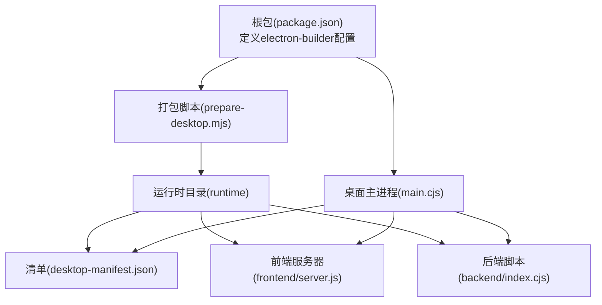
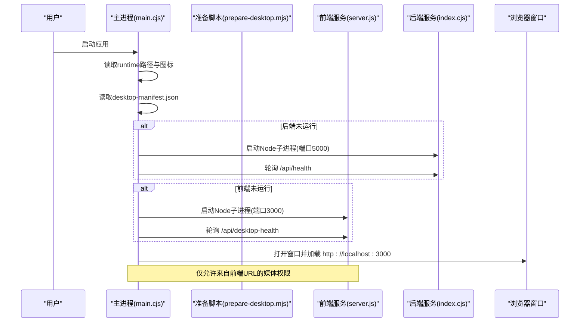
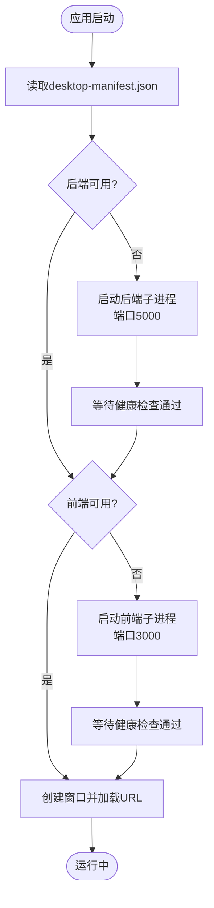
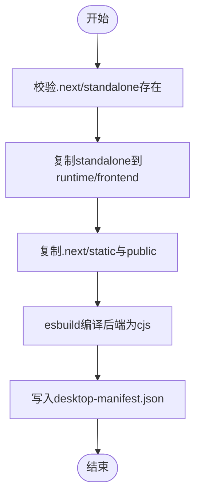
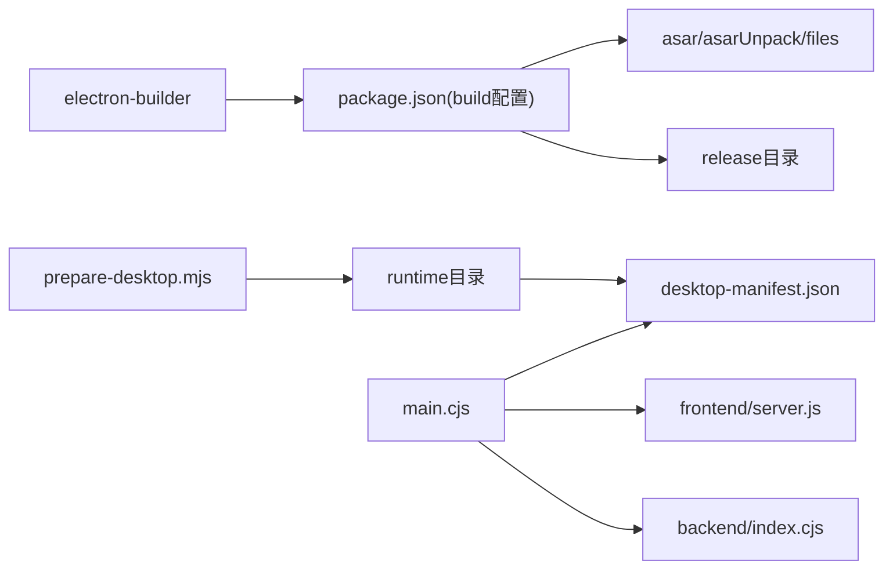

# 桌面应用打包

<cite>
**本文引用的文件**
- [main.cjs](file://fishery-digital-twin-platform/apps/desktop/main.cjs)
- [desktop-manifest.json](file://fishery-digital-twin-platform/apps/desktop/runtime/desktop-manifest.json)
- [prepare-desktop.mjs](file://fishery-digital-twin-platform/scripts/prepare-desktop.mjs)
- [package.json](file://fishery-digital-twin-platform/package.json)
- [backend/index.ts](file://fishery-digital-twin-platform/apps/backend/src/index.ts)
- [frontend/package.json](file://fishery-digital-twin-platform/apps/frontend/package.json)
- [ci.yml](file://.github/workflows/ci.yml)
</cite>

## 目录
1. [简介](#简介)
2. [项目结构](#项目结构)
3. [核心组件](#核心组件)
4. [架构总览](#架构总览)
5. [详细组件分析](#详细组件分析)
6. [依赖关系分析](#依赖关系分析)
7. [性能与优化](#性能与优化)
8. [故障排查指南](#故障排查指南)
9. [结论](#结论)
10. [附录：跨平台打包策略](#附录跨平台打包策略)

## 简介
本文件面向“渔博士”数字孪生平台的桌面端打包与分发，覆盖从构建、运行时准备、manifest配置到跨平台打包的完整流程。重点说明：
- 桌面运行时环境准备（前端静态资源部署、后端服务集成、配置文件生成）
- manifest文件结构与职责（前端服务器路径、后端脚本位置、依赖关系）
- 跨平台打包策略（Windows/macOS/Linux）
- 打包优化技巧（资源压缩、依赖精简、启动速度）
- 常见失败原因与解决方法

## 项目结构
本项目采用 monorepo 组织，桌面端入口位于 apps/desktop，运行时产物位于 apps/desktop/runtime，由根级 package.json 中的 electron-builder 配置驱动打包。

图表来源
- [package.json:53-90](file://fishery-digital-twin-platform/package.json#L53-L90)
- [main.cjs:10-12](file://fishery-digital-twin-platform/apps/desktop/main.cjs#L10-L12)
- [prepare-desktop.mjs:6-10](file://fishery-digital-twin-platform/scripts/prepare-desktop.mjs#L6-L10)
- [desktop-manifest.json:1-4](file://fishery-digital-twin-platform/apps/desktop/runtime/desktop-manifest.json#L1-L4)

章节来源
- [package.json:1-96](file://fishery-digital-twin-platform/package.json#L1-L96)
- [main.cjs:1-202](file://fishery-digital-twin-platform/apps/desktop/main.cjs#L1-L202)
- [prepare-desktop.mjs:1-82](file://fishery-digital-twin-platform/scripts/prepare-desktop.mjs#L1-L82)
- [desktop-manifest.json:1-5](file://fishery-digital-twin-platform/apps/desktop/runtime/desktop-manifest.json#L1-L5)

## 核心组件
- 桌面主进程 main.cjs：负责生命周期管理、子进程启动、端口健康探测、权限控制、窗口创建与导航限制。
- 打包准备脚本 prepare-desktop.mjs：将 Next.js standalone 前端复制到 runtime，拷贝静态资源与 public，使用 esbuild 编译后端为 cjs，并生成 desktop-manifest.json。
- 根级 package.json：定义工作区、脚本命令、electron-builder 打包配置（asar、asarUnpack、files、输出目录、平台目标等）。
- 后端服务 backend/index.ts：Express API，提供健康检查、数据接口、设备发现广播等。
- 前端 frontend/package.json：Next.js 应用，提供独立 server.js 供桌面端运行。

章节来源
- [main.cjs:1-202](file://fishery-digital-twin-platform/apps/desktop/main.cjs#L1-L202)
- [prepare-desktop.mjs:1-82](file://fishery-digital-twin-platform/scripts/prepare-desktop.mjs#L1-L82)
- [package.json:16-38](file://fishery-digital-twin-platform/package.json#L16-L38)
- [backend/index.ts:56-76](file://fishery-digital-twin-platform/apps/backend/src/index.ts#L56-L76)
- [frontend/package.json:6-12](file://fishery-digital-twin-platform/apps/frontend/package.json#L6-L12)

## 架构总览
桌面应用启动时，主进程读取 runtime 下的 desktop-manifest.json，定位前端与后端脚本；若端口未被占用且服务未运行，则通过 Node 子进程拉起前后端，轮询健康接口直到就绪，最后加载前端页面。

图表来源
- [main.cjs:82-118](file://fishery-digital-twin-platform/apps/desktop/main.cjs#L82-L118)
- [main.cjs:121-149](file://fishery-digital-twin-platform/apps/desktop/main.cjs#L121-L149)
- [backend/index.ts:322-334](file://fishery-digital-twin-platform/apps/backend/src/index.ts#L322-L334)

## 详细组件分析

### 桌面主进程（main.cjs）
- 运行时路径解析：根据是否打包决定 runtimeRoot，确保在 asar.unpacked 中正确访问 runtime。
- 子进程管理：统一通过 spawn 启动 Node 进程，注入环境变量（如 PORT、HOST、NODE_ENV），并记录日志流。
- 健康探测：对后端 /api/health 和前端 /api/desktop-health 进行轮询，超时抛出错误。
- 安全与权限：启用 contextIsolation、禁用 nodeIntegration、限制新窗口打开、限制导航到非前端源、授予媒体权限给前端源。
- 单实例锁：防止重复启动，聚焦已有窗口。

图表来源
- [main.cjs:82-118](file://fishery-digital-twin-platform/apps/desktop/main.cjs#L82-L118)
- [main.cjs:121-149](file://fishery-digital-twin-platform/apps/desktop/main.cjs#L121-L149)

章节来源
- [main.cjs:1-202](file://fishery-digital-twin-platform/apps/desktop/main.cjs#L1-L202)

### 打包准备脚本（prepare-desktop.mjs）
- 前置校验：确保 next build --standalone 产物存在，拒绝在非预期目录操作。
- 复制前端：将 .next/standalone 复制到 runtime/frontend，并复制 .next/static 与 public。
- 编译后端：使用 esbuild 将后端 TypeScript 编译为 cjs 输出到 runtime/backend/index.cjs。
- 生成清单：写入 desktop-manifest.json，包含相对路径的前端服务器与后端脚本。

图表来源
- [prepare-desktop.mjs:16-27](file://fishery-digital-twin-platform/scripts/prepare-desktop.mjs#L16-L27)
- [prepare-desktop.mjs:49-59](file://fishery-digital-twin-platform/scripts/prepare-desktop.mjs#L49-L59)
- [prepare-desktop.mjs:61-71](file://fishery-digital-twin-platform/scripts/prepare-desktop.mjs#L61-L71)
- [prepare-desktop.mjs:73-81](file://fishery-digital-twin-platform/scripts/prepare-desktop.mjs#L73-L81)

章节来源
- [prepare-desktop.mjs:1-82](file://fishery-digital-twin-platform/scripts/prepare-desktop.mjs#L1-L82)

### 清单文件（desktop-manifest.json）
- 字段说明：
  - frontendServer：前端 server.js 在 runtime 中的相对路径。
  - backendScript：后端 index.cjs 在 runtime 中的相对路径。
- 作用：主进程据此动态定位并启动前后端服务，解耦路径变化。

章节来源
- [desktop-manifest.json:1-5](file://fishery-digital-twin-platform/apps/desktop/runtime/desktop-manifest.json#L1-L5)

### 后端服务（backend/index.ts）
- 健康接口：/api/health 返回 service 名称用于主进程匹配。
- CORS 与令牌：支持本地回环免令牌，局域网需 X-UISYS-Token。
- 设备发现：UDP 广播后端端口，便于局域网发现。
- 数据与仿真：水质、电池、导航、AI报告、舵机与推进器控制、数字孪生推演等接口。

章节来源
- [backend/index.ts:56-76](file://fishery-digital-twin-platform/apps/backend/src/index.ts#L56-L76)
- [backend/index.ts:322-334](file://fishery-digital-twin-platform/apps/backend/src/index.ts#L322-L334)
- [backend/index.ts:564-579](file://fishery-digital-twin-platform/apps/backend/src/index.ts#L564-L579)

### 前端应用（apps/frontend）
- 构建产物：Next.js standalone 模式生成可独立运行的 server.js。
- 资源：静态资源与 public 目录被复制到 runtime/frontend，保证离线可用。

章节来源
- [frontend/package.json:6-12](file://fishery-digital-twin-platform/apps/frontend/package.json#L6-L12)
- [prepare-desktop.mjs:49-59](file://fishery-digital-twin-platform/scripts/prepare-desktop.mjs#L49-L59)

## 依赖关系分析
- 主进程依赖：Electron、Node 子进程、文件系统、路径工具。
- 构建期依赖：esbuild（后端打包）、Next.js（前端构建）、electron-builder（打包）。
- 运行时依赖：前后端服务以子进程方式运行，不嵌入 asar，避免运行时修改与热更新问题。

图表来源
- [package.json:53-90](file://fishery-digital-twin-platform/package.json#L53-L90)
- [prepare-desktop.mjs:6-10](file://fishery-digital-twin-platform/scripts/prepare-desktop.mjs#L6-L10)
- [desktop-manifest.json:1-4](file://fishery-digital-twin-platform/apps/desktop/runtime/desktop-manifest.json#L1-L4)
- [main.cjs:82-118](file://fishery-digital-twin-platform/apps/desktop/main.cjs#L82-L118)

章节来源
- [package.json:53-90](file://fishery-digital-twin-platform/package.json#L53-L90)
- [prepare-desktop.mjs:1-82](file://fishery-digital-twin-platform/scripts/prepare-desktop.mjs#L1-L82)
- [main.cjs:82-118](file://fishery-digital-twin-platform/apps/desktop/main.cjs#L82-L118)

## 性能与优化
- 资源体积优化
  - 前端：使用 Next.js standalone 构建，仅包含必要代码；确保 .next/static 与 public 正确复制。
  - 后端：esbuild 打包为单一 cjs，关闭 sourcemap 与 minify（可按需开启）。
- 依赖精简
  - 仅打包 runtime 目录与主进程文件，避免引入开发依赖。
  - 通过 asarUnpack 保留 runtime 以便运行时读写与扩展。
- 启动速度优化
  - 主进程先探测端口占用，避免不必要的子进程启动。
  - 健康检查间隔合理（约350ms），超时时间区分后端与前端差异。
  - 日志重定向至文件，减少控制台开销。
- 内存与并发
  - 子进程隔离前后端，崩溃不影响主进程。
  - 限制窗口打开与导航，降低渲染层压力。

[本节为通用指导，无需特定文件引用]

## 故障排查指南
- 端口占用
  - 现象：启动时报端口已被占用。
  - 处理：关闭占用 3000/5000 的程序后重试。
  - 依据：主进程健康探测与错误提示。
- 运行时缺失
  - 现象：提示桌面运行文件不存在。
  - 处理：执行 npm run desktop:prepare 生成 runtime 与 manifest。
  - 依据：主进程启动前校验 manifest。
- 服务健康检查失败
  - 现象：服务启动超时。
  - 处理：查看 logs 目录下的 desktop-services.log，检查后端 /api/health 与前端 /api/desktop-health。
  - 依据：主进程超时抛错与日志路径。
- 权限与媒体
  - 现象：摄像头/麦克风不可用。
  - 处理：确认请求来源为前端 URL，主进程已授权媒体权限。
  - 依据：主进程权限处理器。
- 单实例冲突
  - 现象：再次启动无响应。
  - 处理：聚焦已有窗口或退出旧实例。
  - 依据：主进程单实例锁逻辑。

章节来源
- [main.cjs:82-118](file://fishery-digital-twin-platform/apps/desktop/main.cjs#L82-L118)
- [main.cjs:152-177](file://fishery-digital-twin-platform/apps/desktop/main.cjs#L152-L177)
- [main.cjs:180-191](file://fishery-digital-twin-platform/apps/desktop/main.cjs#L180-L191)

## 结论
该桌面应用通过“主进程 + 子进程”的架构实现前后端解耦与稳定运行；借助 prepare-desktop.mjs 自动化准备运行时与 manifest，配合 electron-builder 完成跨平台打包。合理的健康检查、权限控制与日志机制提升了可维护性与用户体验。按本文档的流程与优化建议，可实现高效、稳定的桌面应用构建与分发。

[本节为总结性内容，无需特定文件引用]

## 附录：跨平台打包策略
- Windows
  - 目标：NSIS 安装包（x64），自定义安装程序名称与快捷方式。
  - 配置要点：icon、target、artifactName、nsis 选项。
- macOS
  - 目标：可添加 dmg/app 目标（当前配置未显式声明，可在 build.win 同级增加 build.mac）。
  - 注意事项：签名与公证流程需在 CI 中补充。
- Linux
  - 目标：可添加 AppImage/rpm/deb 目标（当前配置未显式声明，可在 build.linux 中补充）。
  - 注意事项：系统依赖（如 libXScrnSaver）需在构建环境中安装。

当前仓库默认只配置了 Windows NSIS 打包目标；如需多平台发布，请在根 package.json 的 build 节点下追加对应平台配置，并在 CI 中增加相应构建步骤。

章节来源
- [package.json:70-89](file://fishery-digital-twin-platform/package.json#L70-L89)
- [ci.yml:8-26](file://.github/workflows/ci.yml#L8-L26)