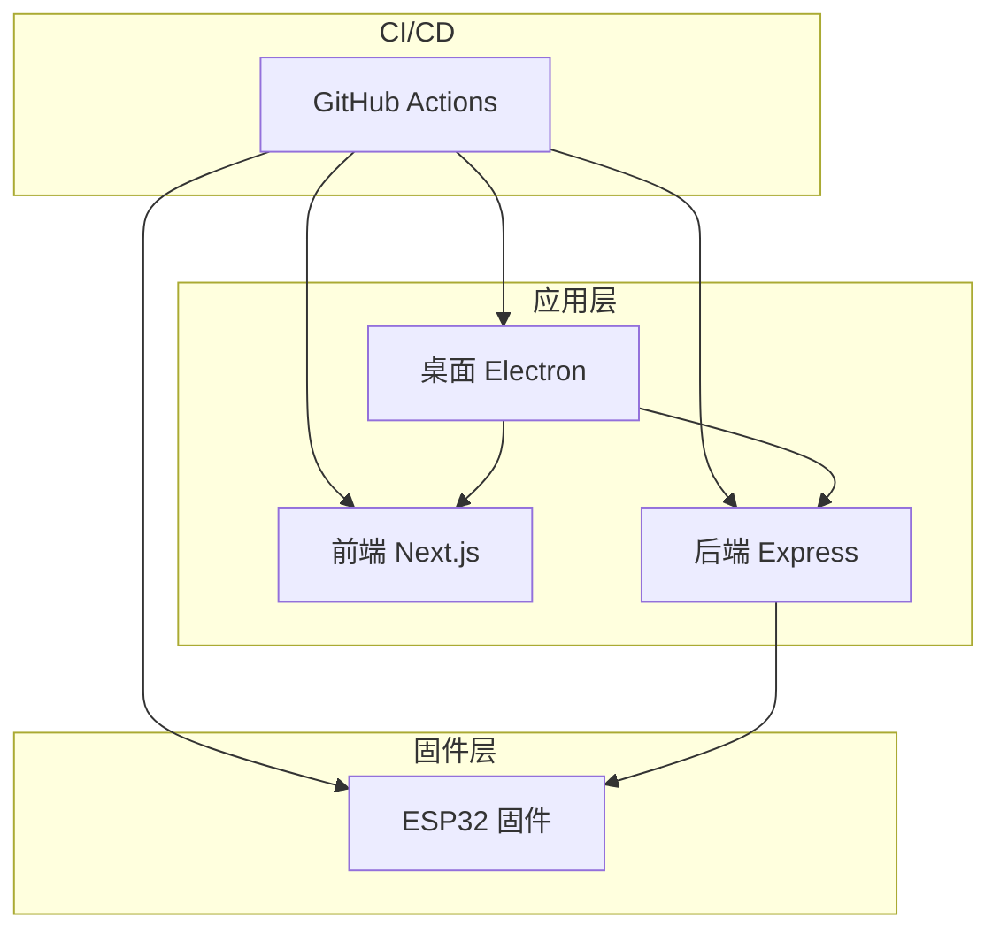
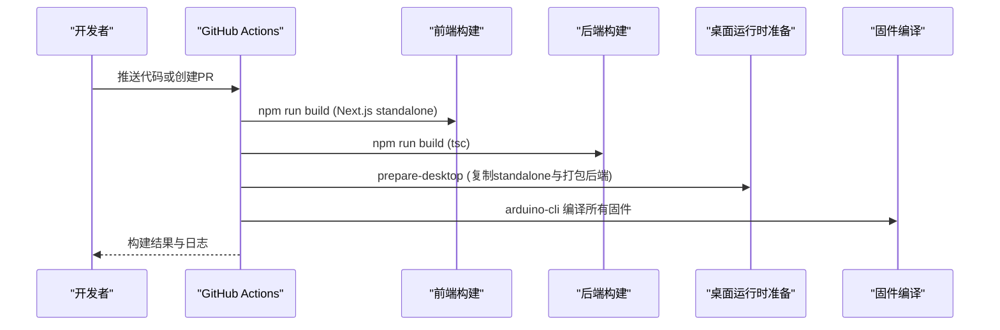
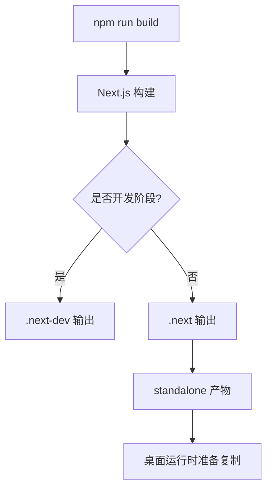
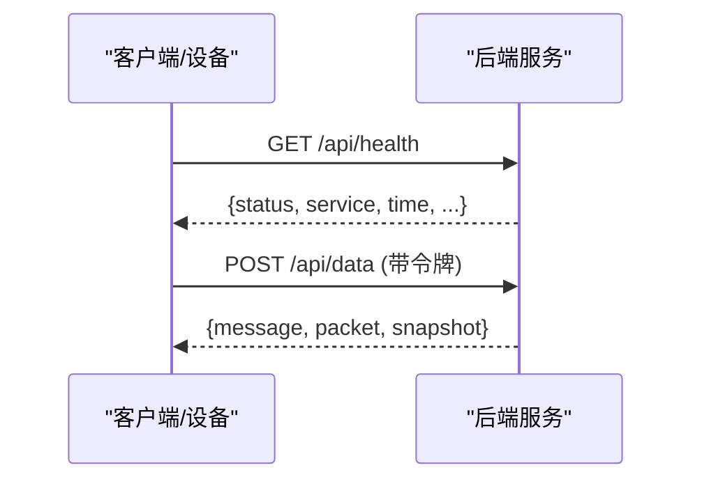
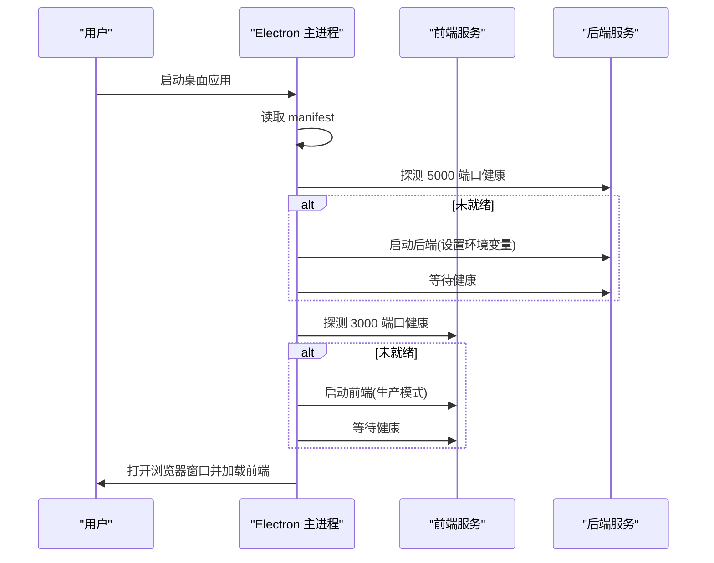
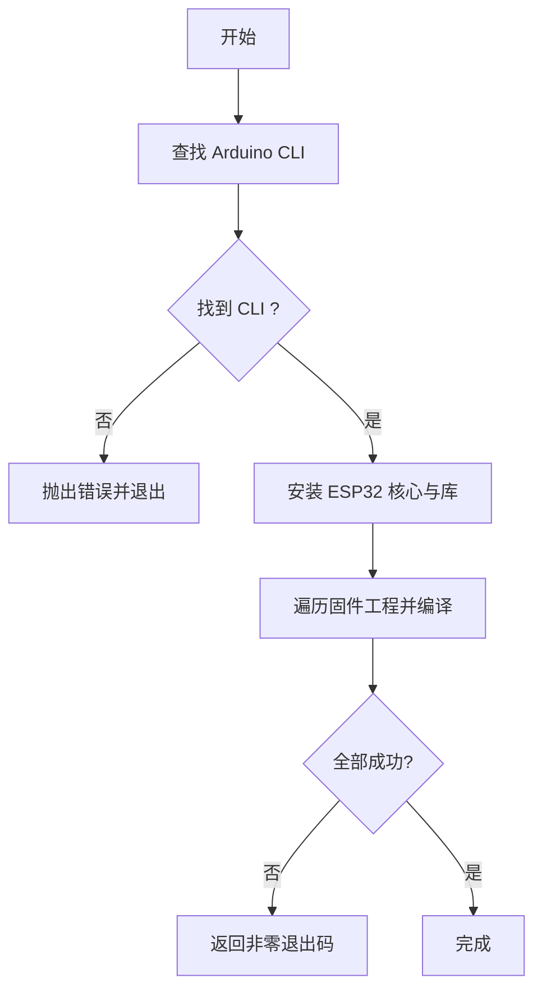
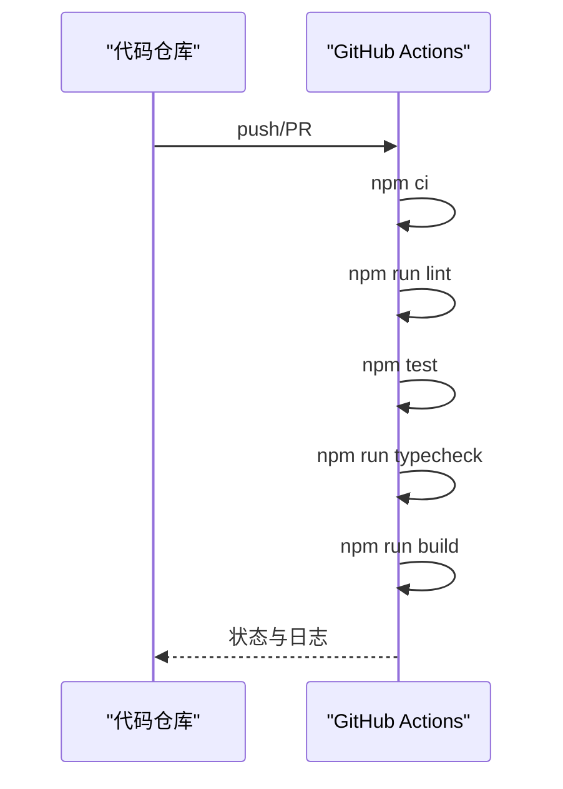
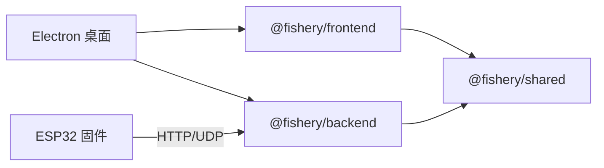

# 部署流程

<cite>
**本文引用的文件**
- [CI工作流](file://fishery-digital-twin-platform/.github/workflows/ci.yml)
- [后端包配置](file://fishery-digital-twin-platform/apps/backend/package.json)
- [前端包配置](file://fishery-digital-twin-platform/apps/frontend/package.json)
- [Next.js构建配置](file://fishery-digital-twin-platform/apps/frontend/next.config.mjs)
- [桌面应用主进程](file://fishery-digital-twin-platform/apps/desktop/main.cjs)
- [桌面运行清单](file://fishery-digital-twin-platform/apps/desktop/runtime/desktop-manifest.json)
- [桌面运行时准备脚本](file://fishery-digital-twin-platform/scripts/prepare-desktop.mjs)
- [固件工具脚本](file://fishery-digital-twin-platform/scripts/firmware-tooling.ps1)
- [预检查脚本](file://fishery-digital-twin-platform/scripts/preflight.ps1)
- [后端服务入口](file://fishery-digital-twin-platform/apps/backend/src/index.ts)
</cite>

## 目录
1. [简介](#简介)
2. [项目结构](#项目结构)
3. [核心组件](#核心组件)
4. [架构总览](#架构总览)
5. [详细组件分析](#详细组件分析)
6. [依赖关系分析](#依赖关系分析)
7. [性能考虑](#性能考虑)
8. [故障排查指南](#故障排查指南)
9. [结论](#结论)
10. [附录](#附录)

## 简介
本文件面向开发与运维团队，系统化说明渔业数字孪生平台的自动化构建与发布流程。内容覆盖：
- 前端 Next.js 应用构建、后端 TypeScript 编译、桌面应用打包与固件编译
- CI/CD 流水线（GitHub Actions）的触发条件、质量门禁与产物生成
- 容器化与集群部署建议（基于现有构建产物）
- 灰度发布、回滚机制与版本管理策略
- 多环境差异（开发、测试、预生产、生产）
- 部署验证与健康检查

## 项目结构
仓库采用多应用+共享库的 monorepo 组织方式：
- apps/frontend：Next.js 前端应用，支持独立可执行输出
- apps/backend：Express 后端服务，提供设备接入、数据聚合、控制接口
- apps/desktop：Electron 桌面应用，内嵌并启动前后端服务
- firmware/esp32：ESP32 固件源码，使用 Arduino CLI 编译
- scripts：构建与部署辅助脚本（桌面运行时准备、固件编译、预检查等）
- .github/workflows：CI 工作流定义

图表来源
- [CI工作流:1-26](file://fishery-digital-twin-platform/.github/workflows/ci.yml#L1-L26)
- [桌面应用主进程:1-202](file://fishery-digital-twin-platform/apps/desktop/main.cjs#L1-L202)
- [后端服务入口:1-599](file://fishery-digital-twin-platform/apps/backend/src/index.ts#L1-L599)

章节来源
- [CI工作流:1-26](file://fishery-digital-twin-platform/.github/workflows/ci.yml#L1-L26)
- [前端包配置:1-45](file://fishery-digital-twin-platform/apps/frontend/package.json#L1-L45)
- [后端包配置:1-27](file://fishery-digital-twin-platform/apps/backend/package.json#L1-L27)
- [桌面应用主进程:1-202](file://fishery-digital-twin-platform/apps/desktop/main.cjs#L1-L202)
- [固件工具脚本:1-75](file://fishery-digital-twin-platform/scripts/firmware-tooling.ps1#L1-L75)

## 核心组件
- 前端构建：Next.js 通过 next build 生成 standalone 产物，便于在 Node 环境中直接运行
- 后端构建：TypeScript 编译为 CommonJS，暴露 HTTP API 与 UDP 发现服务
- 桌面应用：Electron 主进程负责拉起前后端子进程、端口探测、健康检查与窗口展示
- 固件编译：Arduino CLI 安装依赖并编译多个 ESP32 工程
- CI 流水线：统一执行 lint、类型检查、测试、构建，确保代码质量与一致性

章节来源
- [前端包配置:1-45](file://fishery-digital-twin-platform/apps/frontend/package.json#L1-L45)
- [后端包配置:1-27](file://fishery-digital-twin-platform/apps/backend/package.json#L1-L27)
- [桌面应用主进程:1-202](file://fishery-digital-twin-platform/apps/desktop/main.cjs#L1-L202)
- [固件工具脚本:1-75](file://fishery-digital-twin-platform/scripts/firmware-tooling.ps1#L1-L75)
- [CI工作流:1-26](file://fishery-digital-twin-platform/.github/workflows/ci.yml#L1-L26)

## 架构总览
下图展示了从代码提交到产物的端到端流程，以及桌面应用的本地运行编排。

图表来源
- [CI工作流:1-26](file://fishery-digital-twin-platform/.github/workflows/ci.yml#L1-L26)
- [桌面运行时准备脚本:1-82](file://fishery-digital-twin-platform/scripts/prepare-desktop.mjs#L1-L82)
- [固件工具脚本:1-75](file://fishery-digital-twin-platform/scripts/firmware-tooling.ps1#L1-L75)

## 详细组件分析

### 前端 Next.js 构建与产物
- 构建目标：standalone 输出，便于在最小 Node 环境中运行
- 构建缓存：开发阶段与生产构建目录分离，避免缓存污染
- 共享包：transpilePackages 包含 @fishery/shared，保证跨应用复用

图表来源
- [前端包配置:1-45](file://fishery-digital-twin-platform/apps/frontend/package.json#L1-L45)
- [Next.js构建配置:1-18](file://fishery-digital-twin-platform/apps/frontend/next.config.mjs#L1-L18)
- [桌面运行时准备脚本:1-82](file://fishery-digital-twin-platform/scripts/prepare-desktop.mjs#L1-L82)

章节来源
- [前端包配置:1-45](file://fishery-digital-twin-platform/apps/frontend/package.json#L1-L45)
- [Next.js构建配置:1-18](file://fishery-digital-twin-platform/apps/frontend/next.config.mjs#L1-L18)

### 后端 TypeScript 编译与服务
- 编译：tsc 将 src 编译至 dist，Node 以 ES Modules 模式运行
- 运行：默认监听 5000 端口，支持 HOST 绑定；暴露 /api/health 健康检查
- 安全：CORS 白名单、LAN 控制需携带令牌校验
- 设备发现：UDP 广播服务用于局域网设备发现

图表来源
- [后端服务入口:1-599](file://fishery-digital-twin-platform/apps/backend/src/index.ts#L1-L599)

章节来源
- [后端包配置:1-27](file://fishery-digital-twin-platform/apps/backend/package.json#L1-L27)
- [后端服务入口:1-599](file://fishery-digital-twin-platform/apps/backend/src/index.ts#L1-L599)

### 桌面应用打包与本地编排
- 运行时准备：将 Next.js standalone 复制到 desktop/runtime，并打包后端为 index.cjs，生成 manifest
- 启动流程：检测端口占用，按需启动后端与前端，轮询健康接口直到就绪
- 窗口与安全：启用沙箱、限制导航、仅允许媒体权限来自前端源

图表来源
- [桌面应用主进程:1-202](file://fishery-digital-twin-platform/apps/desktop/main.cjs#L1-L202)
- [桌面运行清单:1-5](file://fishery-digital-twin-platform/apps/desktop/runtime/desktop-manifest.json#L1-L5)
- [桌面运行时准备脚本:1-82](file://fishery-digital-twin-platform/scripts/prepare-desktop.mjs#L1-L82)

章节来源
- [桌面应用主进程:1-202](file://fishery-digital-twin-platform/apps/desktop/main.cjs#L1-L202)
- [桌面运行清单:1-5](file://fishery-digital-twin-platform/apps/desktop/runtime/desktop-manifest.json#L1-L5)
- [桌面运行时准备脚本:1-82](file://fishery-digital-twin-platform/scripts/prepare-desktop.mjs#L1-L82)

### 固件编译流程
- 依赖安装：自动查找 Arduino CLI，安装 ESP32 核心与所需库
- 批量编译：对多个 .ino 工程进行编译，失败即中止
- 适用场景：本地开发或 CI 中需要验证固件兼容性时执行

图表来源
- [固件工具脚本:1-75](file://fishery-digital-twin-platform/scripts/firmware-tooling.ps1#L1-L75)

章节来源
- [固件工具脚本:1-75](file://fishery-digital-twin-platform/scripts/firmware-tooling.ps1#L1-L75)

### CI/CD 流水线
- 触发：push 到 main 分支或任意 PR
- 步骤：检出代码、安装依赖、lint、测试、类型检查、构建
- 产物：前端 standalone、后端 dist、桌面运行时与固件二进制（如需扩展）

图表来源
- [CI工作流:1-26](file://fishery-digital-twin-platform/.github/workflows/ci.yml#L1-L26)

章节来源
- [CI工作流:1-26](file://fishery-digital-twin-platform/.github/workflows/ci.yml#L1-L26)

## 依赖关系分析
- 前端依赖 Next.js、Three.js、TensorFlow.js 等，构建产物为 standalone
- 后端依赖 Express、CORS、dotenv，提供 HTTP 与 UDP 能力
- 桌面应用依赖 Electron，内部编排前后端进程
- 固件依赖 Arduino CLI 与 ESP32 生态库

图表来源
- [前端包配置:1-45](file://fishery-digital-twin-platform/apps/frontend/package.json#L1-L45)
- [后端包配置:1-27](file://fishery-digital-twin-platform/apps/backend/package.json#L1-L27)
- [桌面应用主进程:1-202](file://fishery-digital-twin-platform/apps/desktop/main.cjs#L1-L202)
- [固件工具脚本:1-75](file://fishery-digital-twin-platform/scripts/firmware-tooling.ps1#L1-L75)

章节来源
- [前端包配置:1-45](file://fishery-digital-twin-platform/apps/frontend/package.json#L1-L45)
- [后端包配置:1-27](file://fishery-digital-twin-platform/apps/backend/package.json#L1-L27)
- [桌面应用主进程:1-202](file://fishery-digital-twin-platform/apps/desktop/main.cjs#L1-L202)
- [固件工具脚本:1-75](file://fishery-digital-twin-platform/scripts/firmware-tooling.ps1#L1-L75)

## 性能考虑
- 前端构建：使用 Next.js standalone 减少运行时依赖体积，提升冷启动速度
- 后端：CORS 与令牌校验在入口处生效，避免不必要的处理开销
- 桌面应用：健康检查轮询间隔与超时时间已内置，避免长时间阻塞
- 固件：仅在必要时编译，避免 CI 中不必要的耗时

[本节为通用指导，不直接分析具体文件]

## 故障排查指南
- 端口冲突：桌面应用会检测 3000/5000 端口占用并提示关闭占用程序
- 服务未就绪：桌面应用会在超时后抛出错误并显示日志路径
- 令牌不一致：预检查脚本会比对后端与桌面环境的令牌长度与值
- 固件缺失：Arduino CLI 未找到或缺少核心/库时会报错并指引安装

章节来源
- [桌面应用主进程:1-202](file://fishery-digital-twin-platform/apps/desktop/main.cjs#L1-L202)
- [预检查脚本:1-89](file://fishery-digital-twin-platform/scripts/preflight.ps1#L1-L89)
- [固件工具脚本:1-75](file://fishery-digital-twin-platform/scripts/firmware-tooling.ps1#L1-L75)

## 结论
本项目提供了完整的自动化构建与发布能力：前端 Next.js standalone、后端 TypeScript 编译、桌面应用编排与固件编译均在 CI 中串联执行。通过健康检查与环境预检查，保障部署稳定性。建议在后续迭代中补充容器化镜像构建与多环境发布策略，以实现更灵活的灰度与回滚能力。

[本节为总结性内容，不直接分析具体文件]

## 附录

### 构建与发布命令参考
- 前端构建：npm run build（Next.js standalone）
- 后端构建：npm run build（tsc）
- 桌面运行时准备：scripts/prepare-desktop.mjs
- 固件编译：scripts/firmware-tooling.ps1（可选 InstallDependencies/CompileAll）
- 预检查：scripts/preflight.ps1（before-start/runtime）

章节来源
- [前端包配置:1-45](file://fishery-digital-twin-platform/apps/frontend/package.json#L1-L45)
- [后端包配置:1-27](file://fishery-digital-twin-platform/apps/backend/package.json#L1-L27)
- [桌面运行时准备脚本:1-82](file://fishery-digital-twin-platform/scripts/prepare-desktop.mjs#L1-L82)
- [固件工具脚本:1-75](file://fishery-digital-twin-platform/scripts/firmware-tooling.ps1#L1-L75)
- [预检查脚本:1-89](file://fishery-digital-twin-platform/scripts/preflight.ps1#L1-L89)

### 健康检查与验证
- 后端健康：GET /api/health，返回服务名与状态
- 前端健康：GET /api/desktop-health（由前端路由提供）
- 桌面应用：启动前轮询上述健康接口，确保服务就绪

章节来源
- [后端服务入口:1-599](file://fishery-digital-twin-platform/apps/backend/src/index.ts#L1-L599)
- [桌面应用主进程:1-202](file://fishery-digital-twin-platform/apps/desktop/main.cjs#L1-L202)

### 容器化与集群部署建议
- 镜像构建：基于 Node 基础镜像，拷贝 Next.js standalone 与后端 dist，暴露对应端口
- 服务编排：使用 Docker Compose 或 Kubernetes 编排前端、后端与持久化存储
- 健康探针：结合 /api/health 与前端健康路由实现存活与就绪探针
- 滚动更新：配合 readiness/liveness 探针实现灰度与回滚

[本节为概念性建议，不直接映射到具体文件]

### 灰度发布与回滚策略
- 灰度：按版本号或标签逐步放量，观察健康指标与错误率
- 回滚：保留上一稳定版本镜像/制品，快速切换流量
- 版本管理：通过 Git tag 与 CI 产物关联，确保可追溯

[本节为概念性建议，不直接映射到具体文件]

### 多环境差异说明
- 开发：本地运行，端口与调试开关默认开启
- 测试：启用严格校验与测试套件，禁用演示数据注入
- 预生产：接近生产的环境变量与网络策略
- 生产：关闭调试、启用 CORS 白名单、强制令牌校验、限制访问范围

[本节为概念性建议，不直接映射到具体文件]