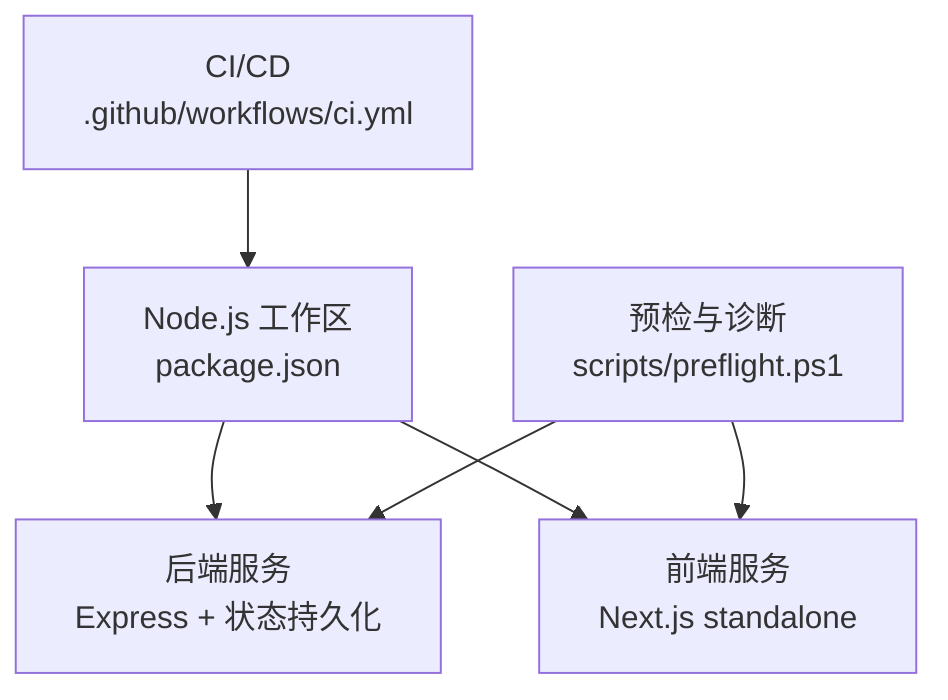
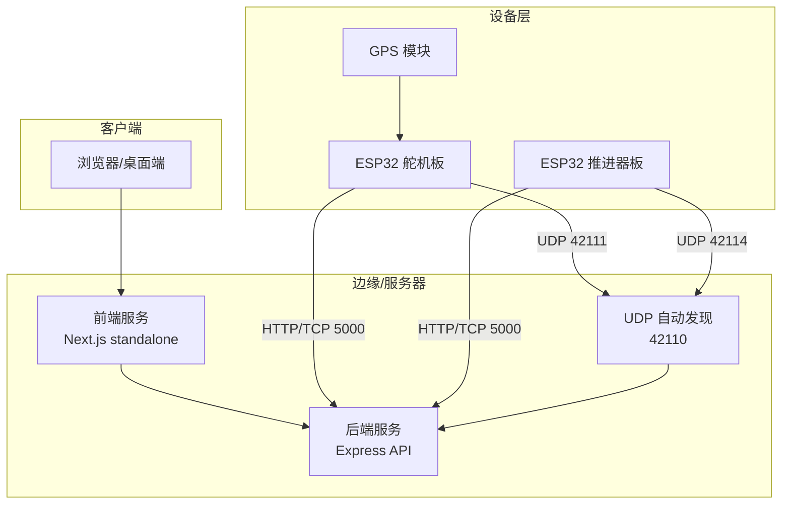
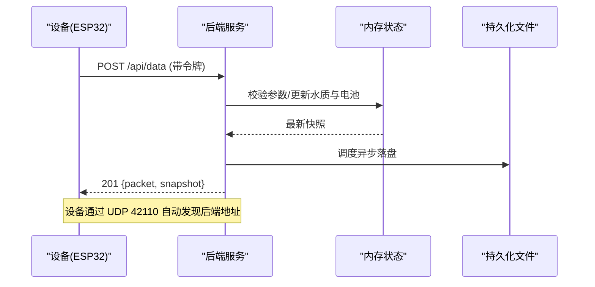
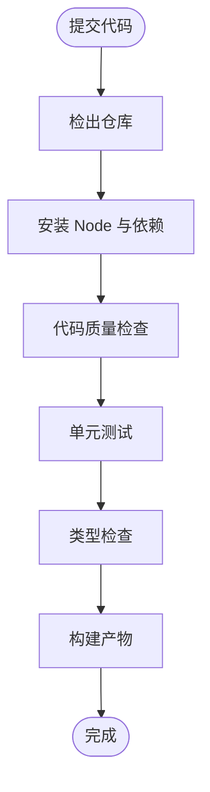
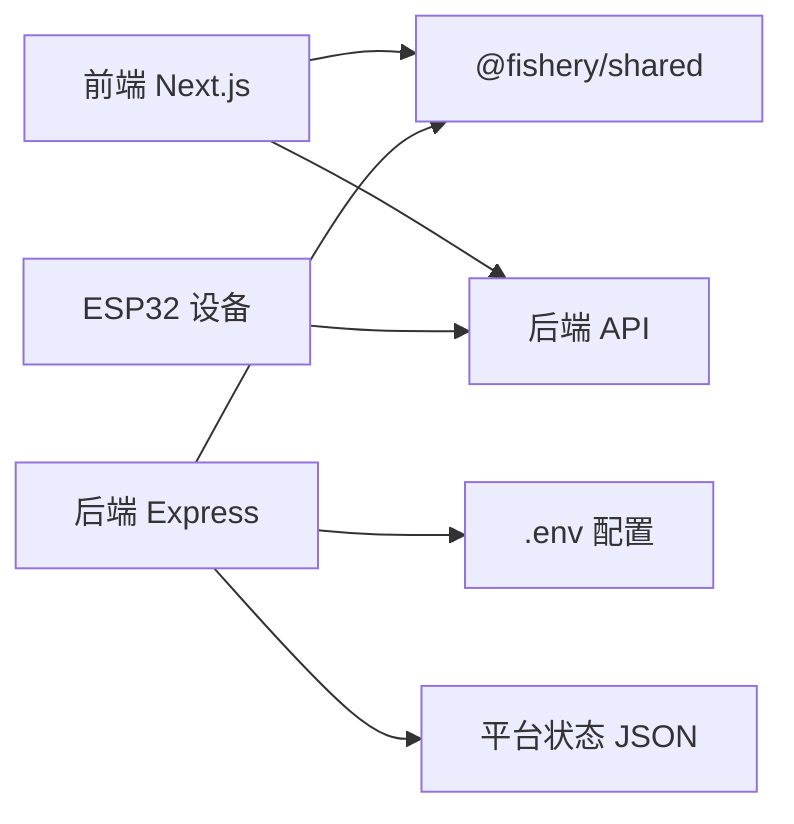

# 部署运维

<cite>
**本文引用的文件**
- [package.json](file://fishery-digital-twin-platform/package.json)
- [ci.yml](file://.github/workflows/ci.yml)
- [后端入口 index.ts](file://fishery-digital-twin-platform/apps/backend/src/index.ts)
- [后端持久化 persistence.ts](file://fishery-digital-twin-platform/apps/backend/src/persistence.ts)
- [前端 Next.js 配置 next.config.mjs](file://fishery-digital-twin-platform/apps/frontend/next.config.mjs)
- [安全与网络文档 security-and-network.md](file://fishery-digital-twin-platform/docs/security-and-network.md)
- [预检脚本 preflight.ps1](file://fishery-digital-twin-platform/scripts/preflight.ps1)
- [项目说明 README.md](file://fishery-digital-twin-platform/README.md)
</cite>

## 目录
1. [简介](#简介)
2. [项目结构](#项目结构)
3. [核心组件](#核心组件)
4. [架构总览](#架构总览)
5. [详细组件分析](#详细组件分析)
6. [依赖关系分析](#依赖关系分析)
7. [性能考虑](#性能考虑)
8. [故障排查指南](#故障排查指南)
9. [结论](#结论)
10. [附录](#附录)

## 简介
本运维文档面向生产环境，覆盖服务器要求、依赖安装、环境变量管理、自动化部署（CI/CD）、容器化与高可用建议、监控告警、备份恢复、故障排查与安全加固。系统由 Express 后端、Next.js 前端、ESP32 设备端组成，提供水质监测、设备控制、数字孪生推演与 AI 报告能力。默认端口：前端 3000，后端 5000；设备自动发现使用 UDP 42110，设备侧监听 42111-42114。

## 项目结构
- 根工作区通过 npm workspaces 管理 apps/backend、apps/frontend、packages/shared。
- 后端基于 Express，提供健康检查、数据上报、设备控制、AI 报告、日志等接口，并内置状态持久化。
- 前端为 Next.js 应用，构建输出 standalone 模式便于独立部署。
- CI 流水线在 GitHub Actions 中执行 lint、测试、类型检查与构建。
- 预检脚本用于启动前环境与端口可用性检查，以及运行时健康探测。

**图示来源**
- [package.json:1-38](file://fishery-digital-twin-platform/package.json#L1-L38)
- [ci.yml:1-26](file://.github/workflows/ci.yml#L1-L26)
- [preflight.ps1:116-148](file://fishery-digital-twin-platform/scripts/preflight.ps1#L116-L148)

**章节来源**
- [package.json:1-38](file://fishery-digital-twin-platform/package.json#L1-L38)
- [ci.yml:1-26](file://.github/workflows/ci.yml#L1-L26)
- [preflight.ps1:116-148](file://fishery-digital-twin-platform/scripts/preflight.ps1#L116-L148)

## 核心组件
- 后端服务
  - 监听 HTTP 与 UDP 自动发现，暴露 /api/* 接口。
  - 支持 CORS 白名单、令牌鉴权、限流与错误处理。
  - 内置状态持久化到 JSON 文件，进程退出时刷新落盘。
- 前端服务
  - Next.js 构建为 standalone 输出，便于独立运行。
  - 开发阶段与生产构建缓存分离，避免产物污染。
- 设备端
  - ESP32 通过 UDP 自动发现后端地址，HTTP 上报数据与控制命令。
  - 需要与后端一致的令牌，局域网访问需携带令牌头。

**章节来源**
- [后端入口 index.ts:46-77](file://fishery-digital-twin-platform/apps/backend/src/index.ts#L46-L77)
- [后端入口 index.ts:101-157](file://fishery-digital-twin-platform/apps/backend/src/index.ts#L101-L157)
- [后端入口 index.ts:271-318](file://fishery-digital-twin-platform/apps/backend/src/index.ts#L271-L318)
- [后端入口 index.ts:322-557](file://fishery-digital-twin-platform/apps/backend/src/index.ts#L322-L557)
- [后端持久化 persistence.ts:12-68](file://fishery-digital-twin-platform/apps/backend/src/persistence.ts#L12-L68)
- [前端 Next.js 配置 next.config.mjs:8-16](file://fishery-digital-twin-platform/apps/frontend/next.config.mjs#L8-L16)
- [安全与网络文档 security-and-network.md:17-30](file://fishery-digital-twin-platform/docs/security-and-network.md#L17-L30)

## 架构总览
下图展示生产环境典型部署形态：前端静态站点或 Next.js 独立实例对外提供服务，后端通过反向代理暴露 API，设备端通过局域网 UDP 自动发现后端并上报数据。

**图示来源**
- [后端入口 index.ts:271-318](file://fishery-digital-twin-platform/apps/backend/src/index.ts#L271-L318)
- [后端入口 index.ts:564-571](file://fishery-digital-twin-platform/apps/backend/src/index.ts#L564-L571)
- [安全与网络文档 security-and-network.md:28-30](file://fishery-digital-twin-platform/docs/security-and-network.md#L28-L30)

## 详细组件分析

### 后端服务（Express）
- 启动与配置
  - 从环境变量读取端口、主机、发现端口、演示开关、传感器新鲜度阈值、CORS 源与操作令牌。
  - 绑定 HTTP 与 UDP 服务，启动后周期性广播后端地址供设备发现。
- 鉴权与限流
  - 回环地址直接放行；非回环请求必须携带 X-UISYS-Token，未配置令牌则拒绝局域网控制。
  - AI 报告生成限制每分钟一次，防止滥用。
- 数据与状态
  - 接收传感器数据、更新水质历史、电池状态、导航与设备在线状态。
  - 状态增量写入 JSON，进程退出时确保落盘。
- 健康检查
  - /api/health 返回服务状态、数据模式、AI/GPS/设备快照，便于编排与健康探针。

**图示来源**
- [后端入口 index.ts:348-430](file://fishery-digital-twin-platform/apps/backend/src/index.ts#L348-L430)
- [后端入口 index.ts:271-318](file://fishery-digital-twin-platform/apps/backend/src/index.ts#L271-L318)
- [后端持久化 persistence.ts:51-68](file://fishery-digital-twin-platform/apps/backend/src/persistence.ts#L51-L68)

**章节来源**
- [后端入口 index.ts:46-77](file://fishery-digital-twin-platform/apps/backend/src/index.ts#L46-L77)
- [后端入口 index.ts:101-157](file://fishery-digital-twin-platform/apps/backend/src/index.ts#L101-L157)
- [后端入口 index.ts:322-557](file://fishery-digital-twin-platform/apps/backend/src/index.ts#L322-L557)
- [后端持久化 persistence.ts:12-68](file://fishery-digital-twin-platform/apps/backend/src/persistence.ts#L12-L68)

### 前端服务（Next.js）
- 构建与运行
  - 开发阶段使用 .next-dev 缓存，生产构建输出 standalone，便于独立部署。
  - 共享包 @fishery/shared 参与转译，保证前后端类型一致。
- 部署建议
  - 可配合反向代理（如 Nginx/Caddy）提供 HTTPS 与静态资源缓存。
  - 通过环境变量注入后端 API 基础地址（若前端调用后端）。

**章节来源**
- [前端 Next.js 配置 next.config.mjs:8-16](file://fishery-digital-twin-platform/apps/frontend/next.config.mjs#L8-L16)

### 自动化部署（CI/CD）
- 触发条件
  - 推送至 main 分支或创建 pull request 时触发。
- 任务流程
  - 检出代码、设置 Node 版本、缓存依赖、执行 lint、测试、类型检查与构建。
- 扩展建议
  - 增加制品打包与上传步骤（如 Docker 镜像、安装包）。
  - 增加部署到目标环境的步骤（SSH/SCP、Kubernetes 发布等）。

**图示来源**
- [ci.yml:1-26](file://.github/workflows/ci.yml#L1-L26)

**章节来源**
- [ci.yml:1-26](file://.github/workflows/ci.yml#L1-L26)

### 设备自动发现与网络
- 自动发现协议
  - 设备广播 UISYS_DISCOVER_V1 到 UDP 42110，后端回复包含端口信息。
  - 后端周期性向设备端口公告后端地址，设备据此建立 HTTP 连接。
- 防火墙与网络
  - 需在专用网络开放 TCP 5000 与 UDP 42110 入站规则。
  - 热点不能启用客户端隔离，设备与电脑需在同一局域网。

**章节来源**
- [后端入口 index.ts:271-318](file://fishery-digital-twin-platform/apps/backend/src/index.ts#L271-L318)
- [安全与网络文档 security-and-network.md:28-30](file://fishery-digital-twin-platform/docs/security-and-network.md#L28-L30)
- [项目说明 README.md:143-171](file://fishery-digital-twin-platform/README.md#L143-L171)

## 依赖关系分析
- 运行时依赖
  - 后端：Express、CORS、dotenv。
  - 前端：Next.js、React、可视化与地图库。
  - 工具链：concurrently、electron-builder（桌面版）。
- 构建与开发
  - TypeScript、ESLint、PostCSS、Tailwind。
- 外部集成
  - DeepSeek API（可选），用于 AI 报告生成。
  - ESP32 固件通过 WiFi 与后端通信。

**图示来源**
- [后端入口 index.ts:46-77](file://fishery-digital-twin-platform/apps/backend/src/index.ts#L46-L77)
- [后端持久化 persistence.ts:12-68](file://fishery-digital-twin-platform/apps/backend/src/persistence.ts#L12-L68)
- [安全与网络文档 security-and-network.md:17-30](file://fishery-digital-twin-platform/docs/security-and-network.md#L17-L30)

**章节来源**
- [package.json:1-38](file://fishery-digital-twin-platform/package.json#L1-L38)
- [后端入口 index.ts:46-77](file://fishery-digital-twin-platform/apps/backend/src/index.ts#L46-L77)
- [后端持久化 persistence.ts:12-68](file://fishery-digital-twin-platform/apps/backend/src/persistence.ts#L12-L68)

## 性能考虑
- 后端
  - 合理设置 CORS 白名单，避免跨域开销。
  - 限制请求体大小，避免大报文影响吞吐。
  - 使用令牌鉴权减少非法请求。
  - 状态持久化采用异步合并写，降低频繁 IO。
- 前端
  - 使用 standalone 构建减少运行时依赖体积。
  - 开发/生产缓存目录分离，避免热更新缓存污染。
- 设备
  - 控制命令批量下发，减少网络往返。
  - 心跳与上报频率按业务需求调优，避免拥塞。

[本节为通用指导，不直接分析具体文件]

## 故障排查指南
- 启动前检查
  - 使用预检脚本验证 Node 版本、端口占用、令牌一致性、防火墙规则与服务健康。
- 常见问题
  - 端口冲突：确认 3000、5000、42110 未被占用。
  - 令牌不一致：后端与固件令牌需一致，否则设备请求返回 401。
  - 网络隔离：热点开启客户端隔离会导致设备无法发现后端。
  - 防火墙：专用网络未开放 TCP 5000 与 UDP 42110。
- 健康检查
  - 前端健康：http://localhost:3000/api/desktop-health
  - 后端健康：http://localhost:5000/api/health
- 日志与状态
  - 后端日志可通过 /api/logs 获取最近记录。
  - 平台状态持久化在 data/platform-state.json，可用于恢复与审计。

**章节来源**
- [preflight.ps1:66-153](file://fishery-digital-twin-platform/scripts/preflight.ps1#L66-L153)
- [后端入口 index.ts:322-334](file://fishery-digital-twin-platform/apps/backend/src/index.ts#L322-L334)
- [后端入口 index.ts:557-557](file://fishery-digital-twin-platform/apps/backend/src/index.ts#L557-L557)
- [后端持久化 persistence.ts:12-68](file://fishery-digital-twin-platform/apps/backend/src/persistence.ts#L12-L68)

## 结论
该平台的部署运维围绕“稳定、可观测、可恢复”的目标展开：通过标准化环境变量与令牌机制保障安全，借助 CI/CD 提升交付质量，利用健康检查与日志实现可观测性，结合状态持久化与备份策略保障可恢复性。生产环境建议配合反向代理、负载均衡与容器化编排，进一步提升可用性与弹性。

[本节为总结性内容，不直接分析具体文件]

## 附录

### 生产环境搭建清单
- 服务器要求
  - Node.js 版本满足工作区约束（见 package.json engines）。
  - 操作系统支持 Node 与所需工具链。
- 依赖安装
  - 安装 Node 与 npm，执行工作区安装。
  - 如需桌面版，准备 Electron 构建环境。
- 配置文件与环境变量
  - 复制并填写后端 .env，设置 HOST、PORT、UISYS_API_TOKEN、CORS_ORIGIN 等。
  - 设备固件 wifi_secrets.h 与后端令牌保持一致。
- 启动顺序
  - 先启动后端，再启动前端；或使用工作区脚本同时启动。
  - 使用预检脚本进行启动前检查。

**章节来源**
- [package.json:1-38](file://fishery-digital-twin-platform/package.json#L1-L38)
- [安全与网络文档 security-and-network.md:17-30](file://fishery-digital-twin-platform/docs/security-and-network.md#L17-L30)
- [项目说明 README.md:36-77](file://fishery-digital-twin-platform/README.md#L36-L77)

### 自动化部署流程（CI/CD）
- 触发与任务
  - push 到 main 或 PR 触发，执行 lint、测试、类型检查与构建。
- 制品与发布
  - 建议在 CI 中增加制品打包（Docker 镜像、安装包）与发布步骤。
- 回滚策略
  - 保留上一版本镜像或安装包，快速回滚。

**章节来源**
- [ci.yml:1-26](file://.github/workflows/ci.yml#L1-L26)

### 容器化与高可用建议
- 容器化
  - 将后端与前端分别打包为镜像，最小化基础镜像，仅包含运行时依赖。
  - 使用多阶段构建减小镜像体积。
- 负载均衡
  - 使用反向代理或负载均衡器分发前端流量，后端无状态化后可水平扩展。
- 高可用
  - 多副本部署，健康检查与自愈。
  - 状态持久化建议使用外部存储（对象存储或数据库），避免单点故障。

[本节为通用指导，不直接分析具体文件]

### 监控告警系统
- 性能监控
  - 采集后端 /api/health 响应时间与状态码，前端页面加载耗时。
- 日志收集
  - 后端日志输出到标准输出，集中收集到日志平台。
  - 通过 /api/logs 获取最近系统日志用于排障。
- 错误追踪
  - 对关键接口捕获异常并记录上下文，关联用户会话与设备 ID。
- 告警通知
  - 基于健康检查失败、错误率上升、延迟升高设置阈值告警。
  - 通过邮件、短信或即时通讯工具通知运维人员。

[本节为通用指导，不直接分析具体文件]

### 备份恢复策略
- 数据备份
  - 定期备份 platform-state.json 与日志文件。
  - 建议异地备份与版本化管理。
- 配置备份
  - 备份 .env、反向代理配置、证书与密钥。
- 灾难恢复
  - 制定恢复流程：恢复数据与配置、重启服务、验证健康检查。
  - 演练恢复流程，确保 RTO/RPO 达标。

[本节为通用指导，不直接分析具体文件]

### 安全加固措施
- 网络安全
  - 仅在专用网络开放必要端口，关闭不必要服务。
  - 使用 HTTPS 终止于反向代理，内部通信使用内网。
- 访问控制
  - 严格配置 CORS 白名单，限制来源。
  - 强制令牌鉴权，禁止回环外请求无令牌访问。
- 数据加密
  - 传输层使用 TLS，敏感配置加密存储。
- 漏洞防护
  - 定期扫描依赖漏洞，及时升级。
  - 最小权限原则，限制进程与文件系统访问。

**章节来源**
- [安全与网络文档 security-and-network.md:17-30](file://fishery-digital-twin-platform/docs/security-and-network.md#L17-L30)
- [后端入口 index.ts:101-157](file://fishery-digital-twin-platform/apps/backend/src/index.ts#L101-L157)

### 运维手册与应急预案
- 日常巡检
  - 检查服务健康、设备在线、日志错误与磁盘空间。
- 应急流程
  - 服务不可用：重启服务、回滚版本、切换备用节点。
  - 设备离线：检查网络、令牌、供电与固件。
- 最佳实践
  - 变更灰度发布，变更后观察指标与日志。
  - 配置基线与模板化，减少人为失误。

[本节为通用指导，不直接分析具体文件]