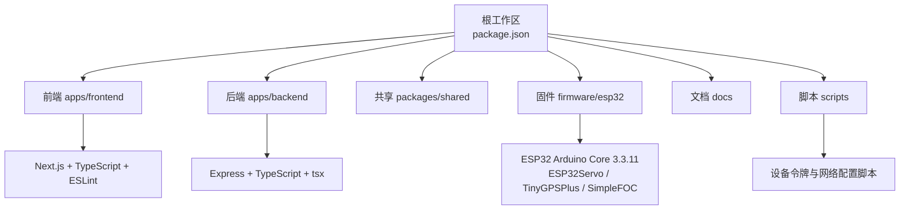
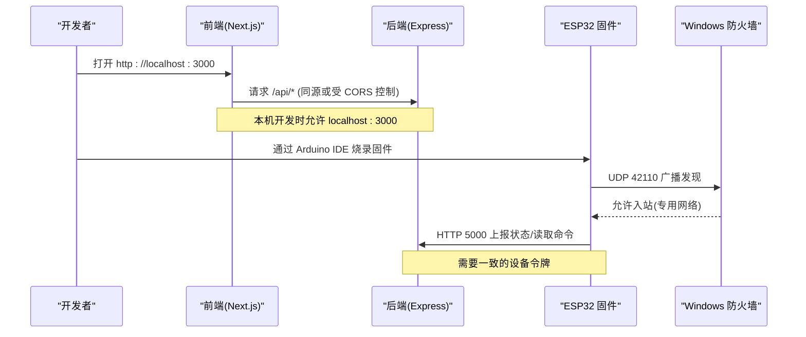
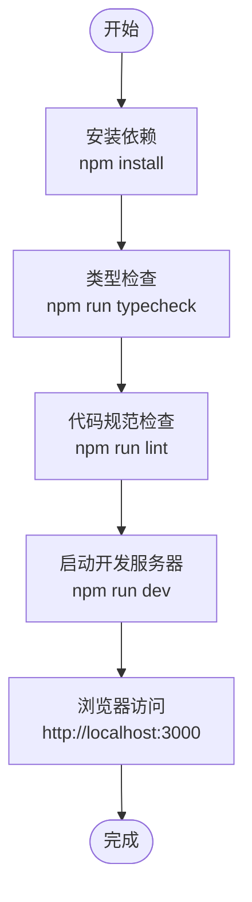
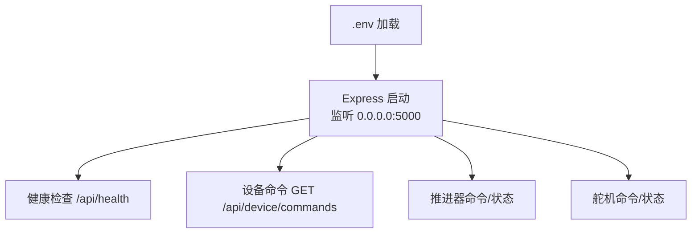
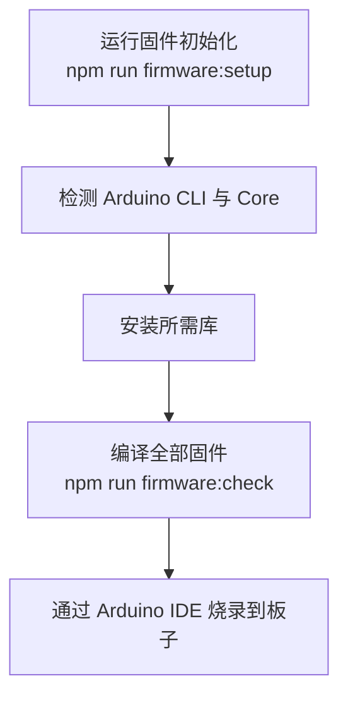
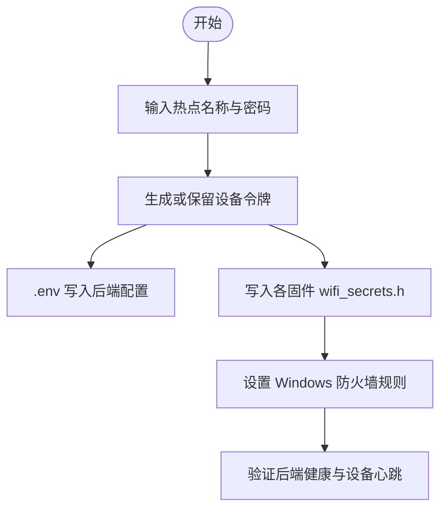
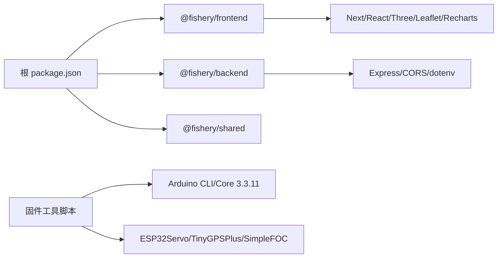

# 开发环境配置

<cite>
**本文引用的文件**
- [README.md](file://fishery-digital-twin-platform/README.md)
- [package.json](file://fishery-digital-twin-platform/package.json)
- [apps/frontend/package.json](file://fishery-digital-twin-platform/apps/frontend/package.json)
- [apps/backend/package.json](file://fishery-digital-twin-platform/apps/backend/package.json)
- [apps/frontend/eslint.config.mjs](file://fishery-digital-twin-platform/apps/frontend/eslint.config.mjs)
- [apps/frontend/tsconfig.json](file://fishery-digital-twin-platform/apps/frontend/tsconfig.json)
- [apps/backend/.env.example](file://fishery-digital-twin-platform/apps/backend/.env.example)
- [firmware/esp32/maker_esp32_pro_servo_temp_01/wifi_secrets.example.h](file://fishery-digital-twin-platform/firmware/esp32/maker_esp32_pro_servo_temp_01/wifi_secrets.example.h)
- [scripts/configure-device-secrets.ps1](file://fishery-digital-twin-platform/scripts/configure-device-secrets.ps1)
- [scripts/configure-windows-network.ps1](file://fishery-digital-twin-platform/scripts/configure-windows-network.ps1)
- [scripts/firmware-tooling.ps1](file://fishery-digital-twin-platform/scripts/firmware-tooling.ps1)
- [docs/hardware-and-firmware.md](file://fishery-digital-twin-platform/docs/hardware-and-firmware.md)
- [docs/security-and-network.md](file://fishery-digital-twin-platform/docs/security-and-network.md)
</cite>

## 目录
1. [简介](#简介)
2. [项目结构](#项目结构)
3. [核心组件](#核心组件)
4. [架构总览](#架构总览)
5. [详细组件分析](#详细组件分析)
6. [依赖关系分析](#依赖关系分析)
7. [性能注意事项](#性能注意事项)
8. [故障排查指南](#故障排查指南)
9. [结论](#结论)
10. [附录](#附录)

## 简介
本文件面向“智慧渔业巡检船数字孪生平台”的开发与调试，目标是帮助开发者在 Windows 环境下快速搭建本地开发、固件编译、网络连通与调试测试的完整工作流。内容覆盖：
- Node.js 与前端/后端开发工具链（TypeScript、ESLint）
- ESP32 固件开发环境（Arduino IDE 2.x、Core 与库版本）
- 网络与安全配置（Windows 防火墙、WiFi 热点、设备令牌）
- 调试与测试（浏览器开发者工具、API 测试、串口调试）
- 开发工作流与团队协作规范

## 项目结构
仓库采用 monorepo 组织方式，包含前端、后端、共享类型、ESP32 固件、文档与自动化脚本等。根级 package.json 通过 workspaces 管理多子项目，并提供统一脚本用于启动、构建、检查、网络配置与固件工具链安装。

图表来源
- [package.json:1-96](file://fishery-digital-twin-platform/package.json#L1-L96)
- [apps/frontend/package.json:1-45](file://fishery-digital-twin-platform/apps/frontend/package.json#L1-L45)
- [apps/backend/package.json:1-27](file://fishery-digital-twin-platform/apps/backend/package.json#L1-L27)
- [scripts/firmware-tooling.ps1:1-75](file://fishery-digital-twin-platform/scripts/firmware-tooling.ps1#L1-L75)

章节来源
- [README.md:16-69](file://fishery-digital-twin-platform/README.md#L16-L69)
- [package.json:1-96](file://fishery-digital-twin-platform/package.json#L1-L96)

## 核心组件
- 前端：基于 Next.js 的 Web 界面，使用 TypeScript 进行类型检查，使用 ESLint 进行代码规范校验。
- 后端：基于 Express 的 API 服务，使用 TypeScript 与 tsx 运行，提供设备命令下发与健康检查接口。
- 固件：ESP32 程序，使用 Arduino IDE 2.x 与指定版本的 Core 和库进行编译与烧录。
- 脚本：统一的 PowerShell 脚本负责设备令牌生成、网络规则设置与固件依赖安装。

章节来源
- [apps/frontend/package.json:1-45](file://fishery-digital-twin-platform/apps/frontend/package.json#L1-L45)
- [apps/backend/package.json:1-27](file://fishery-digital-twin-platform/apps/backend/package.json#L1-L27)
- [scripts/firmware-tooling.ps1:1-75](file://fishery-digital-twin-platform/scripts/firmware-tooling.ps1#L1-L75)
- [scripts/configure-device-secrets.ps1:1-169](file://fishery-digital-twin-platform/scripts/configure-device-secrets.ps1#L1-L169)

## 架构总览
系统由前端页面、后端 API、ESP32 设备组成。前端通过浏览器访问后端；ESP32 通过 WiFi 连接同一局域网，使用 UDP 自动发现后端并访问 HTTP API。Windows 防火墙需放行 TCP 5000 与 UDP 42110。

图表来源
- [README.md:143-179](file://fishery-digital-twin-platform/README.md#L143-L179)
- [docs/security-and-network.md:28-44](file://fishery-digital-twin-platform/docs/security-and-network.md#L28-L44)
- [scripts/configure-windows-network.ps1:42-63](file://fishery-digital-twin-platform/scripts/configure-windows-network.ps1#L42-L63)

## 详细组件分析

### 前端开发环境与代码质量
- Node.js 与包管理器：根配置要求 Node.js 版本范围与 npm 版本范围，确保前后端一致。
- TypeScript：前端启用严格模式与增量编译，路径别名 @/* 指向 src。
- ESLint：基于 Next 官方配置，针对 3D/媒体相关场景关闭部分限制，忽略构建产物与模型目录。
- 脚本：提供 dev/build/start/typecheck/lint 等命令，便于日常开发与 CI。

图表来源
- [apps/frontend/package.json:6-13](file://fishery-digital-twin-platform/apps/frontend/package.json#L6-L13)
- [apps/frontend/tsconfig.json:1-44](file://fishery-digital-twin-platform/apps/frontend/tsconfig.json#L1-L44)
- [apps/frontend/eslint.config.mjs:1-19](file://fishery-digital-twin-platform/apps/frontend/eslint.config.mjs#L1-L19)
- [package.json:16-38](file://fishery-digital-twin-platform/package.json#L16-L38)

章节来源
- [apps/frontend/package.json:1-45](file://fishery-digital-twin-platform/apps/frontend/package.json#L1-L45)
- [apps/frontend/tsconfig.json:1-44](file://fishery-digital-twin-platform/apps/frontend/tsconfig.json#L1-L44)
- [apps/frontend/eslint.config.mjs:1-19](file://fishery-digital-twin-platform/apps/frontend/eslint.config.mjs#L1-L19)

### 后端开发环境与配置
- 运行时：使用 tsx watch 启动开发模式，生产模式使用 tsc 编译后 node 运行。
- 环境变量：端口、主机、发现端口、设备令牌、CORS 与 DeepSeek 相关配置均通过 .env 管理。
- 安全：来自局域网的设备请求必须携带令牌，否则拒绝；本机回环地址可放宽。

图表来源
- [apps/backend/package.json:6-12](file://fishery-digital-twin-platform/apps/backend/package.json#L6-L12)
- [apps/backend/.env.example:1-13](file://fishery-digital-twin-platform/apps/backend/.env.example#L1-L13)
- [docs/security-and-network.md:17-26](file://fishery-digital-twin-platform/docs/security-and-network.md#L17-L26)

章节来源
- [apps/backend/package.json:1-27](file://fishery-digital-twin-platform/apps/backend/package.json#L1-L27)
- [apps/backend/.env.example:1-13](file://fishery-digital-twin-platform/apps/backend/.env.example#L1-L13)
- [docs/security-and-network.md:17-26](file://fishery-digital-twin-platform/docs/security-and-network.md#L17-L26)

### ESP32 固件开发环境
- 工具链：Arduino IDE 2.x，通过脚本自动定位 arduino-cli。
- Core 与库：ESP32 Arduino Core 3.3.11，以及 ESP32Servo 3.2.1、TinyGPSPlus 1.0.3、Simple FOC 2.4.0。
- 编译：脚本支持一键安装依赖与批量编译所有固件入口。
- 设备 ID：不同固件对应不同设备 ID，用于命令路由与状态上报。

图表来源
- [scripts/firmware-tooling.ps1:10-75](file://fishery-digital-twin-platform/scripts/firmware-tooling.ps1#L10-L75)
- [README.md:94-103](file://fishery-digital-twin-platform/README.md#L94-L103)
- [docs/hardware-and-firmware.md:9-58](file://fishery-digital-twin-platform/docs/hardware-and-firmware.md#L9-L58)

章节来源
- [scripts/firmware-tooling.ps1:1-75](file://fishery-digital-twin-platform/scripts/firmware-tooling.ps1#L1-75)
- [README.md:94-141](file://fishery-digital-twin-platform/README.md#L94-L141)
- [docs/hardware-and-firmware.md:9-58](file://fishery-digital-twin-platform/docs/hardware-and-firmware.md#L9-L58)

### 网络环境与安全配置
- 热点要求：电脑与 ESP32 必须连接同一可信热点，且热点不能开启客户端隔离。
- 自动发现：ESP32 通过 UDP 42110 广播发现后端，后端回复/公告来源 IP 被固件采用。
- 防火墙：仅对“专用网络”开放 TCP 5000 与 UDP 42110 入站。
- 令牌管理：后端与固件使用相同令牌；首次运行会生成随机令牌，后续保留除非主动轮换。

图表来源
- [scripts/configure-device-secrets.ps1:85-169](file://fishery-digital-twin-platform/scripts/configure-device-secrets.ps1#L85-L169)
- [scripts/configure-windows-network.ps1:10-75](file://fishery-digital-twin-platform/scripts/configure-windows-network.ps1#L10-L75)
- [docs/security-and-network.md:28-44](file://fishery-digital-twin-platform/docs/security-and-network.md#L28-L44)
- [README.md:143-179](file://fishery-digital-twin-platform/README.md#L143-L179)

章节来源
- [scripts/configure-device-secrets.ps1:1-169](file://fishery-digital-twin-platform/scripts/configure-device-secrets.ps1#L1-L169)
- [scripts/configure-windows-network.ps1:1-75](file://fishery-digital-twin-platform/scripts/configure-windows-network.ps1#L1-L75)
- [docs/security-and-network.md:1-55](file://fishery-digital-twin-platform/docs/security-and-network.md#L1-L55)
- [README.md:143-179](file://fishery-digital-twin-platform/README.md#L143-L179)

### 调试工具与测试环境
- 浏览器开发者工具：用于前端页面调试、网络请求查看与错误日志分析。
- API 测试：可通过浏览器或任意 HTTP 客户端访问后端健康检查与设备命令接口，确认连通性与令牌有效性。
- 串口调试：使用 Arduino IDE 的串口监视器查看固件输出，辅助定位 WiFi 连接、UDP 发现与命令执行问题。
- 诊断脚本：运行项目内置诊断命令，检查后端与固件令牌、WiFi 配置、端口、防火墙、前后端健康与设备心跳。

章节来源
- [README.md:56-69](file://fishery-digital-twin-platform/README.md#L56-L69)
- [docs/hardware-and-firmware.md:177-204](file://fishery-digital-twin-platform/docs/hardware-and-firmware.md#L177-L204)

### 开发工作流与团队协作规范
- 首次在新机器上初始化：安装 Node.js 22+，执行依赖安装、本地设备配置与网络配置，然后启动开发服务。
- 日常开发：直接启动开发服务，使用诊断命令检查环境；修改前端或后端代码后热重载生效。
- 固件更新：每次修改热点信息或令牌后，需重新烧录受影响的 ESP32 固件。
- 质量门禁：提交前执行代码规范检查、类型检查、测试与构建；必要时运行安全审计。
- 协作建议：
  - 不要提交敏感配置文件（.env、wifi_secrets.h）。
  - 保持 Core 与库版本一致，避免团队环境差异。
  - 变更网络或令牌时通知团队成员重新烧录设备。
  - 使用统一脚本进行环境准备，减少人为失误。

章节来源
- [README.md:36-63](file://fishery-digital-twin-platform/README.md#L36-L63)
- [README.md:197-205](file://fishery-digital-twin-platform/README.md#L197-L205)
- [docs/security-and-network.md:1-16](file://fishery-digital-twin-platform/docs/security-and-network.md#L1-L16)

## 依赖关系分析
- Node.js 与 npm：根工作区限定版本范围，保证前后端一致性。
- 前端依赖：Next.js、React、Three.js、Leaflet、Recharts 等用于 3D、地图与可视化。
- 后端依赖：Express、CORS、dotenv 用于 API 与服务配置。
- 固件依赖：ESP32 Arduino Core 与若干库，由脚本统一管理安装与编译。

图表来源
- [package.json:1-96](file://fishery-digital-twin-platform/package.json#L1-L96)
- [apps/frontend/package.json:14-43](file://fishery-digital-twin-platform/apps/frontend/package.json#L14-L43)
- [apps/backend/package.json:13-25](file://fishery-digital-twin-platform/apps/backend/package.json#L13-L25)
- [scripts/firmware-tooling.ps1:37-58](file://fishery-digital-twin-platform/scripts/firmware-tooling.ps1#L37-L58)

章节来源
- [package.json:1-96](file://fishery-digital-twin-platform/package.json#L1-L96)
- [apps/frontend/package.json:14-43](file://fishery-digital-twin-platform/apps/frontend/package.json#L14-L43)
- [apps/backend/package.json:13-25](file://fishery-digital-twin-platform/apps/backend/package.json#L13-L25)
- [scripts/firmware-tooling.ps1:37-58](file://fishery-digital-twin-platform/scripts/firmware-tooling.ps1#L37-L58)

## 性能注意事项
- 前端构建与类型检查：使用增量编译与严格模式，有助于早期发现问题并提升迭代速度。
- 后端监听地址：默认监听 0.0.0.0，便于局域网设备访问；同时通过 CORS 与令牌限制外部滥用。
- 固件轮询策略：固件仅在目标角度变化时更新 PWM，避免重复写入造成网络与资源浪费。
- 推杆保护：固件提供缓启动、断网停止、急停与冷却机制，防止长时间运行导致过热或损坏。

章节来源
- [apps/frontend/tsconfig.json:1-44](file://fishery-digital-twin-platform/apps/frontend/tsconfig.json#L1-L44)
- [apps/backend/.env.example:1-13](file://fishery-digital-twin-platform/apps/backend/.env.example#L1-L13)
- [docs/hardware-and-firmware.md:85-117](file://fishery-digital-twin-platform/docs/hardware-and-firmware.md#L85-L117)

## 故障排查指南
- 无法访问后端：检查是否运行了开发服务、IP 是否为当前 WLAN IPv4、防火墙是否放行 TCP 5000。
- 设备无法发现后端：确认热点未开启客户端隔离、电脑与设备在同一 WiFi、UDP 42110 已放行。
- 令牌不一致：若更换令牌，需重新烧录所有使用该令牌的 ESP32 固件。
- 传感器或执行机构异常：先单路空载测试，逐步接入；出现抖动或发热立即断电检查供电与接线。
- 使用诊断命令：运行项目内置诊断，检查后端与固件令牌、WiFi 配置、端口、防火墙、前后端健康与设备心跳。

章节来源
- [docs/hardware-and-firmware.md:177-204](file://fishery-digital-twin-platform/docs/hardware-and-firmware.md#L177-L204)
- [README.md:56-63](file://fishery-digital-twin-platform/README.md#L56-L63)
- [docs/security-and-network.md:28-44](file://fishery-digital-twin-platform/docs/security-and-network.md#L28-L44)

## 结论
通过统一的脚本与明确的配置约定，本项目能够在 Windows 环境下快速搭建前端、后端与 ESP32 固件的开发与调试环境。遵循本文档的步骤与规范，可有效降低环境差异带来的问题，提高团队协作效率与交付质量。

## 附录

### 常用命令速查
- 安装依赖与初始化：npm install、npm run setup:local
- 启动开发服务：npm run dev
- 诊断环境：npm run doctor
- 固件工具链：npm run firmware:setup、npm run firmware:check
- 网络配置：npm run setup:network
- 代码质量：npm run lint、npm test、npm run typecheck、npm run build

章节来源
- [README.md:36-63](file://fishery-digital-twin-platform/README.md#L36-L63)
- [package.json:16-38](file://fishery-digital-twin-platform/package.json#L16-L38)