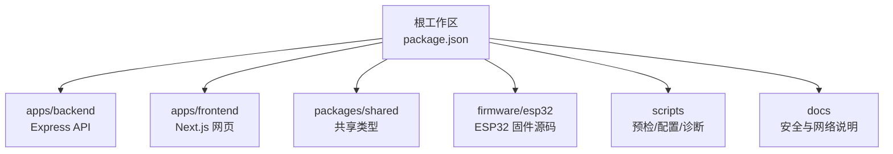
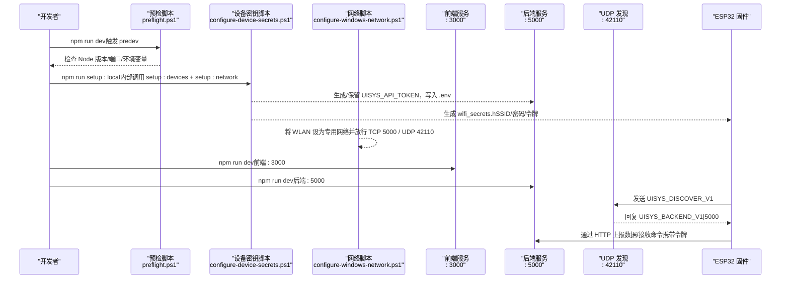
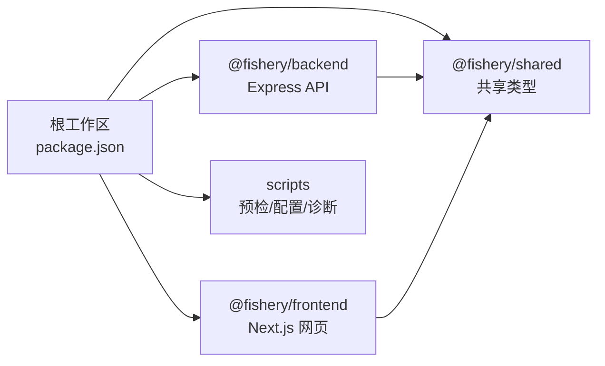

# 快速开始指南

<cite>
**本文引用的文件**
- [README.md](file://fishery-digital-twin-platform/README.md)
- [package.json（根工作区）](file://fishery-digital-twin-platform/package.json)
- [apps/backend/package.json](file://fishery-digital-twin-platform/apps/backend/package.json)
- [apps/frontend/package.json](file://fishery-digital-twin-platform/apps/frontend/package.json)
- [scripts/preflight.ps1](file://fishery-digital-twin-platform/scripts/preflight.ps1)
- [scripts/configure-device-secrets.ps1](file://fishery-digital-twin-platform/scripts/configure-device-secrets.ps1)
- [scripts/configure-windows-network.ps1](file://fishery-digital-twin-platform/scripts/configure-windows-network.ps1)
- [apps/backend/src/index.ts](file://fishery-digital-twin-platform/apps/backend/src/index.ts)
- [docs/security-and-network.md](file://fishery-digital-twin-platform/docs/security-and-network.md)
</cite>

## 目录
1. [简介](#简介)
2. [项目结构](#项目结构)
3. [核心组件](#核心组件)
4. [架构总览](#架构总览)
5. [详细组件分析](#详细组件分析)
6. [依赖关系分析](#依赖关系分析)
7. [性能与启动建议](#性能与启动建议)
8. [故障排查指南](#故障排查指南)
9. [结论](#结论)
10. [附录：常用命令速查](#附录：常用命令速查)

## 简介
本指南面向首次接触“智慧渔业巡检船数字孪生平台”的新用户，目标是在最短时间内完成环境搭建、网络与安全配置，并成功运行开发模式或生产模式，访问前端页面与后端接口。内容涵盖 Node.js 版本要求、依赖安装、本地初始化、WiFi 热点配置、令牌生成、Windows 防火墙设置、诊断命令以及常见问题处理。

## 项目结构
仓库采用 Monorepo 组织方式，包含前后端应用、共享类型包、固件脚本与文档：
- apps/backend：Express 后端，提供设备数据、AI 报告、舵机与推进器控制、GPS 状态等接口，并实现 UDP 自动发现。
- apps/frontend：Next.js 前端，提供 3D 船模、环境监测、导航、设备健康、操作日志等页面。
- packages/shared：前后端共享的 TypeScript 类型定义。
- firmware/esp32：ESP32 相关固件源码与示例密钥模板。
- scripts：预检、设备密钥同步、网络规则配置、固件工具等自动化脚本。
- docs：安全与网络说明、最终检查清单等。

**图表来源**
- [package.json（根工作区）:1-38](file://fishery-digital-twin-platform/package.json#L1-L38)

**章节来源**
- [README.md:16-28](file://fishery-digital-twin-platform/README.md#L16-L28)
- [package.json（根工作区）:1-38](file://fishery-digital-twin-platform/package.json#L1-L38)

## 核心组件
- 后端服务：监听 TCP 5000，暴露 REST 接口；同时监听 UDP 42110 用于 ESP32 自动发现，并向客户端端口广播后端地址。
- 前端服务：监听 TCP 3000，提供 Web 界面与健康检查接口。
- 设备通信：ESP32 通过同一 WiFi 热点连接电脑，使用 UDP 自动发现后端 HTTP 端口，并通过 HTTP 上报传感器数据与控制指令。
- 安全机制：局域网控制请求需携带令牌（X-UISYS-Token），本机回环地址可直接访问。
- 预检与诊断：启动前检查 Node 版本、端口占用、环境变量；运行时检查前后端健康与设备在线状态。

**章节来源**
- [apps/backend/src/index.ts:46-76](file://fishery-digital-twin-platform/apps/backend/src/index.ts#L46-L76)
- [apps/backend/src/index.ts:101-157](file://fishery-digital-twin-platform/apps/backend/src/index.ts#L101-L157)
- [apps/backend/src/index.ts:271-318](file://fishery-digital-twin-platform/apps/backend/src/index.ts#L271-L318)
- [scripts/preflight.ps1:66-153](file://fishery-digital-twin-platform/scripts/preflight.ps1#L66-L153)

## 架构总览
下图展示了首次启动到设备接入的整体流程：预检脚本校验环境与端口，设备密钥脚本生成令牌并写入后端与环境变量，网络脚本开放防火墙规则，随后前后端并行启动，ESP32 通过 UDP 自动发现后端并建立通信。

**图表来源**
- [package.json（根工作区）:16-38](file://fishery-digital-twin-platform/package.json#L16-L38)
- [scripts/configure-device-secrets.ps1:85-169](file://fishery-digital-twin-platform/scripts/configure-device-secrets.ps1#L85-L169)
- [scripts/configure-windows-network.ps1:10-63](file://fishery-digital-twin-platform/scripts/configure-windows-network.ps1#L10-L63)
- [apps/backend/src/index.ts:271-318](file://fishery-digital-twin-platform/apps/backend/src/index.ts#L271-L318)

## 详细组件分析

### 环境准备与依赖安装
- Node.js 版本要求：根工作区声明引擎范围为 Node >=22.20 <25，推荐使用 Node.js 22。
- 安装依赖：在项目根目录执行 npm install，安装 monorepo 中所有子包的依赖。
- 构建与类型检查：可运行 npm run build 与 npm run typecheck 进行编译与类型检查（非必须）。

**章节来源**
- [package.json（根工作区）:7-10](file://fishery-digital-twin-platform/package.json#L7-L10)
- [package.json（根工作区）:21-24](file://fishery-digital-twin-platform/package.json#L21-L24)

### 首次启动流程
推荐按以下顺序执行：
1. npm install：安装全部依赖。
2. npm run setup:local：内部依次执行设备密钥配置与网络权限设置。
   - setup:devices：交互式输入热点名称与密码，生成或保留令牌，写入后端 .env 与各固件 wifi_secrets.h。
   - setup:network：以管理员权限将当前 WLAN 设为专用网络，并添加 TCP 5000 与 UDP 42110 入站规则。
3. npm run dev：并行启动后端与前端。
   - 后端监听 http://localhost:5000。
   - 前端监听 http://localhost:3000。

注意事项：
- 首次运行会询问热点名称和密码；令牌默认保留，除非显式旋转。
- 若仅桌面版缺少令牌，可使用 npm run setup:desktop 同步令牌而不修改热点信息。
- 完成后需重新烧录受影响的 ESP32 固件以应用新令牌与热点配置。

**章节来源**
- [README.md:36-54](file://fishery-digital-twin-platform/README.md#L36-L54)
- [package.json（根工作区）:16-32](file://fishery-digital-twin-platform/package.json#L16-L32)
- [scripts/configure-device-secrets.ps1:85-169](file://fishery-digital-twin-platform/scripts/configure-device-secrets.ps1#L85-L169)
- [scripts/configure-windows-network.ps1:10-63](file://fishery-digital-twin-platform/scripts/configure-windows-network.ps1#L10-L63)

### WiFi 热点配置与令牌生成
- 热点要求：电脑与所有 ESP32 必须连接同一可信热点，且热点不能启用客户端隔离。
- 令牌生成：setup:devices 会生成或保留一个足够长的随机令牌，写入后端 .env 与固件 wifi_secrets.h。
- 令牌一致性：后端与所有固件中的令牌必须一致；不一致会导致设备无法控制或被拒绝。
- 令牌旋转：仅在准备重新烧录全部设备时使用 setup:devices:rotate，避免已烧录设备突然失效。

**章节来源**
- [README.md:143-171](file://fishery-digital-twin-platform/README.md#L143-L171)
- [docs/security-and-network.md:3-26](file://fishery-digital-twin-platform/docs/security-and-network.md#L3-L26)
- [scripts/configure-device-secrets.ps1:20-30](file://fishery-digital-twin-platform/scripts/configure-device-secrets.ps1#L20-L30)
- [scripts/configure-device-secrets.ps1:102-116](file://fishery-digital-twin-platform/scripts/configure-device-secrets.ps1#L102-L116)

### 网络权限设置（Windows 防火墙）
- 目的：允许 ESP32 通过 UDP 42110 自动发现后端，并通过 TCP 5000 访问 API。
- 方法：运行 npm run setup:network，脚本将以管理员权限将 WLAN 设为专用网络，并创建最小范围的入站规则。
- 验证：可通过 netsh advfirewall firewall show rule name="Fishery Platform API TCP 5000" 查看规则是否生效。

**章节来源**
- [scripts/configure-windows-network.ps1:10-63](file://fishery-digital-twin-platform/scripts/configure-windows-network.ps1#L10-L63)
- [scripts/preflight.ps1:145-148](file://fishery-digital-twin-platform/scripts/preflight.ps1#L145-L148)

### 开发模式与生产模式
- 开发模式：npm run dev，并行启动后端与前端，适合调试与热更新。
- 生产模式：先 npm run build 构建，再 npm run start 启动，适合比赛展示或长时间运行。

**章节来源**
- [README.md:71-76](file://fishery-digital-twin-platform/README.md#L71-L76)
- [package.json（根工作区）:18-26](file://fishery-digital-twin-platform/package.json#L18-L26)

### 常用诊断命令
- npm run doctor：运行时诊断，检查前后端健康、设备在线状态、端口占用与防火墙规则。
- npm run lint / npm test / npm run typecheck / npm run build：代码质量与构建检查。
- 查看 WLAN IPv4：ipconfig | findstr IPv4。
- 查看保存的 WiFi 名称：netsh wlan show profiles。

**章节来源**
- [README.md:56-69](file://fishery-digital-twin-platform/README.md#L56-L69)
- [scripts/preflight.ps1:116-153](file://fishery-digital-twin-platform/scripts/preflight.ps1#L116-L153)

## 依赖关系分析
- 根工作区通过 workspaces 管理 apps/* 与 packages/* 子包。
- 后端依赖 Express、CORS、dotenv；前端依赖 Next.js、Three.js、TensorFlow.js 等。
- 预检脚本在 before-start 阶段检查 Node 版本与端口可用性；在 runtime 阶段检查前后端健康与设备状态。

**图表来源**
- [package.json（根工作区）:11-15](file://fishery-digital-twin-platform/package.json#L11-L15)
- [apps/backend/package.json:13-25](file://fishery-digital-twin-platform/apps/backend/package.json#L13-L25)
- [apps/frontend/package.json:14-43](file://fishery-digital-twin-platform/apps/frontend/package.json#L14-L43)

**章节来源**
- [package.json（根工作区）:11-15](file://fishery-digital-twin-platform/package.json#L11-L15)
- [apps/backend/package.json:1-27](file://fishery-digital-twin-platform/apps/backend/package.json#L1-L27)
- [apps/frontend/package.json:1-45](file://fishery-digital-twin-platform/apps/frontend/package.json#L1-L45)

## 性能与启动建议
- 开发模式建议使用 npm run dev，便于热更新与调试。
- 生产模式建议使用 npm run build 后 npm run start，减少开发时开销。
- 确保 Node.js 版本满足要求，避免兼容性问题。
- 保持热点稳定且无客户端隔离，保证设备通信顺畅。

[本节为通用指导，不直接分析具体文件]

## 故障排查指南
- 端口被占用：predev 会检查 3000、5000、42110 是否可用；如有占用，请停止旧进程后再启动。
- 后端不可达：确认 .env 存在且 HOST=0.0.0.0，UISYS_API_TOKEN 长度足够；检查防火墙规则是否创建。
- 设备离线：检查热点 SSID/密码是否正确、令牌是否一致、ESP32 是否重新烧录；通过 npm run doctor 查看设备在线状态。
- 令牌不一致：若更换热点或令牌，需重新烧录受影响固件；必要时使用 setup:devices:rotate 旋转令牌。
- 桌面版令牌不同步：运行 npm run setup:desktop 同步令牌，不影响已烧录设备。

**章节来源**
- [scripts/preflight.ps1:116-153](file://fishery-digital-twin-platform/scripts/preflight.ps1#L116-L153)
- [scripts/configure-device-secrets.ps1:102-116](file://fishery-digital-twin-platform/scripts/configure-device-secrets.ps1#L102-L116)
- [docs/security-and-network.md:28-50](file://fishery-digital-twin-platform/docs/security-and-network.md#L28-L50)

## 结论
按照本指南完成 Node.js 安装、依赖安装、本地初始化、WiFi 与令牌配置、防火墙设置后，即可通过 npm run dev 启动开发模式，或通过 npm run build 与 npm run start 进入生产模式。使用 npm run doctor 进行诊断，结合常见故障排查步骤，可快速定位并解决问题，确保平台稳定运行。

[本节为总结性内容，不直接分析具体文件]

## 附录：常用命令速查
- 安装依赖：npm install
- 本地初始化：npm run setup:local
- 启动开发模式：npm run dev
- 启动生产模式：npm run build && npm run start
- 仅同步桌面令牌：npm run setup:desktop
- 旋转令牌并重新烧录设备：npm run setup:devices:rotate
- 运行诊断：npm run doctor
- 代码质量检查：npm run lint / npm test / npm run typecheck / npm run build

**章节来源**
- [README.md:36-76](file://fishery-digital-twin-platform/README.md#L36-L76)
- [package.json（根工作区）:16-38](file://fishery-digital-twin-platform/package.json#L16-L38)