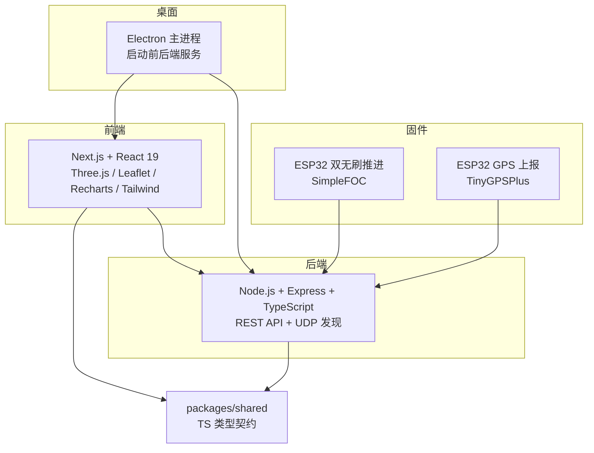
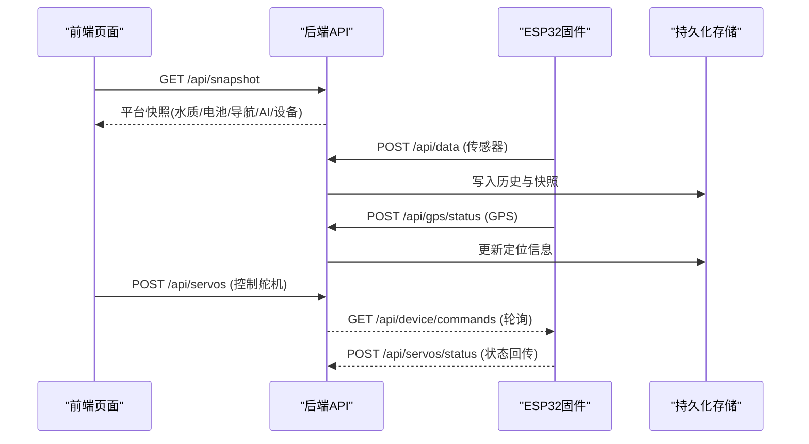
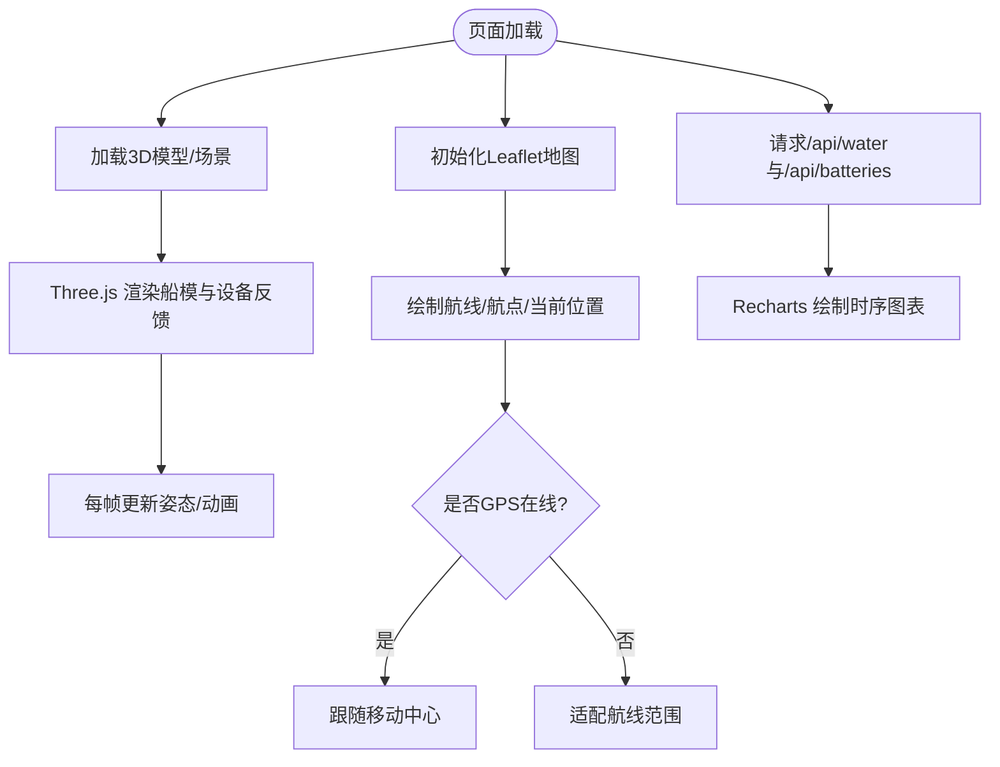
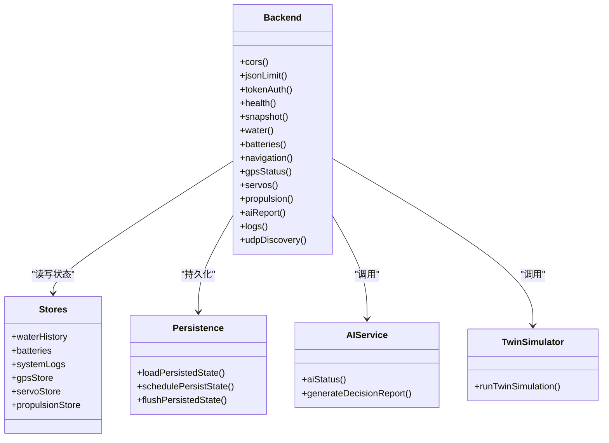
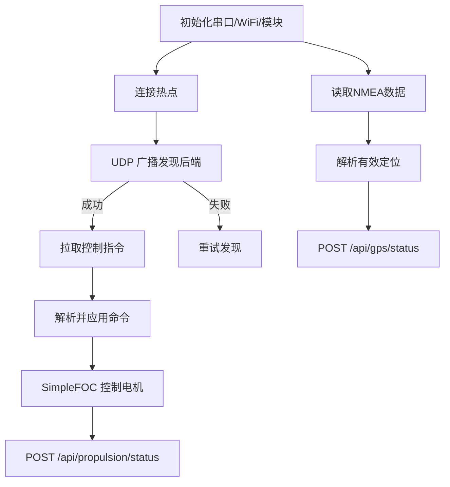
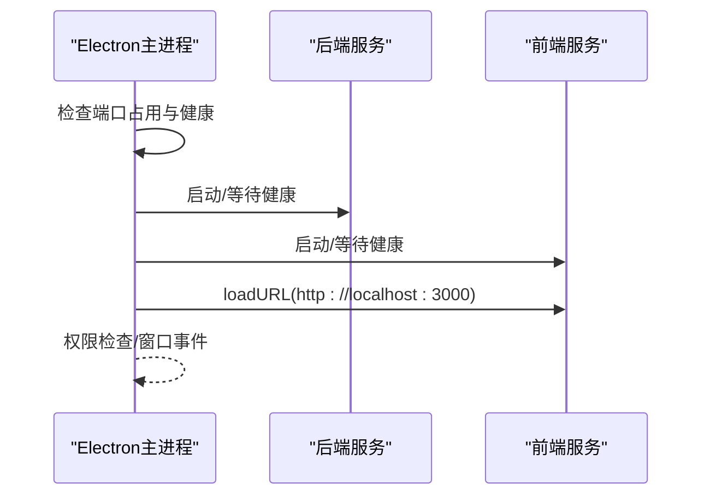
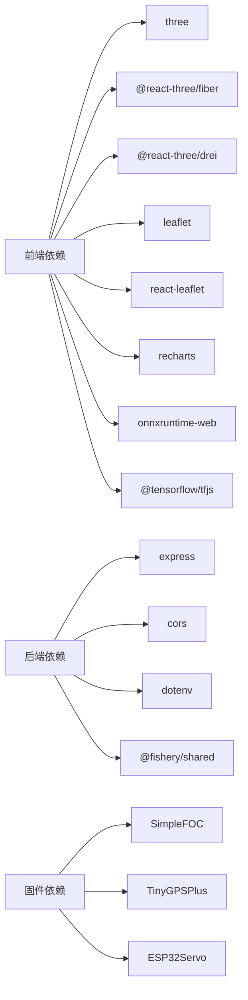

# 技术栈概览

<cite>
**本文引用的文件**
- [README.md](file://fishery-digital-twin-platform/README.md)
- [package.json](file://fishery-digital-twin-platform/package.json)
- [apps/backend/package.json](file://fishery-digital-twin-platform/apps/backend/package.json)
- [apps/frontend/package.json](file://fishery-digital-twin-platform/apps/frontend/package.json)
- [apps/backend/src/index.ts](file://fishery-digital-twin-platform/apps/backend/src/index.ts)
- [apps/desktop/main.cjs](file://fishery-digital-twin-platform/apps/desktop/main.cjs)
- [apps/frontend/src/components/three/BoatTwinScene.tsx](file://fishery-digital-twin-platform/apps/frontend/src/components/three/BoatTwinScene.tsx)
- [apps/frontend/src/components/map/NavigationMap.tsx](file://fishery-digital-twin-platform/apps/frontend/src/components/map/NavigationMap.tsx)
- [apps/frontend/tailwind.config.mjs](file://fishery-digital-twin-platform/apps/frontend/tailwind.config.mjs)
- [apps/frontend/next.config.mjs](file://fishery-digital-twin-platform/apps/frontend/next.config.mjs)
- [firmware/esp32/esp32_simplefoc_dual_propulsion/esp32_simplefoc_dual_propulsion.ino](file://fishery-digital-twin-platform/firmware/esp32/esp32_simplefoc_dual_propulsion/esp32_simplefoc_dual_propulsion.ino)
- [firmware/esp32/maker_esp32_pro_gps_only/maker_esp32_pro_gps_only.ino](file://fishery-digital-twin-platform/firmware/esp32/maker_esp32_pro_gps_only/maker_esp32_pro_gps_only.ino)
- [packages/shared/src/index.ts](file://fishery-digital-twin-platform/packages/shared/src/index.ts)
</cite>

## 目录
1. [简介](#简介)
2. [项目结构](#项目结构)
3. [核心组件](#核心组件)
4. [架构总览](#架构总览)
5. [详细组件分析](#详细组件分析)
6. [依赖关系分析](#依赖关系分析)
7. [性能考量](#性能考量)
8. [故障排查指南](#故障排查指南)
9. [结论](#结论)
10. [附录：学习路径与选型依据](#附录学习路径与选型依据)

## 简介
本技术栈概览面向智慧渔业巡检船数字孪生平台，覆盖前端、后端、嵌入式固件与桌面应用四个层面。平台以 Next.js + React 19 构建交互式仪表盘，使用 Three.js 实现三维船模与设备可视化，Leaflet 展示导航地图，Recharts 呈现水质与环境数据图表；后端采用 Node.js + Express + TypeScript 提供 RESTful API，并内置 UDP 自动发现机制；嵌入式固件基于 Arduino ESP32，使用 SimpleFOC 控制无刷推进电机，TinyGPSPlus 解析 GPS 数据；桌面应用通过 Electron 打包，统一启动前后端服务并提供本地运行体验。

## 项目结构
仓库采用 monorepo 组织方式，包含 apps（backend、frontend、desktop）、packages（shared 类型共享）、firmware（ESP32 固件）与 docs（文档）。根 package.json 定义工作区、脚本与 Electron 打包配置；各子应用独立维护依赖与构建脚本。

**图示来源**
- [package.json:1-96](file://fishery-digital-twin-platform/package.json#L1-L96)
- [apps/backend/src/index.ts:56-110](file://fishery-digital-twin-platform/apps/backend/src/index.ts#L56-L110)
- [apps/desktop/main.cjs:1-202](file://fishery-digital-twin-platform/apps/desktop/main.cjs#L1-L202)
- [firmware/esp32/esp32_simplefoc_dual_propulsion/esp32_simplefoc_dual_propulsion.ino:1-722](file://fishery-digital-twin-platform/firmware/esp32/esp32_simplefoc_dual_propulsion/esp32_simplefoc_dual_propulsion.ino#L1-L722)
- [firmware/esp32/maker_esp32_pro_gps_only/maker_esp32_pro_gps_only.ino:1-366](file://fishery-digital-twin-platform/firmware/esp32/maker_esp32_pro_gps_only/maker_esp32_pro_gps_only.ino#L1-L366)

**章节来源**
- [README.md:16-28](file://fishery-digital-twin-platform/README.md#L16-L28)
- [package.json:1-96](file://fishery-digital-twin-platform/package.json#L1-L96)

## 核心组件
- 前端（Next.js + React 19）
  - 3D 渲染：Three.js + @react-three/fiber/drei，承载船模、设备反馈与仿真预览
  - 地图：Leaflet + react-leaflet，支持在线瓦片与离线底图回退
  - 图表：Recharts，用于水质与环境指标时序展示
  - 样式：Tailwind CSS，自定义主题色板与阴影
  - 构建：Next.js standalone 输出，开发时分离缓存目录
- 后端（Node.js + Express + TypeScript）
  - REST API：水质、电池、导航、AI 报告、舵机、推进器、日志等接口
  - 安全：CORS 白名单、局域网令牌校验、请求体大小限制
  - 设备接入：UDP 自动发现（端口 42110），HTTP 上报（传感器/GPS/设备状态）
  - 持久化：平台快照、日志、AI 报告落盘
- 嵌入式固件（Arduino ESP32）
  - 推进控制：SimpleFOC 驱动双无刷电机，含电流采样、编码器可选、速度开环/闭环模式
  - GPS 上报：TinyGPSPlus 解析 NMEA，定时 POST 到后端
  - 网络：WiFi STA，UDP 广播发现后端，HTTP 拉取命令并上报状态
- 桌面应用（Electron）
  - 主进程：单实例、权限控制、健康检查、启动/停止前后端子进程
  - 打包：electron-builder 生成 NSIS 安装包，资源与运行时隔离

**章节来源**
- [apps/frontend/package.json:14-42](file://fishery-digital-twin-platform/apps/frontend/package.json#L14-L42)
- [apps/frontend/next.config.mjs:8-16](file://fishery-digital-twin-platform/apps/frontend/next.config.mjs#L8-L16)
- [apps/frontend/tailwind.config.mjs:9-69](file://fishery-digital-twin-platform/apps/frontend/tailwind.config.mjs#L9-L69)
- [apps/backend/package.json:13-25](file://fishery-digital-twin-platform/apps/backend/package.json#L13-L25)
- [apps/backend/src/index.ts:101-110](file://fishery-digital-twin-platform/apps/backend/src/index.ts#L101-L110)
- [apps/backend/src/index.ts:271-318](file://fishery-digital-twin-platform/apps/backend/src/index.ts#L271-L318)
- [firmware/esp32/esp32_simplefoc_dual_propulsion/esp32_simplefoc_dual_propulsion.ino:132-147](file://fishery-digital-twin-platform/firmware/esp32/esp32_simplefoc_dual_propulsion/esp32_simplefoc_dual_propulsion.ino#L132-L147)
- [firmware/esp32/maker_esp32_pro_gps_only/maker_esp32_pro_gps_only.ino:51-53](file://fishery-digital-twin-platform/firmware/esp32/maker_esp32_pro_gps_only/maker_esp32_pro_gps_only.ino#L51-L53)
- [apps/desktop/main.cjs:1-202](file://fishery-digital-twin-platform/apps/desktop/main.cjs#L1-L202)

## 架构总览
系统由“前端界面层 + 后端服务层 + 设备固件层 + 桌面封装层”构成。前端通过 REST API 获取数据并渲染 3D/地图/图表；后端聚合传感器、GPS、设备状态，提供 AI 报告与数字孪生推演；ESP32 固件通过 UDP 自动发现后端并周期性上报数据或拉取控制指令；Electron 作为桌面入口统一管理前后端生命周期。

**图示来源**
- [apps/backend/src/index.ts:322-557](file://fishery-digital-twin-platform/apps/backend/src/index.ts#L322-L557)
- [firmware/esp32/esp32_simplefoc_dual_propulsion/esp32_simplefoc_dual_propulsion.ino:476-506](file://fishery-digital-twin-platform/firmware/esp32/esp32_simplefoc_dual_propulsion/esp32_simplefoc_dual_propulsion.ino#L476-L506)
- [firmware/esp32/maker_esp32_pro_gps_only/maker_esp32_pro_gps_only.ino:313-355](file://fishery-digital-twin-platform/firmware/esp32/maker_esp32_pro_gps_only/maker_esp32_pro_gps_only.ino#L313-L355)

## 详细组件分析

### 前端技术栈
- Next.js + React 19
  - 职责：页面路由、SSR/客户端渲染、热重载、静态资源管理
  - 版本兼容：React 19 通过根包 overrides 锁定版本，确保与 @types/react 一致
  - 集成方式：standalone 输出便于部署；开发期使用 .next-dev 避免与生产缓存冲突
- Three.js 3D 渲染
  - 职责：加载 GLTF 船模、设备反馈可视化（舵机角度、电机功率、执行机构伸缩）、仿真轨迹与水面效果
  - 集成方式：@react-three/fiber 管理 Canvas 与帧循环，@react-three/drei 提供 OrbitControls、useGLTF 等工具
- Leaflet 地图库
  - 职责：显示实时位置、航点与航线；支持瓦片失败时切换为离线 SVG 底图
  - 集成方式：react-leaflet 封装 MapContainer/Marker/Polyline；FollowPosition/FitRoute 处理视图跟随与适配
- Recharts 图表库
  - 职责：绘制水质与环境指标时序曲线，辅助趋势判断
  - 集成方式：在仪表盘页面中消费后端 /api/water 数据
- Tailwind CSS 样式框架
  - 职责：原子化样式、主题色板、阴影与背景渐变
  - 集成方式：tailwind.config.mjs 扩展 app/ink/harbor/mist/sage/sand/ocean 色系，content 指向 src/**/*.{ts,tsx}

**图示来源**
- [apps/frontend/src/components/three/BoatTwinScene.tsx:1-800](file://fishery-digital-twin-platform/apps/frontend/src/components/three/BoatTwinScene.tsx#L1-L800)
- [apps/frontend/src/components/map/NavigationMap.tsx:27-86](file://fishery-digital-twin-platform/apps/frontend/src/components/map/NavigationMap.tsx#L27-L86)
- [apps/frontend/tailwind.config.mjs:9-69](file://fishery-digital-twin-platform/apps/frontend/tailwind.config.mjs#L9-L69)
- [apps/frontend/next.config.mjs:8-16](file://fishery-digital-twin-platform/apps/frontend/next.config.mjs#L8-L16)

**章节来源**
- [apps/frontend/package.json:14-42](file://fishery-digital-twin-platform/apps/frontend/package.json#L14-L42)
- [apps/frontend/src/components/three/BoatTwinScene.tsx:1-800](file://fishery-digital-twin-platform/apps/frontend/src/components/three/BoatTwinScene.tsx#L1-L800)
- [apps/frontend/src/components/map/NavigationMap.tsx:1-137](file://fishery-digital-twin-platform/apps/frontend/src/components/map/NavigationMap.tsx#L1-L137)
- [apps/frontend/tailwind.config.mjs:1-72](file://fishery-digital-twin-platform/apps/frontend/tailwind.config.mjs#L1-L72)
- [apps/frontend/next.config.mjs:1-18](file://fishery-digital-twin-platform/apps/frontend/next.config.mjs#L1-L18)

### 后端技术栈
- Node.js + Express + TypeScript
  - 职责：REST API、CORS、令牌鉴权、数据持久化、AI 报告、数字孪生推演、设备状态聚合
  - 版本兼容：Express 4.x、TypeScript 5.x、dotenv 环境变量注入
  - 集成方式：监听 HTTP 端口与 UDP 发现端口；按设备 ID 区分舵机/推进器/GPS 数据流
- 安全与访问控制
  - CORS 白名单默认允许 localhost:3000；局域网控制接口要求 X-UISYS-Token
  - 请求体限制 1MB，错误中间件统一返回 JSON 错误
- 设备通信
  - UDP 自动发现：后端监听 42110，响应 UISYS_DISCOVER_V1，广播本机端口
  - 设备上报：POST /api/data（传感器）、/api/gps/status（GPS）、/api/servos/status、/api/propulsion/status
  - 设备拉取：GET /api/device/commands、/api/propulsion/commands

**图示来源**
- [apps/backend/src/index.ts:56-110](file://fishery-digital-twin-platform/apps/backend/src/index.ts#L56-L110)
- [apps/backend/src/index.ts:112-195](file://fishery-digital-twin-platform/apps/backend/src/index.ts#L112-L195)
- [apps/backend/src/index.ts:271-318](file://fishery-digital-twin-platform/apps/backend/src/index.ts#L271-L318)
- [apps/backend/src/index.ts:322-557](file://fishery-digital-twin-platform/apps/backend/src/index.ts#L322-L557)

**章节来源**
- [apps/backend/package.json:13-25](file://fishery-digital-twin-platform/apps/backend/package.json#L13-L25)
- [apps/backend/src/index.ts:56-599](file://fishery-digital-twin-platform/apps/backend/src/index.ts#L56-L599)

### 嵌入式固件技术栈
- Arduino ESP32
  - 职责：连接 WiFi、UDP 自动发现后端、HTTP 上报传感器/GPS/设备状态、拉取控制指令
  - 版本兼容：ESP32 Core 3.3.11、ESP32Servo 3.2.1、TinyGPSPlus 1.0.3、SimpleFOC 2.4.0
- SimpleFOC
  - 职责：BLDC 电机控制（速度开环/闭环）、PWM 驱动、电流采样、编码器可选
  - 集成方式：BLDCMotor + BLDCDriver3PWM，参数包括极对数、电压限幅、最大转速、死区与斜坡步进
- TinyGPSPlus
  - 职责：解析 NMEA 语句，提取经纬度、卫星数、HDOP、高度、速度与航向
  - 集成方式：HardwareSerial 读取 GPS TX，周期上报至后端 /api/gps/status

**图示来源**
- [firmware/esp32/esp32_simplefoc_dual_propulsion/esp32_simplefoc_dual_propulsion.ino:204-236](file://fishery-digital-twin-platform/firmware/esp32/esp32_simplefoc_dual_propulsion/esp32_simplefoc_dual_propulsion.ino#L204-L236)
- [firmware/esp32/esp32_simplefoc_dual_propulsion/esp32_simplefoc_dual_propulsion.ino:326-474](file://fishery-digital-twin-platform/firmware/esp32/esp32_simplefoc_dual_propulsion/esp32_simplefoc_dual_propulsion.ino#L326-L474)
- [firmware/esp32/esp32_simplefoc_dual_propulsion/esp32_simplefoc_dual_propulsion.ino:476-700](file://fishery-digital-twin-platform/firmware/esp32/esp32_simplefoc_dual_propulsion/esp32_simplefoc_dual_propulsion.ino#L476-L700)
- [firmware/esp32/maker_esp32_pro_gps_only/maker_esp32_pro_gps_only.ino:82-116](file://fishery-digital-twin-platform/firmware/esp32/maker_esp32_pro_gps_only/maker_esp32_pro_gps_only.ino#L82-L116)
- [firmware/esp32/maker_esp32_pro_gps_only/maker_esp32_pro_gps_only.ino:144-263](file://fishery-digital-twin-platform/firmware/esp32/maker_esp32_pro_gps_only/maker_esp32_pro_gps_only.ino#L144-L263)
- [firmware/esp32/maker_esp32_pro_gps_only/maker_esp32_pro_gps_only.ino:313-355](file://fishery-digital-twin-platform/firmware/esp32/maker_esp32_pro_gps_only/maker_esp32_pro_gps_only.ino#L313-L355)

**章节来源**
- [README.md:94-103](file://fishery-digital-twin-platform/README.md#L94-L103)
- [firmware/esp32/esp32_simplefoc_dual_propulsion/esp32_simplefoc_dual_propulsion.ino:1-722](file://fishery-digital-twin-platform/firmware/esp32/esp32_simplefoc_dual_propulsion/esp32_simplefoc_dual_propulsion.ino#L1-L722)
- [firmware/esp32/maker_esp32_pro_gps_only/maker_esp32_pro_gps_only.ino:1-366](file://fishery-digital-twin-platform/firmware/esp32/maker_esp32_pro_gps_only/maker_esp32_pro_gps_only.ino#L1-L366)

### 桌面应用技术栈
- Electron
  - 职责：单实例锁、权限控制（媒体访问）、启动/停止前后端子进程、健康检查、错误弹窗与日志
  - 集成方式：读取 runtime 清单，启动 backend 与 frontend 服务，等待健康接口就绪后加载前端 URL
- 打包与分发
  - electron-builder 配置 NSIS 安装程序，产物命名包含版本号，资源与运行时解包策略明确

**图示来源**
- [apps/desktop/main.cjs:54-118](file://fishery-digital-twin-platform/apps/desktop/main.cjs#L54-L118)
- [apps/desktop/main.cjs:121-177](file://fishery-digital-twin-platform/apps/desktop/main.cjs#L121-L177)
- [package.json:53-90](file://fishery-digital-twin-platform/package.json#L53-L90)

**章节来源**
- [apps/desktop/main.cjs:1-202](file://fishery-digital-twin-platform/apps/desktop/main.cjs#L1-L202)
- [package.json:53-90](file://fishery-digital-twin-platform/package.json#L53-L90)

## 依赖关系分析
- 工作区与版本锁定
  - 根 package.json 声明 workspaces 与 engines，锁定 Node 与 npm 版本；overrides 强制 React 19 版本一致性
  - Electron 与 esbuild 允许脚本执行，满足构建与打包需求
- 前后端共享类型
  - packages/shared 定义 WaterData、BatteryData、NavigationData、AIReport、VesselStatus、ServoSnapshot、PropulsionSnapshot、SystemLog、TwinSimulationResult 等类型，前后端共用，保证契约一致
- 外部依赖
  - 前端：three、@react-three/fiber、@react-three/drei、leaflet、react-leaflet、recharts、onnxruntime-web、@tensorflow-models/coco-ssd、@tensorflow/tfjs
  - 后端：express、cors、dotenv、@fishery/shared
  - 固件：SimpleFOC、TinyGPSPlus、ESP32Servo（参考 README 固件依赖说明）

**图示来源**
- [apps/frontend/package.json:14-42](file://fishery-digital-twin-platform/apps/frontend/package.json#L14-L42)
- [apps/backend/package.json:13-25](file://fishery-digital-twin-platform/apps/backend/package.json#L13-L25)
- [README.md:94-103](file://fishery-digital-twin-platform/README.md#L94-L103)
- [packages/shared/src/index.ts:1-288](file://fishery-digital-twin-platform/packages/shared/src/index.ts#L1-L288)

**章节来源**
- [package.json:1-96](file://fishery-digital-twin-platform/package.json#L1-L96)
- [apps/frontend/package.json:14-42](file://fishery-digital-twin-platform/apps/frontend/package.json#L14-L42)
- [apps/backend/package.json:13-25](file://fishery-digital-twin-platform/apps/backend/package.json#L13-L25)
- [packages/shared/src/index.ts:1-288](file://fishery-digital-twin-platform/packages/shared/src/index.ts#L1-L288)

## 性能考量
- 前端渲染
  - Three.js 场景使用 useFrame 节流与阻尼插值，减少高频刷新开销；水面与粒子效果按需启用
  - 地图组件禁用不必要的动画与惯性，提升交互响应
  - Next.js standalone 输出减少运行时体积，提高部署效率
- 后端处理
  - 请求体限制 1MB，防止大负载阻塞；CORS 白名单最小化暴露面
  - 演示数据与真实数据混合模式（dataMode）避免频繁全量替换历史
  - 持久化调度与批量落盘降低 I/O 压力
- 固件通信
  - 命令轮询间隔与状态上报间隔可配置，避免过度网络请求
  - 电机控制采用斜坡步进与死区，降低机械冲击与能耗

[本节为通用性能建议，不直接分析具体文件]

## 故障排查指南
- 网络与发现
  - 确认 ESP32 与电脑在同一热点且未开启客户端隔离
  - 后端需开放 TCP 5000 与 UDP 42110 入站规则；可使用脚本自动配置
  - 若后端地址变化，固件会清除旧地址并重新发现
- 令牌与安全
  - 局域网控制接口需要 X-UISYS-Token；未配置时将返回 503
  - 前端 CORS 仅允许配置的 origin；跨域错误将返回 403
- 服务健康
  - 桌面应用会检测端口占用与服务健康；若失败弹出错误并提示日志位置
  - 后端健康接口 /api/health 返回服务状态、数据模式、AI/GPS/设备快照
- 常见错误
  - 端口冲突：3000/5000 被占用时报错并提示关闭占用程序
  - 固件连接失败：检查 WiFi 配置、令牌、后端地址与防火墙规则

**章节来源**
- [README.md:143-185](file://fishery-digital-twin-platform/README.md#L143-L185)
- [apps/backend/src/index.ts:143-157](file://fishery-digital-twin-platform/apps/backend/src/index.ts#L143-L157)
- [apps/backend/src/index.ts:559-561](file://fishery-digital-twin-platform/apps/backend/src/index.ts#L559-L561)
- [apps/desktop/main.cjs:93-118](file://fishery-digital-twin-platform/apps/desktop/main.cjs#L93-L118)
- [apps/desktop/main.cjs:168-177](file://fishery-digital-twin-platform/apps/desktop/main.cjs#L168-L177)

## 结论
本技术栈以现代 Web 技术（Next.js + React 19）与 3D/地图/图表能力为核心，结合稳健的后端服务（Express + TypeScript）与可靠的嵌入式固件（ESP32 + SimpleFOC/TinyGPSPlus），并通过 Electron 提供一体化桌面体验。各组件职责清晰、版本兼容可控、集成方式明确，能够满足智慧渔业巡检船的数字孪生与 AI 决策需求。

[本节为总结性内容，不直接分析具体文件]

## 附录：学习路径与选型依据
- 前端
  - Next.js：推荐从官方文档入门，理解路由、SSR/CSR、构建与部署；本项目使用 standalone 输出与开发缓存分离
  - React 19：关注 Hooks、并发特性与类型定义；通过 overrides 锁定版本避免冲突
  - Three.js：掌握 Fiber/Drei 生态，理解场景、材质、光照与帧循环；本项目用于船模与设备反馈可视化
  - Leaflet：学习地图容器、图层、标记与交互；本项目支持离线底图回退
  - Recharts：熟悉折线/面积图与数据绑定；本项目用于水质与环境指标时序展示
  - Tailwind：学习原子化样式与主题扩展；本项目自定义海洋风格色板
- 后端
  - Node.js + Express：掌握中间件、路由、CORS、错误处理；本项目实现 REST API 与令牌鉴权
  - TypeScript：强化类型约束与接口契约；前后端共享类型提升一致性
  - UDP 自动发现：理解广播/组播与端口映射；本项目用于设备与后端动态发现
- 固件
  - Arduino ESP32：学习 WiFi、HTTP、UDP 与外设驱动；本项目实现设备上报与控制
  - SimpleFOC：掌握 BLDC 电机控制、电流采样与编码器；本项目用于推进器控制
  - TinyGPSPlus：学习 NMEA 解析与定位质量评估；本项目用于 GPS 数据上报
- 桌面应用
  - Electron：理解主进程/渲染进程、权限与生命周期；本项目用于统一启动与打包
  - electron-builder：学习打包配置与资源管理；本项目生成 NSIS 安装程序

[本节为学习建议与选型依据，不直接分析具体文件]