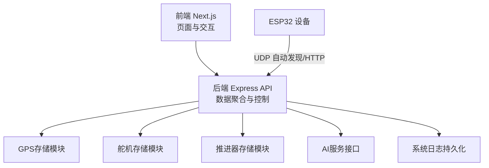
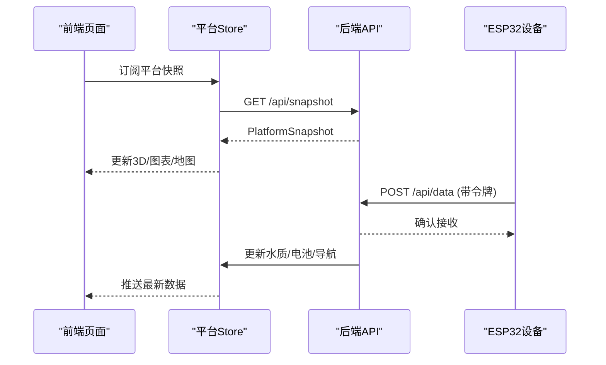
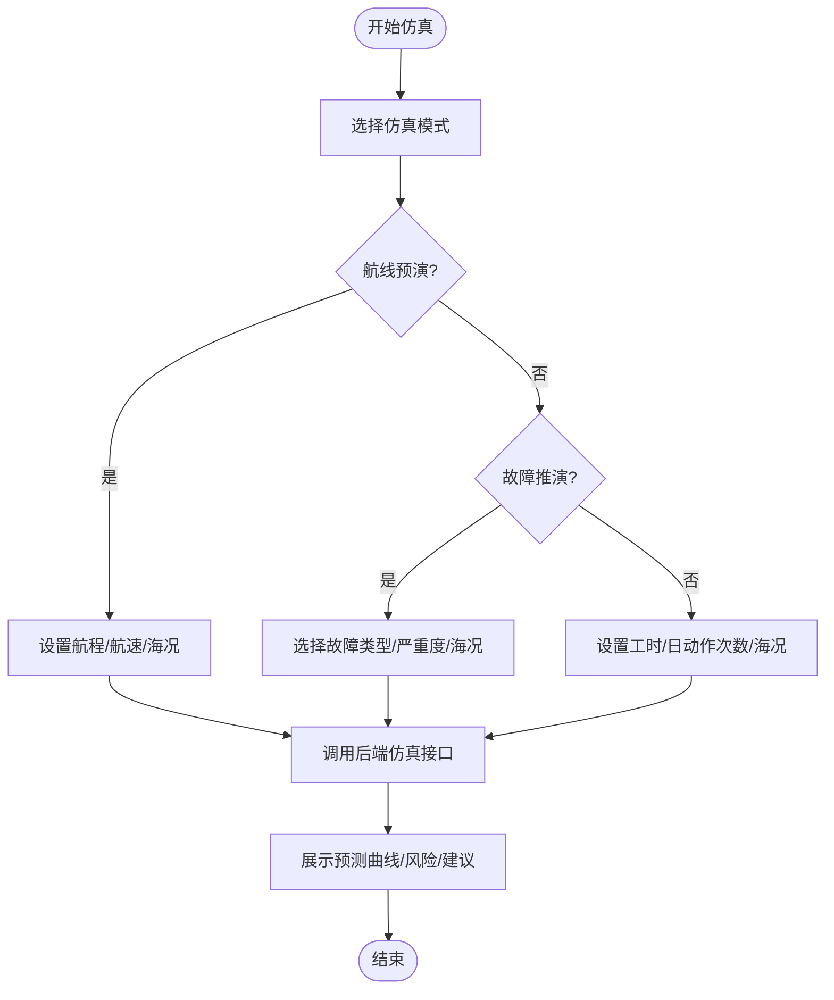
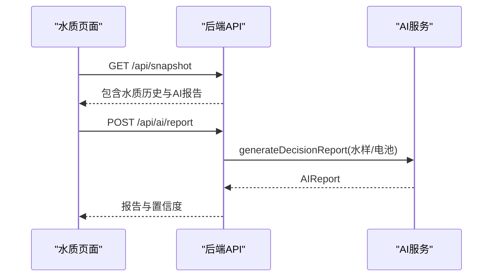
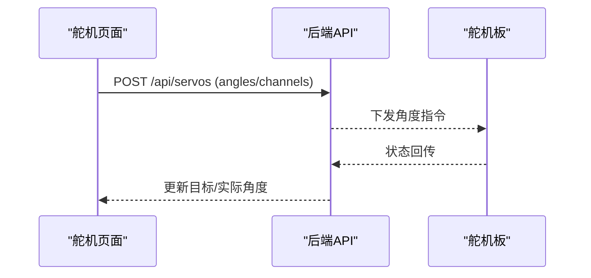
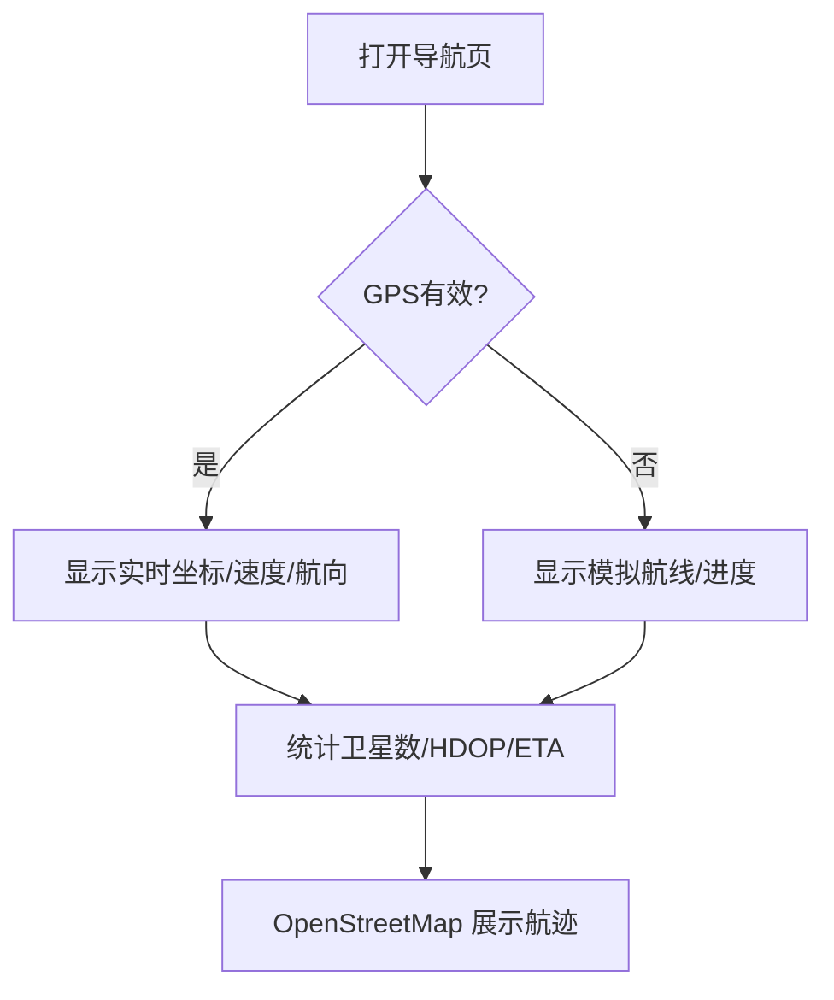
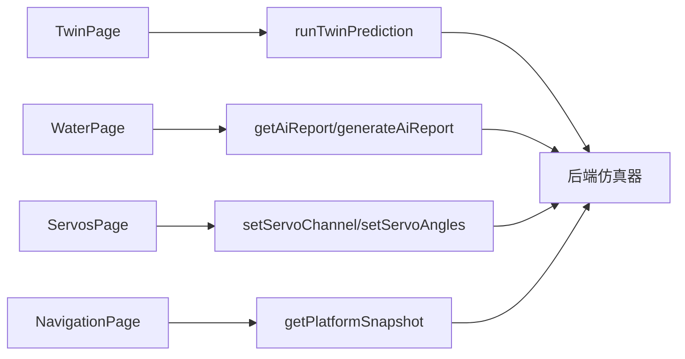

# 核心功能特性

<cite>
**本文引用的文件**
- [README.md](file://fishery-digital-twin-platform/README.md)
- [apps/frontend/src/app/page.tsx](file://fishery-digital-twin-platform/apps/frontend/src/app/page.tsx)
- [apps/frontend/src/components/landing/LandingExperience.tsx](file://fishery-digital-twin-platform/apps/frontend/src/components/landing/LandingExperience.tsx)
- [apps/frontend/src/components/dashboard/TwinPage.tsx](file://fishery-digital-twin-platform/apps/frontend/src/components/dashboard/TwinPage.tsx)
- [apps/frontend/src/components/dashboard/WaterPage.tsx](file://fishery-digital-twin-platform/apps/frontend/src/components/dashboard/WaterPage.tsx)
- [apps/frontend/src/components/dashboard/ServosPage.tsx](file://fishery-digital-twin-platform/apps/frontend/src/components/dashboard/ServosPage.tsx)
- [apps/frontend/src/components/dashboard/NavigationPage.tsx](file://fishery-digital-twin-platform/apps/frontend/src/components/dashboard/NavigationPage.tsx)
- [apps/frontend/src/components/dashboard/HealthPage.tsx](file://fishery-digital-twin-platform/apps/frontend/src/components/dashboard/HealthPage.tsx)
- [apps/frontend/src/components/dashboard/LogsPage.tsx](file://fishery-digital-twin-platform/apps/frontend/src/components/dashboard/LogsPage.tsx)
- [apps/frontend/src/lib/api.ts](file://fishery-digital-twin-platform/apps/frontend/src/lib/api.ts)
- [apps/frontend/src/hooks/usePlatformData.ts](file://fishery-digital-twin-platform/apps/frontend/src/hooks/usePlatformData.ts)
- [packages/shared/src/index.ts](file://fishery-digital-twin-platform/packages/shared/src/index.ts)
- [apps/backend/src/index.ts](file://fishery-digital-twin-platform/apps/backend/src/index.ts)
</cite>

## 目录
1. [简介](#简介)
2. [项目结构](#项目结构)
3. [核心组件](#核心组件)
4. [架构总览](#架构总览)
5. [详细功能分析](#详细功能分析)
6. [依赖关系分析](#依赖关系分析)
7. [性能与可用性](#性能与可用性)
8. [故障排查指南](#故障排查指南)
9. [结论](#结论)

## 简介
本文件面向智慧渔业巡检船数字孪生平台，系统化梳理并说明八大核心功能：首页3D船模展示、系统总览、三维孪生、环境监测（含AI预测）、水上执行机构控制（8路舵机）、航线规划（GPS定位与离线底图）、设备健康监控（电池/电控/通信/传感器预警）、操作日志记录。每个功能均从技术实现、用户交互方式与业务价值三个维度展开，帮助非技术读者理解平台能力，同时为开发者提供可追溯的实现路径。

## 项目结构
平台采用前后端分离与多应用组织：
- 前端 Next.js 应用负责页面渲染、3D场景、图表与地图、控制交互
- 后端 Express 服务聚合传感器数据、设备状态、AI报告、仿真推演与日志
- 共享类型包统一前后端数据结构
- 固件层通过UDP自动发现后端并上报状态

**图示来源**
- [apps/backend/src/index.ts:56-110](file://fishery-digital-twin-platform/apps/backend/src/index.ts#L56-L110)
- [apps/backend/src/index.ts:271-318](file://fishery-digital-twin-platform/apps/backend/src/index.ts#L271-L318)
- [apps/backend/src/index.ts:322-557](file://fishery-digital-twin-platform/apps/backend/src/index.ts#L322-L557)

**章节来源**
- [README.md:16-28](file://fishery-digital-twin-platform/README.md#L16-L28)
- [apps/backend/src/index.ts:56-110](file://fishery-digital-twin-platform/apps/backend/src/index.ts#L56-L110)

## 核心组件
- 前端数据总线：usePlatformData 基于共享 store 订阅平台快照，所有页面读取同一份实时数据，保证一致性
- 统一API封装：api.ts 集中处理鉴权头、超时与错误，暴露平台快照、AI报告、舵机/推进器控制、仿真等接口
- 共享类型：@fishery/shared 定义水质、导航、设备、日志、仿真输入输出等类型，确保前后端契约一致
- 后端路由：Express 聚合传感器数据、GPS、设备状态、AI报告、仿真与日志，并提供UDP自动发现

**章节来源**
- [apps/frontend/src/hooks/usePlatformData.ts:1-24](file://fishery-digital-twin-platform/apps/frontend/src/hooks/usePlatformData.ts#L1-L24)
- [apps/frontend/src/lib/api.ts:1-101](file://fishery-digital-twin-platform/apps/frontend/src/lib/api.ts#L1-L101)
- [packages/shared/src/index.ts:1-288](file://fishery-digital-twin-platform/packages/shared/src/index.ts#L1-L288)
- [apps/backend/src/index.ts:322-557](file://fishery-digital-twin-platform/apps/backend/src/index.ts#L322-L557)

## 架构总览
平台以“前端页面 + 后端服务 + 设备固件”三层架构运行：
- 前端页面通过 usePlatformData 订阅平台快照，驱动3D场景、图表与地图更新
- 后端提供REST接口与UDP广播，接收设备上报、生成AI报告、执行仿真推演、维护日志
- 设备通过UDP自动发现后端地址，使用令牌鉴权后上报状态或接收控制指令

**图示来源**
- [apps/frontend/src/hooks/usePlatformData.ts:1-24](file://fishery-digital-twin-platform/apps/frontend/src/hooks/usePlatformData.ts#L1-L24)
- [apps/frontend/src/lib/api.ts:26-35](file://fishery-digital-twin-platform/apps/frontend/src/lib/api.ts#L26-L35)
- [apps/backend/src/index.ts:367-430](file://fishery-digital-twin-platform/apps/backend/src/index.ts#L367-L430)

## 详细功能分析

### 1. 首页3D船模展示（自动旋转、拖动、缩放）
- 技术实现
  - 首页入口渲染 LandingExperience，动态加载 BoatTwinScene 3D场景，启用 autoRotate、float=false、colorizeModel 等参数
  - 支持拖拽平移与滚轮缩放，进入系统前预加载仪表盘路由
- 用户交互
  - 点击“进入系统”触发过渡动画并跳转至仪表盘
  - 3D场景中可自由查看船体模型
- 业务价值
  - 直观展示“耕海一号”船体外观，增强演示效果与品牌感知
  - 降低首次使用门槛，快速引导用户进入核心功能

**章节来源**
- [apps/frontend/src/app/page.tsx:1-7](file://fishery-digital-twin-platform/apps/frontend/src/app/page.tsx#L1-L7)
- [apps/frontend/src/components/landing/LandingExperience.tsx:10-73](file://fishery-digital-twin-platform/apps/frontend/src/components/landing/LandingExperience.tsx#L10-L73)
- [apps/frontend/src/components/landing/LandingExperience.tsx:23-30](file://fishery-digital-twin-platform/apps/frontend/src/components/landing/LandingExperience.tsx#L23-L30)

### 2. 系统总览（平台状态和核心监测数据）
- 技术实现
  - 仪表盘默认重定向到 twin 页面，承载任务概览、航行参数与环境采样数据
  - 使用 usePlatformData 获取 snapshot，展示 vessel.online、navigation.speed/heading、water 指标
- 用户交互
  - 一键复位视角、全屏查看3D场景
  - 切换动态水面开关，观察不同海况下的视觉效果
- 业务价值
  - 将平台在线状态、任务进度、续航估算与关键环境指标集中在一个视图，便于快速掌握整体态势

**章节来源**
- [apps/frontend/src/app/dashboard/page.tsx:1-6](file://fishery-digital-twin-platform/apps/frontend/src/app/dashboard/page.tsx#L1-L6)
- [apps/frontend/src/components/dashboard/TwinPage.tsx:24-54](file://fishery-digital-twin-platform/apps/frontend/src/components/dashboard/TwinPage.tsx#L24-L54)
- [apps/frontend/src/components/dashboard/TwinPage.tsx:165-229](file://fishery-digital-twin-platform/apps/frontend/src/components/dashboard/TwinPage.tsx#L165-L229)

### 3. 三维孪生（船模姿态、任务状态和控制反馈）
- 技术实现
  - TwinPage 集成 BoatTwinScene，支持俯视模式、工作装备显示、养殖对象显示与模拟图层叠加
  - 任务进度由剩余航程计算；电量续航按平均电池估算；导航趋势用折线图展示
  - 仿真实验台调用 runTwinPrediction，返回航线预演、故障推演、疲劳损耗结果
- 用户交互
  - 选择仿真模式（航线预演/故障推演/疲劳损耗），设置参数并运行推演
  - 查看置信度、风险等级、模型依据与假设限制
- 业务价值
  - 在虚拟环境中评估任务可行性与风险，辅助决策而不直接操控真实设备
  - 提供可解释的预测结果，提升运维与调度效率

**图示来源**
- [apps/frontend/src/components/dashboard/TwinPage.tsx:67-78](file://fishery-digital-twin-platform/apps/frontend/src/components/dashboard/TwinPage.tsx#L67-L78)
- [apps/frontend/src/components/dashboard/TwinPage.tsx:358-495](file://fishery-digital-twin-platform/apps/frontend/src/components/dashboard/TwinPage.tsx#L358-L495)
- [apps/frontend/src/lib/api.ts:95-100](file://fishery-digital-twin-platform/apps/frontend/src/lib/api.ts#L95-L100)
- [apps/backend/src/index.ts:540-555](file://fishery-digital-twin-platform/apps/backend/src/index.ts#L540-L555)

**章节来源**
- [apps/frontend/src/components/dashboard/TwinPage.tsx:80-152](file://fishery-digital-twin-platform/apps/frontend/src/components/dashboard/TwinPage.tsx#L80-L152)
- [apps/frontend/src/components/dashboard/TwinPage.tsx:586-767](file://fishery-digital-twin-platform/apps/frontend/src/components/dashboard/TwinPage.tsx#L586-L767)

### 4. 环境监测（水温、浊度、pH、溶解氧、氨氮、电导率及AI预测报告）
- 技术实现
  - WaterPage 聚合实时历史数据，支持1小时/6小时/24小时/7天时间窗口切换
  - 核心趋势图展示水温、溶解氧、pH，低溶解氧区域高亮提示
  - AI报告通过 getAiStatus/getAiReport/generateAiReport 获取，未配置大模型时使用本地预测逻辑
  - 后端 /api/data 接收传感器数据，计算水质状态并写入历史；/api/demo/simulate 生成独立演示数据
- 用户交互
  - 点击“生成演示数据”播放采集动画，或返回实时数据
  - 点击“生成预测报告”，查看风险等级、关键发现、行动建议与数据质量说明
- 业务价值
  - 将多源水质指标与AI决策建议整合，支持藻华风险、浊度趋势与续航估计
  - 演示模式便于培训与演示，不影响真实历史数据

**图示来源**
- [apps/frontend/src/components/dashboard/WaterPage.tsx:45-167](file://fishery-digital-twin-platform/apps/frontend/src/components/dashboard/WaterPage.tsx#L45-L167)
- [apps/frontend/src/components/dashboard/WaterPage.tsx:403-537](file://fishery-digital-twin-platform/apps/frontend/src/components/dashboard/WaterPage.tsx#L403-L537)
- [apps/backend/src/index.ts:367-430](file://fishery-digital-twin-platform/apps/backend/src/index.ts#L367-L430)
- [apps/backend/src/index.ts:447-473](file://fishery-digital-twin-platform/apps/backend/src/index.ts#L447-L473)

**章节来源**
- [apps/frontend/src/components/dashboard/WaterPage.tsx:220-347](file://fishery-digital-twin-platform/apps/frontend/src/components/dashboard/WaterPage.tsx#L220-L347)
- [apps/frontend/src/components/dashboard/WaterPage.tsx:580-612](file://fishery-digital-twin-platform/apps/frontend/src/components/dashboard/WaterPage.tsx#L580-L612)

### 5. 水上执行机构控制（8路舵机控制）
- 技术实现
  - ServosPage 管理两块舵机板（每板4路），分别用于云台与水枪控制
  - 支持手动步进控制、归中、全部复位、自动跟踪（基于视觉目标检测）
  - 通过 setServoChannel/setServoAngles 下发角度指令，后端记录命令并回写实际角度
  - 推进器控制（电机/电动推杆）与舵机协同，支持模式切换与急停保护
- 用户交互
  - 方向键步进调整云台角度，开启/关闭自动跟踪，选择跟踪目标类别
  - 水枪开关按钮控制开合角度，实时反馈设备在线状态
- 业务价值
  - 实现对摄像头云台与水枪的精确控制，支持垃圾识别跟踪与作业执行
  - 安全机制防止误操作，保障设备与人员安全

**图示来源**
- [apps/frontend/src/components/dashboard/ServosPage.tsx:111-175](file://fishery-digital-twin-platform/apps/frontend/src/components/dashboard/ServosPage.tsx#L111-L175)
- [apps/frontend/src/components/dashboard/ServosPage.tsx:194-461](file://fishery-digital-twin-platform/apps/frontend/src/components/dashboard/ServosPage.tsx#L194-L461)
- [apps/frontend/src/lib/api.ts:52-68](file://fishery-digital-twin-platform/apps/frontend/src/lib/api.ts#L52-L68)
- [apps/backend/src/index.ts:475-503](file://fishery-digital-twin-platform/apps/backend/src/index.ts#L475-L503)

**章节来源**
- [apps/frontend/src/components/dashboard/ServosPage.tsx:592-731](file://fishery-digital-twin-platform/apps/frontend/src/components/dashboard/ServosPage.tsx#L592-L731)

### 6. 航线规划（GPS定位和离线底图）
- 技术实现
  - NavigationPage 使用 OpenStreetMap 展示航迹，优先显示WGS84 GPS坐标；无定位时标记参考航线
  - 计算航点距离与进度，展示速度、航向、卫星数与HDOP精度
  - 后端 currentNavigation 根据GPS状态决定数据来源与位置信息
- 用户交互
  - 右侧面板显示当前任务、巡航进度、关键参数与GPS信息
  - 地图可视化航点与当前位置，支持离线底图展示
- 业务价值
  - 提供直观的航行态势感知，辅助任务编排与返航决策
  - 在无GPS情况下仍可参考预设航线进行演示与训练

**图示来源**
- [apps/frontend/src/components/dashboard/NavigationPage.tsx:44-145](file://fishery-digital-twin-platform/apps/frontend/src/components/dashboard/NavigationPage.tsx#L44-L145)
- [apps/backend/src/index.ts:197-222](file://fishery-digital-twin-platform/apps/backend/src/index.ts#L197-L222)

**章节来源**
- [apps/frontend/src/components/dashboard/NavigationPage.tsx:64-141](file://fishery-digital-twin-platform/apps/frontend/src/components/dashboard/NavigationPage.tsx#L64-L141)

### 7. 设备健康监控（电池、电控、通信和传感器状态预警）
- 技术实现
  - HealthPage 汇总主控开发板、飞控模块、通信模块、环境传感器状态与电池电量
  - 计算综合健康评分与趋势，展示告警列表与建议
  - 支持立即健康检查，刷新快照与反馈
- 用户交互
  - 一键检查健康状态，查看在线设备数量、平均电量、预警项与严重故障
  - 电源系统与核心设备状态分栏展示，便于快速定位问题
- 业务价值
  - 提前发现潜在故障，降低停机风险
  - 提供可操作的维护建议，提升运维效率

**章节来源**
- [apps/frontend/src/components/dashboard/HealthPage.tsx:13-102](file://fishery-digital-twin-platform/apps/frontend/src/components/dashboard/HealthPage.tsx#L13-L102)
- [apps/frontend/src/components/dashboard/HealthPage.tsx:104-201](file://fishery-digital-twin-platform/apps/frontend/src/components/dashboard/HealthPage.tsx#L104-L201)

### 8. 操作日志记录
- 技术实现
  - LogsPage 定时拉取 /api/logs，展示事件时间、级别、来源、标题与详情
  - 后端 appendLog 记录传感器、AI、舵机、推进器等事件，限制最近80条
- 用户交互
  - 按级别筛选日志，查看预警与异常条目
  - 自动刷新，便于实时监控
- 业务价值
  - 提供可审计的运行轨迹，支持问题回溯与合规检查
  - 帮助快速定位异常来源，缩短排障时间

**章节来源**
- [apps/frontend/src/components/dashboard/LogsPage.tsx:9-89](file://fishery-digital-twin-platform/apps/frontend/src/components/dashboard/LogsPage.tsx#L9-L89)
- [apps/backend/src/index.ts:116-129](file://fishery-digital-twin-platform/apps/backend/src/index.ts#L116-L129)
- [apps/backend/src/index.ts:557-561](file://fishery-digital-twin-platform/apps/backend/src/index.ts#L557-L561)

## 依赖关系分析
- 前端依赖
  - usePlatformData 依赖 platformStore，统一订阅快照
  - 各页面依赖 api.ts 提供的REST接口
  - 3D与图表库（Three.js、Recharts）用于可视化
- 后端依赖
  - Express 中间件（CORS、JSON解析）
  - GPS存储、舵机存储、推进器存储模块
  - AI服务接口与仿真器
  - UDP自动发现服务
- 共享类型
  - @fishery/shared 定义所有数据结构，确保前后端契约一致

**图示来源**
- [apps/frontend/src/components/dashboard/TwinPage.tsx:67-78](file://fishery-digital-twin-platform/apps/frontend/src/components/dashboard/TwinPage.tsx#L67-L78)
- [apps/frontend/src/components/dashboard/WaterPage.tsx:403-537](file://fishery-digital-twin-platform/apps/frontend/src/components/dashboard/WaterPage.tsx#L403-L537)
- [apps/frontend/src/components/dashboard/ServosPage.tsx:194-461](file://fishery-digital-twin-platform/apps/frontend/src/components/dashboard/ServosPage.tsx#L194-L461)
- [apps/frontend/src/lib/api.ts:26-100](file://fishery-digital-twin-platform/apps/frontend/src/lib/api.ts#L26-L100)
- [apps/backend/src/index.ts:540-557](file://fishery-digital-twin-platform/apps/backend/src/index.ts#L540-L557)

**章节来源**
- [packages/shared/src/index.ts:1-288](file://fishery-digital-twin-platform/packages/shared/src/index.ts#L1-L288)
- [apps/backend/src/index.ts:56-110](file://fishery-digital-twin-platform/apps/backend/src/index.ts#L56-L110)

## 性能与可用性
- 前端
  - 使用动态导入与SSR禁用优化3D场景加载
  - 图表按需渲染，避免首屏阻塞
- 后端
  - CORS限制与令牌鉴权保障安全
  - 演示数据与真实数据隔离，避免污染历史
  - 日志限长与持久化，防止内存增长
- 设备
  - UDP自动发现减少配置成本
  - 心跳与在线状态反馈提升可靠性

[本节为通用指导，不直接分析具体文件]

## 故障排查指南
- 连接问题
  - 检查后端端口与CORS配置，确认前端域名允许
  - 局域网控制需携带 X-UISYS-Token，否则返回401
- 设备通信
  - 确认ESP32与电脑在同一热点且未启用客户端隔离
  - 查看UDP发现端口与设备端口是否冲突
- AI报告
  - 若未配置密钥，将使用本地预测；配置后需等待至少一分钟一次请求
- 日志加载失败
  - 页面保留上一次成功内容，检查后端日志接口连通性

**章节来源**
- [apps/backend/src/index.ts:143-157](file://fishery-digital-twin-platform/apps/backend/src/index.ts#L143-L157)
- [apps/backend/src/index.ts:447-473](file://fishery-digital-twin-platform/apps/backend/src/index.ts#L447-L473)
- [apps/frontend/src/components/dashboard/LogsPage.tsx:14-33](file://fishery-digital-twin-platform/apps/frontend/src/components/dashboard/LogsPage.tsx#L14-L33)

## 结论
平台围绕3D展示、环境监测、设备控制、航线规划与健康监控形成闭环，结合AI预测与数字孪生仿真，为智慧渔业巡检船提供可视化、可预测、可控制的综合解决方案。通过清晰的前后端契约与安全的设备通信机制，既满足演示与训练需求，也具备生产部署的基础能力。