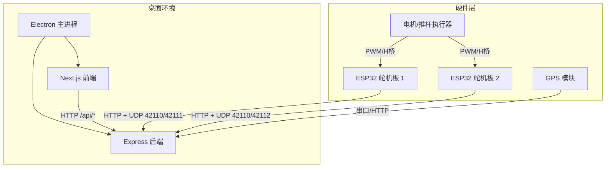
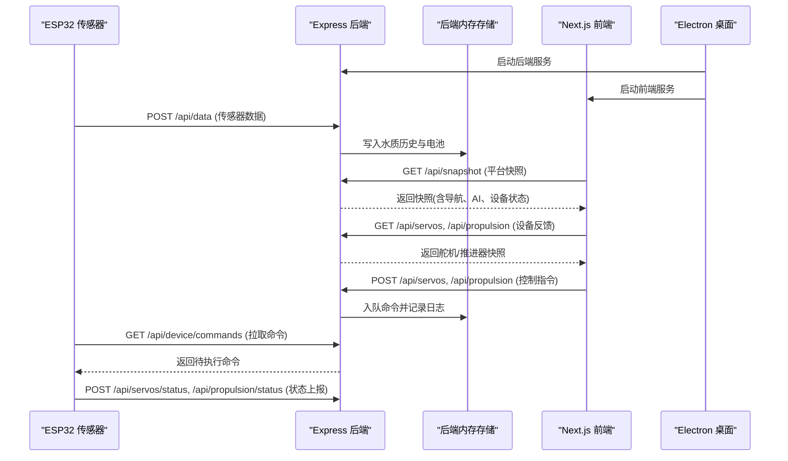
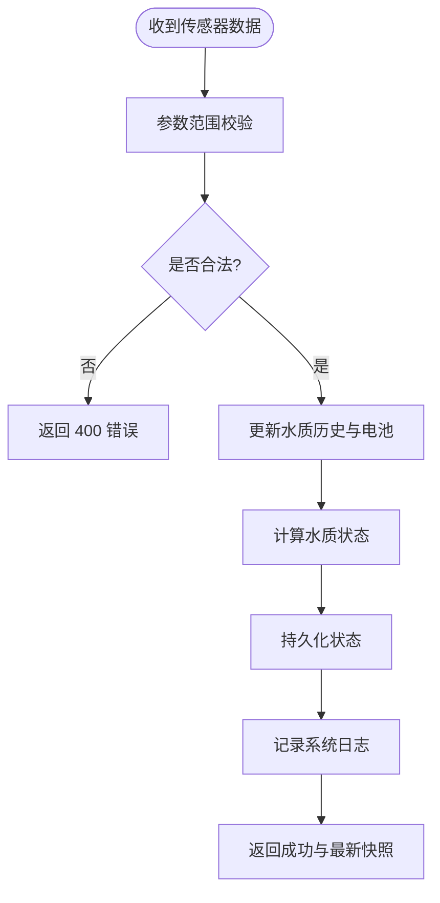
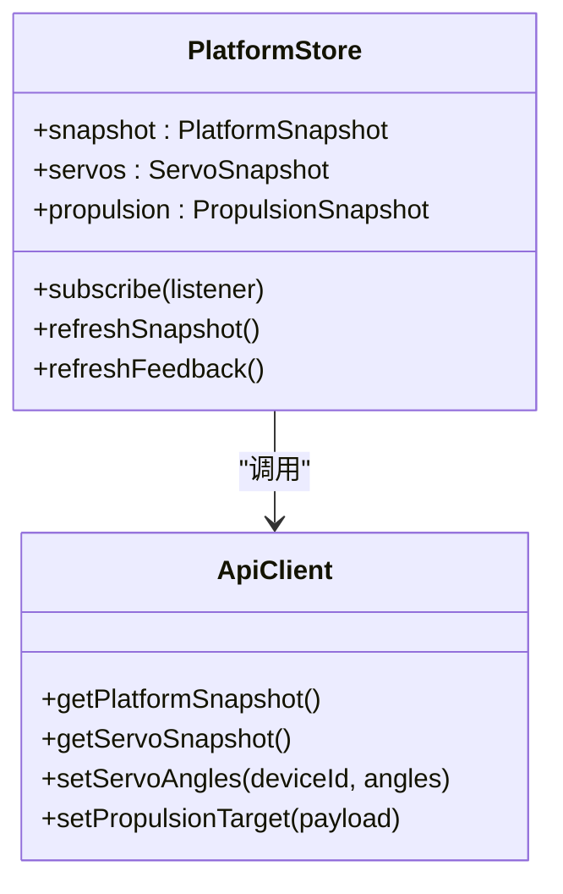
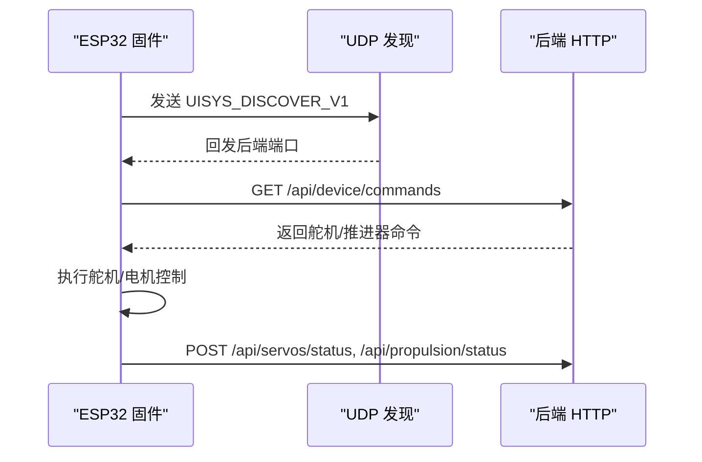
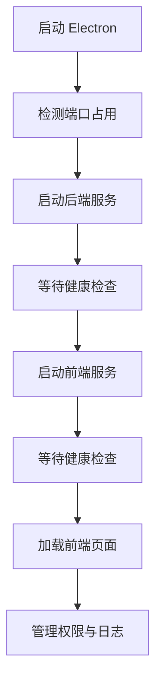
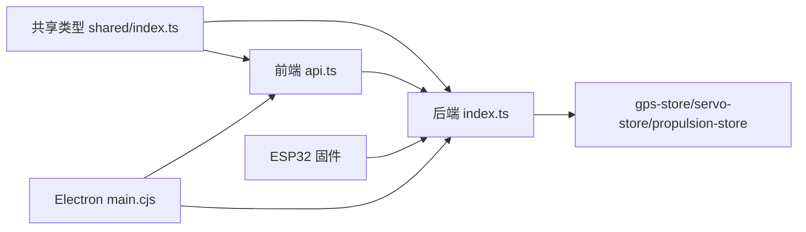

# 系统架构设计

<cite>
**本文引用的文件**
- [README.md](file://fishery-digital-twin-platform/README.md)
- [package.json](file://fishery-digital-twin-platform/package.json)
- [后端入口 index.ts](file://fishery-digital-twin-platform/apps/backend/src/index.ts)
- [GPS 状态存储 gps-store.ts](file://fishery-digital-twin-platform/apps/backend/src/gps-store.ts)
- [舵机存储 servo-store.ts](file://fishery-digital-twin-platform/apps/backend/src/servo-store.ts)
- [推进器存储 propulsion-store.ts](file://fishery-digital-twin-platform/apps/backend/src/propulsion-store.ts)
- [设备测试 device-stores.test.ts](file://fishery-digital-twin-platform/apps/backend/src/device-stores.test.ts)
- [前端根布局 layout.tsx](file://fishery-digital-twin-platform/apps/frontend/src/app/layout.tsx)
- [前端 API 封装 api.ts](file://fishery-digital-twin-platform/apps/frontend/src/lib/api.ts)
- [前端平台状态 store platformStore.ts](file://fishery-digital-twin-platform/apps/frontend/src/lib/platformStore.ts)
- [桌面主进程 main.cjs](file://fishery-digital-twin-platform/apps/desktop/main.cjs)
- [共享类型定义 shared/index.ts](file://fishery-digital-twin-platform/packages/shared/src/index.ts)
- [硬件与固件说明 hardware-and-firmware.md](file://fishery-digital-twin-platform/docs/hardware-and-firmware.md)
- [ESP32 固件示例 maker_esp32_pro_servo_temp_01.ino](file://fishery-digital-twin-platform/firmware/esp32/maker_esp32_pro_servo_temp_01/maker_esp32_pro_servo_temp_01.ino)
</cite>

## 目录
1. [简介](#简介)
2. [项目结构](#项目结构)
3. [核心组件](#核心组件)
4. [架构总览](#架构总览)
5. [详细组件分析](#详细组件分析)
6. [依赖关系分析](#依赖关系分析)
7. [性能考虑](#性能考虑)
8. [故障排查指南](#故障排查指南)
9. [结论](#结论)
10. [附录](#附录)

## 简介
本系统为智慧渔业巡检船数字孪生平台，采用前后端分离、微服务思想与插件化扩展设计。前端基于 Next.js 提供用户界面与 3D 可视化；后端基于 Express 处理业务逻辑、设备通信与数据聚合；ESP32 固件负责硬件控制、传感器数据采集与网络上报；Electron 桌面应用提供本地运行环境，自动启动并管理前后端进程。系统通过 HTTP REST API、UDP 设备发现机制以及可扩展的实时通信通道，实现从传感器采集到前端展示的完整数据链路，并通过模块化解耦和统一类型契约提升可维护性与可扩展性。

## 项目结构
仓库采用 Monorepo 组织方式，包含四个主要应用与一个共享类型包：
- apps/backend：Express 后端，提供健康检查、数据快照、设备命令、AI 报告、日志等接口，并内置 UDP 设备发现广播。
- apps/frontend：Next.js 前端，提供仪表盘、三维孪生、导航地图、设备控制页面，使用轮询拉取平台快照与设备反馈。
- apps/desktop：Electron 主进程，打包并启动前端与后端，提供单实例窗口、权限控制与服务生命周期管理。
- firmware/esp32：多套 ESP32 固件，分别驱动舵机、电机、推杆与 GPS，并通过 HTTP/UDP 与后端交互。
- packages/shared：前后端共享 TypeScript 类型定义，确保数据契约一致。

图表来源
- [桌面主进程 main.cjs:1-202](file://fishery-digital-twin-platform/apps/desktop/main.cjs#L1-L202)
- [后端入口 index.ts:56-334](file://fishery-digital-twin-platform/apps/backend/src/index.ts#L56-L334)
- [硬件与固件说明 hardware-and-firmware.md:118-138](file://fishery-digital-twin-platform/docs/hardware-and-firmware.md#L118-L138)
- [ESP32 固件示例 maker_esp32_pro_servo_temp_01.ino:43-63](file://fishery-digital-twin-platform/firmware/esp32/maker_esp32_pro_servo_temp_01/maker_esp32_pro_servo_temp_01.ino#L43-L63)

章节来源
- [README.md:16-28](file://fishery-digital-twin-platform/README.md#L16-L28)
- [package.json:11-37](file://fishery-digital-twin-platform/package.json#L11-L37)

## 核心组件
- 前端 Next.js 应用：提供仪表盘、三维孪生、导航、设备控制与日志页面；通过平台状态 store 定时拉取快照与设备反馈，渲染 3D 场景与图表。
- 后端 Express 服务：集中处理传感器数据、GPS 状态、舵机与推进器控制、AI 报告生成、数字孪生仿真、系统日志与持久化；提供 UDP 设备发现广播。
- ESP32 固件：连接 WiFi，通过 UDP 自动发现后端地址，周期性上报传感器与设备状态，拉取控制命令并执行（舵机角度、电机功率、推杆动作）。
- Electron 桌面应用：单实例窗口，自动检测并启动后端与前端服务，限制导航域，管理媒体权限，输出日志文件。

章节来源
- [前端根布局 layout.tsx:1-20](file://fishery-digital-twin-platform/apps/frontend/src/app/layout.tsx#L1-L20)
- [后端入口 index.ts:101-114](file://fishery-digital-twin-platform/apps/backend/src/index.ts#L101-L114)
- [ESP32 固件示例 maker_esp32_pro_servo_temp_01.ino:187-200](file://fishery-digital-twin-platform/firmware/esp32/maker_esp32_pro_servo_temp_01/maker_esp32_pro_servo_temp_01.ino#L187-L200)
- [桌面主进程 main.cjs:82-119](file://fishery-digital-twin-platform/apps/desktop/main.cjs#L82-L119)

## 架构总览
系统采用分层与模块化架构：
- 表现层：Next.js 前端，负责 UI 与 3D 可视化。
- 业务层：Express 后端，聚合数据、执行业务规则、协调设备与 AI。
- 设备层：ESP32 固件，负责硬件驱动与数据采集。
- 运行层：Electron 桌面应用，提供本地集成与进程管理。

数据流向：
- 传感器数据由 ESP32 通过 HTTP POST 上报至后端，后端校验并写入历史序列，更新水质状态与电池信息。
- GPS 状态通过专用接口更新，后端结合在线判定与坐标有效性生成导航数据。
- 前端定时拉取平台快照与设备反馈，渲染仪表盘与 3D 模型。
- 控制指令由前端发起，经后端校验、限流与安全检查后入队，ESP32 定期拉取并执行。
- 数字孪生仿真与 AI 报告在后端计算，结果返回前端展示。

图表来源
- [后端入口 index.ts:322-557](file://fishery-digital-twin-platform/apps/backend/src/index.ts#L322-L557)
- [前端 API 封装 api.ts:26-100](file://fishery-digital-twin-platform/apps/frontend/src/lib/api.ts#L26-L100)
- [桌面主进程 main.cjs:82-119](file://fishery-digital-twin-platform/apps/desktop/main.cjs#L82-L119)
- [硬件与固件说明 hardware-and-firmware.md:118-138](file://fishery-digital-twin-platform/docs/hardware-and-firmware.md#L118-L138)

## 详细组件分析

### 后端 Express 服务
后端是系统的业务中枢，职责包括：
- 提供健康检查与平台快照接口，聚合水质、电池、导航、AI 报告与设备状态。
- 接收传感器数据，进行范围校验与状态判定，维护历史序列与持久化。
- 管理 GPS 状态，限制坐标系为 WGS84，计算在线与有效定位。
- 管理舵机与推进器设备状态，校验命令合法性与安全限制，维护命令队列与 TTL。
- 提供数字孪生仿真与 AI 报告生成接口，支持演示数据与真实数据混合模式。
- 实现 UDP 设备发现广播，响应 ESP32 的 UISYS_DISCOVER_V1 请求并回发后端端口。

图表来源
- [后端入口 index.ts:367-430](file://fishery-digital-twin-platform/apps/backend/src/index.ts#L367-L430)
- [GPS 状态存储 gps-store.ts:59-103](file://fishery-digital-twin-platform/apps/backend/src/gps-store.ts#L59-L103)
- [舵机存储 servo-store.ts:106-153](file://fishery-digital-twin-platform/apps/backend/src/servo-store.ts#L106-L153)
- [推进器存储 propulsion-store.ts:166-231](file://fishery-digital-twin-platform/apps/backend/src/propulsion-store.ts#L166-L231)

章节来源
- [后端入口 index.ts:56-114](file://fishery-digital-twin-platform/apps/backend/src/index.ts#L56-L114)
- [后端入口 index.ts:271-318](file://fishery-digital-twin-platform/apps/backend/src/index.ts#L271-L318)
- [GPS 状态存储 gps-store.ts:1-103](file://fishery-digital-twin-platform/apps/backend/src/gps-store.ts#L1-L103)
- [舵机存储 servo-store.ts:1-184](file://fishery-digital-twin-platform/apps/backend/src/servo-store.ts#L1-L184)
- [推进器存储 propulsion-store.ts:1-319](file://fishery-digital-twin-platform/apps/backend/src/propulsion-store.ts#L1-L319)

### 前端 Next.js 应用
前端采用客户端状态管理，通过平台 store 定时拉取平台快照与设备反馈，避免不必要的重渲染。关键特性：
- 初始快照在服务端渲染时确定，避免 hydration 不匹配。
- 快照与设备反馈分片更新，减少全局重绘。
- 失败重试与连接状态标记，增强用户体验。
- 统一的 API 封装，自动携带令牌头与超时控制。

图表来源
- [前端平台状态 store platformStore.ts:20-196](file://fishery-digital-twin-platform/apps/frontend/src/lib/platformStore.ts#L20-L196)
- [前端 API 封装 api.ts:1-101](file://fishery-digital-twin-platform/apps/frontend/src/lib/api.ts#L1-L101)

章节来源
- [前端根布局 layout.tsx:1-20](file://fishery-digital-twin-platform/apps/frontend/src/app/layout.tsx#L1-L20)
- [前端平台状态 store platformStore.ts:20-196](file://fishery-digital-twin-platform/apps/frontend/src/lib/platformStore.ts#L20-L196)
- [前端 API 封装 api.ts:1-101](file://fishery-digital-twin-platform/apps/frontend/src/lib/api.ts#L1-L101)

### ESP32 固件
固件负责硬件控制与网络通信：
- 连接 WiFi，通过 UDP 42110 广播发现请求，接收后端回复并缓存后端地址。
- 周期性读取 GPS 数据，解析 NMEA 语句，上报串口在线与定位有效性。
- 控制舵机角度，限制安全范围，避免重复写入相同目标。
- 驱动直流电机与推杆，支持缓启动、急停、命令超时保护。
- 拉取后端下发的控制命令，执行并上报设备状态。

图表来源
- [ESP32 固件示例 maker_esp32_pro_servo_temp_01.ino:43-63](file://fishery-digital-twin-platform/firmware/esp32/maker_esp32_pro_servo_temp_01/maker_esp32_pro_servo_temp_01.ino#L43-L63)
- [硬件与固件说明 hardware-and-firmware.md:118-138](file://fishery-digital-twin-platform/docs/hardware-and-firmware.md#L118-L138)

章节来源
- [ESP32 固件示例 maker_esp32_pro_servo_temp_01.ino:187-200](file://fishery-digital-twin-platform/firmware/esp32/maker_esp32_pro_servo_temp_01/maker_esp32_pro_servo_temp_01.ino#L187-L200)
- [硬件与固件说明 hardware-and-firmware.md:1-234](file://fishery-digital-twin-platform/docs/hardware-and-firmware.md#L1-L234)

### Electron 桌面应用
桌面应用提供本地运行环境：
- 单实例锁，防止重复启动。
- 自动检测并启动后端与前端服务，等待健康检查通过。
- 限制窗口导航域，仅允许访问前端域名。
- 授予媒体权限给前端页面，便于摄像头或音频功能。
- 输出服务日志到本地文件，便于问题定位。

图表来源
- [桌面主进程 main.cjs:54-119](file://fishery-digital-twin-platform/apps/desktop/main.cjs#L54-L119)
- [桌面主进程 main.cjs:121-178](file://fishery-digital-twin-platform/apps/desktop/main.cjs#L121-L178)

章节来源
- [桌面主进程 main.cjs:1-202](file://fishery-digital-twin-platform/apps/desktop/main.cjs#L1-L202)

## 依赖关系分析
系统通过共享类型定义解耦前后端，后端内部通过独立存储模块管理不同设备状态，前端通过统一 API 封装降低耦合度。关键依赖关系如下：
- 前端依赖后端提供的 REST API。
- 后端依赖共享类型定义与内部存储模块。
- ESP32 固件依赖后端 HTTP 与 UDP 发现协议。
- Electron 依赖 Node.js 子进程管理与文件系统。

图表来源
- [共享类型定义 shared/index.ts:1-288](file://fishery-digital-twin-platform/packages/shared/src/index.ts#L1-L288)
- [前端 API 封装 api.ts:1-101](file://fishery-digital-twin-platform/apps/frontend/src/lib/api.ts#L1-L101)
- [后端入口 index.ts:1-599](file://fishery-digital-twin-platform/apps/backend/src/index.ts#L1-L599)
- [桌面主进程 main.cjs:1-202](file://fishery-digital-twin-platform/apps/desktop/main.cjs#L1-L202)

章节来源
- [共享类型定义 shared/index.ts:1-288](file://fishery-digital-twin-platform/packages/shared/src/index.ts#L1-L288)
- [设备测试 device-stores.test.ts:1-93](file://fishery-digital-twin-platform/apps/backend/src/device-stores.test.ts#L1-L93)

## 性能考虑
- 前端采用分片状态与定时器轮询，避免频繁重渲染，提高 UI 响应性。
- 后端对传感器数据与命令进行范围校验与限流，防止异常输入与滥用。
- 设备命令队列设置 TTL，避免过期命令堆积。
- 数字孪生仿真与 AI 报告生成异步处理，减少阻塞。
- Electron 单实例与资源清理，保证桌面应用稳定性。

[本节为通用性能建议，不直接分析具体文件]

## 故障排查指南
常见问题与排查步骤：
- 后端端口冲突：检查 5000 与 3000 端口是否被其他程序占用，桌面应用会提示并阻止启动。
- 防火墙拦截：确保 Windows 防火墙允许 TCP 5000 与 UDP 42110 入站。
- WiFi 隔离：确认热点未开启客户端隔离，ESP32 与电脑需在同一局域网。
- 令牌不一致：确保固件与后端配置一致的 UISYS_API_TOKEN。
- 健康检查失败：通过浏览器访问 http://电脑IPv4:5000/api/health 验证后端可用性。
- 日志定位：查看桌面应用输出的 desktop-services.log 与后端控制台日志。

章节来源
- [桌面主进程 main.cjs:93-119](file://fishery-digital-twin-platform/apps/desktop/main.cjs#L93-L119)
- [README.md:143-185](file://fishery-digital-twin-platform/README.md#L143-L185)
- [硬件与固件说明 hardware-and-firmware.md:177-204](file://fishery-digital-twin-platform/docs/hardware-and-firmware.md#L177-L204)

## 结论
本系统通过清晰的分层架构与模块化设计，实现了智慧渔业巡检船的数字化监控与控制。前后端分离提升了开发效率与可维护性，微服务思想体现在设备状态管理与命令队列的独立封装，插件化设计通过共享类型与统一接口支持新设备与新功能的快速接入。UDP 设备发现机制简化了部署流程，HTTP REST API 提供了稳定可靠的数据通道。未来可在保持现有解耦策略的基础上，引入 WebSocket 实现更高效的实时通信，并扩展更多传感器与执行器类型。

[本节为总结性内容，不直接分析具体文件]

## 附录
- 启动与部署：参考 README 中的安装与启动脚本。
- 安全配置：环境变量与令牌管理，CORS 与跨域限制。
- 硬件接线：舵机、电机、推杆与 GPS 的接线规范与安全注意事项。
- 类型契约：共享类型定义确保前后端数据结构一致。

章节来源
- [README.md:36-76](file://fishery-digital-twin-platform/README.md#L36-L76)
- [README.md:173-185](file://fishery-digital-twin-platform/README.md#L173-L185)
- [硬件与固件说明 hardware-and-firmware.md:67-117](file://fishery-digital-twin-platform/docs/hardware-and-firmware.md#L67-L117)
- [共享类型定义 shared/index.ts:1-288](file://fishery-digital-twin-platform/packages/shared/src/index.ts#L1-L288)