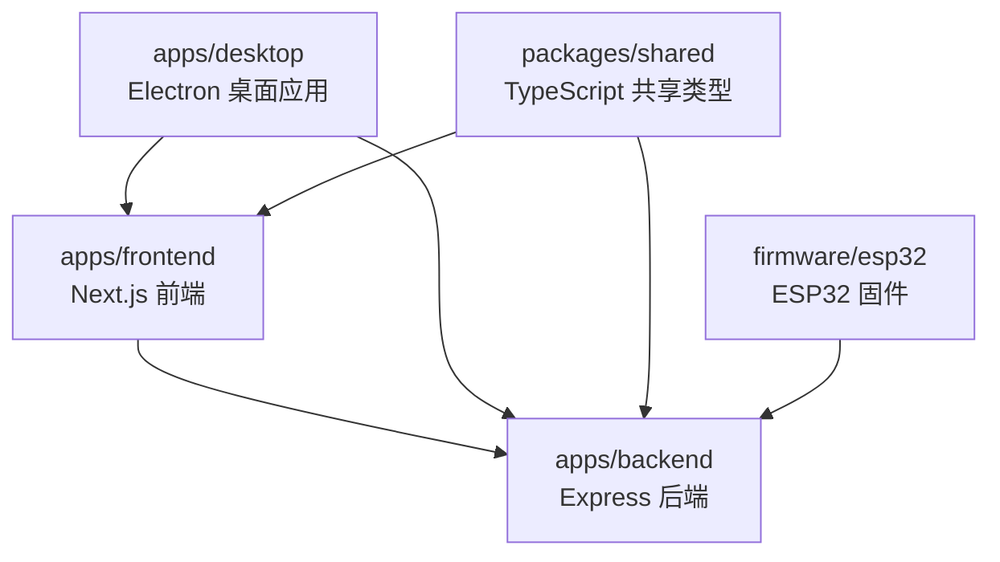
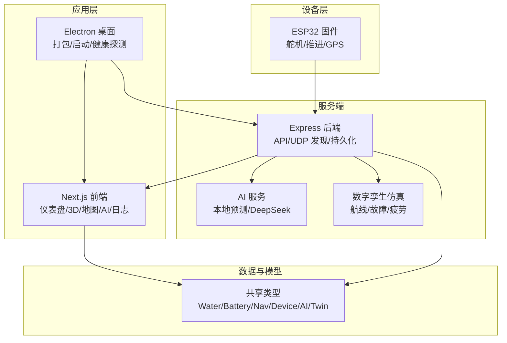
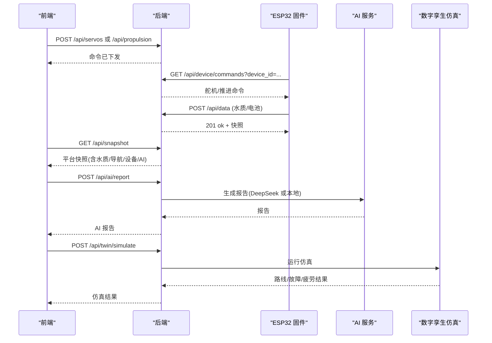
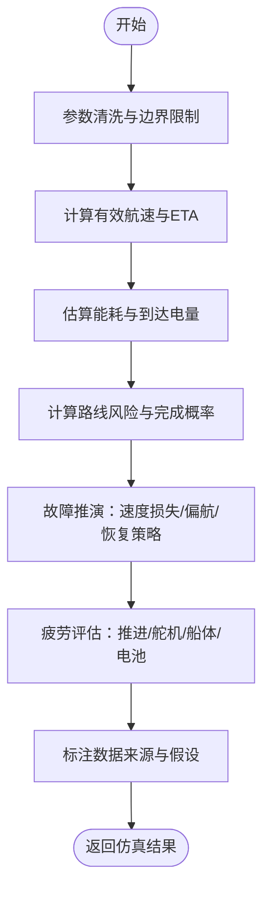
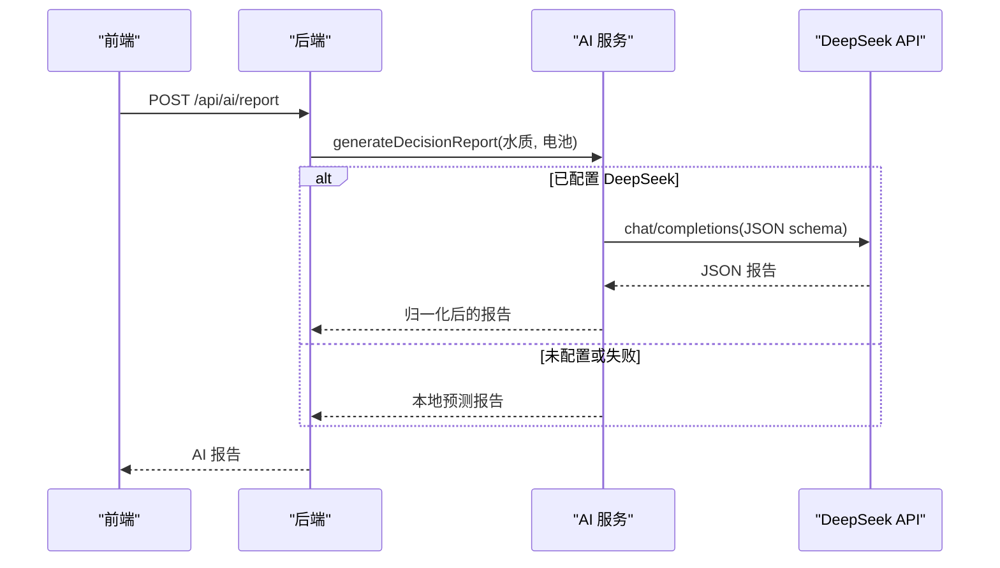
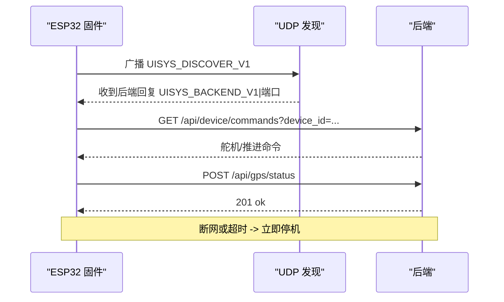
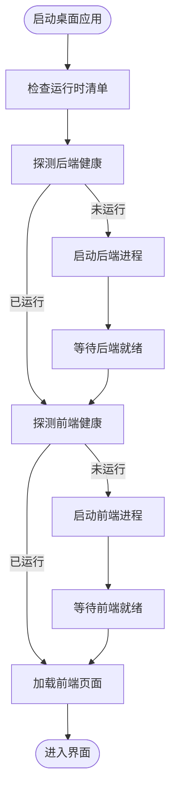
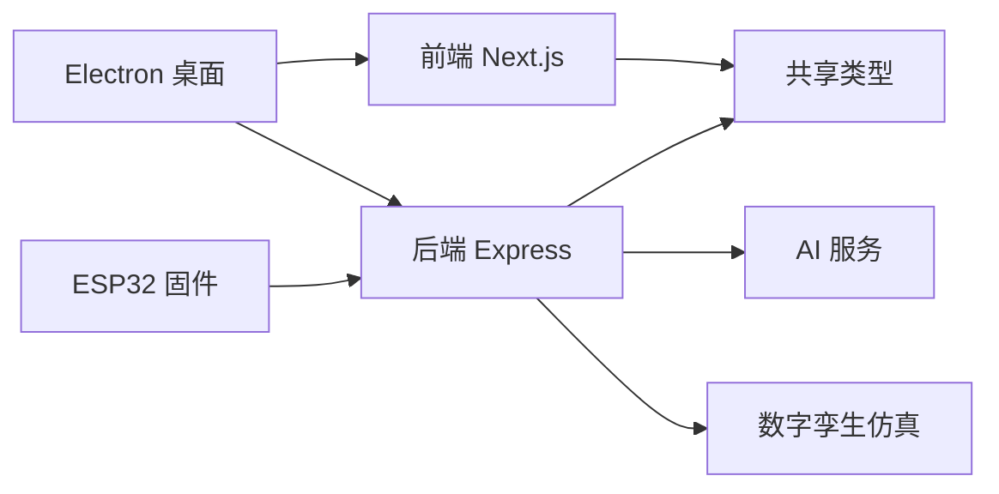

# 项目概述

<cite>
**本文引用的文件**
- [README.md](file://fishery-digital-twin-platform/README.md)
- [package.json](file://fishery-digital-twin-platform/package.json)
- [后端入口 index.ts](file://fishery-digital-twin-platform/apps/backend/src/index.ts)
- [AI 服务 ai-service.ts](file://fishery-digital-twin-platform/apps/backend/src/ai-service.ts)
- [数字孪生仿真 twin-simulator.ts](file://fishery-digital-twin-platform/apps/backend/src/twin-simulator.ts)
- [前端根布局 layout.tsx](file://fishery-digital-twin-platform/apps/frontend/src/app/layout.tsx)
- [桌面主进程 main.cjs](file://fishery-digital-twin-platform/apps/desktop/main.cjs)
- [共享类型 shared/index.ts](file://fishery-digital-twin-platform/packages/shared/src/index.ts)
- [ESP32 固件 maker_esp32_pro_servo_temp_01.ino](file://fishery-digital-twin-platform/firmware/esp32/maker_esp32_pro_servo_temp_01/maker_esp32_pro_servo_temp_01.ino)
</cite>

## 目录
1. [引言](#引言)
2. [项目结构](#项目结构)
3. [核心组件](#核心组件)
4. [架构总览](#架构总览)
5. [详细组件分析](#详细组件分析)
6. [依赖关系分析](#依赖关系分析)
7. [性能与可靠性考虑](#性能与可靠性考虑)
8. [故障排查指南](#故障排查指南)
9. [结论](#结论)
10. [附录：快速开始](#附录快速开始)

## 引言
本项目面向智慧渔业巡检船，构建“数字孪生 + AI 决策支持”的一体化平台。系统围绕 3D 船模展示、环境监测、AI 辅助分析、设备健康、航线规划、水上执行机构控制与操作日志展开，目标是让运维人员通过可视化界面实时掌握船舶状态、预测风险并做出可执行的巡检与返航建议。

- 目标价值
  - 将真实传感器数据、设备状态与三维模型联动，形成可观察、可推演、可控制的闭环。
  - 通过本地预测与可选云端大模型生成报告，为水质异常、设备退化与能耗预算提供决策依据。
  - 以 ESP32 固件作为边缘节点，实现舵机、推进器、GPS 等设备的稳定采集与控制。

- 关键特性
  - 3D 船模展示：姿态、任务状态与演示级控制反馈。
  - 环境监测：水温、浊度、pH、溶解氧、氨氮、电导率，集成 AI 预测报告。
  - 设备控制：两块 MAKER-ESP32-PRO 舵机板（共 8 路舵机）与双无刷推进控制。
  - 导航定位：优先使用 WGS84 GPS；无定位时显示参考航线与离线底图。
  - 设备健康：电池、电控、通信、传感器状态与异常预警。
  - 操作日志：记录后端、传感器、AI 与控制事件。

**章节来源**
- [README.md:1-15](file://fishery-digital-twin-platform/README.md#L1-L15)

## 项目结构
仓库采用 Monorepo 组织方式，包含前端、后端、桌面应用、共享类型与 ESP32 固件。

- apps/frontend：Next.js 应用，提供仪表盘、3D 孪生、地图、AI、日志等页面。
- apps/backend：Express 服务，聚合传感器、GPS、舵机、推进器、AI 报告与数字孪生仿真接口。
- apps/desktop：Electron 主进程，打包并启动前后端服务，提供独立桌面体验。
- packages/shared：前后端共享的类型定义，保证数据结构一致。
- firmware/esp32：基于 Arduino 的 ESP32 固件，负责 WiFi 连接、UDP 自动发现后端、传感器上报与设备控制。

**章节来源**
- [README.md:16-34](file://fishery-digital-twin-platform/README.md#L16-L34)
- [package.json:1-38](file://fishery-digital-twin-platform/package.json#L1-L38)

## 核心组件
- 后端 Express 服务
  - 暴露健康检查、快照、水质历史、电池、导航、GPS、设备状态、日志等查询接口。
  - 接收传感器数据、GPS 状态、舵机与推进器命令，并进行校验、持久化与日志记录。
  - 内置 UDP 自动发现协议，供 ESP32 设备发现本机后端地址。
  - 提供 AI 报告生成接口，支持本地预测与 DeepSeek 云端模型回退。
  - 提供数字孪生仿真接口，用于航线预演、故障推演与疲劳评估。

- 前端 Next.js 应用
  - 提供仪表盘、三维孪生、水质监测、导航、设备控制、AI 报告与日志页面。
  - 通过 API 拉取平台快照与实时数据，驱动图表、地图与 3D 场景更新。

- Electron 桌面应用
  - 自动检测并启动后端与前端服务，封装为独立安装包。
  - 管理端口占用、服务健康探测与错误提示。

- ESP32 固件
  - 连接 WiFi，通过 UDP 广播发现后端，建立 HTTP 通道。
  - 定时轮询设备命令，执行舵机角度与推进器功率控制。
  - 读取 GPS 串口数据，上报位置、速度与航向。
  - 安全保护：断网或超时自动停机等。

- 共享类型
  - 统一定义水质、电池、导航、设备状态、AI 报告、数字孪生输入输出等数据结构。

**章节来源**
- [后端入口 index.ts:46-114](file://fishery-digital-twin-platform/apps/backend/src/index.ts#L46-L114)
- [AI 服务 ai-service.ts:160-233](file://fishery-digital-twin-platform/apps/backend/src/ai-service.ts#L160-L233)
- [数字孪生仿真 twin-simulator.ts:74-254](file://fishery-digital-twin-platform/apps/backend/src/twin-simulator.ts#L74-L254)
- [前端根布局 layout.tsx:1-20](file://fishery-digital-twin-platform/apps/frontend/src/app/layout.tsx#L1-L20)
- [桌面主进程 main.cjs:82-119](file://fishery-digital-twin-platform/apps/desktop/main.cjs#L82-L119)
- [ESP32 固件 maker_esp32_pro_servo_temp_01.ino:305-408](file://fishery-digital-twin-platform/firmware/esp32/maker_esp32_pro_servo_temp_01/maker_esp32_pro_servo_temp_01.ino#L305-L408)
- [共享类型 shared/index.ts:1-288](file://fishery-digital-twin-platform/packages/shared/src/index.ts#L1-L288)

## 架构总览
系统由四层构成：设备层（ESP32）、服务端（Express）、应用层（Next.js 与 Electron）、数据与模型层（共享类型、AI 与仿真）。

**图示来源**
- [后端入口 index.ts:271-318](file://fishery-digital-twin-platform/apps/backend/src/index.ts#L271-L318)
- [AI 服务 ai-service.ts:167-233](file://fishery-digital-twin-platform/apps/backend/src/ai-service.ts#L167-L233)
- [数字孪生仿真 twin-simulator.ts:74-254](file://fishery-digital-twin-platform/apps/backend/src/twin-simulator.ts#L74-L254)
- [桌面主进程 main.cjs:82-119](file://fishery-digital-twin-platform/apps/desktop/main.cjs#L82-L119)
- [共享类型 shared/index.ts:1-288](file://fishery-digital-twin-platform/packages/shared/src/index.ts#L1-L288)

## 详细组件分析

### 后端 Express 服务
- 职责
  - 统一接入传感器、GPS、舵机、推进器数据与命令。
  - 维护水质历史、电池状态、系统日志，并提供平台快照。
  - 实现 UDP 自动发现，使 ESP32 无需写死 IP 即可找到后端。
  - 提供 AI 报告与数字孪生仿真接口。

- 关键流程
  - 设备命令下发：前端调用 /api/servos 或 /api/propulsion，后端写入命令队列，设备侧轮询 /api/device/commands 或 /api/propulsion/commands 获取并执行。
  - 传感器数据上报：ESP32 调用 /api/data 提交水质与电池数据，后端校验范围、追加历史、计算水质状态并记录日志。
  - GPS 状态上报：ESP32 调用 /api/gps/status 上报定位信息，后端合并到导航快照。
  - AI 报告：调用 /api/ai/report，先尝试 DeepSeek，失败或无配置则返回本地预测结果。
  - 数字孪生：调用 /api/twin/simulate，输入航线、海况、故障参数，输出完成概率、能耗、疲劳与健康建议。

**图示来源**
- [后端入口 index.ts:322-558](file://fishery-digital-twin-platform/apps/backend/src/index.ts#L322-L558)
- [AI 服务 ai-service.ts:167-233](file://fishery-digital-twin-platform/apps/backend/src/ai-service.ts#L167-L233)
- [数字孪生仿真 twin-simulator.ts:74-254](file://fishery-digital-twin-platform/apps/backend/src/twin-simulator.ts#L74-L254)

**章节来源**
- [后端入口 index.ts:46-114](file://fishery-digital-twin-platform/apps/backend/src/index.ts#L46-L114)
- [后端入口 index.ts:322-558](file://fishery-digital-twin-platform/apps/backend/src/index.ts#L322-L558)

### 数字孪生仿真模块
- 功能
  - 航线预演：根据距离、目标速度、海况与执行机构反馈，估算 ETA、能耗、到达电量与完成概率。
  - 故障推演：模拟舵机卡滞、电机降额、反馈丢失等故障对速度与航向的影响。
  - 疲劳评估：综合推进、舵机、船体与电池寿命，给出整体健康度与下次检修时间。

- 输入与输出
  - 输入：航线距离、目标速度、海况等级、故障类型与严重度、累计运行小时、日动作次数。
  - 输出：路线预测、故障预测、疲劳组件、置信度、数据来源与假设说明。

**图示来源**
- [数字孪生仿真 twin-simulator.ts:35-50](file://fishery-digital-twin-platform/apps/backend/src/twin-simulator.ts#L35-L50)
- [数字孪生仿真 twin-simulator.ts:74-254](file://fishery-digital-twin-platform/apps/backend/src/twin-simulator.ts#L74-L254)

**章节来源**
- [数字孪生仿真 twin-simulator.ts:74-254](file://fishery-digital-twin-platform/apps/backend/src/twin-simulator.ts#L74-L254)

### AI 报告服务
- 功能
  - 本地预测：基于水质统计与电池均值生成风险等级、摘要、发现与建议。
  - 云端增强：若配置 DeepSeek API，则调用聊天接口生成结构化 JSON 报告，并做字段归一化。
  - 限流与降级：请求间隔限制，失败时回退到本地报告。

- 数据源
  - 最近水质采样点、电池状态、养殖参考阈值。

**图示来源**
- [AI 服务 ai-service.ts:160-233](file://fishery-digital-twin-platform/apps/backend/src/ai-service.ts#L160-L233)

**章节来源**
- [AI 服务 ai-service.ts:1-233](file://fishery-digital-twin-platform/apps/backend/src/ai-service.ts#L1-L233)

### ESP32 固件与自动发现
- 功能
  - WiFi 连接与重连，网络中断时立即停止所有电机。
  - UDP 自动发现：广播 UISYS_DISCOVER_V1，接收后端回复 UISYS_BACKEND_V1|端口，确定后端地址。
  - 命令轮询：按设备 ID 轮询舵机与推进器命令，解析并平滑执行。
  - GPS 上报：串口读取 NMEA，解析位置、速度、航向，定期上报后端。

- 安全机制
  - 命令超时自动禁用输出。
  - 紧急停止标志优先于一切控制。
  - 断网或后端不可达时清空 PWM，防止失控。

**图示来源**
- [ESP32 固件 maker_esp32_pro_servo_temp_01.ino:305-408](file://fishery-digital-twin-platform/firmware/esp32/maker_esp32_pro_servo_temp_01/maker_esp32_pro_servo_temp_01.ino#L305-L408)
- [ESP32 固件 maker_esp32_pro_servo_temp_01.ino:460-534](file://fishery-digital-twin-platform/firmware/esp32/maker_esp32_pro_servo_temp_01/maker_esp32_pro_servo_temp_01.ino#L460-L534)
- [后端入口 index.ts:271-318](file://fishery-digital-twin-platform/apps/backend/src/index.ts#L271-L318)

**章节来源**
- [ESP32 固件 maker_esp32_pro_servo_temp_01.ino:187-250](file://fishery-digital-twin-platform/firmware/esp32/maker_esp32_pro_servo_temp_01/maker_esp32_pro_servo_temp_01.ino#L187-L250)
- [ESP32 固件 maker_esp32_pro_servo_temp_01.ino:305-408](file://fishery-digital-twin-platform/firmware/esp32/maker_esp32_pro_servo_temp_01/maker_esp32_pro_servo_temp_01.ino#L305-L408)
- [ESP32 固件 maker_esp32_pro_servo_temp_01.ino:460-534](file://fishery-digital-twin-platform/firmware/esp32/maker_esp32_pro_servo_temp_01/maker_esp32_pro_servo_temp_01.ino#L460-L534)

### Electron 桌面应用
- 功能
  - 启动后端与前端服务，检测端口占用与服务健康。
  - 加载前端页面，限制导航至指定域名。
  - 单实例锁，避免重复启动。
  - 错误弹窗与日志路径提示。

**图示来源**
- [桌面主进程 main.cjs:82-119](file://fishery-digital-twin-platform/apps/desktop/main.cjs#L82-L119)
- [桌面主进程 main.cjs:121-178](file://fishery-digital-twin-platform/apps/desktop/main.cjs#L121-L178)

**章节来源**
- [桌面主进程 main.cjs:1-202](file://fishery-digital-twin-platform/apps/desktop/main.cjs#L1-L202)

## 依赖关系分析
- 模块耦合
  - 前端依赖后端 API 与共享类型。
  - 后端依赖共享类型、AI 服务、数字孪生仿真、GPS 存储、舵机/推进存储与持久化。
  - 桌面应用依赖后端与前端健康接口。
  - ESP32 固件依赖后端 API 与 UDP 发现协议。

- 外部依赖
  - Node.js 运行时与 npm 工作区。
  - Electron 打包与分发。
  - DeepSeek API（可选）。
  - Arduino 工具链与 ESP32 库。

**图示来源**
- [package.json:1-38](file://fishery-digital-twin-platform/package.json#L1-L38)
- [共享类型 shared/index.ts:1-288](file://fishery-digital-twin-platform/packages/shared/src/index.ts#L1-L288)

**章节来源**
- [package.json:1-38](file://fishery-digital-twin-platform/package.json#L1-L38)
- [共享类型 shared/index.ts:1-288](file://fishery-digital-twin-platform/packages/shared/src/index.ts#L1-L288)

## 性能与可靠性考虑
- 数据新鲜度
  - 水质数据默认保留最近 180 条，避免内存增长。
  - 传感器数据超过设定时间未更新会被视为不新鲜，影响在线判定。

- 安全与访问控制
  - 局域网控制接口要求令牌，本地回环可直接访问。
  - CORS 白名单限制前端来源。
  - Windows 防火墙规则仅对专用网络开放必要端口。

- 设备安全
  - 断网或命令超时自动停机，防止失控。
  - 紧急停止优先级最高。
  - 舵机角度限制与平滑移动，保护机械结构。

- 仿真与报告
  - 数字孪生仿真仅在服务器内计算，不直接下发控制命令。
  - AI 报告具备限流与降级策略，确保可用性。

**章节来源**
- [后端入口 index.ts:116-157](file://fishery-digital-twin-platform/apps/backend/src/index.ts#L116-L157)
- [后端入口 index.ts:178-195](file://fishery-digital-twin-platform/apps/backend/src/index.ts#L178-L195)
- [后端入口 index.ts:559-599](file://fishery-digital-twin-platform/apps/backend/src/index.ts#L559-L599)
- [ESP32 固件 maker_esp32_pro_servo_temp_01.ino:771-800](file://fishery-digital-twin-platform/firmware/esp32/maker_esp32_pro_servo_temp_01/maker_esp32_pro_servo_temp_01.ino#L771-L800)
- [AI 服务 ai-service.ts:167-233](file://fishery-digital-twin-platform/apps/backend/src/ai-service.ts#L167-L233)

## 故障排查指南
- 常见问题
  - 端口占用：桌面应用会检测 3000 与 5000 端口是否被其他服务占用。
  - 令牌缺失：未配置令牌时，局域网控制请求将被拒绝。
  - WiFi 隔离：热点不能开启客户端隔离，否则设备无法发现后端。
  - 防火墙：需允许 TCP 5000 与 UDP 42110 入站。

- 诊断步骤
  - 运行一键诊断脚本，检查后端与固件令牌、WiFi 配置、端口、防火墙与健康状态。
  - 查看桌面应用日志路径，定位服务启动失败原因。
  - 检查 ESP32 串口日志，确认 UDP 发现与 HTTP 请求状态码。

**章节来源**
- [桌面主进程 main.cjs:93-119](file://fishery-digital-twin-platform/apps/desktop/main.cjs#L93-L119)
- [桌面主进程 main.cjs:164-178](file://fishery-digital-twin-platform/apps/desktop/main.cjs#L164-L178)
- [README.md:56-63](file://fishery-digital-twin-platform/README.md#L56-L63)
- [README.md:143-180](file://fishery-digital-twin-platform/README.md#L143-L180)

## 结论
该平台以“设备-服务-应用-模型”的分层架构，实现了从数据采集、可视化展示到 AI 决策与数字孪生仿真的完整闭环。通过共享类型保障前后端一致性，通过 UDP 自动发现简化设备接入，通过本地与云端结合的 AI 报告提升决策质量，通过严格的设备安全机制保障现场运行可靠。对于初学者，可从前端仪表盘与 3D 船模入手理解系统；对于有经验的开发者，可深入后端 API、AI 服务与数字孪生仿真，扩展更多业务模型与设备适配。

## 附录：快速开始
- 环境准备
  - 安装 Node.js 22 与 npm。
  - 首次复制到新电脑后，依次执行安装、本地设置与开发模式。

- 首次运行
  - 安装依赖。
  - 执行本地设置，生成令牌并配置网络。
  - 启动开发模式，打开前端与后端。

- 生产模式
  - 构建项目。
  - 启动生产服务。

- 诊断与维护
  - 运行诊断脚本检查环境与设备连通性。
  - 按需重新烧录固件以同步令牌与热点配置。

**章节来源**
- [README.md:36-77](file://fishery-digital-twin-platform/README.md#L36-L77)
- [README.md:94-103](file://fishery-digital-twin-platform/README.md#L94-L103)
- [README.md:143-180](file://fishery-digital-twin-platform/README.md#L143-L180)
- [package.json:16-38](file://fishery-digital-twin-platform/package.json#L16-L38)