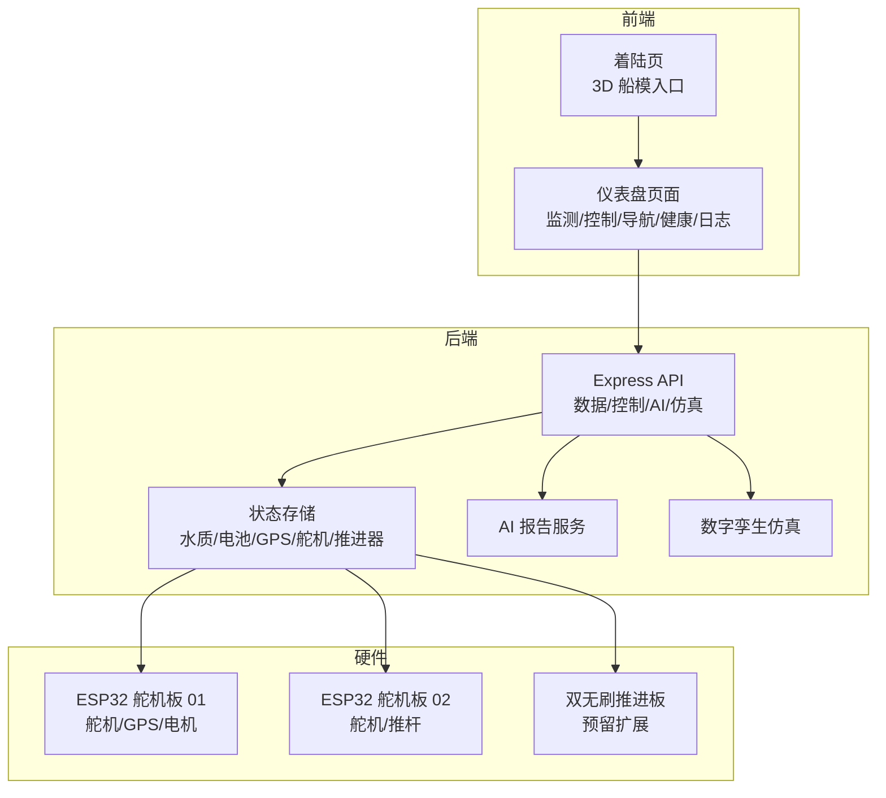
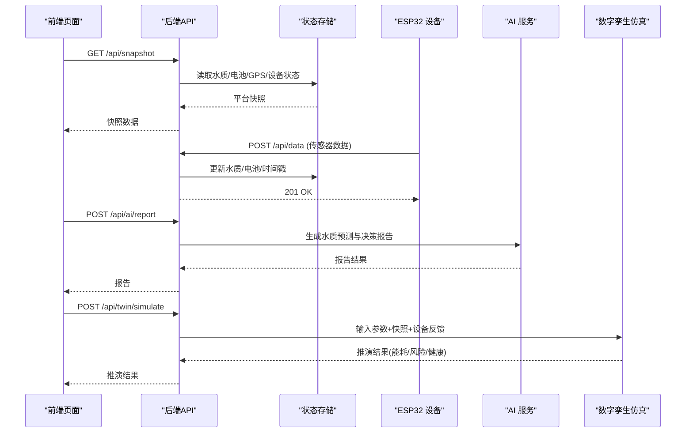
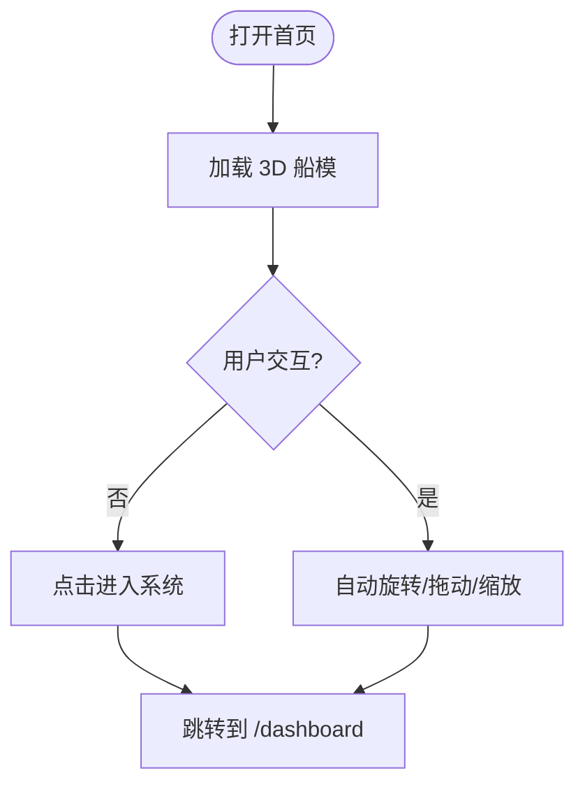
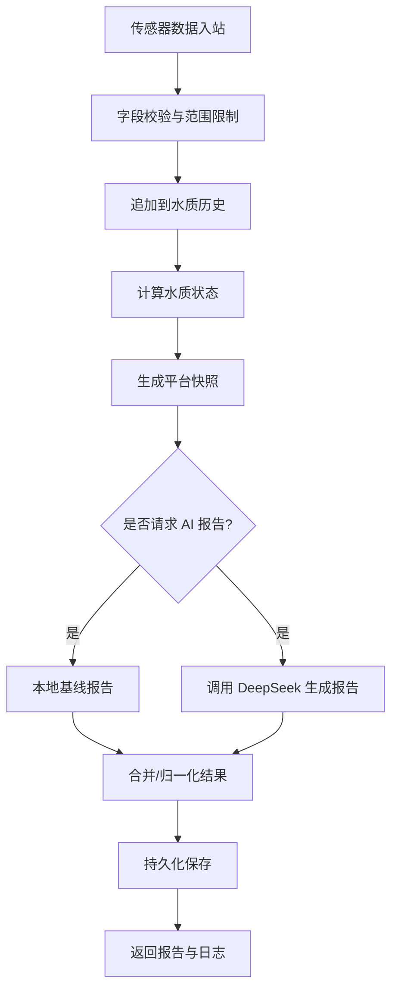
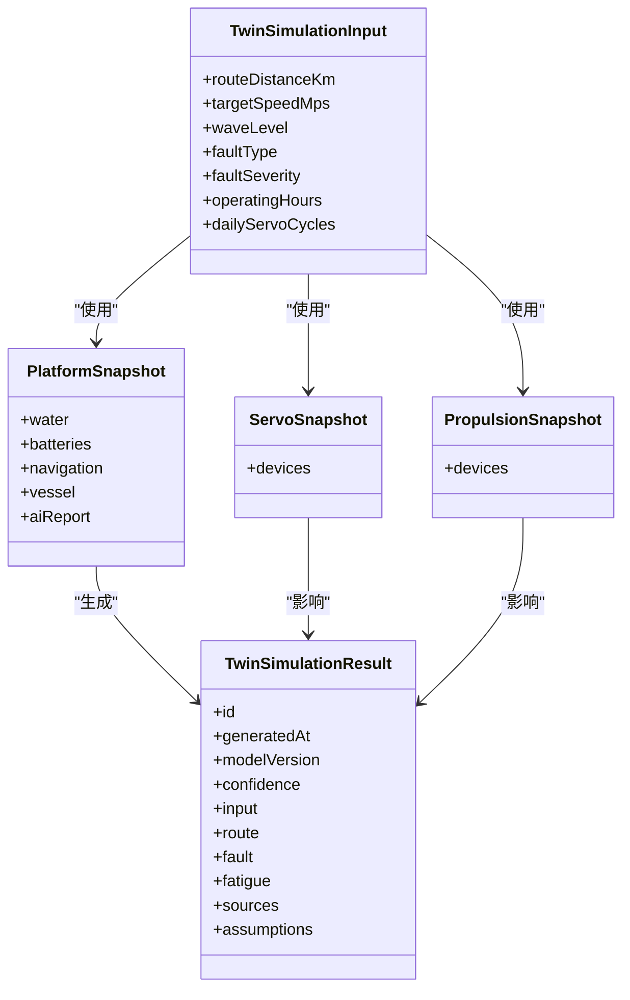
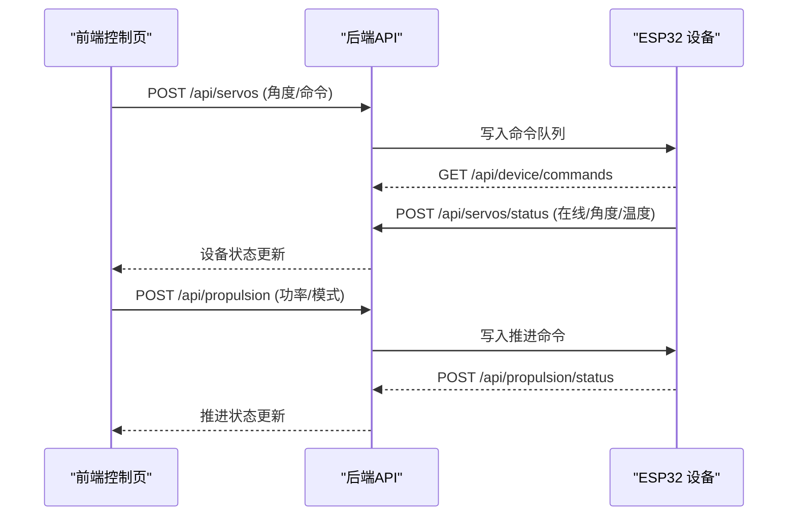
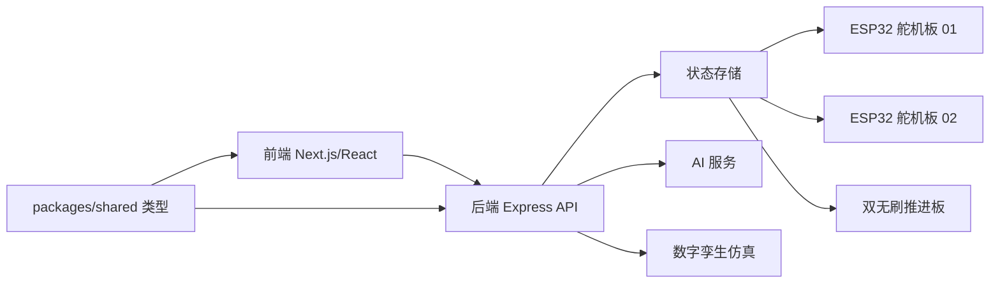

# 项目背景与目标

<cite>
**本文引用的文件列表**
- [README.md](file://fishery-digital-twin-platform/README.md)
- [package.json](file://fishery-digital-twin-platform/package.json)
- [后端入口 index.ts](file://fishery-digital-twin-platform/apps/backend/src/index.ts)
- [AI 服务 ai-service.ts](file://fishery-digital-twin-platform/apps/backend/src/ai-service.ts)
- [数字孪生仿真 twin-simulator.ts](file://fishery-digital-twin-platform/apps/backend/src/twin-simulator.ts)
- [前端首页 page.tsx](file://fishery-digital-twin-platform/apps/frontend/src/app/page.tsx)
- [着陆页 LandingExperience.tsx](file://fishery-digital-twin-platform/apps/frontend/src/components/landing/LandingExperience.tsx)
- [项目结构说明 project-structure.md](file://fishery-digital-twin-platform/docs/project-structure.md)
- [硬件与固件说明 hardware-and-firmware.md](file://fishery-digital-twin-platform/docs/hardware-and-firmware.md)
- [舵机板固件 maker_esp32_pro_servo_temp_01.ino](file://fishery-digital-twin-platform/firmware/esp32/maker_esp32_pro_servo_temp_01/maker_esp32_pro_servo_temp_01.ino)
</cite>

## 目录
1. [引言](#引言)
2. [项目结构](#项目结构)
3. [核心组件](#核心组件)
4. [架构总览](#架构总览)
5. [详细组件分析](#详细组件分析)
6. [依赖关系分析](#依赖关系分析)
7. [性能与可靠性考虑](#性能与可靠性考虑)
8. [故障排查指南](#故障排查指南)
9. [结论](#结论)
10. [附录：数字孪生入门](#附录数字孪生入门)

## 引言
本项目面向“海洋航行器制作大赛”，围绕智慧渔业巡检船构建一套“数字孪生 + AI 辅助决策”的完整平台。系统以 3D 船模展示为入口，结合环境监测、设备健康监控、航线规划与水上执行机构控制，形成从感知到决策再到执行的闭环。通过数字孪生推演与 AI 报告，帮助参赛队伍在复杂水域环境中进行风险评估、能耗预估与任务可行性判断，提升比赛演示效果与实际应用价值。

本项目的核心价值在于：
- 将真实传感器数据、设备状态与三维可视化融合，提供可交互的数字孪生界面。
- 用 AI 生成水质趋势与风险研判，辅助巡检策略调整。
- 通过执行机构控制（舵机、推进器、水枪云台等）实现水上动作的可控演示。
- 以模块化架构和统一接口规范，支撑后续功能扩展与竞赛场景快速迭代。

**章节来源**
- [README.md:1-15](file://fishery-digital-twin-platform/README.md#L1-L15)

## 项目结构
仓库采用多包工作区组织，前后端分离、共享类型定义、固件与文档独立管理：
- apps/backend：Express 后端，提供 API、设备命令、AI 报告、数字孪生仿真、GPS/舵机/推进器状态存储与持久化。
- apps/frontend：Next.js 前端，包含首页 3D 船模、系统总览、三维孪生、环境监测、设备健康、导航与控制页面。
- packages/shared：前后端共享 TypeScript 类型，保证接口一致性。
- firmware/esp32：ESP32 固件，负责舵机、电机、GPS 数据采集与上报、命令执行。
- docs：项目结构、硬件接入、模型导入与安全网络说明。

**图表来源**
- [项目结构说明 project-structure.md:15-107](file://fishery-digital-twin-platform/docs/project-structure.md#L15-L107)
- [后端入口 index.ts:56-110](file://fishery-digital-twin-platform/apps/backend/src/index.ts#L56-L110)

**章节来源**
- [项目结构说明 project-structure.md:1-138](file://fishery-digital-twin-platform/docs/project-structure.md#L1-L138)
- [package.json:1-38](file://fishery-digital-twin-platform/package.json#L1-L38)

## 核心组件
- 3D 船模展示与着陆体验：首页加载 3D 船模并引导进入系统，支持自动旋转、缩放与交互。
- 环境监测与 AI 报告：采集水温、浊度、pH、溶解氧、氨氮、电导率，生成趋势分析与风险等级，并可调用外部大模型增强报告质量。
- 设备健康监控：实时展示电池、电控、通信与传感器在线状态，异常时预警。
- 航线规划与定位：优先使用 WGS84 GPS 定位；无定位时显示参考航线与离线底图。
- 执行机构控制：两块 ESP32 舵机板共 8 路舵机，支持云台、推杆与推进器控制。
- 数字孪生仿真：基于当前快照与执行机构反馈，推演航程能耗、到达电量、横偏误差、完成概率与部件疲劳，输出风险与建议。

**章节来源**
- [README.md:5-14](file://fishery-digital-twin-platform/README.md#L5-L14)
- [项目结构说明 project-structure.md:15-37](file://fishery-digital-twin-platform/docs/project-structure.md#L15-L37)

## 架构总览
系统由前端、后端、硬件三层构成，后端作为中枢协调数据流与控制流：
- 前端通过 REST API 获取平台快照、水质历史、设备状态，并下发控制指令。
- 后端维护内存中的历史数据与设备状态，提供健康检查、数据写入、AI 报告生成、数字孪生仿真与日志查询。
- 硬件通过 WiFi 与 UDP 自动发现后端，周期性上报传感器与设备状态，并拉取控制命令执行。

**图表来源**
- [后端入口 index.ts:322-557](file://fishery-digital-twin-platform/apps/backend/src/index.ts#L322-L557)
- [AI 服务 ai-service.ts:167-233](file://fishery-digital-twin-platform/apps/backend/src/ai-service.ts#L167-L233)
- [数字孪生仿真 twin-simulator.ts:74-253](file://fishery-digital-twin-platform/apps/backend/src/twin-simulator.ts#L74-L253)

**章节来源**
- [后端入口 index.ts:56-110](file://fishery-digital-twin-platform/apps/backend/src/index.ts#L56-L110)

## 详细组件分析

### 3D 船模与着陆体验
- 首页渲染 3D 船模，支持自动旋转与交互，点击“进入系统”后跳转至仪表盘。
- 着陆页预加载仪表盘路由，提升进入速度；过渡动画增强演示观感。

**图表来源**
- [前端首页 page.tsx:1-7](file://fishery-digital-twin-platform/apps/frontend/src/app/page.tsx#L1-L7)
- [着陆页 LandingExperience.tsx:15-79](file://fishery-digital-twin-platform/apps/frontend/src/components/landing/LandingExperience.tsx#L15-L79)

**章节来源**
- [项目结构说明 project-structure.md:15-37](file://fishery-digital-twin-platform/docs/project-structure.md#L15-L37)

### 环境监测与 AI 报告
- 后端接收传感器数据，计算水质状态，维护历史序列，并提供数据模式判断（演示/回退/混合/实时）。
- AI 报告支持本地基线预测与 DeepSeek 外部模型；未配置密钥时使用本地逻辑生成报告。
- 报告包含风险等级、关键发现、建议措施、数据质量说明与置信度。

**图表来源**
- [后端入口 index.ts:367-473](file://fishery-digital-twin-platform/apps/backend/src/index.ts#L367-L473)
- [AI 服务 ai-service.ts:49-122](file://fishery-digital-twin-platform/apps/backend/src/ai-service.ts#L49-L122)
- [AI 服务 ai-service.ts:167-233](file://fishery-digital-twin-platform/apps/backend/src/ai-service.ts#L167-L233)

**章节来源**
- [README.md:79-92](file://fishery-digital-twin-platform/README.md#L79-L92)

### 数字孪生仿真
- 输入包括航线距离、目标航速、海况等级、故障类型与严重度、运行小时、日动作次数等。
- 仿真综合执行机构反馈、电池均值、海况载荷与跟踪误差，估算有效航速、ETA、能耗、到达电量、横偏误差与完成概率。
- 对推进电机、舵机、船体结构与电池进行疲劳评估，给出整体健康度与下次检修建议。
- 输出包含路线系列、故障系列、置信度、数据来源与假设说明。

**图表来源**
- [数字孪生仿真 twin-simulator.ts:74-253](file://fishery-digital-twin-platform/apps/backend/src/twin-simulator.ts#L74-L253)

**章节来源**
- [数字孪生仿真 twin-simulator.ts:14-50](file://fishery-digital-twin-platform/apps/backend/src/twin-simulator.ts#L14-L50)

### 执行机构控制与硬件联动
- 两块 ESP32 舵机板分别控制舵机、推杆与电机，支持角度控制、缓启动、急停与命令超时保护。
- 后端提供舵机与推进器的命令队列与状态存储，设备通过轮询拉取命令并上报状态。
- GPS 数据经后端聚合，用于导航与定位展示；无定位时回退到参考航线。

**图表来源**
- [后端入口 index.ts:475-538](file://fishery-digital-twin-platform/apps/backend/src/index.ts#L475-L538)
- [硬件与固件说明 hardware-and-firmware.md:118-138](file://fishery-digital-twin-platform/docs/hardware-and-firmware.md#L118-L138)

**章节来源**
- [硬件与固件说明 hardware-and-firmware.md:1-117](file://fishery-digital-twin-platform/docs/hardware-and-firmware.md#L1-L117)
- [舵机板固件 maker_esp32_pro_servo_temp_01.ino:1-200](file://fishery-digital-twin-platform/firmware/esp32/maker_esp32_pro_servo_temp_01/maker_esp32_pro_servo_temp_01.ino#L1-L200)

## 依赖关系分析
- 前端依赖 Next.js、React、Three.js 与 Recharts，用于 3D 渲染与图表展示。
- 后端依赖 Express、CORS、dotenv，提供 HTTP API、跨域与配置管理。
- 共享类型位于 packages/shared，确保前后端数据结构一致。
- 固件依赖 ESP32Servo、TinyGPSPlus、WiFiUdp 等库，实现舵机控制、GPS 解析与网络通信。

**图表来源**
- [项目结构说明 project-structure.md:65-107](file://fishery-digital-twin-platform/docs/project-structure.md#L65-L107)
- [package.json:12-38](file://fishery-digital-twin-platform/package.json#L12-L38)

**章节来源**
- [项目结构说明 project-structure.md:65-107](file://fishery-digital-twin-platform/docs/project-structure.md#L65-L107)

## 性能与可靠性考虑
- 数据新鲜度：传感器数据按固定间隔或实时推送，后端维护最近 N 条历史，避免无限增长。
- 安全访问：局域网控制接口要求令牌认证，本地回环地址可免令牌；CORS 限制可信来源。
- 稳定性：UDP 自动发现后端，IP 变化后重新发现；HTTP 启动失败与端口占用会终止进程。
- 资源消耗：AI 报告限频（每分钟一次），避免频繁调用外部模型；仿真仅在服务端计算，不直接下发控制命令。
- 持久化：平台状态定期落盘，重启后可恢复水质历史、电池状态、AI 报告与系统日志。

**章节来源**
- [后端入口 index.ts:136-157](file://fishery-digital-twin-platform/apps/backend/src/index.ts#L136-L157)
- [后端入口 index.ts:271-318](file://fishery-digital-twin-platform/apps/backend/src/index.ts#L271-L318)
- [后端入口 index.ts:456-473](file://fishery-digital-twin-platform/apps/backend/src/index.ts#L456-L473)
- [后端入口 index.ts:559-599](file://fishery-digital-twin-platform/apps/backend/src/index.ts#L559-L599)

## 故障排查指南
- 无法连接后端：检查电脑 IPv4、热点名称、防火墙规则（TCP 5000、UDP 42110）、热点客户端隔离。
- 设备未上线：确认设备 ID、令牌一致；查看 /api/health 与 /api/logs；检查设备心跳与命令拉取。
- AI 报告失败：检查 DeepSeek 密钥与模型配置；若未配置则使用本地报告；关注限频与超时设置。
- 3D 模型加载缓慢：确认模型资源路径与纹理加载；浏览器控制台查看错误信息。
- 控制无效：确认命令下发成功、设备在线且未触发急停；检查舵机供电与机械限位。

**章节来源**
- [README.md:143-187](file://fishery-digital-twin-platform/README.md#L143-L187)
- [硬件与固件说明 hardware-and-firmware.md:140-204](file://fishery-digital-twin-platform/docs/hardware-and-firmware.md#L140-L204)

## 结论
本项目以数字孪生为核心，将 3D 可视化、环境监测、AI 决策与执行控制整合为一套完整的智慧渔业巡检解决方案。通过真实传感器数据与仿真推演，系统能够在比赛中直观展示技术能力，在实际应用中提升巡检效率与安全性。其模块化架构与统一接口规范，也为后续扩展与工程化落地提供了坚实基础。

[本节为总结性内容，不直接分析具体文件]

## 附录：数字孪生入门
- 什么是数字孪生：数字孪生是在虚拟空间中对物理实体进行高保真建模，并通过实时数据驱动，使其行为与状态尽可能接近真实对象。它既能“看见”设备的当前状态，也能“预测”未来表现。
- 在本项目中的应用：
  - 3D 船模展示：让操作者直观看到船的姿态、任务状态与控制反馈。
  - 环境监测：将水温、浊度、pH、溶解氧、氨氮、电导率等指标映射到数字模型，形成趋势与风险视图。
  - 设备健康：根据执行机构反馈与运行时长，评估部件疲劳与健康度，提示检修时机。
  - 航线规划：结合 GPS 定位与仿真能耗，预估到达时间与剩余电量，降低任务失败风险。
  - 执行控制：将网页指令转化为设备动作，形成“感知—决策—执行”的闭环。
- 初学者理解要点：
  - 数字孪生不是简单的 3D 动画，而是“数据驱动的虚拟副本”。
  - 它的价值在于“可视、可测、可预测、可优化”，帮助人在复杂环境中做出更明智的决策。
  - 本项目通过真实数据与仿真算法，让数字孪生在渔业巡检中具备实用性与可操作性。

[本节为概念性内容，不直接分析具体文件]